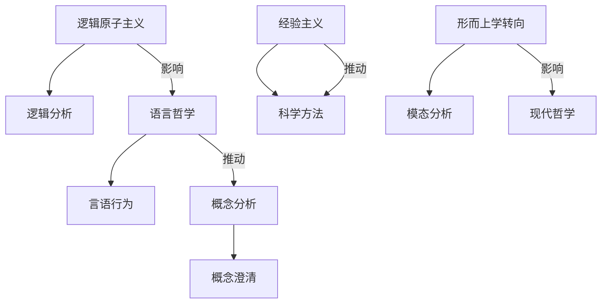

## 07.2.x.5 分析哲学流派与理论对比及结构图 {#072x5-分析哲学流派与理论对比及结构图}

### 主要分析哲学流派与理论对比表

| 流派         | 代表人物         | 核心观点         | 方法论特征         | 主要贡献         |
|--------------|------------------|------------------|--------------------|------------------|
| 逻辑原子主义 | 罗素、维特根斯坦 | 世界由原子事实组成 | 逻辑分析、命题分解 | 语言哲学奠基     |
| 语言哲学     | 奥斯汀、塞尔     | 语言决定意义     | 言语行为、语境分析 | 语用学发展       |
| 经验主义     | 奎因、卡尔纳普   | 经验为知识基础   | 逻辑经验、科学方法 | 科学哲学推进     |
| 概念分析     | 摩尔、赖尔       | 概念澄清         | 分析方法、反例法   | 哲学方法革新     |
| 形而上学转向 | 克里普克、刘易斯 | 可能世界、模态逻辑 | 模态分析、模型理论 | 现代形而上学     |

### Mermaid结构图：分析哲学流派关系

---
> 交叉引用：[07.2.4 现象学哲学分析](./现象学哲学分析.md)｜[07.2.6 规范伦理学分析](./规范伦理学分析.md)｜[07.2.1 信息本体论分析](./信息本体论分析.md) 