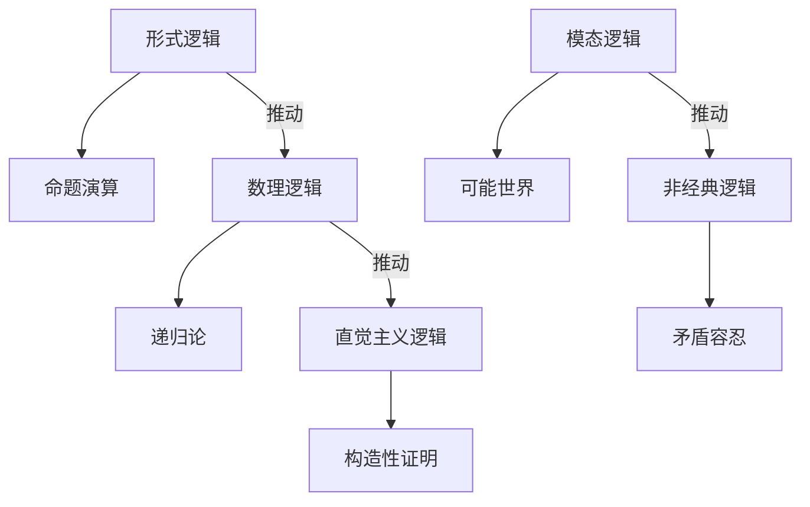

# 07.2.x 逻辑哲学

## 07.2.x.5 逻辑哲学流派与理论对比及结构图 {#072x5-逻辑哲学流派与理论对比及结构图}

### 主要逻辑哲学流派与理论对比表

| 流派         | 代表人物         | 核心观点         | 方法论特征         | 主要贡献         |
|--------------|------------------|------------------|--------------------|------------------|
| 形式逻辑     | 弗雷格、罗素     | 逻辑形式化       | 命题演算、谓词逻辑 | 现代逻辑基础     |
| 数理逻辑     | 哥德尔、图灵     | 逻辑与数学统一   | 递归论、可判定性   | 不完全性定理     |
| 直觉主义逻辑 | 海廷、布劳威尔   | 拒绝排中律       | 构造性证明、可计算性 | 计算机科学基础   |
| 模态逻辑     | 克里普克、刘易斯 | 可能世界、模态性 | 模型理论、语义分析 | 现代形而上学     |
| 非经典逻辑   | 普里斯特、贝尔纳普 | 多值/悖论容忍   | 矛盾容忍、模糊性   | 非经典推理理论   |

### Mermaid结构图：逻辑哲学流派关系

---
> 交叉引用：[07.2.4 现象学哲学分析](./现象学哲学分析.md)｜[07.2.6 规范伦理学分析](./规范伦理学分析.md)｜[07.2.1 信息本体论分析](./信息本体论分析.md)
