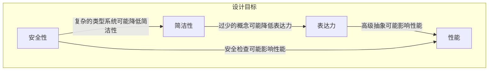

# 07.1.1 语言设计原则 (Language Design Principles)

## 目录

- [07.1.1 语言设计原则 (Language Design Principles)](#0711-语言设计原则-language-design-principles)
  - [目录](#目录)
  - [1. 定义与背景](#1-定义与背景)
  - [2. 批判性分析](#2-批判性分析)
  - [3. 核心原则](#3-核心原则)
  - [4. 形式化表达](#4-形式化表达)
  - [5. 交叉引用](#5-交叉引用)
  - [6. 参考文献](#6-参考文献)
  - [批判性分析](#批判性分析)

---

## 1. 定义与背景

语言设计原则是在设计编程语言时用于指导决策的启发式规则和理念。这些原则旨在平衡语言的表达能力、易用性、安全性和实现效率，最终目标是创造出能够帮助程序员清晰思考和高效工作的工具。

---

## 2. 批判性分析

- **核心权衡**: 编程语言的设计充满了权衡。例如，在静态类型和动态类型之间、在性能和安全性之间、在简洁性和明确性之间。没有"最好"的语言，只有在特定上下文中"更合适"的语言。
- **影响**: 语言的设计深刻地影响着程序员的思维方式和软件的质量。

---

## 3. 核心原则

- **简洁性 (Simplicity)**: 语言应包含尽可能少的基本概念。例如，Scheme。

- **正交性 (Orthogonality)**: 语言中的一小组原语可以以少数几种方式组合起来，从而构建出控制和数据结构。语言特性之间应互不影响。
  - **定义**: 语言特性 $f_1, f_2$ 是正交的，当且仅当它们可以独立组合而不产生冲突。
  - **Rust实现示例**:

      ```rust
      #[derive(Debug, Clone, PartialEq, Eq, Hash)]
      pub enum LanguageFeature {
          StaticTyping,
          DynamicTyping,
          GarbageCollection,
          ManualMemory,
          FunctionalProgramming,
          ObjectOriented,
      }

      pub struct OrthogonalityChecker {
          feature_matrix: std::collections::HashMap<(LanguageFeature, LanguageFeature), bool>,
      }

      impl OrthogonalityChecker {
          pub fn are_orthogonal(&self, f1: &LanguageFeature, f2: &LanguageFeature) -> bool {
              self.feature_matrix.get(&(f1.clone(), f2.clone())).unwrap_or(&false)
          }
          
          pub fn check_feature_set(&self, features: &[LanguageFeature]) -> bool {
              for i in 0..features.len() {
                  for j in (i + 1)..features.len() {
                      if !self.are_orthogonal(&features[i], &features[j]) {
                          return false;
                      }
                  }
              }
              true
          }
      }
      ```

- **一致性 (Regularity/Consistency)**: 语言的规则应没有例外，使得程序员更容易学习和记忆。相似的概念应使用相似的语法表示。
  - **定义**: 语言设计是一致的，当且仅当相似的概念使用相似的语法表示。
  - **Rust实现示例**:

      ```rust
      pub struct ConsistencyChecker {
          syntax_patterns: std::collections::HashMap<String, Vec<String>>,
      }

      impl ConsistencyChecker {
          pub fn check_consistency(&self, concept1: &str, concept2: &str) -> f64 {
              let patterns1 = self.syntax_patterns.get(concept1);
              let patterns2 = self.syntax_patterns.get(concept2);
              
              match (patterns1, patterns2) {
                  (Some(p1), Some(p2)) => {
                      let common_patterns = p1.iter().filter(|p| p2.contains(p)).count();
                      let total_patterns = p1.len() + p2.len() - common_patterns;
                      
                      if total_patterns == 0 {
                          1.0
                      } else {
                          common_patterns as f64 / total_patterns as f64
                      }
                  }
                  _ => 0.0
              }
          }
      }
      ```

- **安全性 (Safety)**: 语言应能防止程序员犯下不安全的错误，如类型安全、内存安全。例如，Rust的所有权系统。

- **表达力 (Expressiveness)**: 语言应能让程序员以清晰、简洁的方式表达复杂的思想。

- **性能 (Performance)**: 语言的抽象不应带来不可接受的性能开销（零成本抽象）。例如，C++。

---

## 4. 形式化表达

**设计原则的权衡空间 (Trade-off Space)**:



---

## 5. 交叉引用

- [语言设计理论总览](README.md)
- [语法与文法](./07.1.2_Syntax_and_Grammars.md)
- [语言特性](./07.1.4_Language_Features.md)
- [类型系统](../07.2_Type_Systems/README.md)

---

## 6. 参考文献

1. Hoare, C. A. R. "Hints on programming language design." 1973.
2. Steele, Guy L. "Growing a language." *Oupsla*, 1998.

## 批判性分析

- 本节内容待补充：请从多元理论视角、局限性、争议点、应用前景等方面进行批判性分析。
