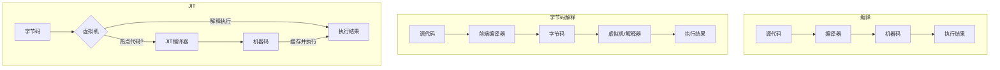

# 08.4.2 解释 (Interpretation)

## 目录

- [08.4.2 解释 (Interpretation)](#0842-解释-interpretation)
  - [目录](#目录)
  - [1. 定义与背景](#1-定义与背景)
  - [2. 批判性分析](#2-批判性分析)
  - [3. 核心技术](#3-核心技术)
  - [4. 形式化表达](#4-形式化表达)
  - [5. 交叉引用](#5-交叉引用)
  - [6. 参考文献](#6-参考文献)

---

## 1. 定义与背景

**解释器 (Interpreter)** 是一个程序，它直接执行用源语言编写的指令，而不需要预先将其编译成机器码。解释器在运行时逐行或逐个语句地读取源代码，并立即执行相应的操作。

---

## 2. 批判性分析

- **优点**:
  - **平台无关性**: 同一份源代码可以不经修改地在任何装有对应解释器的平台上运行。
  - **开发效率**: 省去了编译步骤，开发和调试周期短，反馈快。
  - **动态性**: 易于实现动态类型、反射等高级特性。
- **缺点**:
  - **性能**: 由于在运行时需要进行词法、语法分析和类型检查，通常比编译型语言慢得多。重复执行的代码（如循环）会被重复解释。

---

## 3. 核心技术

- **直接解释 (Direct Interpretation)**:
  - **描述**: 最简单的解释器形式，直接在源代码的AST上进行树遍历求值。
  - **优点**: 实现简单。
  - **缺点**: 效率极低。
- **字节码解释 (Bytecode Interpretation)**:
  - **描述**: 现代解释器（如Python, Java, C#）的主流技术。它首先将源代码"编译"成一种低级的、平台无关的中间表示，称为**字节码 (Bytecode)**。然后由一个**虚拟机 (Virtual Machine)**来解释执行字节码。
  - **优点**: 只需做一次词法和语法分析，大大提高了性能。字节码比源代码更紧凑、更适合解释。
- **即时编译 (Just-In-Time Compilation, JIT)**:
  - **描述**: 字节码解释器的一种高级优化技术。虚拟机会在运行时监控代码的执行情况，将频繁执行的"热点"代码（如循环体）在运行时编译成本地的机器码，并缓存起来。
  - **优点**: 结合了编译器和解释器的优点，实现了接近编译型语言的性能和解释型语言的灵活性。

---

## 4. 形式化表达

**不同实现技术的流程**:

---

## 5. 交叉引用

- [语言实现总览](README.md)
- [编译理论](08.4.1_Compilation_Theory.md)
- [虚拟机与运行时](08.4.3_Virtual_Machines_and_Runtimes.md)

---

## 6. 参考文献

1. Nystrom, Robert. *Crafting Interpreters*. 2021.
2. Bracha, Gilad. "The Secret of Good JITs." *JVM Language Summit*, 2009.

## 批判性分析

- 本节内容待补充：请从多元理论视角、局限性、争议点、应用前景等方面进行批判性分析。
