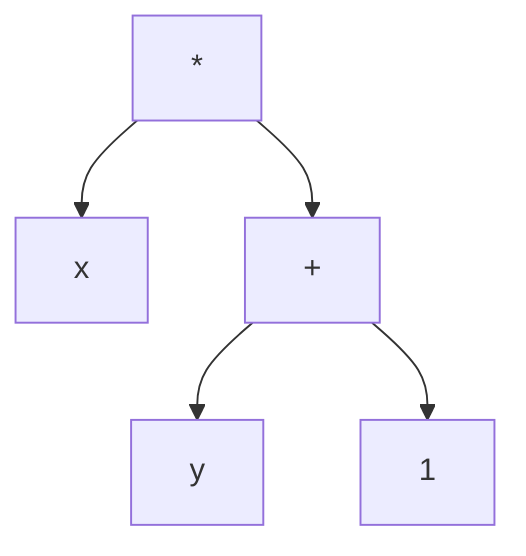

# 08.1.2 语法与文法 (Syntax and Grammars)

## 目录

- [08.1.2 语法与文法 (Syntax and Grammars)](#0812-语法与文法-syntax-and-grammars)
  - [目录](#目录)
  - [1. 定义与背景](#1-定义与背景)
  - [2. 批判性分析](#2-批判性分析)
  - [3. 核心概念](#3-核心概念)
  - [4. 形式化表达](#4-形式化表达)
  - [5. 交叉引用](#5-交叉引用)
  - [6. 参考文献](#6-参考文献)

---

## 1. 定义与背景

**语法 (Syntax)** 是一门编程语言中，构成格式正确（well-formed）程序的规则集合。它只关心程序文本的"形式"或"结构"，不关心其"含义"。

**文法 (Grammar)** 是用于精确描述语法的形式化工具，最常用的是上下文无关文法（Context-Free Grammar, CFG）。

---

## 2. 批判性分析

- **重要性**: 清晰、一致的语法对语言的可用性至关重要。一个好的语法应该易于阅读、编写和解析。
- **挑战**: "糖衣语法"（syntactic sugar）可以提高便利性，但可能增加语言的复杂性。二义性文法（ambiguous grammar）是语言设计中需要极力避免的，如C语言中的"悬挂else"问题。

---

## 3. 核心概念

- **词法结构 (Lexical Structure)**: 定义了语言中最基本的"单词"是如何构成的，如标识符、关键字、字面量、运算符等。通常用正则表达式描述。
- **短语结构 (Phrase Structure)**: 定义了"单词"是如何组合成"句子"（如表达式、语句）的。通常用上下文无关文法描述。
- **巴科斯-诺尔范式 (Backus-Naur Form, BNF)**: 一种用于描述上下文无关文法的元语言，是描述语言语法的标准方式。
- **抽象语法树 (Abstract Syntax Tree, AST)**: 程序文本的树状表示，它移除了所有不影响语义的语法细节（如括号、分隔符），是编译器和解释器进行语义分析的基础。

---

## 4. 形式化表达

**算术表达式的BNF文法**:

```text
<expr> ::= <expr> + <term> | <expr> - <term> | <term>
<term> ::= <term> * <factor> | <term> / <factor> | <factor>
<factor> ::= ( <expr> ) | <number>
<number> ::= [0-9]+
```

这个文法通过将表达式（expr）、项（term）和因子（factor）分层，解决了加减法和乘除法之间的优先级问题。

**`x * (y + 1)` 的抽象语法树 (AST)**:



---

## 5. 交叉引用

- [语言设计与规约总览](README.md)
- [语义](08.1.3_Semantics.md)
- [形式语言理论](README.md)
- [语言实现](README.md)

---

## 6. 参考文献

1. Aho, Alfred V., et al. *Compilers: Principles, Techniques, & Tools* (The Dragon Book). 2006.
2. Naur, Peter. "Revised report on the algorithmic language Algol 60." *Communications of the ACM*, 1963.


## 批判性分析

- 本节内容待补充：请从多元理论视角、局限性、争议点、应用前景等方面进行批判性分析。
