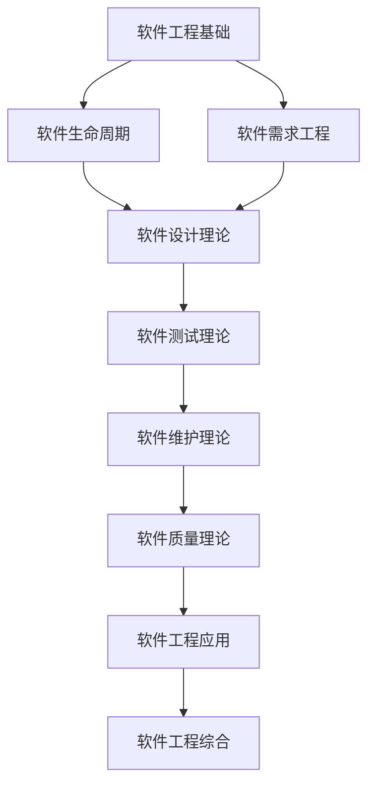

# 软件工程理论索引 (Software Engineering Theory Index)

## 📋 **目录**

### 1. [软件工程基础](07.1_Software_Engineering_Foundation.md)

### 2. [软件生命周期](07.2_Software_Lifecycle.md)

### 3. [软件需求工程](07.3_Requirements_Engineering.md)

### 4. [软件设计理论](07.4_Software_Design_Theory.md)

### 5. [软件测试理论](07.5_Software_Testing_Theory.md)

### 6. [软件维护理论](07.6_Software_Maintenance_Theory.md)

### 7. [软件质量理论](07.7_Software_Quality_Theory.md)

### 8. [软件工程应用](07.8_Software_Engineering_Applications.md)

---

## 🎯 **软件工程理论概述**

软件工程理论研究软件系统的开发、维护和管理的理论方法。它为软件产业提供了系统化的方法论，确保软件产品的质量、可靠性和可维护性。

### 核心特征

1. **系统化方法**：提供系统化的软件开发方法
2. **质量保证**：确保软件产品的质量
3. **过程管理**：管理软件开发过程
4. **团队协作**：支持团队协作开发
5. **持续改进**：支持软件持续改进

### 理论层次

```
┌─────────────────────────────────────────────────────────────┐
│                    软件工程综合 (7.9)                         │
├─────────────────────────────────────────────────────────────┤
│ 应用理论 (7.8) │ 质量理论 (7.7) │ 维护理论 (7.6) │ 测试理论 (7.5) │
├─────────────────────────────────────────────────────────────┤
│ 设计理论 (7.4) │ 需求工程 (7.3) │ 生命周期 (7.2) │ 基础理论 (7.1) │
└─────────────────────────────────────────────────────────────┘
```

---

## 🔗 **理论关联图**



---

## 📚 **详细主题结构**

### 7.1 软件工程基础

- **7.1.1** [软件工程定义](07.1_Software_Engineering_Foundation.md#711-软件工程定义)
- **7.1.2** [软件工程原则](07.1_Software_Engineering_Foundation.md#712-软件工程原则)
- **7.1.3** [软件工程模型](07.1_Software_Engineering_Foundation.md#713-软件工程模型)
- **7.1.4** [软件工程方法论](07.1_Software_Engineering_Foundation.md#714-软件工程方法论)

### 7.2 软件生命周期

- **7.2.1** [瀑布模型](07.2_Software_Lifecycle.md#721-瀑布模型)
- **7.2.2** [迭代模型](07.2_Software_Lifecycle.md#722-迭代模型)
- **7.2.3** [敏捷开发](07.2_Software_Lifecycle.md#723-敏捷开发)
- **7.2.4** [DevOps](07.2_Software_Lifecycle.md#724-devops)

### 7.3 软件需求工程

- **7.3.1** [需求获取](07.3_Requirements_Engineering.md#731-需求获取)
- **7.3.2** [需求分析](07.3_Requirements_Engineering.md#732-需求分析)
- **7.3.3** [需求规格](07.3_Requirements_Engineering.md#733-需求规格)
- **7.3.4** [需求验证](07.3_Requirements_Engineering.md#734-需求验证)

### 7.4 软件设计理论

- **7.4.1** [架构设计](07.4_Software_Design_Theory.md#741-架构设计)
- **7.4.2** [详细设计](07.4_Software_Design_Theory.md#742-详细设计)
- **7.4.3** [设计模式](07.4_Software_Design_Theory.md#743-设计模式)
- **7.4.4** [设计原则](07.4_Software_Design_Theory.md#744-设计原则)

### 7.5 软件测试理论

- **7.5.1** [测试策略](07.5_Software_Testing_Theory.md#751-测试策略)
- **7.5.2** [单元测试](07.5_Software_Testing_Theory.md#752-单元测试)
- **7.5.3** [集成测试](07.5_Software_Testing_Theory.md#753-集成测试)
- **7.5.4** [系统测试](07.5_Software_Testing_Theory.md#754-系统测试)

### 7.6 软件维护理论

- **7.6.1** [维护类型](07.6_Software_Maintenance_Theory.md#761-维护类型)
- **7.6.2** [维护过程](07.6_Software_Maintenance_Theory.md#762-维护过程)
- **7.6.3** [重构理论](07.6_Software_Maintenance_Theory.md#763-重构理论)
- **7.6.4** [版本管理](07.6_Software_Maintenance_Theory.md#764-版本管理)

### 7.7 软件质量理论

- **7.7.1** [质量模型](07.7_Software_Quality_Theory.md#771-质量模型)
- **7.7.2** [质量度量](07.7_Software_Quality_Theory.md#772-质量度量)
- **7.7.3** [质量保证](07.7_Software_Quality_Theory.md#773-质量保证)
- **7.7.4** [质量改进](07.7_Software_Quality_Theory.md#774-质量改进)

### 7.8 软件工程应用

- **7.8.1** [企业软件开发](07.8_Software_Engineering_Applications.md#781-企业软件开发)
- **7.8.2** [开源软件开发](07.8_Software_Engineering_Applications.md#782-开源软件开发)
- **7.8.3** [嵌入式软件开发](07.8_Software_Engineering_Applications.md#783-嵌入式软件开发)
- **7.8.4** [Web应用开发](07.8_Software_Engineering_Applications.md#784-web应用开发)

---

## 🔄 **与其他理论的关联**

### 向上关联

- **分布式系统理论**：[06_Distributed_Systems_Theory](../06_Distributed_Systems_Theory/01_Distributed_Systems_Theory_Index.md)
- **编程语言理论**：[08_Programming_Language_Theory](../08_Programming_Language_Theory/01_Programming_Language_Theory_Index.md)

### 向下关联

- **形式模型理论**：[09_Formal_Model_Theory](../09_Formal_Model_Theory/01_Formal_Model_Theory_Index.md)
- **上下文系统**：[12_Context_System](../12_Context_System/01_Context_System_Index.md)

---

## 📖 **学习路径建议**

### 基础路径

1. 软件工程基础 → 软件生命周期 → 软件需求工程
2. 软件设计理论 → 软件测试理论 → 软件维护理论
3. 软件质量理论 → 软件工程应用 → 软件工程综合

### 专业路径

- **项目管理方向**：生命周期 → 需求工程 → 企业软件开发
- **技术架构方向**：设计理论 → 质量理论 → 架构设计
- **测试质量方向**：测试理论 → 质量理论 → 质量保证

---

## 🎯 **核心概念索引**

| 概念 | 定义位置 | 相关理论 |
|------|----------|----------|
| 软件工程 | [7.1.1](07.1_Software_Engineering_Foundation.md#711-软件工程定义) | 软件工程基础 |
| 生命周期 | [7.2.1](07.2_Software_Lifecycle.md#721-瀑布模型) | 软件生命周期 |
| 需求工程 | [7.3.1](07.3_Requirements_Engineering.md#731-需求获取) | 软件需求工程 |
| 软件设计 | [7.4.1](07.4_Software_Design_Theory.md#741-架构设计) | 软件设计理论 |
| 软件测试 | [7.5.1](07.5_Software_Testing_Theory.md#751-测试策略) | 软件测试理论 |
| 软件维护 | [7.6.1](07.6_Software_Maintenance_Theory.md#761-维护类型) | 软件维护理论 |
| 软件质量 | [7.7.1](07.7_Software_Quality_Theory.md#771-质量模型) | 软件质量理论 |
| 企业开发 | [7.8.1](07.8_Software_Engineering_Applications.md#781-企业软件开发) | 软件工程应用 |

---

## 🔄 **持续更新**

**最后更新时间**：2024-12-20
**版本**：v1.0.0
**维护者**：软件工程理论重构团队

---

## 📋 **待完成任务**

- [ ] 创建所有子主题的详细文档
- [ ] 建立软件工程概念间的交叉引用系统
- [ ] 完善方法论和最佳实践
- [ ] 构建软件工程理论与实践的桥梁
