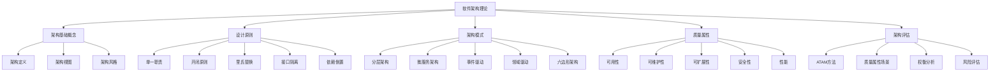

# 软件架构基础理论 (Software Architecture Foundation)

## 🎯 **概述**

软件架构是软件工程的核心理论，研究软件系统的结构、组织方式和设计原则。本文档构建了完整的软件架构理论体系，涵盖架构模式、设计原则、质量属性等核心内容。

## 📚 **目录**

### 1. 软件架构基础概念

- **1.1** 架构定义与性质
- **1.2** 架构视图与视角
- **1.3** 架构风格与模式
- **1.4** 架构决策与权衡

### 2. 架构设计原则

- **2.1** 单一职责原则
- **2.2** 开闭原则
- **2.3** 里氏替换原则
- **2.4** 接口隔离原则
- **2.5** 依赖倒置原则

### 3. 架构模式

- **3.1** 分层架构
- **3.2** 微服务架构
- **3.3** 事件驱动架构
- **3.4** 领域驱动设计
- **3.5** 六边形架构

### 4. 质量属性

- **4.1** 可用性
- **4.2** 可维护性
- **4.3** 可扩展性
- **4.4** 安全性
- **4.5** 性能

### 5. 架构评估

- **5.1** 架构评估方法
- **5.2** 质量属性场景
- **5.3** 权衡分析
- **5.4** 风险评估

## 1. 软件架构基础概念

### 1.1 架构定义与性质

**定义 1.1 (软件架构)**
软件架构是软件系统的高级抽象，描述系统的结构、组件、接口和交互关系。

**定义 1.2 (架构性质)**
软件架构具有以下性质：

- **抽象性**：隐藏实现细节，关注高层结构
- **全局性**：影响整个系统的设计和实现
- **稳定性**：相对稳定，不易频繁变更
- **约束性**：约束后续的设计和实现决策

**定义 1.3 (架构元素)**
架构元素包括：

- **组件**：系统的功能单元
- **连接器**：组件间的交互机制
- **配置**：组件和连接器的拓扑结构
- **约束**：架构必须满足的条件

**形式化定义：**

```haskell
data Architecture = Architecture {
  components :: Map ComponentId Component,
  connectors :: Map ConnectorId Connector,
  configuration :: Configuration,
  constraints :: [Constraint]
} deriving (Show)

data Component = Component {
  componentId :: ComponentId,
  interface :: Interface,
  behavior :: Behavior,
  properties :: Map PropertyName PropertyValue
} deriving (Show)

data Connector = Connector {
  connectorId :: ConnectorId,
  source :: ComponentId,
  target :: ComponentId,
  protocol :: Protocol,
  properties :: Map PropertyName PropertyValue
} deriving (Show)

data Configuration = Configuration {
  topology :: Topology,
  bindings :: Map ComponentId ConnectorId
} deriving (Show)

-- 架构验证
validateArchitecture :: Architecture -> ValidationResult
validateArchitecture arch = 
  let -- 检查组件完整性
      componentValid = validateComponents arch
      -- 检查连接器完整性
      connectorValid = validateConnectors arch
      -- 检查配置一致性
      configValid = validateConfiguration arch
      -- 检查约束满足
      constraintValid = validateConstraints arch
  in ValidationResult {
    isValid = componentValid && connectorValid && configValid && constraintValid,
    errors = collectErrors arch
  }
```

### 1.2 架构视图与视角

**定义 1.4 (架构视图)**
架构视图是从特定角度对系统结构的描述。

**定义 1.5 (4+1视图模型)**
4+1视图模型包括：

- **逻辑视图**：系统的功能结构
- **进程视图**：系统的并发结构
- **开发视图**：系统的模块结构
- **物理视图**：系统的部署结构
- **场景视图**：系统的用例实现

**形式化实现：**

```haskell
data ArchitectureView = 
  LogicalView {
    logicalComponents :: [LogicalComponent],
    logicalRelations :: [LogicalRelation]
  }
  | ProcessView {
    processes :: [Process],
    processCommunications :: [ProcessCommunication]
  }
  | DevelopmentView {
    modules :: [Module],
    moduleDependencies :: [ModuleDependency]
  }
  | PhysicalView {
    nodes :: [Node],
    nodeDeployments :: [NodeDeployment]
  }
  | ScenarioView {
    useCases :: [UseCase],
    useCaseRealizations :: [UseCaseRealization]
  }
  deriving (Show)

-- 视图一致性检查
checkViewConsistency :: [ArchitectureView] -> ConsistencyResult
checkViewConsistency views = 
  let -- 检查组件一致性
      componentConsistency = checkComponentConsistency views
      -- 检查接口一致性
      interfaceConsistency = checkInterfaceConsistency views
      -- 检查关系一致性
      relationConsistency = checkRelationConsistency views
  in ConsistencyResult {
    isConsistent = componentConsistency && interfaceConsistency && relationConsistency,
    inconsistencies = findInconsistencies views
  }
```

### 1.3 架构风格与模式

**定义 1.6 (架构风格)**
架构风格是一类架构模式的抽象，定义了组件类型、连接器类型和拓扑约束。

**定义 1.7 (架构模式)**
架构模式是解决特定问题的可重用架构解决方案。

**常见架构风格：**

1. **分层风格**：系统按层次组织
2. **客户端-服务器风格**：客户端请求，服务器响应
3. **管道-过滤器风格**：数据流经一系列过滤器
4. **事件驱动风格**：组件通过事件交互
5. **微服务风格**：系统分解为小型服务

**形式化实现：**

```haskell
data ArchitectureStyle = 
  Layered
  | ClientServer
  | PipeFilter
  | EventDriven
  | Microservices
  | DomainDriven
  | Hexagonal
  deriving (Show, Eq)

data ArchitecturePattern = ArchitecturePattern {
  name :: String,
  style :: ArchitectureStyle,
  components :: [ComponentTemplate],
  connectors :: [ConnectorTemplate],
  constraints :: [Constraint],
  benefits :: [String],
  drawbacks :: [String]
} deriving (Show)

-- 架构模式应用
applyArchitecturePattern :: Architecture -> ArchitecturePattern -> Architecture
applyArchitecturePattern arch pattern = 
  let -- 实例化组件
      newComponents = instantiateComponents (components pattern) arch
      -- 实例化连接器
      newConnectors = instantiateConnectors (connectors pattern) arch
      -- 应用约束
      newConstraints = constraints arch ++ constraints pattern
      -- 更新配置
      newConfiguration = updateConfiguration arch newComponents newConnectors
  in Architecture {
    components = components arch `Map.union` newComponents,
    connectors = connectors arch `Map.union` newConnectors,
    configuration = newConfiguration,
    constraints = newConstraints
  }
```

## 2. 架构设计原则

### 2.1 单一职责原则

**定义 2.1 (单一职责原则)**
一个类或模块应该只有一个引起它变化的原因。

**形式化定义：**
$$\forall c \in Components, |Responsibilities(c)| = 1$$

其中 $Responsibilities(c)$ 是组件 $c$ 的职责集合。

**形式化实现：**

```rust
// Rust实现单一职责原则
pub trait SingleResponsibility {
    fn get_responsibility(&self) -> Responsibility;
    fn has_single_responsibility(&self) -> bool;
}

#[derive(Debug, Clone)]
pub struct Responsibility {
    name: String,
    description: String,
    change_reasons: Vec<String>,
}

impl SingleResponsibility for Responsibility {
    fn get_responsibility(&self) -> Responsibility {
        self.clone()
    }
    
    fn has_single_responsibility(&self) -> bool {
        self.change_reasons.len() == 1
    }
}

// 组件实现
#[derive(Debug)]
pub struct UserManager {
    responsibility: Responsibility,
}

impl UserManager {
    pub fn new() -> Self {
        UserManager {
            responsibility: Responsibility {
                name: "User Management".to_string(),
                description: "Manage user accounts and authentication".to_string(),
                change_reasons: vec!["User management requirements change".to_string()],
            },
        }
    }
    
    pub fn create_user(&self, user_data: UserData) -> Result<User, Error> {
        // 用户创建逻辑
        Ok(User::new(user_data))
    }
    
    pub fn authenticate_user(&self, credentials: Credentials) -> Result<Token, Error> {
        // 用户认证逻辑
        Ok(Token::new(credentials))
    }
}

impl SingleResponsibility for UserManager {
    fn get_responsibility(&self) -> Responsibility {
        self.responsibility.clone()
    }
    
    fn has_single_responsibility(&self) -> bool {
        self.responsibility.has_single_responsibility()
    }
}
```

### 2.2 开闭原则

**定义 2.2 (开闭原则)**
软件实体应该对扩展开放，对修改关闭。

**形式化定义：**
$$\forall f \in Features, \exists e \in Extensions : f \text{ can be added via } e$$

**形式化实现：**

```rust
// Rust实现开闭原则
pub trait PaymentProcessor {
    fn process_payment(&self, amount: f64) -> Result<PaymentResult, PaymentError>;
}

#[derive(Debug)]
pub struct PaymentResult {
    transaction_id: String,
    status: PaymentStatus,
    amount: f64,
}

#[derive(Debug)]
pub enum PaymentError {
    InsufficientFunds,
    InvalidCard,
    NetworkError,
}

// 具体实现
#[derive(Debug)]
pub struct CreditCardProcessor;

impl PaymentProcessor for CreditCardProcessor {
    fn process_payment(&self, amount: f64) -> Result<PaymentResult, PaymentError> {
        // 信用卡支付处理逻辑
        Ok(PaymentResult {
            transaction_id: generate_transaction_id(),
            status: PaymentStatus::Success,
            amount,
        })
    }
}

#[derive(Debug)]
pub struct PayPalProcessor;

impl PaymentProcessor for PayPalProcessor {
    fn process_payment(&self, amount: f64) -> Result<PaymentResult, PaymentError> {
        // PayPal支付处理逻辑
        Ok(PaymentResult {
            transaction_id: generate_transaction_id(),
            status: PaymentStatus::Success,
            amount,
        })
    }
}

// 支付服务 - 对扩展开放，对修改关闭
#[derive(Debug)]
pub struct PaymentService {
    processors: Vec<Box<dyn PaymentProcessor>>,
}

impl PaymentService {
    pub fn new() -> Self {
        PaymentService {
            processors: Vec::new(),
        }
    }
    
    // 添加新的支付处理器 - 扩展
    pub fn add_processor(&mut self, processor: Box<dyn PaymentProcessor>) {
        self.processors.push(processor);
    }
    
    // 处理支付 - 不需要修改现有代码
    pub fn process_payment(&self, processor_index: usize, amount: f64) -> Result<PaymentResult, PaymentError> {
        if let Some(processor) = self.processors.get(processor_index) {
            processor.process_payment(amount)
        } else {
            Err(PaymentError::NetworkError)
        }
    }
}
```

### 2.3 里氏替换原则

**定义 2.3 (里氏替换原则)**
子类型必须能够替换其基类型，而不影响程序的正确性。

**形式化定义：**
$$\forall x \in T, \forall y \in S : S \subseteq T \Rightarrow P(x) \Rightarrow P(y)$$

其中 $T$ 是基类型，$S$ 是子类型，$P$ 是程序属性。

**形式化实现：**

```rust
// Rust实现里氏替换原则
pub trait Shape {
    fn area(&self) -> f64;
    fn perimeter(&self) -> f64;
}

#[derive(Debug)]
pub struct Rectangle {
    width: f64,
    height: f64,
}

impl Rectangle {
    pub fn new(width: f64, height: f64) -> Self {
        Rectangle { width, height }
    }
}

impl Shape for Rectangle {
    fn area(&self) -> f64 {
        self.width * self.height
    }
    
    fn perimeter(&self) -> f64 {
        2.0 * (self.width + self.height)
    }
}

#[derive(Debug)]
pub struct Square {
    side: f64,
}

impl Square {
    pub fn new(side: f64) -> Self {
        Square { side }
    }
}

impl Shape for Square {
    fn area(&self) -> f64 {
        self.side * self.side
    }
    
    fn perimeter(&self) -> f64 {
        4.0 * self.side
    }
}

// 使用基类型的地方可以接受任何子类型
pub fn calculate_total_area(shapes: &[Box<dyn Shape>]) -> f64 {
    shapes.iter().map(|shape| shape.area()).sum()
}

// 测试里氏替换原则
#[cfg(test)]
mod tests {
    use super::*;
    
    #[test]
    fn test_liskov_substitution() {
        let shapes: Vec<Box<dyn Shape>> = vec![
            Box::new(Rectangle::new(3.0, 4.0)),
            Box::new(Square::new(5.0)),
        ];
        
        let total_area = calculate_total_area(&shapes);
        assert_eq!(total_area, 12.0 + 25.0); // Rectangle: 3*4=12, Square: 5*5=25
    }
}
```

## 3. 架构模式

### 3.1 分层架构

**定义 3.1 (分层架构)**
分层架构将系统组织为一系列层次，每层只与相邻层交互。

**定义 3.2 (分层原则)**

- 每层只依赖下层
- 每层只被上层依赖
- 层内高内聚，层间低耦合

**形式化实现：**

```rust
// Rust实现分层架构
pub mod presentation {
    use crate::business::UserService;
    use crate::data::UserRepository;
    
    #[derive(Debug)]
    pub struct UserController {
        user_service: UserService,
    }
    
    impl UserController {
        pub fn new(user_service: UserService) -> Self {
            UserController { user_service }
        }
        
        pub fn create_user(&self, user_data: UserData) -> Result<UserResponse, Error> {
            // 表示层：处理HTTP请求，调用业务层
            let user = self.user_service.create_user(user_data)?;
            Ok(UserResponse::from(user))
        }
    }
}

pub mod business {
    use crate::data::UserRepository;
    
    #[derive(Debug)]
    pub struct UserService {
        user_repository: Box<dyn UserRepository>,
    }
    
    impl UserService {
        pub fn new(user_repository: Box<dyn UserRepository>) -> Self {
            UserService { user_repository }
        }
        
        pub fn create_user(&self, user_data: UserData) -> Result<User, Error> {
            // 业务层：业务逻辑处理
            let user = User::new(user_data);
            self.user_repository.save(user.clone())?;
            Ok(user)
        }
    }
}

pub mod data {
    use async_trait::async_trait;
    
    #[async_trait]
    pub trait UserRepository {
        async fn save(&self, user: User) -> Result<(), Error>;
        async fn find_by_id(&self, id: UserId) -> Result<Option<User>, Error>;
        async fn find_all(&self) -> Result<Vec<User>, Error>;
    }
    
    #[derive(Debug)]
    pub struct DatabaseUserRepository {
        connection: DatabaseConnection,
    }
    
    impl DatabaseUserRepository {
        pub fn new(connection: DatabaseConnection) -> Self {
            DatabaseUserRepository { connection }
        }
    }
    
    #[async_trait]
    impl UserRepository for DatabaseUserRepository {
        async fn save(&self, user: User) -> Result<(), Error> {
            // 数据层：数据库操作
            self.connection.execute("INSERT INTO users ...").await?;
            Ok(())
        }
        
        async fn find_by_id(&self, id: UserId) -> Result<Option<User>, Error> {
            // 数据层：数据库查询
            let result = self.connection.query("SELECT * FROM users WHERE id = ?", id).await?;
            Ok(result.map(|row| User::from(row)))
        }
        
        async fn find_all(&self) -> Result<Vec<User>, Error> {
            // 数据层：数据库查询
            let rows = self.connection.query("SELECT * FROM users").await?;
            Ok(rows.into_iter().map(|row| User::from(row)).collect())
        }
    }
}
```

### 3.2 微服务架构

**定义 3.3 (微服务架构)**
微服务架构将系统分解为小型、独立的服务，每个服务负责特定的业务功能。

**定义 3.4 (微服务特征)**

- **独立性**：服务可以独立开发、部署、扩展
- **单一职责**：每个服务专注于特定业务功能
- **松耦合**：服务间通过标准协议通信
- **技术多样性**：不同服务可以使用不同技术栈

**形式化实现：**

```rust
// Rust实现微服务架构
use actix_web::{web, App, HttpServer, HttpResponse};
use serde::{Deserialize, Serialize};

// 用户服务
#[derive(Debug, Serialize, Deserialize)]
pub struct User {
    id: String,
    name: String,
    email: String,
}

#[derive(Debug, Serialize, Deserialize)]
pub struct CreateUserRequest {
    name: String,
    email: String,
}

pub struct UserService {
    repository: Box<dyn UserRepository>,
}

impl UserService {
    pub fn new(repository: Box<dyn UserRepository>) -> Self {
        UserService { repository }
    }
    
    pub async fn create_user(&self, request: CreateUserRequest) -> Result<User, Error> {
        let user = User {
            id: generate_id(),
            name: request.name,
            email: request.email,
        };
        
        self.repository.save(&user).await?;
        Ok(user)
    }
    
    pub async fn get_user(&self, id: &str) -> Result<Option<User>, Error> {
        self.repository.find_by_id(id).await
    }
}

// 用户服务API
async fn create_user(
    service: web::Data<UserService>,
    request: web::Json<CreateUserRequest>,
) -> Result<HttpResponse, actix_web::Error> {
    match service.create_user(request.into_inner()).await {
        Ok(user) => Ok(HttpResponse::Created().json(user)),
        Err(_) => Ok(HttpResponse::InternalServerError().finish()),
    }
}

async fn get_user(
    service: web::Data<UserService>,
    path: web::Path<String>,
) -> Result<HttpResponse, actix_web::Error> {
    match service.get_user(&path).await {
        Ok(Some(user)) => Ok(HttpResponse::Ok().json(user)),
        Ok(None) => Ok(HttpResponse::NotFound().finish()),
        Err(_) => Ok(HttpResponse::InternalServerError().finish()),
    }
}

// 服务注册与发现
#[derive(Debug)]
pub struct ServiceRegistry {
    services: HashMap<String, ServiceInfo>,
}

#[derive(Debug)]
pub struct ServiceInfo {
    name: String,
    url: String,
    health_check_url: String,
    metadata: HashMap<String, String>,
}

impl ServiceRegistry {
    pub fn new() -> Self {
        ServiceRegistry {
            services: HashMap::new(),
        }
    }
    
    pub fn register_service(&mut self, service: ServiceInfo) {
        self.services.insert(service.name.clone(), service);
    }
    
    pub fn discover_service(&self, name: &str) -> Option<&ServiceInfo> {
        self.services.get(name)
    }
}

// 服务间通信
pub struct ServiceClient {
    http_client: reqwest::Client,
    registry: Arc<Mutex<ServiceRegistry>>,
}

impl ServiceClient {
    pub fn new(registry: Arc<Mutex<ServiceRegistry>>) -> Self {
        ServiceClient {
            http_client: reqwest::Client::new(),
            registry,
        }
    }
    
    pub async fn call_service<T>(&self, service_name: &str, endpoint: &str) -> Result<T, Error>
    where
        T: DeserializeOwned,
    {
        let registry = self.registry.lock().unwrap();
        let service_info = registry.discover_service(service_name)
            .ok_or_else(|| Error::ServiceNotFound)?;
        
        let url = format!("{}{}", service_info.url, endpoint);
        let response = self.http_client.get(&url).send().await?;
        
        let result: T = response.json().await?;
        Ok(result)
    }
}
```

## 4. 质量属性

### 4.1 可用性

**定义 4.1 (可用性)**
可用性是系统在指定时间内正常运行的概率。

**定义 4.2 (可用性计算)**
$$Availability = \frac{MTTF}{MTTF + MTTR}$$

其中：

- $MTTF$：平均无故障时间
- $MTTR$：平均修复时间

**形式化实现：**

```rust
// Rust实现可用性监控
use std::time::{Duration, Instant};
use tokio::time::interval;

#[derive(Debug)]
pub struct AvailabilityMonitor {
    start_time: Instant,
    total_uptime: Duration,
    total_downtime: Duration,
    last_status: ServiceStatus,
}

#[derive(Debug, Clone)]
pub enum ServiceStatus {
    Up,
    Down,
    Degraded,
}

impl AvailabilityMonitor {
    pub fn new() -> Self {
        AvailabilityMonitor {
            start_time: Instant::now(),
            total_uptime: Duration::ZERO,
            total_downtime: Duration::ZERO,
            last_status: ServiceStatus::Up,
        }
    }
    
    pub fn update_status(&mut self, status: ServiceStatus) {
        let now = Instant::now();
        let elapsed = now.duration_since(self.start_time);
        
        match (self.last_status.clone(), status.clone()) {
            (ServiceStatus::Up, ServiceStatus::Down) => {
                self.total_uptime += elapsed;
            }
            (ServiceStatus::Down, ServiceStatus::Up) => {
                self.total_downtime += elapsed;
            }
            _ => {}
        }
        
        self.last_status = status;
        self.start_time = now;
    }
    
    pub fn calculate_availability(&self) -> f64 {
        let total_time = self.total_uptime + self.total_downtime;
        if total_time.is_zero() {
            1.0
        } else {
            self.total_uptime.as_secs_f64() / total_time.as_secs_f64()
        }
    }
    
    pub fn get_mttf(&self) -> Duration {
        if self.total_uptime.is_zero() {
            Duration::ZERO
        } else {
            self.total_uptime
        }
    }
    
    pub fn get_mttr(&self) -> Duration {
        if self.total_downtime.is_zero() {
            Duration::ZERO
        } else {
            self.total_downtime
        }
    }
}

// 健康检查
pub struct HealthChecker {
    check_interval: Duration,
    timeout: Duration,
}

impl HealthChecker {
    pub fn new(check_interval: Duration, timeout: Duration) -> Self {
        HealthChecker {
            check_interval,
            timeout,
        }
    }
    
    pub async fn start_monitoring(&self, service_url: String, monitor: Arc<Mutex<AvailabilityMonitor>>) {
        let mut interval = interval(self.check_interval);
        
        loop {
            interval.tick().await;
            
            let status = self.check_health(&service_url).await;
            let mut monitor = monitor.lock().unwrap();
            monitor.update_status(status);
        }
    }
    
    async fn check_health(&self, url: &str) -> ServiceStatus {
        let client = reqwest::Client::new();
        
        match tokio::time::timeout(self.timeout, client.get(url).send()).await {
            Ok(Ok(response)) => {
                if response.status().is_success() {
                    ServiceStatus::Up
                } else {
                    ServiceStatus::Degraded
                }
            }
            _ => ServiceStatus::Down,
        }
    }
}
```

### 4.2 可维护性

**定义 4.3 (可维护性)**
可维护性是系统易于理解、修改和扩展的程度。

**定义 4.4 (可维护性指标)**

- **圈复杂度**：代码路径的复杂程度
- **代码重复率**：重复代码的比例
- **模块耦合度**：模块间的依赖程度
- **代码覆盖率**：测试覆盖的代码比例

**形式化实现：**

```rust
// Rust实现可维护性分析
use std::collections::HashMap;

#[derive(Debug)]
pub struct MaintainabilityAnalyzer {
    metrics: HashMap<String, f64>,
}

#[derive(Debug)]
pub struct CodeMetrics {
    cyclomatic_complexity: u32,
    code_duplication_rate: f64,
    module_coupling: f64,
    test_coverage: f64,
}

impl MaintainabilityAnalyzer {
    pub fn new() -> Self {
        MaintainabilityAnalyzer {
            metrics: HashMap::new(),
        }
    }
    
    pub fn analyze_code(&mut self, code: &str) -> CodeMetrics {
        let cyclomatic_complexity = self.calculate_cyclomatic_complexity(code);
        let code_duplication_rate = self.calculate_duplication_rate(code);
        let module_coupling = self.calculate_module_coupling(code);
        let test_coverage = self.calculate_test_coverage(code);
        
        CodeMetrics {
            cyclomatic_complexity,
            code_duplication_rate,
            module_coupling,
            test_coverage,
        }
    }
    
    fn calculate_cyclomatic_complexity(&self, code: &str) -> u32 {
        let mut complexity = 1; // 基础复杂度
        
        // 计算决策点
        complexity += code.matches("if ").count() as u32;
        complexity += code.matches("while ").count() as u32;
        complexity += code.matches("for ").count() as u32;
        complexity += code.matches("match ").count() as u32;
        complexity += code.matches("&&").count() as u32;
        complexity += code.matches("||").count() as u32;
        
        complexity
    }
    
    fn calculate_duplication_rate(&self, code: &str) -> f64 {
        let lines: Vec<&str> = code.lines().collect();
        let total_lines = lines.len();
        
        if total_lines == 0 {
            return 0.0;
        }
        
        let mut duplicate_lines = 0;
        let mut seen_lines = HashMap::new();
        
        for line in lines {
            let trimmed = line.trim();
            if !trimmed.is_empty() {
                *seen_lines.entry(trimmed).or_insert(0) += 1;
            }
        }
        
        for count in seen_lines.values() {
            if *count > 1 {
                duplicate_lines += count - 1;
            }
        }
        
        duplicate_lines as f64 / total_lines as f64
    }
    
    fn calculate_module_coupling(&self, code: &str) -> f64 {
        // 简化的模块耦合度计算
        let imports = code.matches("use ").count();
        let functions = code.matches("fn ").count();
        
        if functions == 0 {
            0.0
        } else {
            imports as f64 / functions as f64
        }
    }
    
    fn calculate_test_coverage(&self, code: &str) -> f64 {
        // 简化的测试覆盖率计算
        let test_functions = code.matches("#[test]").count();
        let total_functions = code.matches("fn ").count();
        
        if total_functions == 0 {
            0.0
        } else {
            test_functions as f64 / total_functions as f64
        }
    }
    
    pub fn get_maintainability_score(&self, metrics: &CodeMetrics) -> f64 {
        let mut score = 100.0;
        
        // 圈复杂度惩罚
        if metrics.cyclomatic_complexity > 10 {
            score -= (metrics.cyclomatic_complexity - 10) as f64 * 2.0;
        }
        
        // 代码重复率惩罚
        score -= metrics.code_duplication_rate * 50.0;
        
        // 模块耦合度惩罚
        if metrics.module_coupling > 0.5 {
            score -= (metrics.module_coupling - 0.5) * 100.0;
        }
        
        // 测试覆盖率奖励
        score += metrics.test_coverage * 20.0;
        
        score.max(0.0).min(100.0)
    }
}
```

## 5. 架构评估

### 5.1 架构评估方法

**定义 5.1 (ATAM方法)**
架构权衡分析方法(ATAM)是一种系统化的架构评估方法。

**定义 5.2 (评估步骤)**

1. **呈现ATAM**：介绍评估过程
2. **呈现业务驱动**：理解业务目标
3. **呈现架构**：描述系统架构
4. **识别架构方法**：识别关键架构决策
5. **生成质量属性效用树**：分析质量属性
6. **分析架构方法**：评估架构决策
7. **头脑风暴和场景优先级排序**：生成和排序场景
8. **分析架构方法**：深入分析关键场景
9. **呈现结果**：总结评估结果

**形式化实现：**

```rust
// Rust实现ATAM评估
use std::collections::HashMap;

#[derive(Debug)]
pub struct ATAMEvaluation {
    business_goals: Vec<BusinessGoal>,
    quality_attributes: Vec<QualityAttribute>,
    architectural_approaches: Vec<ArchitecturalApproach>,
    scenarios: Vec<Scenario>,
    risks: Vec<Risk>,
    non_risks: Vec<NonRisk>,
    tradeoffs: Vec<Tradeoff>,
}

#[derive(Debug)]
pub struct BusinessGoal {
    name: String,
    description: String,
    priority: Priority,
}

#[derive(Debug)]
pub struct QualityAttribute {
    name: String,
    description: String,
    scenarios: Vec<Scenario>,
    utility_tree: UtilityTree,
}

#[derive(Debug)]
pub struct ArchitecturalApproach {
    name: String,
    description: String,
    quality_attributes: Vec<String>,
    risks: Vec<Risk>,
    non_risks: Vec<NonRisk>,
}

#[derive(Debug)]
pub struct Scenario {
    id: String,
    description: String,
    stimulus: String,
    environment: String,
    artifact: String,
    response: String,
    response_measure: String,
    priority: Priority,
}

#[derive(Debug)]
pub enum Priority {
    High,
    Medium,
    Low,
}

#[derive(Debug)]
pub struct Risk {
    description: String,
    impact: String,
    mitigation: String,
}

#[derive(Debug)]
pub struct NonRisk {
    description: String,
    rationale: String,
}

#[derive(Debug)]
pub struct Tradeoff {
    description: String,
    approach1: String,
    approach2: String,
    quality_attributes: Vec<String>,
}

pub struct ATAMEvaluator {
    evaluation: ATAMEvaluation,
}

impl ATAMEvaluator {
    pub fn new() -> Self {
        ATAMEvaluator {
            evaluation: ATAMEvaluation {
                business_goals: Vec::new(),
                quality_attributes: Vec::new(),
                architectural_approaches: Vec::new(),
                scenarios: Vec::new(),
                risks: Vec::new(),
                non_risks: Vec::new(),
                tradeoffs: Vec::new(),
            },
        }
    }
    
    pub fn add_business_goal(&mut self, goal: BusinessGoal) {
        self.evaluation.business_goals.push(goal);
    }
    
    pub fn add_quality_attribute(&mut self, attribute: QualityAttribute) {
        self.evaluation.quality_attributes.push(attribute);
    }
    
    pub fn add_architectural_approach(&mut self, approach: ArchitecturalApproach) {
        self.evaluation.architectural_approaches.push(approach);
    }
    
    pub fn add_scenario(&mut self, scenario: Scenario) {
        self.evaluation.scenarios.push(scenario);
    }
    
    pub fn analyze_risks(&mut self) {
        for approach in &self.evaluation.architectural_approaches {
            for risk in &approach.risks {
                self.evaluation.risks.push(risk.clone());
            }
            for non_risk in &approach.non_risks {
                self.evaluation.non_risks.push(non_risk.clone());
            }
        }
    }
    
    pub fn identify_tradeoffs(&mut self) {
        let approaches = &self.evaluation.architectural_approaches;
        
        for i in 0..approaches.len() {
            for j in (i + 1)..approaches.len() {
                let approach1 = &approaches[i];
                let approach2 = &approaches[j];
                
                // 检查是否存在质量属性冲突
                let common_attributes: Vec<_> = approach1
                    .quality_attributes
                    .iter()
                    .filter(|attr| approach2.quality_attributes.contains(attr))
                    .cloned()
                    .collect();
                
                if !common_attributes.is_empty() {
                    let tradeoff = Tradeoff {
                        description: format!("Tradeoff between {} and {}", approach1.name, approach2.name),
                        approach1: approach1.name.clone(),
                        approach2: approach2.name.clone(),
                        quality_attributes: common_attributes,
                    };
                    self.evaluation.tradeoffs.push(tradeoff);
                }
            }
        }
    }
    
    pub fn generate_report(&self) -> ATAMReport {
        ATAMReport {
            business_goals: self.evaluation.business_goals.clone(),
            quality_attributes: self.evaluation.quality_attributes.clone(),
            architectural_approaches: self.evaluation.architectural_approaches.clone(),
            scenarios: self.evaluation.scenarios.clone(),
            risks: self.evaluation.risks.clone(),
            non_risks: self.evaluation.non_risks.clone(),
            tradeoffs: self.evaluation.tradeoffs.clone(),
        }
    }
}

#[derive(Debug)]
pub struct ATAMReport {
    business_goals: Vec<BusinessGoal>,
    quality_attributes: Vec<QualityAttribute>,
    architectural_approaches: Vec<ArchitecturalApproach>,
    scenarios: Vec<Scenario>,
    risks: Vec<Risk>,
    non_risks: Vec<NonRisk>,
    tradeoffs: Vec<Tradeoff>,
}
```

## 📊 **理论关系图**



## 🔗 **相关理论链接**

- [软件设计理论](../02_软件设计理论/01_软件设计基础理论.md)
- [软件测试理论](../03_软件测试理论/01_软件测试基础理论.md)
- [软件维护理论](../04_软件维护理论/01_软件维护基础理论.md)
- [软件质量理论](../05_软件质量理论/01_软件质量基础理论.md)
- [控制论理论](../../05_Control_Theory/01_经典控制论/01_经典控制论基础理论.md)
- [分布式系统理论](../../06_Distributed_Systems_Theory/01_分布式算法/01_分布式算法基础理论.md)

## 📚 **参考文献**

1. Bass, L., Clements, P., & Kazman, R. (2012). Software architecture in practice. Pearson Education.
2. Martin, R. C. (2000). Design principles and design patterns. Object Mentor, 1(34), 597.
3. Fowler, M. (2018). Patterns of enterprise application architecture. Addison-Wesley.
4. Newman, S. (2021). Building microservices. O'Reilly Media, Inc.
5. Evans, E. (2003). Domain-driven design: tackling complexity in the heart of software. Pearson Education.

---

**最后更新时间**: 2024-12-20  
**版本**: v1.0.0  
**维护者**: 形式科学体系构建团队
