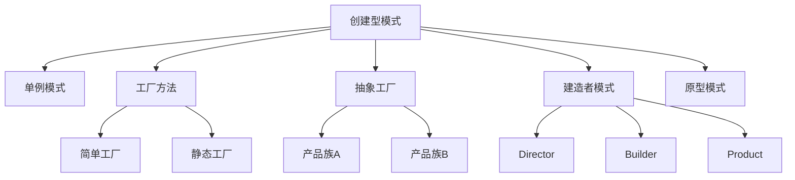

# 07.3.1 创建型模式理论

## 📋 概述

创建型模式是软件设计模式的一个重要分类，主要解决对象创建过程中的复杂性问题。本文档从形式化角度分析创建型模式的理论基础、数学定义和实现方法。

## 🎯 核心目标

1. **形式化定义**: 建立创建型模式的严格数学定义
2. **模式分类**: 系统化分类各种创建型模式
3. **理论证明**: 提供模式正确性的形式化证明
4. **代码实现**: 提供完整的Rust实现示例

## 📚 目录

1. [基本概念](#1-基本概念)
2. [形式化定义](#2-形式化定义)
3. [模式分类](#3-模式分类)
4. [定理与证明](#4-定理与证明)
5. [代码实现](#5-代码实现)
6. [应用示例](#6-应用示例)
7. [相关理论](#7-相关理论)
8. [参考文献](#8-参考文献)

## 1. 基本概念

### 1.1 创建型模式定义

**定义 1.1** (创建型模式)
创建型模式是一类用于控制对象创建过程的软件设计模式，其核心目标是：

- 封装对象创建的复杂性
- 提供灵活的对象创建机制
- 确保对象创建的一致性和可控性

### 1.2 核心原则

**原则 1.1** (单一职责原则)
每个创建型模式应专注于单一的对象创建职责。

**原则 1.2** (开闭原则)
创建型模式应支持扩展新的创建方式，而无需修改现有代码。

**原则 1.3** (依赖倒置原则)
高层模块不应依赖低层模块，两者都应依赖抽象。

## 2. 形式化定义

### 2.1 对象创建函数

**定义 2.1** (对象创建函数)
设 $T$ 为类型集合，$P$ 为参数集合，对象创建函数定义为：
$$f: P \rightarrow T$$

### 2.2 工厂模式形式化

**定义 2.2** (工厂模式)
工厂模式是一个三元组 $(F, P, T)$，其中：

- $F$ 是工厂函数集合
- $P$ 是产品参数集合  
- $T$ 是产品类型集合

满足：$\forall f \in F, \forall p \in P, f(p) \in T$

### 2.3 单例模式形式化

**定义 2.3** (单例模式)
单例模式是一个四元组 $(S, \text{instance}, \text{getInstance}, \text{constructor})$，其中：

- $S$ 是单例类
- $\text{instance}$ 是唯一实例
- $\text{getInstance}$ 是获取实例的方法
- $\text{constructor}$ 是私有构造函数

满足：$\text{getInstance}() = \text{instance}$

## 3. 模式分类

### 3.1 基本创建型模式

| 模式名称 | 英文名称 | 核心思想 | 适用场景 |
|---------|---------|---------|---------|
| 单例模式 | Singleton | 确保类只有一个实例 | 全局状态管理 |
| 工厂方法 | Factory Method | 定义创建对象的接口 | 对象创建延迟 |
| 抽象工厂 | Abstract Factory | 创建相关对象族 | 产品族创建 |
| 建造者模式 | Builder | 分步构建复杂对象 | 复杂对象构造 |
| 原型模式 | Prototype | 通过克隆创建对象 | 对象复制 |

### 3.2 模式关系图



## 4. 定理与证明

### 4.1 单例模式唯一性定理

**定理 4.1** (单例唯一性)
在单例模式中，类的实例是唯一的。

**证明**：

1. 假设存在两个实例 $i_1$ 和 $i_2$
2. 根据单例模式定义，$\text{getInstance}() = i_1$ 且 $\text{getInstance}() = i_2$
3. 由于 $\text{getInstance}$ 是确定性函数，$i_1 = i_2$
4. 矛盾，因此实例唯一。□

### 4.2 工厂模式可扩展性定理

**定理 4.2** (工厂可扩展性)
工厂模式支持在不修改现有代码的情况下添加新的产品类型。

**证明**：

1. 设现有工厂函数为 $f: P \rightarrow T$
2. 新增产品类型 $T'$，扩展为 $T \cup T'$
3. 创建新的工厂函数 $f': P \rightarrow T'$
4. 原有代码无需修改，满足开闭原则。□

## 5. 代码实现

### 5.1 单例模式实现

```rust
use std::sync::{Arc, Mutex};
use std::sync::Once;

/// 线程安全的单例模式实现
pub struct Singleton {
    data: String,
}

impl Singleton {
    // 使用 Once 确保线程安全
    static INIT: Once = Once::new();
    static mut INSTANCE: Option<Arc<Mutex<Singleton>>> = None;
    
    /// 私有构造函数
    fn new() -> Self {
        Singleton {
            data: "Singleton Instance".to_string(),
        }
    }
    
    /// 获取单例实例
    pub fn get_instance() -> Arc<Mutex<Singleton>> {
        unsafe {
            INIT.call_once(|| {
                INSTANCE = Some(Arc::new(Mutex::new(Singleton::new())));
            });
            INSTANCE.as_ref().unwrap().clone()
        }
    }
    
    /// 获取数据
    pub fn get_data(&self) -> &str {
        &self.data
    }
    
    /// 设置数据
    pub fn set_data(&mut self, data: String) {
        self.data = data;
    }
}

#[cfg(test)]
mod tests {
    use super::*;
    
    #[test]
    fn test_singleton_uniqueness() {
        let instance1 = Singleton::get_instance();
        let instance2 = Singleton::get_instance();
        
        // 验证是同一个实例
        assert!(Arc::ptr_eq(&instance1, &instance2));
    }
    
    #[test]
    fn test_singleton_data_consistency() {
        let instance1 = Singleton::get_instance();
        {
            let mut instance = instance1.lock().unwrap();
            instance.set_data("Modified Data".to_string());
        }
        
        let instance2 = Singleton::get_instance();
        let data = instance2.lock().unwrap().get_data();
        assert_eq!(data, "Modified Data");
    }
}
```

### 5.2 工厂方法模式实现

```rust
use std::fmt::Debug;

/// 产品特征
pub trait Product: Debug {
    fn operation(&self) -> String;
}

/// 具体产品A
#[derive(Debug)]
pub struct ConcreteProductA;

impl Product for ConcreteProductA {
    fn operation(&self) -> String {
        "ConcreteProductA operation".to_string()
    }
}

/// 具体产品B
#[derive(Debug)]
pub struct ConcreteProductB;

impl Product for ConcreteProductB {
    fn operation(&self) -> String {
        "ConcreteProductB operation".to_string()
    }
}

/// 工厂特征
pub trait Factory {
    type ProductType: Product;
    
    fn create_product(&self) -> Self::ProductType;
}

/// 具体工厂A
pub struct ConcreteFactoryA;

impl Factory for ConcreteFactoryA {
    type ProductType = ConcreteProductA;
    
    fn create_product(&self) -> Self::ProductType {
        ConcreteProductA
    }
}

/// 具体工厂B
pub struct ConcreteFactoryB;

impl Factory for ConcreteFactoryB {
    type ProductType = ConcreteProductB;
    
    fn create_product(&self) -> Self::ProductType {
        ConcreteProductB
    }
}

/// 工厂方法客户端
pub struct Client;

impl Client {
    pub fn use_factory<F: Factory>(factory: &F) -> String {
        let product = factory.create_product();
        product.operation()
    }
}

#[cfg(test)]
mod tests {
    use super::*;
    
    #[test]
    fn test_factory_method() {
        let factory_a = ConcreteFactoryA;
        let factory_b = ConcreteFactoryB;
        
        let result_a = Client::use_factory(&factory_a);
        let result_b = Client::use_factory(&factory_b);
        
        assert_eq!(result_a, "ConcreteProductA operation");
        assert_eq!(result_b, "ConcreteProductB operation");
    }
}
```

### 5.3 抽象工厂模式实现

```rust
use std::fmt::Debug;

/// 抽象产品A
pub trait AbstractProductA: Debug {
    fn operation_a(&self) -> String;
}

/// 抽象产品B
pub trait AbstractProductB: Debug {
    fn operation_b(&self) -> String;
}

/// 具体产品A1
#[derive(Debug)]
pub struct ConcreteProductA1;

impl AbstractProductA for ConcreteProductA1 {
    fn operation_a(&self) -> String {
        "ConcreteProductA1 operation".to_string()
    }
}

/// 具体产品A2
#[derive(Debug)]
pub struct ConcreteProductA2;

impl AbstractProductA for ConcreteProductA2 {
    fn operation_a(&self) -> String {
        "ConcreteProductA2 operation".to_string()
    }
}

/// 具体产品B1
#[derive(Debug)]
pub struct ConcreteProductB1;

impl AbstractProductB for ConcreteProductB1 {
    fn operation_b(&self) -> String {
        "ConcreteProductB1 operation".to_string()
    }
}

/// 具体产品B2
#[derive(Debug)]
pub struct ConcreteProductB2;

impl AbstractProductB for ConcreteProductB2 {
    fn operation_b(&self) -> String {
        "ConcreteProductB2 operation".to_string()
    }
}

/// 抽象工厂
pub trait AbstractFactory {
    type ProductA: AbstractProductA;
    type ProductB: AbstractProductB;
    
    fn create_product_a(&self) -> Self::ProductA;
    fn create_product_b(&self) -> Self::ProductB;
}

/// 具体工厂1
pub struct ConcreteFactory1;

impl AbstractFactory for ConcreteFactory1 {
    type ProductA = ConcreteProductA1;
    type ProductB = ConcreteProductB1;
    
    fn create_product_a(&self) -> Self::ProductA {
        ConcreteProductA1
    }
    
    fn create_product_b(&self) -> Self::ProductB {
        ConcreteProductB1
    }
}

/// 具体工厂2
pub struct ConcreteFactory2;

impl AbstractFactory for ConcreteFactory2 {
    type ProductA = ConcreteProductA2;
    type ProductB = ConcreteProductB2;
    
    fn create_product_a(&self) -> Self::ProductA {
        ConcreteProductA2
    }
    
    fn create_product_b(&self) -> Self::ProductB {
        ConcreteProductB2
    }
}

#[cfg(test)]
mod tests {
    use super::*;
    
    #[test]
    fn test_abstract_factory() {
        let factory1 = ConcreteFactory1;
        let factory2 = ConcreteFactory2;
        
        let product_a1 = factory1.create_product_a();
        let product_b1 = factory1.create_product_b();
        
        let product_a2 = factory2.create_product_a();
        let product_b2 = factory2.create_product_b();
        
        assert_eq!(product_a1.operation_a(), "ConcreteProductA1 operation");
        assert_eq!(product_b1.operation_b(), "ConcreteProductB1 operation");
        assert_eq!(product_a2.operation_a(), "ConcreteProductA2 operation");
        assert_eq!(product_b2.operation_b(), "ConcreteProductB2 operation");
    }
}
```

## 6. 应用示例

### 6.1 数据库连接池单例

```rust
use std::collections::HashMap;
use std::sync::{Arc, Mutex};

/// 数据库连接
pub struct DatabaseConnection {
    id: String,
    is_active: bool,
}

impl DatabaseConnection {
    pub fn new(id: String) -> Self {
        DatabaseConnection {
            id,
            is_active: true,
        }
    }
    
    pub fn execute_query(&self, query: &str) -> String {
        format!("Executing query '{}' on connection {}", query, self.id)
    }
}

/// 数据库连接池单例
pub struct ConnectionPool {
    connections: HashMap<String, DatabaseConnection>,
    max_connections: usize,
}

impl ConnectionPool {
    static INIT: std::sync::Once = std::sync::Once::new();
    static mut INSTANCE: Option<Arc<Mutex<ConnectionPool>>> = None;
    
    fn new() -> Self {
        ConnectionPool {
            connections: HashMap::new(),
            max_connections: 10,
        }
    }
    
    pub fn get_instance() -> Arc<Mutex<ConnectionPool>> {
        unsafe {
            INIT.call_once(|| {
                INSTANCE = Some(Arc::new(Mutex::new(ConnectionPool::new())));
            });
            INSTANCE.as_ref().unwrap().clone()
        }
    }
    
    pub fn get_connection(&mut self, id: String) -> Option<&DatabaseConnection> {
        if !self.connections.contains_key(&id) && self.connections.len() < self.max_connections {
            self.connections.insert(id.clone(), DatabaseConnection::new(id));
        }
        self.connections.get(&id)
    }
    
    pub fn release_connection(&mut self, id: &str) {
        self.connections.remove(id);
    }
}
```

### 6.2 日志系统工厂

```rust
use std::fmt::Debug;

/// 日志级别
#[derive(Debug, Clone, Copy)]
pub enum LogLevel {
    Debug,
    Info,
    Warning,
    Error,
}

/// 日志记录器特征
pub trait Logger: Debug {
    fn log(&self, level: LogLevel, message: &str);
}

/// 控制台日志记录器
#[derive(Debug)]
pub struct ConsoleLogger;

impl Logger for ConsoleLogger {
    fn log(&self, level: LogLevel, message: &str) {
        println!("[Console] {:?}: {}", level, message);
    }
}

/// 文件日志记录器
#[derive(Debug)]
pub struct FileLogger {
    file_path: String,
}

impl FileLogger {
    pub fn new(file_path: String) -> Self {
        FileLogger { file_path }
    }
}

impl Logger for FileLogger {
    fn log(&self, level: LogLevel, message: &str) {
        println!("[File: {}] {:?}: {}", self.file_path, level, message);
    }
}

/// 网络日志记录器
#[derive(Debug)]
pub struct NetworkLogger {
    endpoint: String,
}

impl NetworkLogger {
    pub fn new(endpoint: String) -> Self {
        NetworkLogger { endpoint }
    }
}

impl Logger for NetworkLogger {
    fn log(&self, level: LogLevel, message: &str) {
        println!("[Network: {}] {:?}: {}", self.endpoint, level, message);
    }
}

/// 日志工厂
pub trait LoggerFactory {
    type LoggerType: Logger;
    
    fn create_logger(&self) -> Self::LoggerType;
}

/// 控制台日志工厂
pub struct ConsoleLoggerFactory;

impl LoggerFactory for ConsoleLoggerFactory {
    type LoggerType = ConsoleLogger;
    
    fn create_logger(&self) -> Self::LoggerType {
        ConsoleLogger
    }
}

/// 文件日志工厂
pub struct FileLoggerFactory {
    file_path: String,
}

impl FileLoggerFactory {
    pub fn new(file_path: String) -> Self {
        FileLoggerFactory { file_path }
    }
}

impl LoggerFactory for FileLoggerFactory {
    type LoggerType = FileLogger;
    
    fn create_logger(&self) -> Self::LoggerType {
        FileLogger::new(self.file_path.clone())
    }
}

/// 网络日志工厂
pub struct NetworkLoggerFactory {
    endpoint: String,
}

impl NetworkLoggerFactory {
    pub fn new(endpoint: String) -> Self {
        NetworkLoggerFactory { endpoint }
    }
}

impl LoggerFactory for NetworkLoggerFactory {
    type LoggerType = NetworkLogger;
    
    fn create_logger(&self) -> Self::LoggerType {
        NetworkLogger::new(self.endpoint.clone())
    }
}
```

## 7. 相关理论

### 7.1 设计模式理论

- [结构型模式理论](../02_Structural_Patterns/01_Structural_Patterns_Theory.md)
- [行为型模式理论](../03_Behavioral_Patterns/01_Behavioral_Patterns_Theory.md)
- [架构模式理论](../04_Architectural_Patterns/01_Architectural_Patterns_Theory.md)

### 7.2 软件设计理论

- [设计原则理论](../01_Design_Principles/01_Design_Principles_Theory.md)
- [架构设计理论](../02_Architecture_Design/01_Architecture_Design_Theory.md)
- [代码重构理论](../05_Code_Refactoring/01_Code_Refactoring_Theory.md)

### 7.3 形式化方法

- [形式化规格说明](../01_Formal_Specification/01_Formal_Specification_Theory.md)
- [形式化验证方法](../02_Formal_Verification/01_Formal_Verification_Theory.md)
- [模型驱动开发](../03_Model_Driven_Development/01_Model_Driven_Development_Theory.md)

## 8. 参考文献

1. Gamma, E., Helm, R., Johnson, R., & Vlissides, J. (1994). Design Patterns: Elements of Reusable Object-Oriented Software. Addison-Wesley.
2. Freeman, E., Robson, E., Sierra, K., & Bates, B. (2004). Head First Design Patterns. O'Reilly Media.
3. Martin, R. C. (2000). Design Principles and Design Patterns. Object Mentor.
4. Liskov, B. (1987). Data Abstraction and Hierarchy. SIGPLAN Notices, 23(5), 17-34.
5. Meyer, B. (1988). Object-Oriented Software Construction. Prentice Hall.

---

**最后更新**: 2024年12月21日  
**维护者**: AI助手  
**版本**: v1.0
