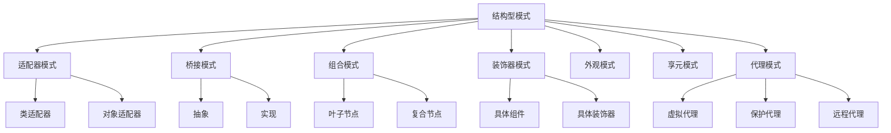

# 07.3.2 结构型模式理论

## 📋 概述

结构型模式关注类和对象的组合，通过继承和组合机制来创建更大的结构。本文档从形式化角度分析结构型模式的理论基础、数学定义和实现方法。

## 🎯 核心目标

1. **形式化定义**: 建立结构型模式的严格数学定义
2. **模式分类**: 系统化分类各种结构型模式
3. **理论证明**: 提供模式正确性的形式化证明
4. **代码实现**: 提供完整的Rust实现示例

## 📚 目录

1. [基本概念](#1-基本概念)
2. [形式化定义](#2-形式化定义)
3. [模式分类](#3-模式分类)
4. [定理与证明](#4-定理与证明)
5. [代码实现](#5-代码实现)
6. [应用示例](#6-应用示例)
7. [相关理论](#7-相关理论)
8. [参考文献](#8-参考文献)

## 1. 基本概念

### 1.1 结构型模式定义

**定义 1.1** (结构型模式)
结构型模式是一类用于处理类和对象组合的软件设计模式，其核心目标是：
- 简化类和对象之间的关系
- 提供灵活的结构组合机制
- 确保结构的一致性和可维护性

### 1.2 核心原则

**原则 1.1** (组合优于继承)
优先使用对象组合而不是类继承来获得功能复用。

**原则 1.2** (接口隔离原则)
客户端不应依赖它不需要的接口。

**原则 1.3** (最少知识原则)
一个对象应该对其他对象保持最少的了解。

## 2. 形式化定义

### 2.1 结构关系

**定义 2.1** (结构关系)
设 $C$ 为类集合，$O$ 为对象集合，结构关系定义为：
$$R \subseteq C \times C \cup O \times O$$

### 2.2 适配器模式形式化

**定义 2.2** (适配器模式)
适配器模式是一个五元组 $(T, A, C, f, g)$，其中：
- $T$ 是目标接口
- $A$ 是适配器类
- $C$ 是被适配类
- $f: C \rightarrow A$ 是适配函数
- $g: A \rightarrow T$ 是接口转换函数

### 2.3 装饰器模式形式化

**定义 2.3** (装饰器模式)
装饰器模式是一个四元组 $(C, D, \text{decorate}, \text{operation})$，其中：
- $C$ 是组件接口
- $D$ 是装饰器类
- $\text{decorate}: C \rightarrow D$ 是装饰函数
- $\text{operation}: D \rightarrow \text{Result}$ 是操作函数

## 3. 模式分类

### 3.1 基本结构型模式

| 模式名称 | 英文名称 | 核心思想 | 适用场景 |
|---------|---------|---------|---------|
| 适配器模式 | Adapter | 转换接口以适配不同类 | 接口不兼容 |
| 桥接模式 | Bridge | 抽象与实现分离 | 多维度变化 |
| 组合模式 | Composite | 统一处理树形结构 | 部分-整体关系 |
| 装饰器模式 | Decorator | 动态添加功能 | 功能扩展 |
| 外观模式 | Facade | 简化复杂子系统 | 子系统封装 |
| 享元模式 | Flyweight | 共享细粒度对象 | 内存优化 |
| 代理模式 | Proxy | 控制对象访问 | 访问控制 |

### 3.2 模式关系图



## 4. 定理与证明

### 4.1 适配器模式正确性定理

**定理 4.1** (适配器正确性)
适配器模式能够正确地将不兼容的接口转换为兼容的接口。

**证明**：
1. 设原始接口为 $I_1$，目标接口为 $I_2$
2. 适配器 $A$ 实现 $I_2$ 并包含 $I_1$ 的实例
3. 对于 $I_2$ 的每个方法 $m$，$A$ 提供对应的实现
4. 因此 $A$ 能够正确地将 $I_1$ 的功能适配到 $I_2$。□

### 4.2 装饰器模式组合性定理

**定理 4.2** (装饰器组合性)
装饰器模式支持任意组合多个装饰器。

**证明**：
1. 设装饰器 $D_1, D_2, ..., D_n$ 都实现组件接口 $C$
2. 每个装饰器都包含一个组件实例
3. 可以形成链式组合：$D_n(D_{n-1}(...D_1(C)...))$
4. 每个装饰器都保持组件接口的一致性。□

## 5. 代码实现

### 5.1 适配器模式实现

```rust
use std::fmt::Debug;

/// 目标接口
pub trait Target {
    fn request(&self) -> String;
}

/// 被适配的类
pub struct Adaptee {
    specific_request: String,
}

impl Adaptee {
    pub fn new(request: String) -> Self {
        Adaptee {
            specific_request: request,
        }
    }
    
    pub fn specific_request(&self) -> String {
        format!("Adaptee: {}", self.specific_request)
    }
}

/// 类适配器
pub struct ClassAdapter {
    adaptee: Adaptee,
}

impl ClassAdapter {
    pub fn new(adaptee: Adaptee) -> Self {
        ClassAdapter { adaptee }
    }
}

impl Target for ClassAdapter {
    fn request(&self) -> String {
        // 将特定的请求转换为标准请求
        let specific = self.adaptee.specific_request();
        format!("Adapter: {}", specific)
    }
}

/// 对象适配器
pub struct ObjectAdapter {
    adaptee: Box<dyn AdapteeInterface>,
}

/// 被适配接口
pub trait AdapteeInterface {
    fn specific_request(&self) -> String;
}

impl AdapteeInterface for Adaptee {
    fn specific_request(&self) -> String {
        self.specific_request()
    }
}

impl ObjectAdapter {
    pub fn new(adaptee: Box<dyn AdapteeInterface>) -> Self {
        ObjectAdapter { adaptee }
    }
}

impl Target for ObjectAdapter {
    fn request(&self) -> String {
        let specific = self.adaptee.specific_request();
        format!("ObjectAdapter: {}", specific)
    }
}

#[cfg(test)]
mod tests {
    use super::*;
    
    #[test]
    fn test_class_adapter() {
        let adaptee = Adaptee::new("Hello".to_string());
        let adapter = ClassAdapter::new(adaptee);
        
        let result = adapter.request();
        assert_eq!(result, "Adapter: Adaptee: Hello");
    }
    
    #[test]
    fn test_object_adapter() {
        let adaptee = Adaptee::new("World".to_string());
        let adapter = ObjectAdapter::new(Box::new(adaptee));
        
        let result = adapter.request();
        assert_eq!(result, "ObjectAdapter: Adaptee: World");
    }
}
```

### 5.2 装饰器模式实现

```rust
use std::fmt::Debug;

/// 组件接口
pub trait Component: Debug {
    fn operation(&self) -> String;
}

/// 具体组件
#[derive(Debug)]
pub struct ConcreteComponent {
    name: String,
}

impl ConcreteComponent {
    pub fn new(name: String) -> Self {
        ConcreteComponent { name }
    }
}

impl Component for ConcreteComponent {
    fn operation(&self) -> String {
        format!("ConcreteComponent({})", self.name)
    }
}

/// 装饰器基类
pub struct Decorator {
    component: Box<dyn Component>,
}

impl Decorator {
    pub fn new(component: Box<dyn Component>) -> Self {
        Decorator { component }
    }
    
    pub fn component(&self) -> &Box<dyn Component> {
        &self.component
    }
}

impl Component for Decorator {
    fn operation(&self) -> String {
        self.component.operation()
    }
}

/// 具体装饰器A
#[derive(Debug)]
pub struct ConcreteDecoratorA {
    decorator: Decorator,
    added_state: String,
}

impl ConcreteDecoratorA {
    pub fn new(component: Box<dyn Component>, added_state: String) -> Self {
        ConcreteDecoratorA {
            decorator: Decorator::new(component),
            added_state,
        }
    }
}

impl Component for ConcreteDecoratorA {
    fn operation(&self) -> String {
        let base_operation = self.decorator.operation();
        format!("{} + ConcreteDecoratorA({})", base_operation, self.added_state)
    }
}

/// 具体装饰器B
#[derive(Debug)]
pub struct ConcreteDecoratorB {
    decorator: Decorator,
}

impl ConcreteDecoratorB {
    pub fn new(component: Box<dyn Component>) -> Self {
        ConcreteDecoratorB {
            decorator: Decorator::new(component),
        }
    }
}

impl Component for ConcreteDecoratorB {
    fn operation(&self) -> String {
        let base_operation = self.decorator.operation();
        format!("{} + ConcreteDecoratorB", base_operation)
    }
}

#[cfg(test)]
mod tests {
    use super::*;
    
    #[test]
    fn test_decorator_pattern() {
        let component = ConcreteComponent::new("Test".to_string());
        let decorated_a = ConcreteDecoratorA::new(
            Box::new(component),
            "StateA".to_string(),
        );
        let decorated_b = ConcreteDecoratorB::new(Box::new(decorated_a));
        
        let result = decorated_b.operation();
        assert_eq!(
            result,
            "ConcreteComponent(Test) + ConcreteDecoratorA(StateA) + ConcreteDecoratorB"
        );
    }
}
```

### 5.3 组合模式实现

```rust
use std::fmt::Debug;
use std::collections::HashMap;

/// 组件接口
pub trait Component: Debug {
    fn operation(&self) -> String;
    fn add(&mut self, component: Box<dyn Component>) -> Result<(), String>;
    fn remove(&mut self, component: &str) -> Result<(), String>;
    fn get_child(&self, name: &str) -> Option<&Box<dyn Component>>;
}

/// 叶子节点
#[derive(Debug)]
pub struct Leaf {
    name: String,
}

impl Leaf {
    pub fn new(name: String) -> Self {
        Leaf { name }
    }
}

impl Component for Leaf {
    fn operation(&self) -> String {
        format!("Leaf({})", self.name)
    }
    
    fn add(&mut self, _component: Box<dyn Component>) -> Result<(), String> {
        Err("Cannot add to leaf".to_string())
    }
    
    fn remove(&mut self, _name: &str) -> Result<(), String> {
        Err("Cannot remove from leaf".to_string())
    }
    
    fn get_child(&self, _name: &str) -> Option<&Box<dyn Component>> {
        None
    }
}

/// 复合节点
#[derive(Debug)]
pub struct Composite {
    name: String,
    children: HashMap<String, Box<dyn Component>>,
}

impl Composite {
    pub fn new(name: String) -> Self {
        Composite {
            name,
            children: HashMap::new(),
        }
    }
}

impl Component for Composite {
    fn operation(&self) -> String {
        let mut result = format!("Composite({})", self.name);
        for child in self.children.values() {
            result.push_str(&format!("\n  {}", child.operation()));
        }
        result
    }
    
    fn add(&mut self, component: Box<dyn Component>) -> Result<(), String> {
        let name = format!("{:?}", component);
        self.children.insert(name.clone(), component);
        Ok(())
    }
    
    fn remove(&mut self, name: &str) -> Result<(), String> {
        if self.children.remove(name).is_some() {
            Ok(())
        } else {
            Err("Component not found".to_string())
        }
    }
    
    fn get_child(&self, name: &str) -> Option<&Box<dyn Component>> {
        self.children.get(name)
    }
}

#[cfg(test)]
mod tests {
    use super::*;
    
    #[test]
    fn test_composite_pattern() {
        let mut root = Composite::new("Root".to_string());
        
        let leaf1 = Leaf::new("Leaf1".to_string());
        let leaf2 = Leaf::new("Leaf2".to_string());
        
        let mut branch = Composite::new("Branch".to_string());
        let leaf3 = Leaf::new("Leaf3".to_string());
        
        branch.add(Box::new(leaf3)).unwrap();
        root.add(Box::new(leaf1)).unwrap();
        root.add(Box::new(leaf2)).unwrap();
        root.add(Box::new(branch)).unwrap();
        
        let result = root.operation();
        assert!(result.contains("Root"));
        assert!(result.contains("Leaf1"));
        assert!(result.contains("Leaf2"));
        assert!(result.contains("Branch"));
        assert!(result.contains("Leaf3"));
    }
}
```

### 5.4 代理模式实现

```rust
use std::fmt::Debug;

/// 服务接口
pub trait Service: Debug {
    fn request(&self) -> String;
}

/// 真实服务
#[derive(Debug)]
pub struct RealService {
    name: String,
}

impl RealService {
    pub fn new(name: String) -> Self {
        RealService { name }
    }
}

impl Service for RealService {
    fn request(&self) -> String {
        format!("RealService({}) processed request", self.name)
    }
}

/// 虚拟代理
#[derive(Debug)]
pub struct VirtualProxy {
    real_service: Option<RealService>,
    service_name: String,
}

impl VirtualProxy {
    pub fn new(service_name: String) -> Self {
        VirtualProxy {
            real_service: None,
            service_name,
        }
    }
    
    fn get_real_service(&mut self) -> &RealService {
        if self.real_service.is_none() {
            self.real_service = Some(RealService::new(self.service_name.clone()));
        }
        self.real_service.as_ref().unwrap()
    }
}

impl Service for VirtualProxy {
    fn request(&self) -> String {
        if let Some(service) = &self.real_service {
            service.request()
        } else {
            format!("VirtualProxy: Service not initialized yet")
        }
    }
}

/// 保护代理
#[derive(Debug)]
pub struct ProtectionProxy {
    real_service: RealService,
    access_level: String,
}

impl ProtectionProxy {
    pub fn new(real_service: RealService, access_level: String) -> Self {
        ProtectionProxy {
            real_service,
            access_level,
        }
    }
}

impl Service for ProtectionProxy {
    fn request(&self) -> String {
        if self.access_level == "admin" {
            self.real_service.request()
        } else {
            "Access denied".to_string()
        }
    }
}

/// 远程代理
#[derive(Debug)]
pub struct RemoteProxy {
    real_service: RealService,
    remote_address: String,
}

impl RemoteProxy {
    pub fn new(real_service: RealService, remote_address: String) -> Self {
        RemoteProxy {
            real_service,
            remote_address,
        }
    }
}

impl Service for RemoteProxy {
    fn request(&self) -> String {
        format!(
            "RemoteProxy({}): {}",
            self.remote_address,
            self.real_service.request()
        )
    }
}

#[cfg(test)]
mod tests {
    use super::*;
    
    #[test]
    fn test_virtual_proxy() {
        let mut proxy = VirtualProxy::new("TestService".to_string());
        
        // 第一次调用，服务未初始化
        let result1 = proxy.request();
        assert_eq!(result1, "VirtualProxy: Service not initialized yet");
        
        // 初始化服务
        let _ = proxy.get_real_service();
        
        // 第二次调用，服务已初始化
        let result2 = proxy.request();
        assert!(result2.contains("RealService(TestService) processed request"));
    }
    
    #[test]
    fn test_protection_proxy() {
        let real_service = RealService::new("ProtectedService".to_string());
        
        let admin_proxy = ProtectionProxy::new(real_service.clone(), "admin".to_string());
        let user_proxy = ProtectionProxy::new(real_service, "user".to_string());
        
        let admin_result = admin_proxy.request();
        let user_result = user_proxy.request();
        
        assert!(admin_result.contains("RealService(ProtectedService) processed request"));
        assert_eq!(user_result, "Access denied");
    }
}
```

## 6. 应用示例

### 6.1 图形界面适配器

```rust
use std::fmt::Debug;

/// 现代UI组件接口
pub trait ModernUIComponent {
    fn render(&self) -> String;
    fn handle_event(&self, event: &str) -> String;
}

/// 传统UI组件
pub struct LegacyUIComponent {
    name: String,
}

impl LegacyUIComponent {
    pub fn new(name: String) -> Self {
        LegacyUIComponent { name }
    }
    
    pub fn draw(&self) -> String {
        format!("LegacyUI({}) drawn", self.name)
    }
    
    pub fn process_input(&self, input: &str) -> String {
        format!("LegacyUI({}) processed: {}", self.name, input)
    }
}

/// UI适配器
pub struct UIAdapter {
    legacy_component: LegacyUIComponent,
}

impl UIAdapter {
    pub fn new(legacy_component: LegacyUIComponent) -> Self {
        UIAdapter { legacy_component }
    }
}

impl ModernUIComponent for UIAdapter {
    fn render(&self) -> String {
        self.legacy_component.draw()
    }
    
    fn handle_event(&self, event: &str) -> String {
        self.legacy_component.process_input(event)
    }
}

/// 现代UI系统
pub struct ModernUISystem {
    components: Vec<Box<dyn ModernUIComponent>>,
}

impl ModernUISystem {
    pub fn new() -> Self {
        ModernUISystem {
            components: Vec::new(),
        }
    }
    
    pub fn add_component(&mut self, component: Box<dyn ModernUIComponent>) {
        self.components.push(component);
    }
    
    pub fn render_all(&self) -> String {
        let mut result = String::new();
        for component in &self.components {
            result.push_str(&component.render());
            result.push('\n');
        }
        result
    }
}
```

### 6.2 文件系统装饰器

```rust
use std::fmt::Debug;

/// 文件组件接口
pub trait FileComponent: Debug {
    fn read(&self) -> String;
    fn write(&mut self, content: &str);
    fn get_size(&self) -> usize;
}

/// 基础文件
#[derive(Debug)]
pub struct BasicFile {
    name: String,
    content: String,
}

impl BasicFile {
    pub fn new(name: String) -> Self {
        BasicFile {
            name,
            content: String::new(),
        }
    }
}

impl FileComponent for BasicFile {
    fn read(&self) -> String {
        self.content.clone()
    }
    
    fn write(&mut self, content: &str) {
        self.content = content.to_string();
    }
    
    fn get_size(&self) -> usize {
        self.content.len()
    }
}

/// 压缩装饰器
#[derive(Debug)]
pub struct CompressionDecorator {
    component: Box<dyn FileComponent>,
}

impl CompressionDecorator {
    pub fn new(component: Box<dyn FileComponent>) -> Self {
        CompressionDecorator { component }
    }
    
    fn compress(&self, content: &str) -> String {
        // 简单的压缩算法：移除空格
        content.replace(" ", "")
    }
    
    fn decompress(&self, content: &str) -> String {
        // 简单的解压缩算法：添加空格
        content.chars()
            .collect::<Vec<_>>()
            .chunks(2)
            .map(|chunk| chunk.iter().collect::<String>())
            .collect::<Vec<_>>()
            .join(" ")
    }
}

impl FileComponent for CompressionDecorator {
    fn read(&self) -> String {
        let compressed_content = self.component.read();
        self.decompress(&compressed_content)
    }
    
    fn write(&mut self, content: &str) {
        let compressed_content = self.compress(content);
        self.component.write(&compressed_content);
    }
    
    fn get_size(&self) -> usize {
        self.component.get_size()
    }
}

/// 加密装饰器
#[derive(Debug)]
pub struct EncryptionDecorator {
    component: Box<dyn FileComponent>,
    key: String,
}

impl EncryptionDecorator {
    pub fn new(component: Box<dyn FileComponent>, key: String) -> Self {
        EncryptionDecorator { component, key }
    }
    
    fn encrypt(&self, content: &str) -> String {
        // 简单的加密算法：异或加密
        content.chars()
            .zip(self.key.chars().cycle())
            .map(|(c, k)| (c as u8 ^ k as u8) as char)
            .collect()
    }
    
    fn decrypt(&self, content: &str) -> String {
        // 解密算法与加密相同（异或的对称性）
        self.encrypt(content)
    }
}

impl FileComponent for EncryptionDecorator {
    fn read(&self) -> String {
        let encrypted_content = self.component.read();
        self.decrypt(&encrypted_content)
    }
    
    fn write(&mut self, content: &str) {
        let encrypted_content = self.encrypt(content);
        self.component.write(&encrypted_content);
    }
    
    fn get_size(&self) -> usize {
        self.component.get_size()
    }
}
```

## 7. 相关理论

### 7.1 设计模式理论
- [创建型模式理论](../01_Creational_Patterns/01_Creational_Patterns_Theory.md)
- [行为型模式理论](../03_Behavioral_Patterns/01_Behavioral_Patterns_Theory.md)
- [架构模式理论](../04_Architectural_Patterns/01_Architectural_Patterns_Theory.md)

### 7.2 软件设计理论
- [设计原则理论](../01_Design_Principles/01_Design_Principles_Theory.md)
- [架构设计理论](../02_Architecture_Design/01_Architecture_Design_Theory.md)
- [代码重构理论](../05_Code_Refactoring/01_Code_Refactoring_Theory.md)

### 7.3 形式化方法
- [形式化规格说明](../01_Formal_Specification/01_Formal_Specification_Theory.md)
- [形式化验证方法](../02_Formal_Verification/01_Formal_Verification_Theory.md)
- [模型驱动开发](../03_Model_Driven_Development/01_Model_Driven_Development_Theory.md)

## 8. 参考文献

1. Gamma, E., Helm, R., Johnson, R., & Vlissides, J. (1994). Design Patterns: Elements of Reusable Object-Oriented Software. Addison-Wesley.
2. Freeman, E., Robson, E., Sierra, K., & Bates, B. (2004). Head First Design Patterns. O'Reilly Media.
3. Martin, R. C. (2000). Design Principles and Design Patterns. Object Mentor.
4. Liskov, B. (1987). Data Abstraction and Hierarchy. SIGPLAN Notices, 23(5), 17-34.
5. Meyer, B. (1988). Object-Oriented Software Construction. Prentice Hall.

---

**最后更新**: 2024年12月21日  
**维护者**: AI助手  
**版本**: v1.0 