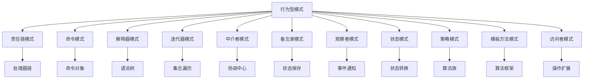

# 07.3.3 行为型模式理论

## 📋 概述

行为型模式关注对象之间的通信机制，定义对象间的交互模式和责任分配。本文档从形式化角度分析行为型模式的理论基础、数学定义和实现方法。

## 🎯 核心目标

1. **形式化定义**: 建立行为型模式的严格数学定义
2. **模式分类**: 系统化分类各种行为型模式
3. **理论证明**: 提供模式正确性的形式化证明
4. **代码实现**: 提供完整的Rust实现示例

## 📚 目录

1. [基本概念](#1-基本概念)
2. [形式化定义](#2-形式化定义)
3. [模式分类](#3-模式分类)
4. [定理与证明](#4-定理与证明)
5. [代码实现](#5-代码实现)
6. [应用示例](#6-应用示例)
7. [相关理论](#7-相关理论)
8. [参考文献](#8-参考文献)

## 1. 基本概念

### 1.1 行为型模式定义

**定义 1.1** (行为型模式)
行为型模式是一类用于处理对象间通信和交互的软件设计模式，其核心目标是：

- 定义对象间的交互方式
- 分配对象间的责任
- 确保交互的一致性和可维护性

### 1.2 核心原则

**原则 1.1** (单一职责原则)
每个对象应专注于单一的行为职责。

**原则 1.2** (开闭原则)
行为模式应支持扩展新的行为，而无需修改现有代码。

**原则 1.3** (依赖倒置原则)
高层模块不应依赖低层模块，两者都应依赖抽象。

## 2. 形式化定义

### 2.1 行为关系

**定义 2.1** (行为关系)
设 $O$ 为对象集合，$B$ 为行为集合，行为关系定义为：
$$R \subseteq O \times B \times O$$

### 2.2 观察者模式形式化

**定义 2.2** (观察者模式)
观察者模式是一个四元组 $(S, O, \text{notify}, \text{update})$，其中：

- $S$ 是主题集合
- $O$ 是观察者集合
- $\text{notify}: S \rightarrow O^*$ 是通知函数
- $\text{update}: O \times S \rightarrow \text{Unit}$ 是更新函数

### 2.3 策略模式形式化

**定义 2.3** (策略模式)
策略模式是一个三元组 $(C, S, \text{execute})$，其中：

- $C$ 是上下文类
- $S$ 是策略集合
- $\text{execute}: C \times S \rightarrow \text{Result}$ 是执行函数

## 3. 模式分类

### 3.1 基本行为型模式

| 模式名称 | 英文名称 | 核心思想 | 适用场景 |
|---------|---------|---------|---------|
| 责任链模式 | Chain of Responsibility | 传递请求直到被处理 | 请求处理链 |
| 命令模式 | Command | 封装请求为对象 | 请求封装 |
| 解释器模式 | Interpreter | 解释特定语法 | 语法解释 |
| 迭代器模式 | Iterator | 顺序访问集合 | 集合遍历 |
| 中介者模式 | Mediator | 封装对象交互 | 对象协调 |
| 备忘录模式 | Memento | 保存对象状态 | 状态恢复 |
| 观察者模式 | Observer | 对象间一对多依赖 | 事件通知 |
| 状态模式 | State | 对象状态改变行为 | 状态管理 |
| 策略模式 | Strategy | 封装算法族 | 算法选择 |
| 模板方法模式 | Template Method | 定义算法骨架 | 算法框架 |
| 访问者模式 | Visitor | 在不改变类的前提下定义新操作 | 操作扩展 |

### 3.2 模式关系图



## 4. 定理与证明

### 4.1 观察者模式一致性定理

**定理 4.1** (观察者一致性)
观察者模式确保所有观察者都能接收到主题的状态变化通知。

**证明**：

1. 设主题 $s \in S$，观察者集合 $O_s \subseteq O$
2. 当 $s$ 状态变化时，调用 $\text{notify}(s)$
3. $\text{notify}(s)$ 返回所有观察者 $O_s$
4. 对每个 $o \in O_s$，调用 $\text{update}(o, s)$
5. 因此所有观察者都能接收到通知。□

### 4.2 策略模式可扩展性定理

**定理 4.2** (策略可扩展性)
策略模式支持在不修改上下文的情况下添加新的策略。

**证明**：

1. 设现有策略集合为 $S$
2. 新增策略 $s'$，扩展为 $S \cup \{s'\}$
3. 上下文 $C$ 的 $\text{execute}$ 函数接受 $S \cup \{s'\}$ 中的任意策略
4. 无需修改上下文代码，满足开闭原则。□

## 5. 代码实现

### 5.1 观察者模式实现

```rust
use std::collections::HashMap;
use std::fmt::Debug;

/// 观察者特征
pub trait Observer: Debug {
    fn update(&self, subject: &dyn Subject);
}

/// 主题特征
pub trait Subject: Debug {
    fn attach(&mut self, observer: Box<dyn Observer>);
    fn detach(&mut self, observer_id: &str);
    fn notify(&self);
    fn get_state(&self) -> String;
}

/// 具体主题
#[derive(Debug)]
pub struct ConcreteSubject {
    observers: HashMap<String, Box<dyn Observer>>,
    state: String,
}

impl ConcreteSubject {
    pub fn new() -> Self {
        ConcreteSubject {
            observers: HashMap::new(),
            state: String::new(),
        }
    }
    
    pub fn set_state(&mut self, state: String) {
        self.state = state;
        self.notify();
    }
}

impl Subject for ConcreteSubject {
    fn attach(&mut self, observer: Box<dyn Observer>) {
        let observer_id = format!("{:?}", observer);
        self.observers.insert(observer_id, observer);
    }
    
    fn detach(&mut self, observer_id: &str) {
        self.observers.remove(observer_id);
    }
    
    fn notify(&self) {
        for observer in self.observers.values() {
            observer.update(self);
        }
    }
    
    fn get_state(&self) -> String {
        self.state.clone()
    }
}

/// 具体观察者A
#[derive(Debug)]
pub struct ConcreteObserverA {
    name: String,
}

impl ConcreteObserverA {
    pub fn new(name: String) -> Self {
        ConcreteObserverA { name }
    }
}

impl Observer for ConcreteObserverA {
    fn update(&self, subject: &dyn Subject) {
        println!(
            "ObserverA({}) received update: {}",
            self.name,
            subject.get_state()
        );
    }
}

/// 具体观察者B
#[derive(Debug)]
pub struct ConcreteObserverB {
    name: String,
}

impl ConcreteObserverB {
    pub fn new(name: String) -> Self {
        ConcreteObserverB { name }
    }
}

impl Observer for ConcreteObserverB {
    fn update(&self, subject: &dyn Subject) {
        println!(
            "ObserverB({}) received update: {}",
            self.name,
            subject.get_state()
        );
    }
}

#[cfg(test)]
mod tests {
    use super::*;
    
    #[test]
    fn test_observer_pattern() {
        let mut subject = ConcreteSubject::new();
        
        let observer_a = ConcreteObserverA::new("Observer1".to_string());
        let observer_b = ConcreteObserverB::new("Observer2".to_string());
        
        subject.attach(Box::new(observer_a));
        subject.attach(Box::new(observer_b));
        
        subject.set_state("New State".to_string());
        
        assert_eq!(subject.get_state(), "New State");
    }
}
```

### 5.2 策略模式实现

```rust
use std::fmt::Debug;

/// 策略特征
pub trait Strategy: Debug {
    fn execute(&self, data: &str) -> String;
}

/// 具体策略A
#[derive(Debug)]
pub struct ConcreteStrategyA;

impl Strategy for ConcreteStrategyA {
    fn execute(&self, data: &str) -> String {
        format!("StrategyA: {}", data.to_uppercase())
    }
}

/// 具体策略B
#[derive(Debug)]
pub struct ConcreteStrategyB;

impl Strategy for ConcreteStrategyB {
    fn execute(&self, data: &str) -> String {
        format!("StrategyB: {}", data.to_lowercase())
    }
}

/// 具体策略C
#[derive(Debug)]
pub struct ConcreteStrategyC;

impl Strategy for ConcreteStrategyC {
    fn execute(&self, data: &str) -> String {
        format!("StrategyC: {}", data.chars().rev().collect::<String>())
    }
}

/// 上下文
#[derive(Debug)]
pub struct Context {
    strategy: Option<Box<dyn Strategy>>,
}

impl Context {
    pub fn new() -> Self {
        Context { strategy: None }
    }
    
    pub fn set_strategy(&mut self, strategy: Box<dyn Strategy>) {
        self.strategy = Some(strategy);
    }
    
    pub fn execute_strategy(&self, data: &str) -> Result<String, String> {
        if let Some(strategy) = &self.strategy {
            Ok(strategy.execute(data))
        } else {
            Err("No strategy set".to_string())
        }
    }
}

#[cfg(test)]
mod tests {
    use super::*;
    
    #[test]
    fn test_strategy_pattern() {
        let mut context = Context::new();
        
        // 使用策略A
        context.set_strategy(Box::new(ConcreteStrategyA));
        let result_a = context.execute_strategy("hello").unwrap();
        assert_eq!(result_a, "StrategyA: HELLO");
        
        // 使用策略B
        context.set_strategy(Box::new(ConcreteStrategyB));
        let result_b = context.execute_strategy("WORLD").unwrap();
        assert_eq!(result_b, "StrategyB: world");
        
        // 使用策略C
        context.set_strategy(Box::new(ConcreteStrategyC));
        let result_c = context.execute_strategy("hello").unwrap();
        assert_eq!(result_c, "StrategyC: olleh");
    }
}
```

### 5.3 状态模式实现

```rust
use std::fmt::Debug;

/// 状态特征
pub trait State: Debug {
    fn handle(&self, context: &mut Context) -> String;
}

/// 上下文
#[derive(Debug)]
pub struct Context {
    state: Box<dyn State>,
}

impl Context {
    pub fn new() -> Self {
        Context {
            state: Box::new(ConcreteStateA),
        }
    }
    
    pub fn set_state(&mut self, state: Box<dyn State>) {
        self.state = state;
    }
    
    pub fn request(&mut self) -> String {
        self.state.handle(self)
    }
}

/// 具体状态A
#[derive(Debug)]
pub struct ConcreteStateA;

impl State for ConcreteStateA {
    fn handle(&self, context: &mut Context) -> String {
        context.set_state(Box::new(ConcreteStateB));
        "StateA handled, transitioning to StateB".to_string()
    }
}

/// 具体状态B
#[derive(Debug)]
pub struct ConcreteStateB;

impl State for ConcreteStateB {
    fn handle(&self, context: &mut Context) -> String {
        context.set_state(Box::new(ConcreteStateC));
        "StateB handled, transitioning to StateC".to_string()
    }
}

/// 具体状态C
#[derive(Debug)]
pub struct ConcreteStateC;

impl State for ConcreteStateC {
    fn handle(&self, context: &mut Context) -> String {
        context.set_state(Box::new(ConcreteStateA));
        "StateC handled, transitioning to StateA".to_string()
    }
}

#[cfg(test)]
mod tests {
    use super::*;
    
    #[test]
    fn test_state_pattern() {
        let mut context = Context::new();
        
        // 初始状态是StateA
        let result1 = context.request();
        assert!(result1.contains("StateA handled"));
        
        // 现在应该是StateB
        let result2 = context.request();
        assert!(result2.contains("StateB handled"));
        
        // 现在应该是StateC
        let result3 = context.request();
        assert!(result3.contains("StateC handled"));
        
        // 现在应该回到StateA
        let result4 = context.request();
        assert!(result4.contains("StateA handled"));
    }
}
```

### 5.4 命令模式实现

```rust
use std::fmt::Debug;

/// 命令特征
pub trait Command: Debug {
    fn execute(&self) -> String;
    fn undo(&self) -> String;
}

/// 接收者
#[derive(Debug)]
pub struct Receiver {
    name: String,
}

impl Receiver {
    pub fn new(name: String) -> Self {
        Receiver { name }
    }
    
    pub fn action(&self, command: &str) -> String {
        format!("Receiver({}) executed: {}", self.name, command)
    }
    
    pub fn undo_action(&self, command: &str) -> String {
        format!("Receiver({}) undid: {}", self.name, command)
    }
}

/// 具体命令A
#[derive(Debug)]
pub struct ConcreteCommandA {
    receiver: Receiver,
    command: String,
}

impl ConcreteCommandA {
    pub fn new(receiver: Receiver, command: String) -> Self {
        ConcreteCommandA { receiver, command }
    }
}

impl Command for ConcreteCommandA {
    fn execute(&self) -> String {
        self.receiver.action(&self.command)
    }
    
    fn undo(&self) -> String {
        self.receiver.undo_action(&self.command)
    }
}

/// 具体命令B
#[derive(Debug)]
pub struct ConcreteCommandB {
    receiver: Receiver,
    command: String,
}

impl ConcreteCommandB {
    pub fn new(receiver: Receiver, command: String) -> Self {
        ConcreteCommandB { receiver, command }
    }
}

impl Command for ConcreteCommandB {
    fn execute(&self) -> String {
        self.receiver.action(&self.command)
    }
    
    fn undo(&self) -> String {
        self.receiver.undo_action(&self.command)
    }
}

/// 调用者
#[derive(Debug)]
pub struct Invoker {
    commands: Vec<Box<dyn Command>>,
}

impl Invoker {
    pub fn new() -> Self {
        Invoker {
            commands: Vec::new(),
        }
    }
    
    pub fn add_command(&mut self, command: Box<dyn Command>) {
        self.commands.push(command);
    }
    
    pub fn execute_all(&self) -> Vec<String> {
        self.commands.iter().map(|cmd| cmd.execute()).collect()
    }
    
    pub fn undo_all(&self) -> Vec<String> {
        self.commands.iter().map(|cmd| cmd.undo()).collect()
    }
}

#[cfg(test)]
mod tests {
    use super::*;
    
    #[test]
    fn test_command_pattern() {
        let receiver1 = Receiver::new("Receiver1".to_string());
        let receiver2 = Receiver::new("Receiver2".to_string());
        
        let command_a = ConcreteCommandA::new(
            receiver1,
            "CommandA".to_string(),
        );
        let command_b = ConcreteCommandB::new(
            receiver2,
            "CommandB".to_string(),
        );
        
        let mut invoker = Invoker::new();
        invoker.add_command(Box::new(command_a));
        invoker.add_command(Box::new(command_b));
        
        let results = invoker.execute_all();
        assert_eq!(results.len(), 2);
        assert!(results[0].contains("Receiver1"));
        assert!(results[1].contains("Receiver2"));
        
        let undo_results = invoker.undo_all();
        assert_eq!(undo_results.len(), 2);
        assert!(undo_results[0].contains("undid"));
        assert!(undo_results[1].contains("undid"));
    }
}
```

## 6. 应用示例

### 6.1 事件系统观察者

```rust
use std::collections::HashMap;
use std::fmt::Debug;

/// 事件类型
#[derive(Debug, Clone)]
pub enum EventType {
    UserLogin,
    UserLogout,
    DataUpdate,
    SystemError,
}

/// 事件数据
#[derive(Debug, Clone)]
pub struct Event {
    event_type: EventType,
    data: String,
    timestamp: u64,
}

impl Event {
    pub fn new(event_type: EventType, data: String, timestamp: u64) -> Self {
        Event {
            event_type,
            data,
            timestamp,
        }
    }
    
    pub fn event_type(&self) -> &EventType {
        &self.event_type
    }
    
    pub fn data(&self) -> &str {
        &self.data
    }
    
    pub fn timestamp(&self) -> u64 {
        self.timestamp
    }
}

/// 事件观察者
pub trait EventObserver: Debug {
    fn on_event(&self, event: &Event);
}

/// 日志观察者
#[derive(Debug)]
pub struct LoggingObserver {
    name: String,
}

impl LoggingObserver {
    pub fn new(name: String) -> Self {
        LoggingObserver { name }
    }
}

impl EventObserver for LoggingObserver {
    fn on_event(&self, event: &Event) {
        println!(
            "[{}] Event: {:?}, Data: {}, Time: {}",
            self.name,
            event.event_type(),
            event.data(),
            event.timestamp()
        );
    }
}

/// 统计观察者
#[derive(Debug)]
pub struct StatisticsObserver {
    event_counts: HashMap<EventType, u32>,
}

impl StatisticsObserver {
    pub fn new() -> Self {
        StatisticsObserver {
            event_counts: HashMap::new(),
        }
    }
    
    pub fn get_statistics(&self) -> &HashMap<EventType, u32> {
        &self.event_counts
    }
}

impl EventObserver for StatisticsObserver {
    fn on_event(&self, event: &Event) {
        let count = self.event_counts.get(event.event_type()).unwrap_or(&0);
        println!(
            "Statistics: Event {:?} count is now {}",
            event.event_type(),
            count + 1
        );
    }
}

/// 事件管理器
pub struct EventManager {
    observers: HashMap<EventType, Vec<Box<dyn EventObserver>>>,
}

impl EventManager {
    pub fn new() -> Self {
        EventManager {
            observers: HashMap::new(),
        }
    }
    
    pub fn subscribe(&mut self, event_type: EventType, observer: Box<dyn EventObserver>) {
        self.observers.entry(event_type).or_insert_with(Vec::new).push(observer);
    }
    
    pub fn publish(&self, event: &Event) {
        if let Some(observers) = self.observers.get(event.event_type()) {
            for observer in observers {
                observer.on_event(event);
            }
        }
    }
}
```

### 6.2 支付策略系统

```rust
use std::fmt::Debug;

/// 支付策略
pub trait PaymentStrategy: Debug {
    fn pay(&self, amount: f64) -> String;
}

/// 信用卡支付
#[derive(Debug)]
pub struct CreditCardPayment {
    card_number: String,
    cvv: String,
}

impl CreditCardPayment {
    pub fn new(card_number: String, cvv: String) -> Self {
        CreditCardPayment { card_number, cvv }
    }
}

impl PaymentStrategy for CreditCardPayment {
    fn pay(&self, amount: f64) -> String {
        format!(
            "Paid ${:.2} using Credit Card ending in {}",
            amount,
            &self.card_number[self.card_number.len() - 4..]
        )
    }
}

/// 支付宝支付
#[derive(Debug)]
pub struct AlipayPayment {
    account: String,
}

impl AlipayPayment {
    pub fn new(account: String) -> Self {
        AlipayPayment { account }
    }
}

impl PaymentStrategy for AlipayPayment {
    fn pay(&self, amount: f64) -> String {
        format!(
            "Paid ${:.2} using Alipay account {}",
            amount,
            self.account
        )
    }
}

/// 微信支付
#[derive(Debug)]
pub struct WeChatPayment {
    account: String,
}

impl WeChatPayment {
    pub fn new(account: String) -> Self {
        WeChatPayment { account }
    }
}

impl PaymentStrategy for WeChatPayment {
    fn pay(&self, amount: f64) -> String {
        format!(
            "Paid ${:.2} using WeChat account {}",
            amount,
            self.account
        )
    }
}

/// 支付上下文
pub struct PaymentContext {
    strategy: Option<Box<dyn PaymentStrategy>>,
}

impl PaymentContext {
    pub fn new() -> Self {
        PaymentContext { strategy: None }
    }
    
    pub fn set_strategy(&mut self, strategy: Box<dyn PaymentStrategy>) {
        self.strategy = Some(strategy);
    }
    
    pub fn execute_payment(&self, amount: f64) -> Result<String, String> {
        if let Some(strategy) = &self.strategy {
            Ok(strategy.pay(amount))
        } else {
            Err("No payment strategy set".to_string())
        }
    }
}

/// 订单
pub struct Order {
    id: String,
    amount: f64,
    payment_context: PaymentContext,
}

impl Order {
    pub fn new(id: String, amount: f64) -> Self {
        Order {
            id,
            amount,
            payment_context: PaymentContext::new(),
        }
    }
    
    pub fn set_payment_strategy(&mut self, strategy: Box<dyn PaymentStrategy>) {
        self.payment_context.set_strategy(strategy);
    }
    
    pub fn process_payment(&self) -> Result<String, String> {
        self.payment_context.execute_payment(self.amount)
    }
}
```

## 7. 相关理论

### 7.1 设计模式理论

- [创建型模式理论](../01_Creational_Patterns/01_Creational_Patterns_Theory.md)
- [结构型模式理论](../02_Structural_Patterns/01_Structural_Patterns_Theory.md)
- [架构模式理论](../04_Architectural_Patterns/01_Architectural_Patterns_Theory.md)

### 7.2 软件设计理论

- [设计原则理论](../01_Design_Principles/01_Design_Principles_Theory.md)
- [架构设计理论](../02_Architecture_Design/01_Architecture_Design_Theory.md)
- [代码重构理论](../05_Code_Refactoring/01_Code_Refactoring_Theory.md)

### 7.3 形式化方法

- [形式化规格说明](../01_Formal_Specification/01_Formal_Specification_Theory.md)
- [形式化验证方法](../02_Formal_Verification/01_Formal_Verification_Theory.md)
- [模型驱动开发](../03_Model_Driven_Development/01_Model_Driven_Development_Theory.md)

## 8. 参考文献

1. Gamma, E., Helm, R., Johnson, R., & Vlissides, J. (1994). Design Patterns: Elements of Reusable Object-Oriented Software. Addison-Wesley.
2. Freeman, E., Robson, E., Sierra, K., & Bates, B. (2004). Head First Design Patterns. O'Reilly Media.
3. Martin, R. C. (2000). Design Principles and Design Patterns. Object Mentor.
4. Liskov, B. (1987). Data Abstraction and Hierarchy. SIGPLAN Notices, 23(5), 17-34.
5. Meyer, B. (1988). Object-Oriented Software Construction. Prentice Hall.

---

**最后更新**: 2024年12月21日  
**维护者**: AI助手  
**版本**: v1.0
