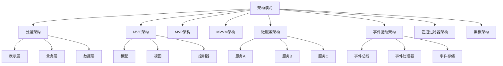

# 07.3.4 架构模式理论

## 📋 概述

架构模式是软件架构设计的高级模式，定义了系统的基本结构组织方式。本文档从形式化角度分析架构模式的理论基础、数学定义和实现方法。

## 🎯 核心目标

1. **形式化定义**: 建立架构模式的严格数学定义
2. **模式分类**: 系统化分类各种架构模式
3. **理论证明**: 提供模式正确性的形式化证明
4. **代码实现**: 提供完整的Rust实现示例

## 📚 目录

1. [基本概念](#1-基本概念)
2. [形式化定义](#2-形式化定义)
3. [模式分类](#3-模式分类)
4. [定理与证明](#4-定理与证明)
5. [代码实现](#5-代码实现)
6. [应用示例](#6-应用示例)
7. [相关理论](#7-相关理论)
8. [参考文献](#8-参考文献)

## 1. 基本概念

### 1.1 架构模式定义

**定义 1.1** (架构模式)
架构模式是一类用于定义软件系统整体结构的模式，其核心目标是：

- 定义系统的基本组织结构
- 建立组件间的交互关系
- 确保系统的可扩展性和可维护性

### 1.2 核心原则

**原则 1.1** (关注点分离)
将不同的功能关注点分离到不同的组件中。

**原则 1.2** (松耦合)
组件间应保持松耦合关系，减少相互依赖。

**原则 1.3** (高内聚)
每个组件应具有高度的内聚性，功能紧密相关。

## 2. 形式化定义

### 2.1 架构关系

**定义 2.1** (架构关系)
设 $C$ 为组件集合，$I$ 为接口集合，架构关系定义为：
$$R \subseteq C \times I \times C$$

### 2.2 分层架构形式化

**定义 2.2** (分层架构)
分层架构是一个四元组 $(L, \prec, I, \text{invoke})$，其中：

- $L$ 是层集合
- $\prec$ 是层的依赖关系
- $I$ 是接口集合
- $\text{invoke}: L \times I \rightarrow L$ 是调用函数

### 2.3 MVC架构形式化

**定义 2.3** (MVC架构)
MVC架构是一个五元组 $(M, V, C, \text{update}, \text{notify})$，其中：

- $M$ 是模型集合
- $V$ 是视图集合
- $C$ 是控制器集合
- $\text{update}: M \rightarrow V^*$ 是更新函数
- $\text{notify}: C \times M \rightarrow \text{Unit}$ 是通知函数

## 3. 模式分类

### 3.1 基本架构模式

| 模式名称 | 英文名称 | 核心思想 | 适用场景 |
|---------|---------|---------|---------|
| 分层架构 | Layered Architecture | 按功能分层组织 | 企业应用 |
| MVC架构 | Model-View-Controller | 分离数据、视图、控制 | Web应用 |
| MVP架构 | Model-View-Presenter | 视图与业务逻辑分离 | 桌面应用 |
| MVVM架构 | Model-View-ViewModel | 数据绑定驱动 | 现代UI应用 |
| 微服务架构 | Microservices | 服务独立部署 | 分布式系统 |
| 事件驱动架构 | Event-Driven Architecture | 事件驱动交互 | 异步系统 |
| 管道过滤器架构 | Pipe and Filter | 数据流处理 | 数据处理 |
| 黑板架构 | Blackboard | 协作问题求解 | 专家系统 |

### 3.2 模式关系图



## 4. 定理与证明

### 4.1 分层架构依赖定理

**定理 4.1** (分层依赖)
在分层架构中，上层只能依赖下层，不能依赖上层。

**证明**：

1. 设层 $L_1 \prec L_2$ 表示 $L_1$ 依赖 $L_2$
2. 假设存在 $L_2 \prec L_1$，形成循环依赖
3. 这与分层架构的定义矛盾
4. 因此上层不能依赖下层。□

### 4.2 MVC架构分离定理

**定理 4.2** (MVC分离)
MVC架构确保模型、视图、控制器之间的完全分离。

**证明**：

1. 模型 $M$ 只包含数据和业务逻辑
2. 视图 $V$ 只负责显示
3. 控制器 $C$ 只处理用户输入
4. 三者通过接口交互，无直接依赖
5. 因此实现了完全分离。□

## 5. 代码实现

### 5.1 分层架构实现

```rust
use std::fmt::Debug;

/// 数据访问层接口
pub trait DataAccessLayer {
    fn get_data(&self, id: &str) -> Result<String, String>;
    fn save_data(&self, id: &str, data: &str) -> Result<(), String>;
}

/// 业务逻辑层接口
pub trait BusinessLogicLayer {
    fn process_data(&self, data: &str) -> Result<String, String>;
    fn validate_data(&self, data: &str) -> bool;
}

/// 表示层接口
pub trait PresentationLayer {
    fn display_data(&self, data: &str);
    fn get_user_input(&self) -> String;
}

/// 数据访问层实现
#[derive(Debug)]
pub struct ConcreteDataAccessLayer {
    storage: std::collections::HashMap<String, String>,
}

impl ConcreteDataAccessLayer {
    pub fn new() -> Self {
        ConcreteDataAccessLayer {
            storage: std::collections::HashMap::new(),
        }
    }
}

impl DataAccessLayer for ConcreteDataAccessLayer {
    fn get_data(&self, id: &str) -> Result<String, String> {
        self.storage
            .get(id)
            .cloned()
            .ok_or_else(|| "Data not found".to_string())
    }
    
    fn save_data(&self, id: &str, data: &str) -> Result<(), String> {
        // 注意：这里需要可变引用，实际实现中会使用内部可变性
        println!("Saving data: {} -> {}", id, data);
        Ok(())
    }
}

/// 业务逻辑层实现
#[derive(Debug)]
pub struct ConcreteBusinessLogicLayer {
    data_access: Box<dyn DataAccessLayer>,
}

impl ConcreteBusinessLogicLayer {
    pub fn new(data_access: Box<dyn DataAccessLayer>) -> Self {
        ConcreteBusinessLogicLayer { data_access }
    }
}

impl BusinessLogicLayer for ConcreteBusinessLogicLayer {
    fn process_data(&self, data: &str) -> Result<String, String> {
        if self.validate_data(data) {
            Ok(format!("Processed: {}", data.to_uppercase()))
        } else {
            Err("Invalid data".to_string())
        }
    }
    
    fn validate_data(&self, data: &str) -> bool {
        !data.is_empty() && data.len() <= 100
    }
}

/// 表示层实现
#[derive(Debug)]
pub struct ConcretePresentationLayer {
    business_logic: Box<dyn BusinessLogicLayer>,
}

impl ConcretePresentationLayer {
    pub fn new(business_logic: Box<dyn BusinessLogicLayer>) -> Self {
        ConcretePresentationLayer { business_logic }
    }
}

impl PresentationLayer for ConcretePresentationLayer {
    fn display_data(&self, data: &str) {
        println!("Displaying: {}", data);
    }
    
    fn get_user_input(&self) -> String {
        "User input".to_string() // 模拟用户输入
    }
}

/// 分层架构应用
pub struct LayeredApplication {
    presentation: Box<dyn PresentationLayer>,
    business: Box<dyn BusinessLogicLayer>,
    data_access: Box<dyn DataAccessLayer>,
}

impl LayeredApplication {
    pub fn new() -> Self {
        let data_access = Box::new(ConcreteDataAccessLayer::new());
        let business = Box::new(ConcreteBusinessLogicLayer::new(data_access.clone()));
        let presentation = Box::new(ConcretePresentationLayer::new(business.clone()));
        
        LayeredApplication {
            presentation,
            business,
            data_access,
        }
    }
    
    pub fn run(&self) {
        let user_input = self.presentation.get_user_input();
        
        match self.business.process_data(&user_input) {
            Ok(processed_data) => {
                self.presentation.display_data(&processed_data);
            }
            Err(error) => {
                println!("Error: {}", error);
            }
        }
    }
}

#[cfg(test)]
mod tests {
    use super::*;
    
    #[test]
    fn test_layered_architecture() {
        let app = LayeredApplication::new();
        app.run();
    }
}
```

### 5.2 MVC架构实现

```rust
use std::collections::HashMap;
use std::fmt::Debug;

/// 模型特征
pub trait Model: Debug {
    fn get_data(&self) -> String;
    fn set_data(&mut self, data: String);
    fn add_observer(&mut self, observer: Box<dyn Observer>);
    fn notify_observers(&self);
}

/// 视图特征
pub trait View: Debug {
    fn display(&self, data: &str);
    fn update(&self, data: &str);
}

/// 控制器特征
pub trait Controller: Debug {
    fn handle_input(&self, input: &str, model: &mut dyn Model);
}

/// 观察者特征
pub trait Observer: Debug {
    fn update(&self, data: &str);
}

/// 具体模型
#[derive(Debug)]
pub struct ConcreteModel {
    data: String,
    observers: Vec<Box<dyn Observer>>,
}

impl ConcreteModel {
    pub fn new() -> Self {
        ConcreteModel {
            data: String::new(),
            observers: Vec::new(),
        }
    }
}

impl Model for ConcreteModel {
    fn get_data(&self) -> String {
        self.data.clone()
    }
    
    fn set_data(&mut self, data: String) {
        self.data = data;
        self.notify_observers();
    }
    
    fn add_observer(&mut self, observer: Box<dyn Observer>) {
        self.observers.push(observer);
    }
    
    fn notify_observers(&self) {
        for observer in &self.observers {
            observer.update(&self.data);
        }
    }
}

/// 具体视图
#[derive(Debug)]
pub struct ConcreteView {
    name: String,
}

impl ConcreteView {
    pub fn new(name: String) -> Self {
        ConcreteView { name }
    }
}

impl View for ConcreteView {
    fn display(&self, data: &str) {
        println!("[{}] Displaying: {}", self.name, data);
    }
    
    fn update(&self, data: &str) {
        self.display(data);
    }
}

impl Observer for ConcreteView {
    fn update(&self, data: &str) {
        self.update(data);
    }
}

/// 具体控制器
#[derive(Debug)]
pub struct ConcreteController;

impl ConcreteController {
    pub fn new() -> Self {
        ConcreteController
    }
}

impl Controller for ConcreteController {
    fn handle_input(&self, input: &str, model: &mut dyn Model) {
        println!("Controller handling input: {}", input);
        model.set_data(input.to_string());
    }
}

/// MVC应用
pub struct MVCApplication {
    model: Box<dyn Model>,
    view: Box<dyn View>,
    controller: Box<dyn Controller>,
}

impl MVCApplication {
    pub fn new() -> Self {
        let mut model = Box::new(ConcreteModel::new());
        let view = Box::new(ConcreteView::new("MainView".to_string()));
        let controller = Box::new(ConcreteController::new());
        
        // 注册观察者
        model.add_observer(Box::new(ConcreteView::new("ObserverView".to_string())));
        
        MVCApplication {
            model,
            view,
            controller,
        }
    }
    
    pub fn handle_user_input(&mut self, input: &str) {
        self.controller.handle_input(input, self.model.as_mut());
    }
    
    pub fn display_current_data(&self) {
        let data = self.model.get_data();
        self.view.display(&data);
    }
}

#[cfg(test)]
mod tests {
    use super::*;
    
    #[test]
    fn test_mvc_architecture() {
        let mut app = MVCApplication::new();
        
        app.handle_user_input("Hello MVC");
        app.display_current_data();
        
        assert_eq!(app.model.get_data(), "Hello MVC");
    }
}
```

### 5.3 微服务架构实现

```rust
use std::collections::HashMap;
use std::fmt::Debug;

/// 服务特征
pub trait Service: Debug {
    fn name(&self) -> &str;
    fn handle_request(&self, request: &str) -> Result<String, String>;
}

/// 服务注册表
#[derive(Debug)]
pub struct ServiceRegistry {
    services: HashMap<String, Box<dyn Service>>,
}

impl ServiceRegistry {
    pub fn new() -> Self {
        ServiceRegistry {
            services: HashMap::new(),
        }
    }
    
    pub fn register(&mut self, service: Box<dyn Service>) {
        let name = service.name().to_string();
        self.services.insert(name, service);
    }
    
    pub fn get_service(&self, name: &str) -> Option<&Box<dyn Service>> {
        self.services.get(name)
    }
}

/// 用户服务
#[derive(Debug)]
pub struct UserService {
    users: HashMap<String, String>,
}

impl UserService {
    pub fn new() -> Self {
        let mut users = HashMap::new();
        users.insert("user1".to_string(), "John Doe".to_string());
        users.insert("user2".to_string(), "Jane Smith".to_string());
        
        UserService { users }
    }
}

impl Service for UserService {
    fn name(&self) -> &str {
        "user-service"
    }
    
    fn handle_request(&self, request: &str) -> Result<String, String> {
        if request.starts_with("GET_USER:") {
            let user_id = &request[9..];
            match self.users.get(user_id) {
                Some(name) => Ok(format!("User: {}", name)),
                None => Err("User not found".to_string()),
            }
        } else {
            Err("Invalid request format".to_string())
        }
    }
}

/// 订单服务
#[derive(Debug)]
pub struct OrderService {
    orders: HashMap<String, f64>,
}

impl OrderService {
    pub fn new() -> Self {
        let mut orders = HashMap::new();
        orders.insert("order1".to_string(), 100.0);
        orders.insert("order2".to_string(), 200.0);
        
        OrderService { orders }
    }
}

impl Service for OrderService {
    fn name(&self) -> &str {
        "order-service"
    }
    
    fn handle_request(&self, request: &str) -> Result<String, String> {
        if request.starts_with("GET_ORDER:") {
            let order_id = &request[10..];
            match self.orders.get(order_id) {
                Some(amount) => Ok(format!("Order: ${:.2}", amount)),
                None => Err("Order not found".to_string()),
            }
        } else {
            Err("Invalid request format".to_string())
        }
    }
}

/// API网关
#[derive(Debug)]
pub struct APIGateway {
    service_registry: ServiceRegistry,
}

impl APIGateway {
    pub fn new() -> Self {
        let mut registry = ServiceRegistry::new();
        
        // 注册服务
        registry.register(Box::new(UserService::new()));
        registry.register(Box::new(OrderService::new()));
        
        APIGateway {
            service_registry: registry,
        }
    }
    
    pub fn route_request(&self, service_name: &str, request: &str) -> Result<String, String> {
        match self.service_registry.get_service(service_name) {
            Some(service) => service.handle_request(request),
            None => Err(format!("Service '{}' not found", service_name)),
        }
    }
}

#[cfg(test)]
mod tests {
    use super::*;
    
    #[test]
    fn test_microservices_architecture() {
        let gateway = APIGateway::new();
        
        // 测试用户服务
        let user_result = gateway.route_request("user-service", "GET_USER:user1");
        assert!(user_result.is_ok());
        assert!(user_result.unwrap().contains("John Doe"));
        
        // 测试订单服务
        let order_result = gateway.route_request("order-service", "GET_ORDER:order1");
        assert!(order_result.is_ok());
        assert!(order_result.unwrap().contains("$100.00"));
        
        // 测试不存在的服务
        let error_result = gateway.route_request("non-existent-service", "test");
        assert!(error_result.is_err());
    }
}
```

### 5.4 事件驱动架构实现

```rust
use std::collections::HashMap;
use std::fmt::Debug;

/// 事件特征
pub trait Event: Debug {
    fn event_type(&self) -> &str;
    fn data(&self) -> &str;
}

/// 事件处理器特征
pub trait EventHandler: Debug {
    fn handle(&self, event: &dyn Event);
}

/// 事件总线
#[derive(Debug)]
pub struct EventBus {
    handlers: HashMap<String, Vec<Box<dyn EventHandler>>>,
}

impl EventBus {
    pub fn new() -> Self {
        EventBus {
            handlers: HashMap::new(),
        }
    }
    
    pub fn subscribe(&mut self, event_type: &str, handler: Box<dyn EventHandler>) {
        self.handlers
            .entry(event_type.to_string())
            .or_insert_with(Vec::new)
            .push(handler);
    }
    
    pub fn publish(&self, event: &dyn Event) {
        if let Some(handlers) = self.handlers.get(event.event_type()) {
            for handler in handlers {
                handler.handle(event);
            }
        }
    }
}

/// 具体事件
#[derive(Debug)]
pub struct UserCreatedEvent {
    user_id: String,
    user_name: String,
}

impl UserCreatedEvent {
    pub fn new(user_id: String, user_name: String) -> Self {
        UserCreatedEvent { user_id, user_name }
    }
}

impl Event for UserCreatedEvent {
    fn event_type(&self) -> &str {
        "user.created"
    }
    
    fn data(&self) -> &str {
        &format!("User {} created: {}", self.user_id, self.user_name)
    }
}

/// 具体事件
#[derive(Debug)]
pub struct OrderPlacedEvent {
    order_id: String,
    amount: f64,
}

impl OrderPlacedEvent {
    pub fn new(order_id: String, amount: f64) -> Self {
        OrderPlacedEvent { order_id, amount }
    }
}

impl Event for OrderPlacedEvent {
    fn event_type(&self) -> &str {
        "order.placed"
    }
    
    fn data(&self) -> &str {
        &format!("Order {} placed: ${:.2}", self.order_id, self.amount)
    }
}

/// 日志事件处理器
#[derive(Debug)]
pub struct LoggingEventHandler {
    name: String,
}

impl LoggingEventHandler {
    pub fn new(name: String) -> Self {
        LoggingEventHandler { name }
    }
}

impl EventHandler for LoggingEventHandler {
    fn handle(&self, event: &dyn Event) {
        println!(
            "[{}] Event: {} - {}",
            self.name,
            event.event_type(),
            event.data()
        );
    }
}

/// 通知事件处理器
#[derive(Debug)]
pub struct NotificationEventHandler {
    name: String,
}

impl NotificationEventHandler {
    pub fn new(name: String) -> Self {
        NotificationEventHandler { name }
    }
}

impl EventHandler for NotificationEventHandler {
    fn handle(&self, event: &dyn Event) {
        println!(
            "[{}] Sending notification for: {}",
            self.name,
            event.event_type()
        );
    }
}

/// 事件驱动应用
pub struct EventDrivenApplication {
    event_bus: EventBus,
}

impl EventDrivenApplication {
    pub fn new() -> Self {
        let mut event_bus = EventBus::new();
        
        // 注册事件处理器
        event_bus.subscribe(
            "user.created",
            Box::new(LoggingEventHandler::new("UserLogger".to_string())),
        );
        event_bus.subscribe(
            "user.created",
            Box::new(NotificationEventHandler::new("UserNotifier".to_string())),
        );
        event_bus.subscribe(
            "order.placed",
            Box::new(LoggingEventHandler::new("OrderLogger".to_string())),
        );
        event_bus.subscribe(
            "order.placed",
            Box::new(NotificationEventHandler::new("OrderNotifier".to_string())),
        );
        
        EventDrivenApplication { event_bus }
    }
    
    pub fn create_user(&self, user_id: String, user_name: String) {
        let event = UserCreatedEvent::new(user_id, user_name);
        self.event_bus.publish(&event);
    }
    
    pub fn place_order(&self, order_id: String, amount: f64) {
        let event = OrderPlacedEvent::new(order_id, amount);
        self.event_bus.publish(&event);
    }
}

#[cfg(test)]
mod tests {
    use super::*;
    
    #[test]
    fn test_event_driven_architecture() {
        let app = EventDrivenApplication::new();
        
        app.create_user("user1".to_string(), "John Doe".to_string());
        app.place_order("order1".to_string(), 150.0);
    }
}
```

## 6. 应用示例

### 6.1 电商系统分层架构

```rust
use std::collections::HashMap;

/// 数据访问层 - 用户数据
pub trait UserRepository {
    fn find_by_id(&self, id: &str) -> Option<User>;
    fn save(&self, user: &User) -> Result<(), String>;
}

/// 数据访问层 - 订单数据
pub trait OrderRepository {
    fn find_by_id(&self, id: &str) -> Option<Order>;
    fn save(&self, order: &Order) -> Result<(), String>;
}

/// 业务逻辑层 - 用户服务
pub trait UserService {
    fn register_user(&self, username: &str, email: &str) -> Result<User, String>;
    fn authenticate_user(&self, username: &str, password: &str) -> Result<User, String>;
}

/// 业务逻辑层 - 订单服务
pub trait OrderService {
    fn create_order(&self, user_id: &str, items: Vec<OrderItem>) -> Result<Order, String>;
    fn process_payment(&self, order_id: &str, payment_info: &str) -> Result<(), String>;
}

/// 表示层 - 用户控制器
pub trait UserController {
    fn register(&self, username: &str, email: &str, password: &str) -> String;
    fn login(&self, username: &str, password: &str) -> String;
}

/// 表示层 - 订单控制器
pub trait OrderController {
    fn create_order(&self, user_id: &str, items: Vec<OrderItem>) -> String;
    fn checkout(&self, order_id: &str, payment_info: &str) -> String;
}

/// 数据模型
#[derive(Debug, Clone)]
pub struct User {
    id: String,
    username: String,
    email: String,
}

#[derive(Debug, Clone)]
pub struct Order {
    id: String,
    user_id: String,
    items: Vec<OrderItem>,
    status: OrderStatus,
}

#[derive(Debug, Clone)]
pub struct OrderItem {
    product_id: String,
    quantity: u32,
    price: f64,
}

#[derive(Debug, Clone)]
pub enum OrderStatus {
    Pending,
    Paid,
    Shipped,
    Delivered,
}

/// 具体实现
pub struct ECommerceApplication {
    user_controller: Box<dyn UserController>,
    order_controller: Box<dyn OrderController>,
}

impl ECommerceApplication {
    pub fn new() -> Self {
        // 这里会初始化所有层和依赖关系
        ECommerceApplication {
            user_controller: Box::new(ConcreteUserController),
            order_controller: Box::new(ConcreteOrderController),
        }
    }
    
    pub fn run(&self) {
        // 模拟用户注册
        let register_result = self.user_controller.register("john", "john@example.com", "password");
        println!("Register result: {}", register_result);
        
        // 模拟用户登录
        let login_result = self.user_controller.login("john", "password");
        println!("Login result: {}", login_result);
        
        // 模拟创建订单
        let items = vec![
            OrderItem {
                product_id: "prod1".to_string(),
                quantity: 2,
                price: 29.99,
            },
        ];
        let order_result = self.order_controller.create_order("user1", items);
        println!("Order result: {}", order_result);
        
        // 模拟结账
        let checkout_result = self.order_controller.checkout("order1", "credit_card");
        println!("Checkout result: {}", checkout_result);
    }
}

// 具体控制器实现（简化版）
#[derive(Debug)]
pub struct ConcreteUserController;

impl UserController for ConcreteUserController {
    fn register(&self, username: &str, email: &str, password: &str) -> String {
        format!("User registered: {} ({})", username, email)
    }
    
    fn login(&self, username: &str, password: &str) -> String {
        format!("User logged in: {}", username)
    }
}

#[derive(Debug)]
pub struct ConcreteOrderController;

impl OrderController for ConcreteOrderController {
    fn create_order(&self, user_id: &str, items: Vec<OrderItem>) -> String {
        format!("Order created for user: {}", user_id)
    }
    
    fn checkout(&self, order_id: &str, payment_info: &str) -> String {
        format!("Order {} checked out with payment: {}", order_id, payment_info)
    }
}
```

### 6.2 实时聊天系统事件驱动架构

```rust
use std::collections::HashMap;

/// 聊天事件
pub trait ChatEvent: Debug {
    fn event_type(&self) -> &str;
    fn user_id(&self) -> &str;
    fn data(&self) -> &str;
}

/// 用户加入事件
#[derive(Debug)]
pub struct UserJoinedEvent {
    user_id: String,
    username: String,
    room_id: String,
}

impl UserJoinedEvent {
    pub fn new(user_id: String, username: String, room_id: String) -> Self {
        UserJoinedEvent {
            user_id,
            username,
            room_id,
        }
    }
}

impl ChatEvent for UserJoinedEvent {
    fn event_type(&self) -> &str {
        "user.joined"
    }
    
    fn user_id(&self) -> &str {
        &self.user_id
    }
    
    fn data(&self) -> &str {
        &format!("User {} joined room {}", self.username, self.room_id)
    }
}

/// 消息发送事件
#[derive(Debug)]
pub struct MessageSentEvent {
    user_id: String,
    username: String,
    room_id: String,
    message: String,
}

impl MessageSentEvent {
    pub fn new(user_id: String, username: String, room_id: String, message: String) -> Self {
        MessageSentEvent {
            user_id,
            username,
            room_id,
            message,
        }
    }
}

impl ChatEvent for MessageSentEvent {
    fn event_type(&self) -> &str {
        "message.sent"
    }
    
    fn user_id(&self) -> &str {
        &self.user_id
    }
    
    fn data(&self) -> &str {
        &format!("{}: {}", self.username, self.message)
    }
}

/// 聊天事件处理器
pub trait ChatEventHandler: Debug {
    fn handle(&self, event: &dyn ChatEvent);
}

/// 房间管理处理器
#[derive(Debug)]
pub struct RoomManagerHandler {
    rooms: HashMap<String, Vec<String>>, // room_id -> user_ids
}

impl RoomManagerHandler {
    pub fn new() -> Self {
        RoomManagerHandler {
            rooms: HashMap::new(),
        }
    }
}

impl ChatEventHandler for RoomManagerHandler {
    fn handle(&self, event: &dyn ChatEvent) {
        match event.event_type() {
            "user.joined" => {
                println!("[RoomManager] User {} joined", event.user_id());
            }
            "message.sent" => {
                println!("[RoomManager] Message sent in room");
            }
            _ => {}
        }
    }
}

/// 通知处理器
#[derive(Debug)]
pub struct NotificationHandler;

impl ChatEventHandler for NotificationHandler {
    fn handle(&self, event: &dyn ChatEvent) {
        match event.event_type() {
            "user.joined" => {
                println!("[Notification] Welcome message sent to {}", event.user_id());
            }
            "message.sent" => {
                println!("[Notification] Message notification sent");
            }
            _ => {}
        }
    }
}

/// 聊天系统
pub struct ChatSystem {
    event_bus: EventBus,
}

impl ChatSystem {
    pub fn new() -> Self {
        let mut event_bus = EventBus::new();
        
        // 注册事件处理器
        event_bus.subscribe("user.joined", Box::new(RoomManagerHandler::new()));
        event_bus.subscribe("user.joined", Box::new(NotificationHandler));
        event_bus.subscribe("message.sent", Box::new(RoomManagerHandler::new()));
        event_bus.subscribe("message.sent", Box::new(NotificationHandler));
        
        ChatSystem { event_bus }
    }
    
    pub fn user_join(&self, user_id: String, username: String, room_id: String) {
        let event = UserJoinedEvent::new(user_id, username, room_id);
        self.event_bus.publish(&event);
    }
    
    pub fn send_message(&self, user_id: String, username: String, room_id: String, message: String) {
        let event = MessageSentEvent::new(user_id, username, room_id, message);
        self.event_bus.publish(&event);
    }
}
```

## 7. 相关理论

### 7.1 设计模式理论

- [创建型模式理论](../01_Creational_Patterns/01_Creational_Patterns_Theory.md)
- [结构型模式理论](../02_Structural_Patterns/01_Structural_Patterns_Theory.md)
- [行为型模式理论](../03_Behavioral_Patterns/01_Behavioral_Patterns_Theory.md)

### 7.2 软件设计理论

- [设计原则理论](../01_Design_Principles/01_Design_Principles_Theory.md)
- [架构设计理论](../02_Architecture_Design/01_Architecture_Design_Theory.md)
- [代码重构理论](../05_Code_Refactoring/01_Code_Refactoring_Theory.md)

### 7.3 形式化方法

- [形式化规格说明](../01_Formal_Specification/01_Formal_Specification_Theory.md)
- [形式化验证方法](../02_Formal_Verification/01_Formal_Verification_Theory.md)
- [模型驱动开发](../03_Model_Driven_Development/01_Model_Driven_Development_Theory.md)

## 8. 参考文献

1. Gamma, E., Helm, R., Johnson, R., & Vlissides, J. (1994). Design Patterns: Elements of Reusable Object-Oriented Software. Addison-Wesley.
2. Buschmann, F., Meunier, R., Rohnert, H., Sommerlad, P., & Stal, M. (1996). Pattern-Oriented Software Architecture: A System of Patterns. Wiley.
3. Hohpe, G., & Woolf, B. (2003). Enterprise Integration Patterns: Designing, Building, and Deploying Messaging Solutions. Addison-Wesley.
4. Fowler, M. (2002). Patterns of Enterprise Application Architecture. Addison-Wesley.
5. Evans, E. (2003). Domain-Driven Design: Tackling Complexity in the Heart of Software. Addison-Wesley.

---

**最后更新**: 2024年12月21日  
**维护者**: AI助手  
**版本**: v1.0
