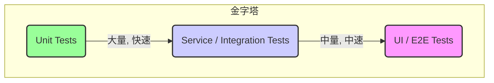

# 07.5.2 测试理论与层级 (Testing Theory and Levels)

## 目录

1.  [定义与背景](#1-定义与背景)
2.  [批判性分析](#2-批判性分析)
3.  [核心概念](#3-核心概念)
4.  [形式化表达](#4-形式化表达)
5.  [交叉引用](#5-交叉引用)
6.  [参考文献](#6-参考文献)

---

## 1. 定义与背景

软件测试是通过执行软件来评估其质量的过程。其主要目的是发现软件中的缺陷（Bugs），并验证其是否满足规定的需求。测试是软件质量保证（SQA）的关键活动。

---

## 2. 批判性分析

-   **核心原则**: 测试只能证明程序中存在错误，而不能证明程序中没有错误。（Edsger Dijkstra）
-   **挑战**: 穷尽测试在除了最简单的程序之外的所有情况下都是不可能的。因此，测试的关键在于设计有效的测试用例，以在有限的资源下最大化地发现缺陷。

---

## 3. 核心概念

-   **测试层级 (Test Levels)**:
    -   **单元测试 (Unit Testing)**: 对软件中最小的可测试单元（如函数、方法、类）进行测试。
    -   **集成测试 (Integration Testing)**: 将已分别测试的单元组合成组件或更大的部分，测试它们之间的接口和交互。
    -   **系统测试 (System Testing)**: 在一个完整的、集成的系统上进行测试，以评估其与指定需求的符合程度。
    -   **验收测试 (Acceptance Testing)**: 通常由客户或最终用户进行，以确认系统是否满足他们的需求和期望。
-   **测试类型 (Test Types)**:
    -   **黑盒测试 (Black-Box Testing)**: 不考虑系统内部结构，只关心输入和输出。
    -   **白盒测试 (White-Box Testing)**: 基于对系统内部代码和结构的了解进行测试。
    -   **灰盒测试 (Gray-Box Testing)**: 介于黑盒和白盒之间，了解部分内部结构。
-   **测试策略**:
    -   **测试金字塔 (Test Pyramid)**: 一种策略，提倡编写大量的快速的单元测试，较少的集成测试，和非常少的慢速的端到端测试。

---

## 4. 形式化表达

**测试金字塔**:

| 测试层级 | 测试对象 | 优点 | 缺点 |
| :--- | :--- | :--- | :--- |
| **单元测试** | 函数、类 | 快速、精确定位 | 无法发现集成问题 |
| **集成测试** | 模块、服务接口 | 发现模块交互问题 | 比单元测试慢 |
| **系统测试** | 整个应用 | 验证端到端功能 | 慢、不稳定、定位难 |

---

## 5. 交叉引用

-   [软件质量与测试总览](./README.md)
-   [软件质量模型](./07.5.1_Software_Quality_Models.md)
-   [持续集成与持续部署](../../07.2_Software_Development_Methodologies/07.2.4_CI_CD.md)

---

## 6. 参考文献

1.  Myers, Glenford J., Sandler, Corey, and Badgett, Tom. *The Art of Software Testing*. 2011.
2.  Cohn, Mike. *Succeeding with Agile: Software Development Using Scrum*. 2009. (推广了测试金字塔) 