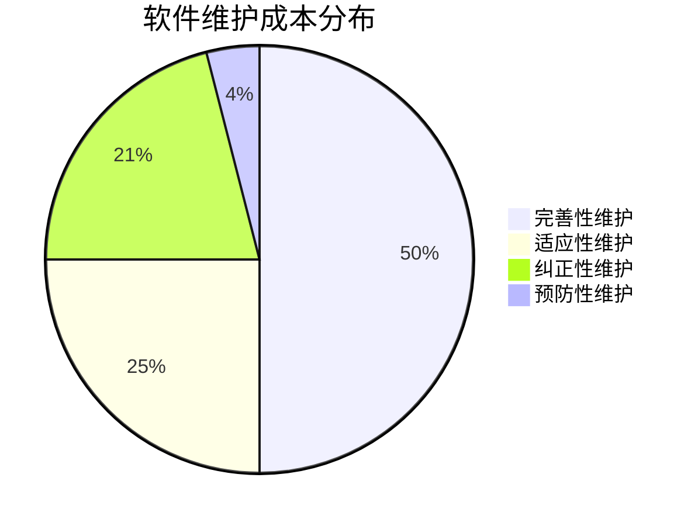

# 07.6.1 软件维护模型 (Maintenance Models)

## 目录

1.  [定义与背景](#1-定义与背景)
2.  [批判性分析](#2-批判性分析)
3.  [维护的类型](#3-维护的类型)
4.  [形式化表达](#4-形式化表达)
5.  [交叉引用](#5-交叉引用)
6.  [参考文献](#6-参考文献)

---

## 1. 定义与背景

软件维护是指在软件产品交付后，为修正错误、改进性能或其他属性、或使产品适应变化的环境而进行的修改活动。长期来看，维护成本往往是软件总成本中最大的部分。

---

## 2. 批判性分析

-   **挑战**: 软件维护常常被视为"二等公民"，但它对业务的持续成功至关重要。维护活动的挑战包括理解遗留代码、知识流失、以及在不引入新错误的情况下进行修改。
-   **Lehman 软件演化定律**: 由Manny Lehman提出的一系列观察，描述了大型软件系统演化的规律，如"持续变化定律"（系统必须持续被修改，否则会变得越来越无用）和"复杂度增加定律"（除非有专门工作来维护或降低其复杂度，否则系统的复杂度会随着演化而增加）。

---

## 3. 维护的类型

根据 **ISO/IEC 14764** 标准，软件维护可以分为四类：
-   **纠正性维护 (Corrective Maintenance)**:
    -   **描述**: 响应和修复用户报告的、在软件中发现的错误和缺陷。这是最传统的"bug修复"。
-   **适应性维护 (Adaptive Maintenance)**:
    -   **描述**: 修改软件以使其能在变化的或新的环境中（如新的操作系统、硬件或法规）继续使用。
-   **完善性维护 (Perfective Maintenance)**:
    -   **描述**: 根据用户的新需求，对软件进行修改以增加新功能或提升性能、可维护性等。这是最大的一部分维护活动。
-   **预防性维护 (Preventive Maintenance)**:
    -   **描述**: 为提高软件未来的可维护性或可靠性，在问题发生前提前主动对软件进行修改，如代码重构、更新文档。

---

## 4. 形式化表达

**软件维护类型分布 (典型)**:

---

## 5. 交叉引用

-   [软件维护与演化总览](./README.md)
-   [重构](./07.6.2_Refactoring.md)
-   [Lehman's Laws of Software Evolution](./TODO.md)

---

## 6. 参考文献

1.  Lientz, B. P., & Swanson, E. B. *Software maintenance management*. 1980.
2.  Lehman, M. M. "Programs, life cycles, and laws of software evolution." *Proceedings of the IEEE*, 1980.
3.  International Organization for Standardization. *ISO/IEC 14764:2006 Software Engineering — Software Life Cycle Processes — Maintenance*. 2006. 