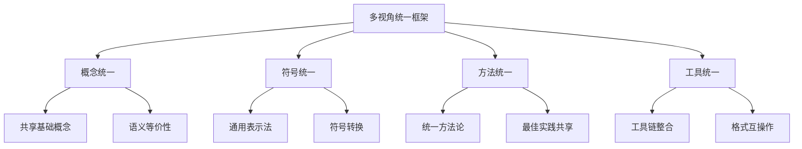
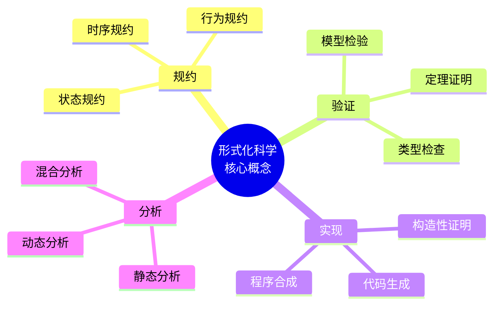
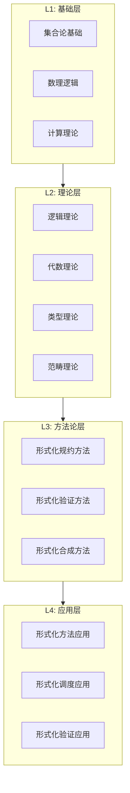
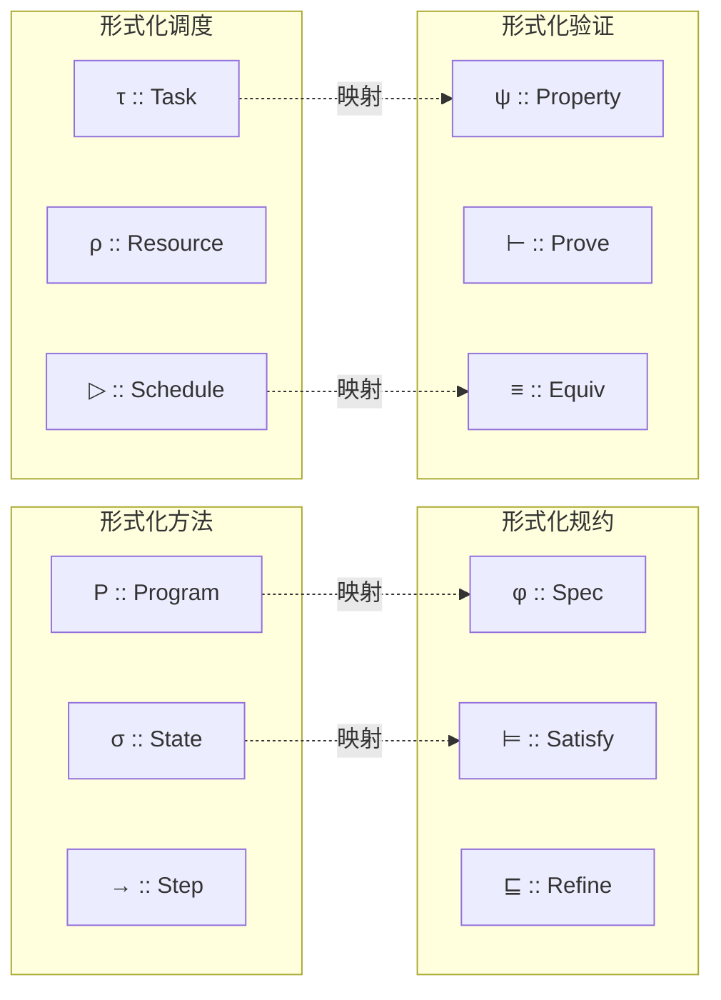
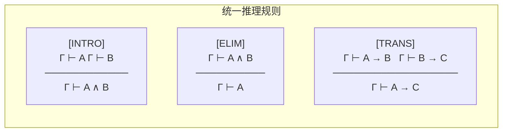
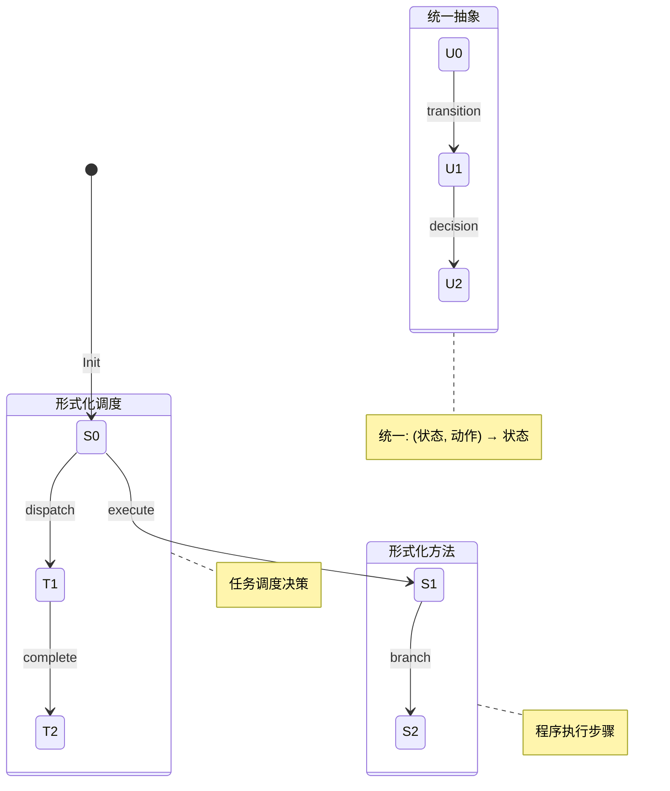
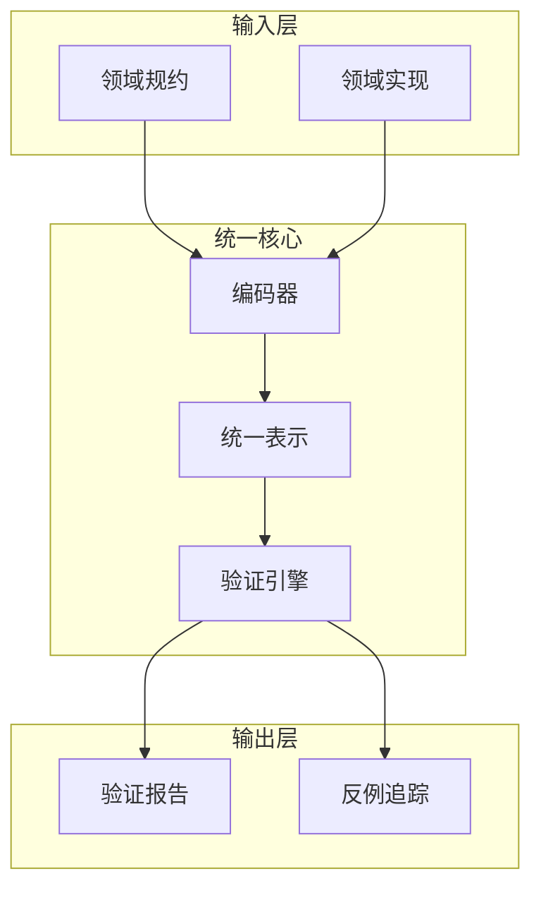

# 1.1 多视角统一框架

---

📌 **内容摘要**

本文档深入探讨多视角统一框架的核心原理和关键方法。内容涵盖形式化方法统一领域的主要知识点，包括任务调度, 调度, 资源分配等关键主题。适合具备相关基础的学习者进行深入研究。

**关键词**: 任务调度, 调度, 资源分配, 形式化方法统一

📚 **学习目标**

- 深入理解多视角统一框架的理论体系和形式化方法
- 能够进行相关定理的形式化证明
- 建立该领域的系统性知识框架

🎯 **难度级别**: 高级

⏱️ **预计阅读时间**: 15分钟

**前置知识**: 该领域的中级知识, 形式化方法基础

---


## 1.1.1 引言

### 1.1.1.1 动机与背景

形式化科学包含多个分支：形式化方法、形式化规约、形式化验证、形式化调度等。每个分支都有其独特的理论基础和工程实践，但缺乏统一的视角来理解它们之间的内在联系。

**核心问题**：如何构建一个统一框架，使得不同形式化分支能够：

- 共享基础概念和符号
- 建立跨领域的映射关系
- 实现理论成果和工程实践的复用

### 1.1.1.2 统一框架的目标



## 1.1.2 理论基础

### 1.1.2.1 元理论层

**定义 1.1.1（元理论）**
设 $\mathcal{M}$ 为元理论，包含：

- 语法：$\mathcal{G} = (V, T, P, S)$
- 语义：$\llbracket \cdot \rrbracket : \mathcal{L} \to \mathcal{D}$
- 推理规则：$\mathcal{R} \subseteq \mathcal{L}^* \times \mathcal{L}$

**定义 1.1.2（理论实例化）**
对于具体理论 $\mathcal{T}$，其元实例化定义为：
$$\text{Inst}(\mathcal{T}, \mathcal{M}) = \langle \mathcal{T}_\text{语法}, \mathcal{T}_\text{语义}, \mathcal{T}_\text{推理} \rangle$$

### 1.1.2.2 核心概念映射



## 1.1.3 统一框架架构

### 1.1.3.1 分层结构



### 1.1.3.2 各层形式化定义

**层 L1 - 基础层**
$$\mathcal{L}_1 = \langle \text{Set}, \text{Logic}, \text{Comp} \rangle$$

- Set: 集合论公理系统（ZFC）
- Logic: 一阶/高阶逻辑
- Comp: 可计算性理论

**层 L2 - 理论层**
$$\mathcal{L}_2 = \langle \mathcal{L}, \mathcal{A}, \mathcal{T}, \mathcal{C} \rangle$$

- $\mathcal{L}$: 逻辑系统
- $\mathcal{A}$: 代数结构
- $\mathcal{T}$: 类型系统
- $\mathcal{C}$: 范畴结构

**层 L3 - 方法论层**
$$\mathcal{L}_3 = \langle \text{Spec}, \text{Verif}, \text{Synth} \rangle$$

- Spec: 规约方法
- Verif: 验证技术
- Synth: 合成策略

**层 L4 - 应用层**
$$\mathcal{L}_4 = \langle \text{FM}, \text{FS}, \text{FV} \rangle$$

- FM: 形式化方法应用
- FS: 形式化调度应用
- FV: 形式化验证应用

## 1.1.4 跨领域概念对应表

### 1.1.4.1 核心概念对比矩阵

| 维度 | 形式化方法 | 形式化调度 | 形式化规约 | 形式化验证 |
|------|-----------|-----------|-----------|-----------|
| **基础对象** | 程序/系统 | 任务/资源 | 规约/契约 | 性质/断言 |
| **状态空间** | 程序状态 | 调度状态 | 规约状态 | 验证状态 |
| **转换关系** | 执行步骤 | 调度决策 | 精化步骤 | 证明步骤 |
| **正确性** | 行为等价 | 调度正确 | 规约满足 | 定理成立 |
| **核心操作** | 组合/精化 | 分配/排序 | 合取/蕴含 | 推导/归约 |

### 1.1.4.2 形式化符号对照



## 1.1.5 统一公理系统

### 1.1.5.1 基础公理

**公理 1.1.1（状态完备性）**
$$\forall s \in \text{State}. \exists! \sigma. \text{enc}(s) = \sigma$$
每个领域状态都有唯一的统一编码。

**公理 1.1.2（转换一致性）**
$$s_1 \xrightarrow{a} s_2 \Rightarrow \text{enc}(s_1) \xrightarrow{\text{enc}(a)} \text{enc}(s_2)$$
领域转换在编码下保持。

**公理 1.1.3（正确性保持）**
$$\text{Correct}(s) \Leftrightarrow \text{Correct}'(\text{enc}(s))$$
正确性谓词在编码下等价。

### 1.1.5.2 推理规则



## 1.1.6 交叉引用

### 1.1.6.1 内部引用

- **1.1 ↔ 1.2**: 本框架提供范畴论视角的统一基础
- **1.1 ↔ 1.3**: 本框架提供类型论视角的统一基础
- **1.1 ↔ 1.4**: 本框架涵盖调度理论的特殊实例

### 1.1.6.2 外部引用

- **↔ 2.1**: 数学-程序映射实现本框架的实例化
- **↔ 2.2**: 理论-工程映射实现本框架的工程应用
- **↔ 2.3**: 形式-计算映射实现本框架的计算落地
- **↔ 2.4**: 知识图谱构建可视化和查询本框架

## 1.1.7 实例分析

### 1.1.7.1 状态机的统一视图



### 1.1.7.2 规约的统一视图

| 规约类型 | 语法 | 语义 | 统一表示 |
|---------|-----|------|---------|
| 程序规约 | $\{P\}C\{Q\}$ | Hoare逻辑 | $P \Rightarrow wp(C, Q)$ |
| 调度规约 | $\text{sched}(\tau, \rho)$ | 调度约束 | $\forall t. \text{sched}(t) \in \text{Valid}$ |
| 类型规约 | $e : T$ | 类型判断 | $\Gamma \vdash e : T$ |
| 时序规约 | $\phi \mathcal{U} \psi$ | LTL语义 | $M, s \models \phi \mathcal{U} \psi$ |

## 1.1.8 工具与实现

### 1.1.8.1 统一表示格式

```yaml
# 统一规约格式 (Unified Specification Format)
unified_spec:
  version: "1.0"
  domain: formal_science

  meta:
    theory_base: "category_theory"
    logic_system: "higher_order"

  components:
    - id: comp_1
      type: state_machine
      domain: formal_method
      encoding: "unified_state"

    - id: comp_2
      type: scheduler
      domain: formal_scheduling
      encoding: "unified_schedule"

  mappings:
    - from: comp_1
      to: comp_2
      relation: "bisimulation"
```

### 1.1.8.2 验证工具链



## 1.1.9 总结

多视角统一框架通过：

1. **分层架构**：将不同形式化分支组织为统一的层次结构
2. **概念映射**：建立跨领域的核心概念对应关系
3. **形式化定义**：提供统一的数学基础
4. **工具支持**：实现可操作的统一表示和验证

该框架为形式化科学的各个领域提供了统一的理论基础和实践指南。

---

_最后更新: 2026-04-11_
_版本: 1.0_
---

## 📚 延伸阅读

- [04.1 范畴基本概念](../../02_形式语言/04_范畴论/04.1_范畴基本概念.md)
- [4.1 范畴基础 (Category Theory Foundations)](../../02_形式语言/04_范畴论/04.1_范畴基础.md)
- [04.3 任务调度](../../06_调度系统/04_分布式调度/04.3_任务调度.md)
- [1.2 数理逻辑](../../01_数学基础/01_元数学基础/01.2_数理逻辑.md)
- [1.1 集合论基础](../../01_数学基础/01_元数学基础/01.1_集合论基础.md)
