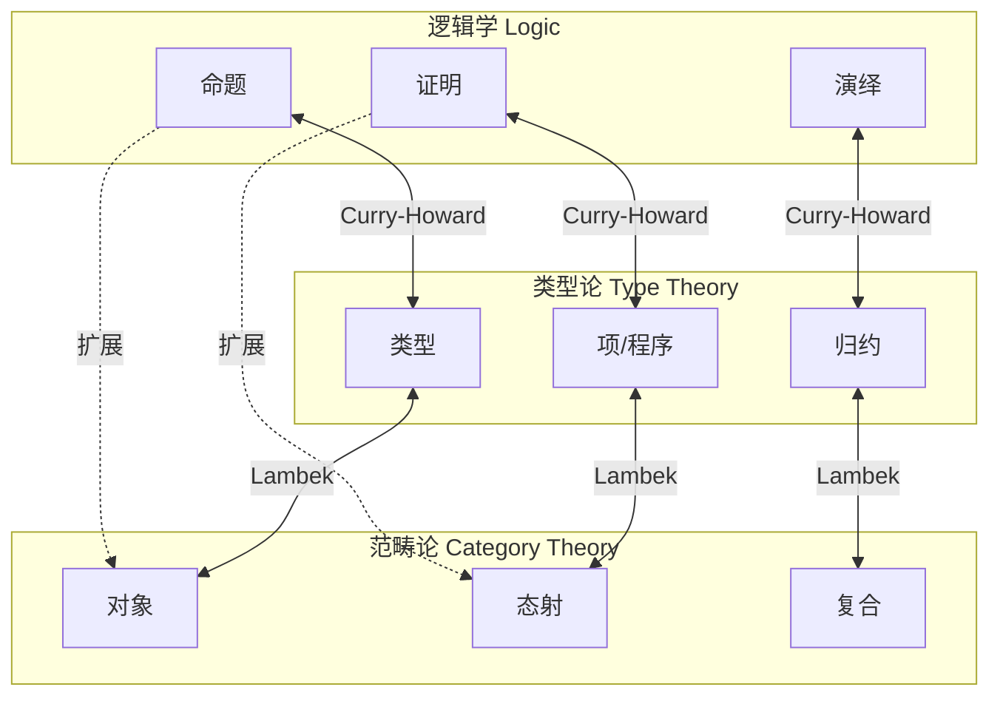
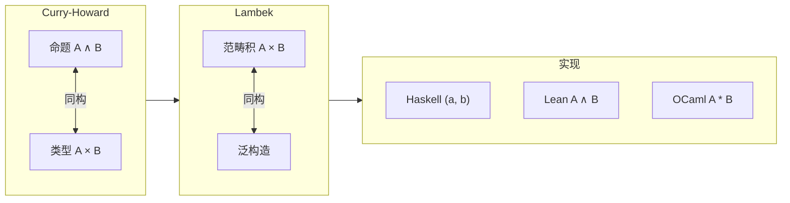
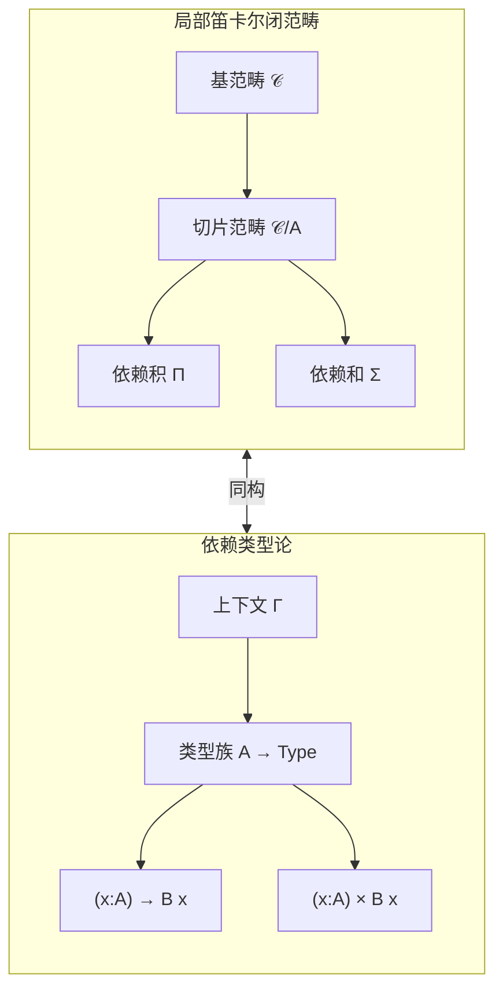
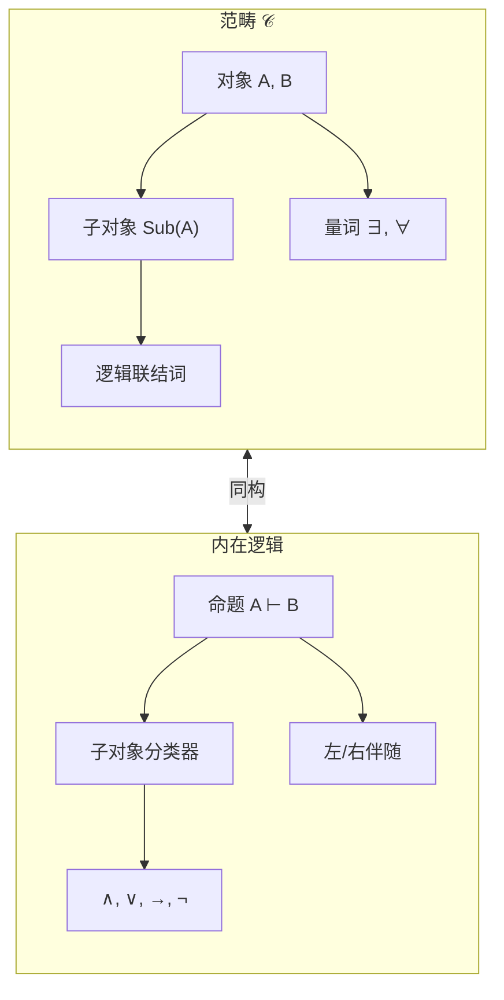

# 01.1 统一理论基础

---

📌 **内容摘要**

本文档系统介绍统一理论的基础理论和核心概念。内容涵盖形式化方法统一领域的主要知识点，包括函子, 范畴论, 范畴, 自然变换等关键主题。适合具备相关基础的学习者进行深入研究。

**关键词**: 函子, 范畴论, 范畴, 自然变换, 形式化方法统一

📚 **学习目标**

- 深入理解统一的理论体系和形式化方法
- 能够进行相关定理的形式化证明
- 建立该领域的系统性知识框架

🎯 **难度级别**: 高级

⏱️ **预计阅读时间**: 15分钟

**前置知识**: 该领域的中级知识, 形式化方法基础

---


## 目录

- [01.1 统一理论基础](#011-统一理论基础)
  - [目录](#目录)
  - [1. 三重视角的统一](#1-三重视角的统一)
    - [1.1 引言](#11-引言)
    - [1.2 核心洞见](#12-核心洞见)
  - [2. Curry-Howard-Lambek 对应](#2-curry-howard-lambek-对应)
    - [2.1 对应的三层结构](#21-对应的三层结构)
    - [2.2 经典 Curry-Howard 对应](#22-经典-curry-howard-对应)
    - [2.3 Lambek 对应：类型论与范畴论](#23-lambek-对应类型论与范畴论)
    - [2.4 完整的对应链条](#24-完整的对应链条)
  - [3. 范畴论语义学](#3-范畴论语义学)
    - [3.1 范畴作为语义框架](#31-范畴作为语义框架)
    - [3.2 笛卡尔闭范畴 (CCC)](#32-笛卡尔闭范畴-ccc)
    - [3.3 局部笛卡尔闭范畴 (LCCC)](#33-局部笛卡尔闭范畴-lccc)
  - [4. 类型论作为统一框架](#4-类型论作为统一框架)
    - [4.1 类型论的层级结构](#41-类型论的层级结构)
    - [4.2 统一公式：类型即命题，程序即证明](#42-统一公式类型即命题程序即证明)
    - [4.3 依赖类型的统一力量](#43-依赖类型的统一力量)
  - [5. 统一的形式化表达](#5-统一的形式化表达)
    - [5.1 双范畴对应](#51-双范畴对应)
    - [5.2 内在逻辑 (Internal Logic)](#52-内在逻辑-internal-logic)
    - [5.3 拓扑斯理论作为终极统一](#53-拓扑斯理论作为终极统一)
  - [6. 综合映射表](#6-综合映射表)
    - [6.1 完整 Curry-Howard-Lambek 对应表](#61-完整-curry-howard-lambek-对应表)
    - [6.2 构造规则对应表](#62-构造规则对应表)
    - [6.3 高级对应：同伦层次](#63-高级对应同伦层次)
  - [参考与延伸](#参考与延伸)
    - [相关章节](#相关章节)
    - [关键文献](#关键文献)
  - [_本章建立了形式科学三大支柱的统一框架。通过 Curry-Howard-Lambek 对应，我们看到逻辑命题、类型和范畴对象本质上是同一数学结构的不同表现。这种统一不仅是理论上的优雅，更为跨领域知识迁移和工具共享奠定了基础。_](#本章建立了形式科学三大支柱的统一框架通过-curry-howard-lambek-对应我们看到逻辑命题类型和范畴对象本质上是同一数学结构的不同表现这种统一不仅是理论上的优雅更为跨领域知识迁移和工具共享奠定了基础)
  - [📚 延伸阅读](#-延伸阅读)

---

## 1. 三重视角的统一

### 1.1 引言

形式科学的三大支柱——**逻辑**、**类型论**和**范畴论**——表面上使用不同的语言和工具，但深层结构却惊人地相似。
本章建立统一的理论基础，展示这三个领域如何通过 Curry-Howard-Lambek 对应形成完整的知识链条。

> **交叉引用**: 关于各领域的独立介绍，参见 [02.1_形式-现实-认知映射.md](../02_多视角映射/02.1_形式-现实-认知映射.md) 和 [01.2_多语言融合.md](01.2_多语言融合.md)

### 1.2 核心洞见



---

## 2. Curry-Howard-Lambek 对应

### 2.1 对应的三层结构

Curry-Howard-Lambek 对应建立了三个层次的双向映射：

$$
\boxed{
\begin{array}{ccc}
\textbf{逻辑学 (Logic)} & \xleftrightarrow{\text{Curry-Howard}} & \textbf{类型论 (Type Theory)} \\
\updownarrow & & \updownarrow \\
\text{命题} \leftrightarrow \text{类型} & & \text{证明} \leftrightarrow \text{项} \\
\updownarrow & & \updownarrow \\
\textbf{范畴论 (Category Theory)} & \xleftarrow{\text{Lambek}} & \text{对象} \leftrightarrow \text{态射}
\end{array}
}
$$

### 2.2 经典 Curry-Howard 对应

| 逻辑概念 | 类型论概念 | 符号对应 |
|---------|-----------|---------|
| 命题 $A$ | 类型 $A$ | $A : \text{Prop} \equiv A : \text{Type}$ |
| 证明 $p$ | 项 $t : A$ | $p \vdash A \equiv t : A$ |
| $A \to B$ | 函数类型 $A \to B$ | 蕴含 = 函数 |
| $A \land B$ | 积类型 $A \times B$ | 合取 = 配对 |
| $A \lor B$ | 和类型 $A + B$ | 析取 = 变体 |
| $\forall x. P(x)$ | 依赖积 $\Pi x:A. B(x)$ | 全称 = 依赖函数 |
| $\exists x. P(x)$ | 依赖和 $\Sigma x:A. B(x)$ | 存在 = 依赖对 |
| 真 $\top$ | 单位类型 $\mathbf{1}$ | 永真命题 |
| 假 $\bot$ | 空类型 $\mathbf{0}$ | 矛盾 |
| 否定 $\neg A$ | 函数 $A \to \mathbf{0}$ | 不可证 |

### 2.3 Lambek 对应：类型论与范畴论

| 类型论概念 | 范畴论概念 | 范畴结构 |
|-----------|-----------|---------|
| 类型 $A$ | 对象 $A$ | $\text{Ob}(\mathcal{C})$ |
| 项 $t : A \to B$ | 态射 $f : A \to B$ | $\text{Hom}(A, B)$ |
| 类型构造子 | 泛性质 | 极限/余极限 |
| 积类型 $A \times B$ | 范畴积 $A \times B$ | 终端锥 |
| 和类型 $A + B$ | 余积 $A + B$ | 初始余锥 |
| 函数类型 $A \to B$ | 指数对象 $B^A$ | 笛卡尔闭 |
| 依赖类型 | 切片范畴 | $\mathcal{C}/A$ |
| 恒等 $t =_A s$ | 相等子对象 | $\text{Eq}_A \hookrightarrow A \times A$ |

### 2.4 完整的对应链条



---

## 3. 范畴论语义学

### 3.1 范畴作为语义框架

范畴论为逻辑和类型论提供统一的语义解释框架。

**定义 3.1.1** (语义解释)
给定语言 $\mathcal{L}$ 和范畴 $\mathcal{C}$，一个语义解释 $[\!-\!]$ 满足：

$$
\begin{aligned}
[\![A \to B]\!] &= [\![B]\!]^{[\![A]\!]} \\
[\![A \times B]\!] &= [\![A]\!] \times [\![B]\!] \\
[\![A + B]\!] &= [\![A]\!] + [\![B]\!]
\end{aligned}
$$

### 3.2 笛卡尔闭范畴 (CCC)

CCC 是简单类型 $\lambda$ 演算的标准语义：

| CCC 结构 | 类型论 | 逻辑 | 实现 |
|---------|--------|------|------|
| 终对象 $\mathbf{1}$ | 单位类型 | 真 | `()` |
| 积 $A \times B$ | 积类型 | 合取 | `(a, b)` |
| 指数 $B^A$ | 函数类型 | 蕴含 | `a -> b` |
| 配对 $\langle f, g \rangle$ | 元组构造 | 合取引入 | `(f, g)` |
| 求值 $\text{ev}$ | 函数应用 | 分离规则 | `f x` |
| 柯里化 $\Lambda f$ | 抽象 | 演绎定理 | `\x -> ...` |

### 3.3 局部笛卡尔闭范畴 (LCCC)

LCCC 为依赖类型提供语义：



---

## 4. 类型论作为统一框架

### 4.1 类型论的层级结构

```
类型论层级
├── 简单类型 λ 演算 (STLC)
│   ├── →, ×, + 基础构造
│   └── 对应：命题逻辑 + 直觉主义
├── 多态类型系统 (System F)
│   ├── ∀X.A 全称量词
│   └── 对应：二阶逻辑
├── 依赖类型论 (MLTT)
│   ├── Π, Σ, = 依赖构造
│   └── 对应：谓词逻辑 + 构造数学
└── 立方类型论 (Cubical)
    ├── Path, Glue 高维结构
    └── 对应：同伦类型论 (HoTT)
```

### 4.2 统一公式：类型即命题，程序即证明

```haskell
-- Haskell: 类型即命题
-- A → B 表示"如果A则B"

-- 蕴含引入（演绎定理）
intro :: (A -> B) -> (A -> B)
intro f = f  -- 恒同

-- 蕴含消去（分离规则）
apply :: (A -> B) -> A -> B
apply f x = f x

-- 合取引入
pair :: A -> B -> (A, B)
pair a b = (a, b)

-- 合取消去
fst' :: (A, B) -> A
fst' (a, _) = a

snd' :: (A, B) -> B
snd' (_, b) = b
```

```lean4
-- Lean: 命题作为类型
-- 证明作为项

-- 蕴含引入
theorem imp_intro {A B : Prop} (h : A → B) : A → B :=
  h  -- 直接使用假设

-- 合取引入
theorem and_intro {A B : Prop} (ha : A) (hb : B) : A ∧ B :=
  ⟨ha, hb⟩  -- 配对构造

-- 合取消去
theorem and_elim_left {A B : Prop} (h : A ∧ B) : A :=
  h.1  -- 投影

-- 经典 Curry-Howard 实例
-- 证明 (A → B) → (B → C) → (A → C)
theorem compose {A B C : Prop} : (A → B) → (B → C) → (A → C) :=
  fun f g a => g (f a)
--      ↑   ↑   ↑
--     A→B B→C  A
```

### 4.3 依赖类型的统一力量

```lean4
-- 依赖类型统一了：
-- 1. 全称量词 ∀ (Pi 类型)
-- 2. 函数空间 → (Pi 的非依赖实例)
-- 3. 类型族索引

-- Π 类型：全称量词
def Universal (A : Type) (B : A → Type) : Type :=
  (a : A) → B a  -- 对所有 a:A, 有 B a

-- 非依赖情况退化为函数
example : Type 1 := Nat → Type  -- 这是 Π 的特例

-- Σ 类型：存在量词
def Existential (A : Type) (B : A → Type) : Type :=
  (a : A) × B a  -- 存在 a:A 使得 B a

-- 存在量词的逻辑
example {A : Type} {P : A → Prop} :
  (∃ a, P a) ↔ ((Q : Prop) → (∀ a, P a → Q) → Q) := by
  -- 存在等价于对所有蕴含的交集
  constructor
  · intro ⟨a, pa⟩ Q h := h a pa
  · intro h := h _ (fun a pa => ⟨a, pa⟩)
```

---

## 5. 统一的形式化表达

### 5.1 双范畴对应

逻辑与范畴的更深层联系通过**双范畴** (Bi-category) 表达：

| 层次 | 逻辑 | 类型论 | 范畴论 |
|-----|------|--------|--------|
| 0-胞 | 真值 | 类型 | 对象 |
| 1-胞 | 蕴含 | 函数 | 态射 |
| 2-胞 | 证明变换 | 程序等价 | 2-态射 |
| 恒等 | 自反 | 恒等函数 | id |
| 复合 | 传递 | 函数复合 | ∘ |

### 5.2 内在逻辑 (Internal Logic)

每个范畴都承载一个内在逻辑：



### 5.3 拓扑斯理论作为终极统一

**基本定理** (Lawvere-Tierney): 初等拓扑斯恰好是承载高阶直觉主义逻辑的范畴。

$$
\text{Topos} \cong \text{HOL} \cong \text{System F}_\omega \cong \text{CCC} + \text{Power Object}
$$

---

## 6. 综合映射表

### 6.1 完整 Curry-Howard-Lambek 对应表

| 逻辑 (L) | 类型 (T) | 范畴 (C) | Haskell | Lean |
|---------|---------|---------|---------|------|
| $A \to B$ | $A \to B$ | 指数 $B^A$ | `a -> b` | `A → B` |
| $A \land B$ | $A \times B$ | 积 | `(a, b)` | `A ∧ B` |
| $A \lor B$ | $A + B$ | 余积 | `Either a b` | `A ∨ B` |
| $\top$ | $\mathbf{1}$ | 终对象 | `()` | `True` |
| $\bot$ | $\mathbf{0}$ | 始对象 | `Void` | `False` |
| $\neg A$ | $A \to \mathbf{0}$ | 到始对象的态射 | `a -> Void` | `¬A` |
| $\forall x.P(x)$ | $\Pi x:A.B(x)$ | 积的右伴随 | `(x::*) => b x` | `∀ x, P x` |
| $\exists x.P(x)$ | $\Sigma x:A.B(x)$ | 积的左伴随 | 存在量化类型 | `∃ x, P x` |
| $x =_A y$ | $\text{Id}_A(x, y)$ | 对角态射的等化子 | 无原生支持 | `x = y` |
| 证明 $p$ | 项 $t : A$ | 全局元素 $1 \to A$ | 值 | 证明项 |
| 证明等价 | β/η 等价 | 态射相等 | 等式推理 | 可判定相等 |

### 6.2 构造规则对应表

| 规则名 | 逻辑形式 | 类型形式 | 范畴形式 |
|-------|---------|---------|---------|
| 蕴含引入 | $\frac{\Gamma, A \vdash B}{\Gamma \vdash A \to B}$ | $\lambda x.t$ | 柯里化 |
| 蕴含消去 | $\frac{\Gamma \vdash A \to B \quad \Gamma \vdash A}{\Gamma \vdash B}$ | 应用 $f\,x$ | 求值 ev |
| 合取引入 | $\frac{\Gamma \vdash A \quad \Gamma \vdash B}{\Gamma \vdash A \land B}$ | $(t, s)$ | 配对 $\langle f, g \rangle$ |
| 合取消去 | $\frac{\Gamma \vdash A \land B}{\Gamma \vdash A}$ | $\pi_1$ | 第一投影 |
| 析取引入 | $\frac{\Gamma \vdash A}{\Gamma \vdash A \lor B}$ | $\text{inl}\,t$ | 左包含 |
| 析取消去 | $\frac{\Gamma \vdash A \lor B \quad \Gamma, A \vdash C \quad \Gamma, B \vdash C}{\Gamma \vdash C}$ | `case` | 余配对 $[f, g]$ |

### 6.3 高级对应：同伦层次

| 概念 | 类型论 | 范畴论 | 同伦论 |
|-----|--------|--------|--------|
| 相等 | 恒等类型 Id | 路径空间 | 路径 |
| 相等证明 | 路径构造 | 同伦 | 道路 |
| 可去性 | K 公理 | 离散范畴 | 零阶同伦 |
| 单值性 | UA 公理 | 对象分类器 | 弱等价 |
| 高阶路径 | Pathⁿ | n-范畴 | 高阶同伦群 |

---

## 参考与延伸

### 相关章节

- [01.2_多语言融合.md](01.2_多语言融合.md) - 逻辑、类型、范畴的语法对应
- [01.4_证明与程序对应.md](01.4_证明与程序对应.md) - Curry-Howard 的程序提取
- [02.2_形式-计算-数学映射.md](../02_多视角映射/02.2_形式-计算-数学映射.md) - 计算视角的统一

### 关键文献

1. Lambek & Scott (1986): _Introduction to Higher-Order Categorical Logic_
2. Barendregt (1991): "Lambda Calculi with Types" (λ-立方)
3. Hofmann (1997): _Syntax and Semantics of Dependent Types_
4. Luo (1994): _Computation and Reasoning: A Type Theory for Computer Science_

---

_本章建立了形式科学三大支柱的统一框架。通过 Curry-Howard-Lambek 对应，我们看到逻辑命题、类型和范畴对象本质上是同一数学结构的不同表现。这种统一不仅是理论上的优雅，更为跨领域知识迁移和工具共享奠定了基础。_
---

## 📚 延伸阅读

- [03.3 同伦层次](../../02_形式语言/03_同伦类型论_HoTT/03.3_同伦层次.md)
- [04.1 范畴基本概念](../../02_形式语言/04_范畴论/04.1_范畴基本概念.md)
- [4.1 范畴基础 (Category Theory Foundations)](../../02_形式语言/04_范畴论/04.1_范畴基础.md)
- [02.4 类型论与逻辑](../../02_形式语言/02_类型论/02.4_类型论与逻辑.md)
- [2.4 类型论进阶 (Advanced Type Theory)](../../02_形式语言/02_类型论/02.4_类型论进阶.md)
