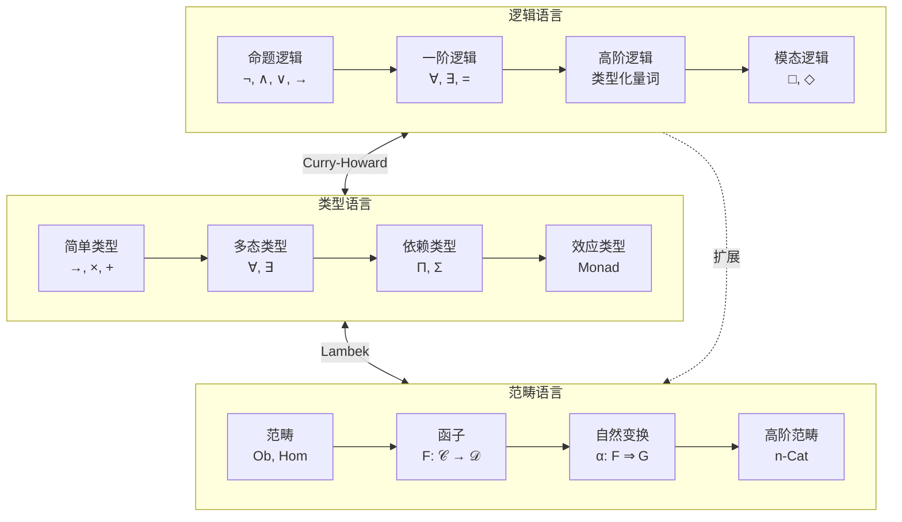
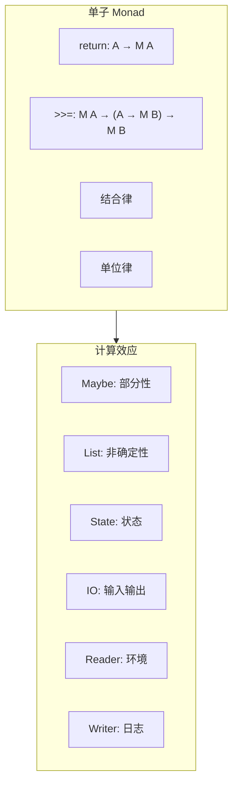
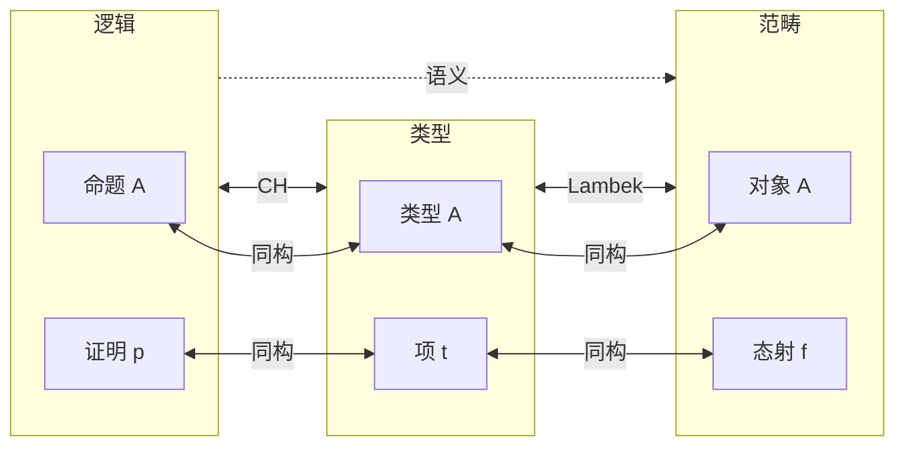
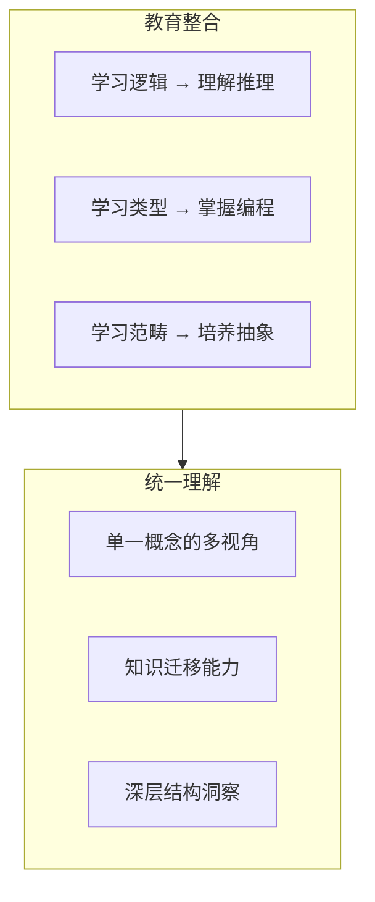

# 01.2 多语言融合

---

📌 **内容摘要**

本文档深入探讨多语言融合的核心原理和关键方法。内容涵盖形式化方法统一领域的主要知识点，包括函子, Σ类型, 依赖类型, 范畴论, Π类型等关键主题。适合具备相关基础的学习者进行深入研究。

**关键词**: 函子, Σ类型, 依赖类型, 范畴论, Π类型, 范畴, 形式化方法统一

📚 **学习目标**

- 深入理解多语言融合的理论体系和形式化方法
- 能够进行相关定理的形式化证明
- 建立该领域的系统性知识框架

🎯 **难度级别**: 高级

⏱️ **预计阅读时间**: 15分钟

**前置知识**: 该领域的中级知识, 形式化方法基础

---


## 目录

- [01.2 多语言融合](#012-多语言融合)
  - [目录](#目录)
  - [1. 三种数学语言](#1-三种数学语言)
    - [1.1 引言：为何需要多种语言？](#11-引言为何需要多种语言)
    - [1.2 三语言的结构对比](#12-三语言的结构对比)
  - [2. 逻辑语言的形式化](#2-逻辑语言的形式化)
    - [2.1 自然演绎系统](#21-自然演绎系统)
    - [2.2 相继式演算](#22-相继式演算)
    - [2.3 不同逻辑的谱系](#23-不同逻辑的谱系)
  - [3. 类型语言的表达力](#3-类型语言的表达力)
    - [3.1 λ-立方体 (Lambda Cube)](#31-λ-立方体-lambda-cube)
    - [3.2 System F：多态的威力](#32-system-f多态的威力)
    - [3.3 依赖类型：类型的类型化](#33-依赖类型类型的类型化)
  - [4. 范畴语言的抽象性](#4-范畴语言的抽象性)
    - [4.1 通用构造语言](#41-通用构造语言)
    - [4.2 函子与映射](#42-函子与映射)
    - [4.3 单子：效应的统一描述](#43-单子效应的统一描述)
  - [5. 语言间的翻译系统](#5-语言间的翻译系统)
    - [5.1 翻译框架](#51-翻译框架)
    - [5.2 翻译示例表](#52-翻译示例表)
    - [5.3 翻译的形式化](#53-翻译的形式化)
  - [6. 融合的实践意义](#6-融合的实践意义)
    - [6.1 跨领域知识迁移](#61-跨领域知识迁移)
    - [6.2 工具共享](#62-工具共享)
    - [6.3 教育价值](#63-教育价值)
  - [参考与延伸](#参考与延伸)
    - [相关章节](#相关章节)
    - [关键文献](#关键文献)
  - [_三种数学语言的融合不是简单的翻译，而是深层结构的同构。掌握这种融合意味着获得了在逻辑、编程和抽象数学之间自由穿梭的能力——这是现代形式科学工作者的核心素养。_](#三种数学语言的融合不是简单的翻译而是深层结构的同构掌握这种融合意味着获得了在逻辑编程和抽象数学之间自由穿梭的能力这是现代形式科学工作者的核心素养)
  - [📋 前置知识](#-前置知识)
  - [📚 延伸阅读](#-延伸阅读)

---

## 1. 三种数学语言

### 1.1 引言：为何需要多种语言？

形式科学使用三种主要语言描述相同领域：

| 语言 | 核心概念 | 优势 | 适用场景 |
|-----|---------|------|---------|
| **逻辑** | 命题、证明、推导 | 推理严谨 | 规范描述、验证 |
| **类型论** | 类型、项、归约 | 计算可执行 | 编程、形式证明 |
| **范畴论** | 对象、态射、函子 | 高度抽象 | 结构映射、统一理论 |

> **交叉引用**: 关于统一的理论基础，参见 [01.1_统一理论基础.md](01.1_统一理论基础.md)

### 1.2 三语言的结构对比



---

## 2. 逻辑语言的形式化

### 2.1 自然演绎系统

自然演绎 (Gentzen, 1935) 是 Curry-Howard 对应的逻辑基础：

$$
\frac{[A] \quad \cdots}{B} \quad \text{引入规则} \qquad
\frac{A \to B \quad A}{B} \quad \text{消去规则}
$$

**核心对应**:

- 引入规则 ↔ λ-抽象
- 消去规则 ↔ 函数应用
- 假设 ↔ 变量
- 推导 ↔ 项

### 2.2 相继式演算

相继式演算提供计算性更强的表述：

$$
\frac{\Gamma \vdash A, \Delta \quad \Gamma', B \vdash \Delta'}{\Gamma, \Gamma', A \to B \vdash \Delta, \Delta'} \; (\to_L)
$$

```lean4
-- Lean 中的相继式风格证明
-- 左规则对应模式匹配，右规则对应构造

theorem and_left_seq {A B : Prop} : A ∧ B → A := by
  -- 左规则：从 A ∧ B 推出 A
  intro h
  cases h with
  | intro a _ => exact a

theorem and_right_seq {A B : Prop} : A → B → A ∧ B := by
  -- 右规则：从 A 和 B 推出 A ∧ B
  intro a b
  constructor
  · exact a
  · exact b
```

### 2.3 不同逻辑的谱系

```
逻辑谱系
├── 经典逻辑 (Classical)
│   ├── 排中律: A ∨ ¬A
│   └── 双重否定消去: ¬¬A → A
├── 直觉主义逻辑 (Intuitionistic)
│   ├── 构造性存在
│   └── 对应: 简单类型 λ 演算
├── 线性逻辑 (Linear)
│   ├── 资源敏感
│   └── 对应: 线性类型系统
├── 模态逻辑 (Modal)
│   ├── □A: 必然
│   ├── ◇A: 可能
│   └── 对应: 阶段 (stage) / 单子
└── 时序逻辑 (Temporal)
    ├── ○A: 下一时刻
    └── □A: 始终
```

---

## 3. 类型语言的表达力

### 3.1 λ-立方体 (Lambda Cube)

Barendregt 的 λ-立方体展示了类型系统的维度：

```
              * 依赖类型
             /|
            / |
           /  |
    多态 *---+----* 依赖 + 多态
         |\  |   /|
         | \ |  / |
         |  \| /  |
    简单 *---+----* 多态 + 依赖
              |
              |
              * 简单类型
```

**维度对应**:

| 维度 | 类型系统 | 逻辑系统 |
|-----|---------|---------|
| → | 简单类型 λ | 命题逻辑 |
| →, × | STLC | 直觉主义命题 |
| →, ×, ∀2 | System F | 二阶逻辑 |
| →, Π | λP | 一阶谓词 |
| →, Π, ∀2 | λC | 高阶逻辑 |
| →, Π, ∀2, × | CoC | 构造演算 |

### 3.2 System F：多态的威力

```haskell
-- Haskell 中的 System F 多态

-- 全称量词 ∀X.A
identity :: forall a. a -> a
identity x = x

-- 多态函数组合
compose :: forall a b c. (b -> c) -> (a -> b) -> (a -> c)
compose f g = \x -> f (g x)

-- 逻辑对应:
-- ∀X.X → X        (同一律的多态形式)
-- ∀A,B,C.(B→C)→(A→B)→(A→C)  (蕴含的传递性)
```

```lean4
-- Lean 中的对应
-- 多态类型对应全称量词

def identity_poly (A : Type) : A → A :=
  fun x => x

-- 类型 Π A : Type, A → A 对应 ∀A.A → A
#check (A : Type) → A → A  -- Type 1

-- 组合子对应逻辑推理
-- (B → C) → (A → B) → (A → C)
def compose_poly (A B C : Type)
  (f : B → C) (g : A → B) : A → C :=
  fun x => f (g x)
```

### 3.3 依赖类型：类型的类型化

依赖类型允许类型依赖于项，实现了 **Curry-Howard 对应**的完整形式：

```lean4
-- 向量的类型依赖于其长度
inductive Vec (α : Type) : Nat → Type
  | nil : Vec α 0
  | cons : α → Vec α n → Vec α (n + 1)

-- 类型安全的长度保证
def vecHead {α : Type} {n : Nat} (v : Vec α (n + 1)) : α :=
  match v with
  | cons x _ => x  -- 无需处理 nil 情况，类型保证非空!

-- 证明即程序
def vecMap {α β : Type} {n : Nat} (f : α → β) (v : Vec α n) : Vec β n :=
  match v with
  | nil => nil
  | cons x xs => cons (f x) (vecMap f xs)
  -- 长度在类型层面保持不变
```

---

## 4. 范畴语言的抽象性

### 4.1 通用构造语言

范畴论提供了构造数学对象的通用语言：

| 构造 | 泛性质 | 逻辑对应 | 类型对应 |
|-----|--------|---------|---------|
| 积 | 终锥 | 合取 ∧ | 积类型 × |
| 余积 | 初始余锥 | 析取 ∨ | 和类型 + |
| 等化子 | 使平行态射相等 | 方程约束 | 类型相等 |
| 指数 | 积的右伴随 | 蕴含 → | 函数类型 → |
| 子对象分类器 | 特征态射 | 谓词 | 真值类型 |

### 4.2 函子与映射

函子是范畴间的结构保持映射：

```haskell
-- Haskell 中的函子
type Functor f = forall a b. (a -> b) -> f a -> f b

-- 函子定律对应结构保持
-- 1. 保持恒等: fmap id = id
-- 2. 保持复合: fmap (f . g) = fmap f . fmap g

-- 列表函子
instance Functor [] where
    fmap f [] = []
    fmap f (x:xs) = f x : fmap f xs

-- Maybe 函子
instance Functor Maybe where
    fmap f Nothing = Nothing
    fmap f (Just x) = Just (f x)
```

```lean4
-- Lean 中的范畴论函子
import Mathlib.CategoryTheory.Functor

open CategoryTheory

-- 函子作为结构映射
variable {C D : Type} [Category C] [Category D]
variable (F : C ⥤ D)

-- 函子保持结构:
-- 1. 对象映射: F.obj : C → D
-- 2. 态射映射: F.map : (X ⟶ Y) → (F.obj X ⟶ F.obj Y)

-- 结构保持公理
-- F.map (f ≫ g) = F.map f ≫ F.map g  (保持复合)
-- F.map (𝟙 X) = 𝟙 (F.obj X)           (保持恒等)
```

### 4.3 单子：效应的统一描述

单子统一了各种计算效应：



```haskell
-- 单子统一各种效应
class Monad m where
    return :: a -> m a
    (>>=) :: m a -> (a -> m b) -> m b

-- 逻辑对应: 模态算子 □
-- return: A → □A  (必然引入)
-- >>=: □A → (A → □B) → □B  (必然消去)

-- IO 单子 (外部效应)
main :: IO ()
main = do
    putStrLn "Hello"
    name <- getLine
    putStrLn ("Hi, " ++ name)

-- 状态单子
newtype State s a = State { runState :: s -> (a, s) }

instance Monad (State s) where
    return a = State $ \s -> (a, s)
    ma >>= f = State $ \s ->
        let (a, s') = runState ma s
        in runState (f a) s'
```

---

## 5. 语言间的翻译系统

### 5.1 翻译框架

建立三种语言间的双向翻译：



### 5.2 翻译示例表

**例 5.2.1**: 从逻辑到类型的翻译

| 逻辑表达式 | 类型表达式 | 备注 |
|-----------|-----------|------|
| $A \to B$ | `A -> B` | 蕴含 = 函数 |
| $\forall x.P(x)$ | `(x:A) -> P x` | 全称 = Π |
| $A \land B \to C$ | `(A, B) -> C` | 多参数函数 |
| $(A \to B) \land A \to B$ | `(A -> B, A) -> B` | 分离规则 |
| $A \to B \to A$ | `A -> B -> A` | K 组合子 |

**例 5.2.2**: 从类型到范畴的翻译

```lean4
-- 类型到范畴对象的映射
variable (A B C : Type)

-- 类型构造 → 范畴构造
-- A → B  →  指数对象 B^A
-- A × B  →  范畴积
-- A + B  →  范畴余积

-- 项到态射的映射
def curry_translation (f : A × B → C) : A → (B → C) :=
  fun a b => f (a, b)
-- 对应范畴论中的 transpose: Hom(A×B, C) ≅ Hom(A, C^B)
```

### 5.3 翻译的形式化

**定义 5.3.1** (忠实翻译)
翻译 $\langle - \rangle$ 是**忠实的**当且仅当：

$$
\Gamma \vdash_L A \text{ 可证 } \iff \langle \Gamma \rangle \vdash_T \langle A \rangle \text{ 有居民}
$$

```lean4
-- 忠实翻译的形式化
def FaithfulTranslation
  (L : Type) (T : Type)
  (translate : L → T)
  (provable : L → Prop)
  (inhabited : T → Prop) : Prop :=
  ∀ (p : L), provable p ↔ inhabited (translate p)

-- Curry-Howard 是忠实的
theorem ch_faithful : FaithfulTranslation Prop Type id
  (fun A => A) (fun A => Nonempty A) := by
  -- 命题可证 当且仅当 对应类型有居民
  intro A
  constructor
  · intro h => exact ⟨h⟩
  · intro h => exact h.1
```

---

## 6. 融合的实践意义

### 6.1 跨领域知识迁移

三种语言的融合使得知识可以在领域间迁移：

```
逻辑证明 ──→ 类型程序 ──→ 可执行代码
    ↑                      ↓
    └──── 范畴优化 ←───── 代码分析
```

### 6.2 工具共享

| 工具类型 | 逻辑来源 | 类型实现 | 范畴优化 |
|---------|---------|---------|---------|
| 定理证明器 | 相继式演算 | 类型检查 | 规范化 |
| 编译器 | 归约语义 | 类型推断 | 范畴优化 |
| 程序分析 | 霍尔逻辑 | 依赖类型 | 伴随语义 |
| 模型检验 | 时序逻辑 | 类型状态 | 余代数 |

### 6.3 教育价值



---

## 参考与延伸

### 相关章节

- [01.1_统一理论基础.md](01.1_统一理论基础.md) - Curry-Howard-Lambek 的数学基础
- [01.3_工程与数学对应.md](01.3_工程与数学对应.md) - 工程概念的数学对应
- [02.4_形式-语言-编程映射.md](../02_多视角映射/02.4_形式-语言-编程映射.md) - 语言与编程的对应

### 关键文献

1. Girard, Lafont & Taylor (1989): _Proofs and Types_
2. Pierce (2002): _Types and Programming Languages_
3. Awodey (2010): _Category Theory_
4. Sørensen & Urzyczyn (2006): _Lectures on the Curry-Howard Isomorphism_

---

_三种数学语言的融合不是简单的翻译，而是深层结构的同构。掌握这种融合意味着获得了在逻辑、编程和抽象数学之间自由穿梭的能力——这是现代形式科学工作者的核心素养。_
---

## 📋 前置知识

- [01.1 统一理论基础](../01_形式化方法统一/01.1_统一理论基础.md)

---

## 📚 延伸阅读

- [04.1 范畴基本概念](../../02_形式语言/04_范畴论/04.1_范畴基本概念.md)
- [4.1 范畴基础 (Category Theory Foundations)](../../02_形式语言/04_范畴论/04.1_范畴基础.md)
- [1. 单子与函子](../../03_编程范式/04_函数式编程/04.2_单子与函子.md)
- [04.3 单子与函子](../../03_编程范式/04_函数式编程/04.3_单子与函子.md)
- [02.4 类型论与逻辑](../../02_形式语言/02_类型论/02.4_类型论与逻辑.md)
