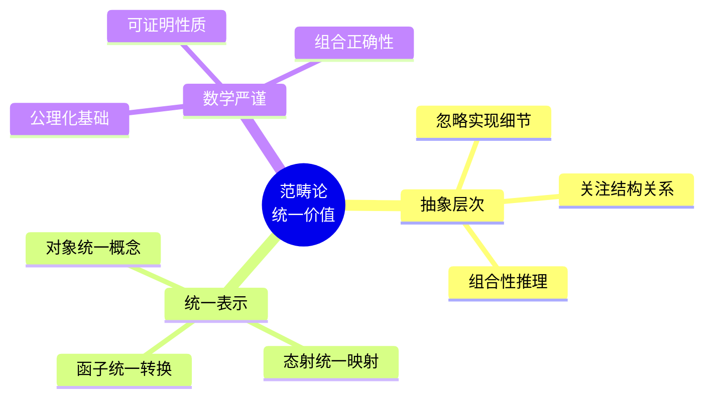
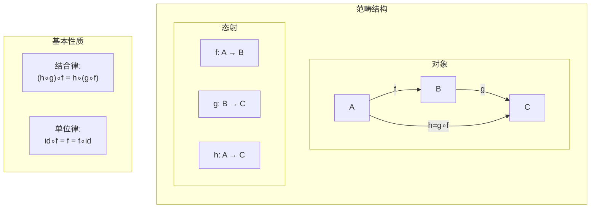
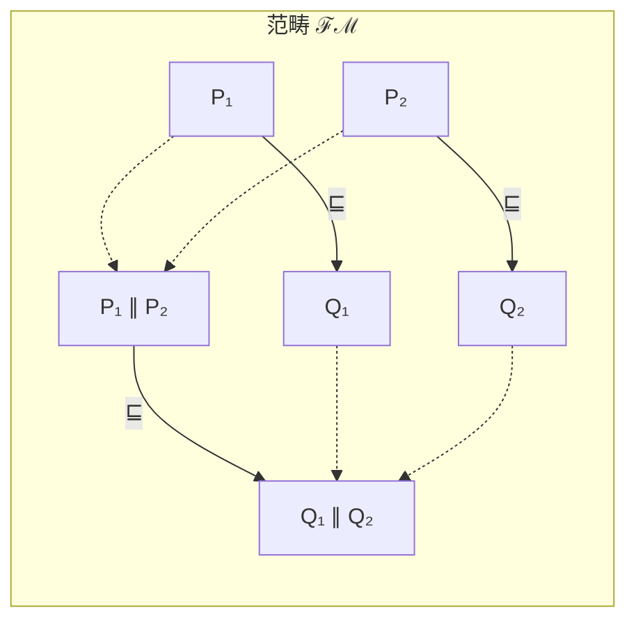
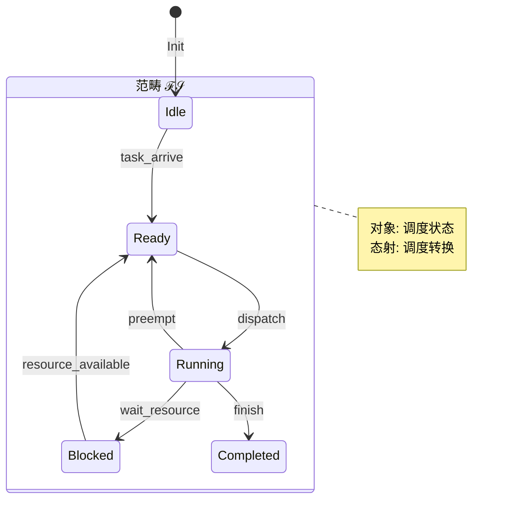
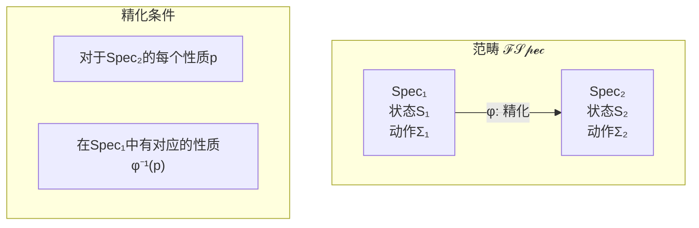
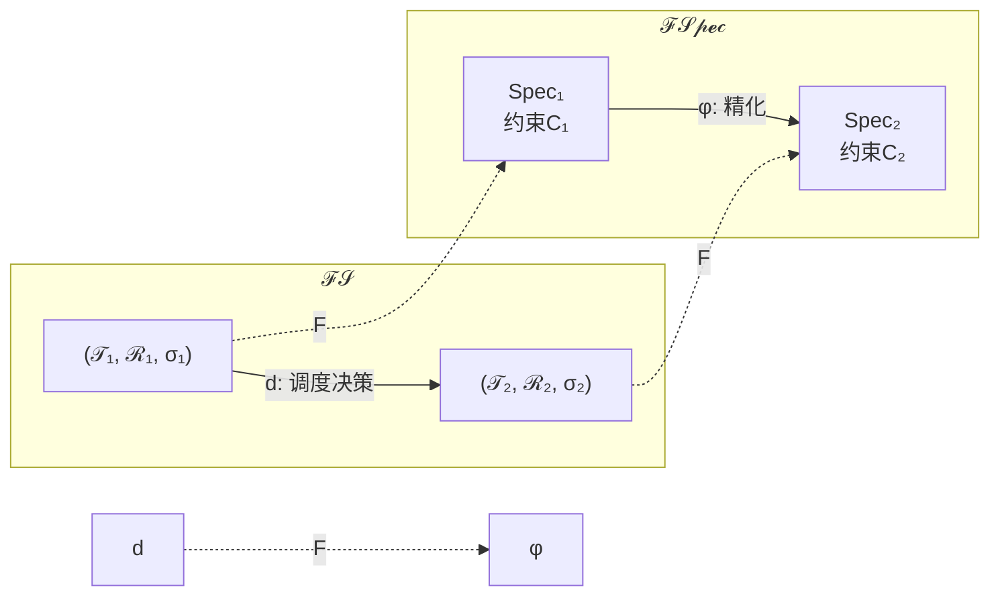
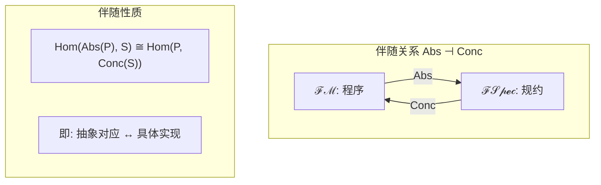
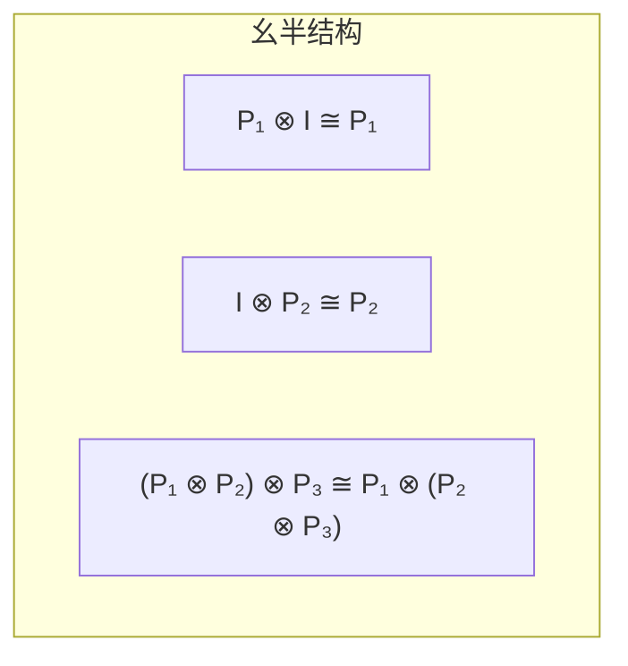
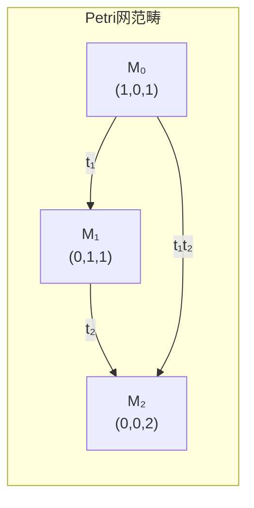
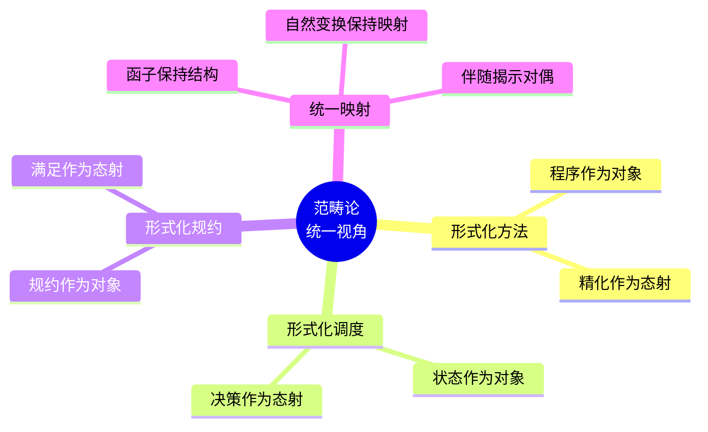

# 1.2 范畴论统一视角

---

📌 **内容摘要**

本文档深入探讨范畴论统一视角的核心原理和关键方法。内容涵盖形式化方法统一领域的主要知识点，包括函子, 范畴论, 范畴, 自然变换等关键主题。适合具备相关基础的学习者进行深入研究。

**关键词**: 函子, 范畴论, 范畴, 自然变换, 形式化方法统一

📚 **学习目标**
- 深入理解范畴论统一视角的理论体系和形式化方法
- 能够进行相关定理的形式化证明
- 建立该领域的系统性知识框架

🎯 **难度级别**: 高级

⏱️ **预计阅读时间**: 15分钟

**前置知识**: 该领域的中级知识, 形式化方法基础

---


## 1.2.1 引言

### 1.2.1.1 范畴论作为统一语言

范畴论（Category Theory）被形容为"数学的数学"，为不同数学分支提供了统一的抽象框架。在形式化科学中，范畴论可以：

- 统一形式化方法的不同概念
- 揭示各分支间的深层结构关系
- 提供组合性和模块化推理的工具

**核心洞察**：形式化科学的各个领域都可以表示为特定的范畴，它们之间的映射对应于函子（Functor）。

### 1.2.1.2 范畴论语义的独特价值



## 1.2.2 范畴论基础回顾

### 1.2.2.1 基本定义

**定义 1.2.1（范畴）**
范畴 $\mathcal{C}$ 由以下部分组成：

- 对象类：$\text{Obj}(\mathcal{C})$
- 态射类：对于任意 $A, B \in \text{Obj}(\mathcal{C})$，有 $\text{Hom}_{\mathcal{C}}(A, B)$
- 单位态射：$\text{id}_A : A \to A$
- 复合运算：$\circ : \text{Hom}(B, C) \times \text{Hom}(A, B) \to \text{Hom}(A, C)$

满足结合律和单位律：

- $(h \circ g) \circ f = h \circ (g \circ f)$
- $f \circ \text{id}_A = f = \text{id}_B \circ f$

### 1.2.2.2 核心范畴结构



## 1.2.3 形式化科学的范畴论模型

### 1.2.3.1 形式化方法范畴 $\mathcal{FM}$

**定义 1.2.2（形式化方法范畴）**
范畴 $\mathcal{FM}$ 定义如下：

- **对象**：程序/系统（表示为状态机、进程代数项等）
- **态射**：程序精化关系 $P \sqsubseteq Q$
- **复合**：精化关系的传递性
- **单位**：恒等精化

**定理 1.2.1（组合性）**
若 $P_1 \sqsubseteq Q_1$ 且 $P_2 \sqsubseteq Q_2$，则 $P_1 \parallel P_2 \sqsubseteq Q_1 \parallel Q_2$



### 1.2.3.2 形式化调度范畴 $\mathcal{FS}$

**定义 1.2.3（形式化调度范畴）**
范畴 $\mathcal{FS}$ 定义如下：

- **对象**：调度状态 $(\mathcal{T}, \mathcal{R}, \sigma)$
  - $\mathcal{T}$: 任务集合
  - $\mathcal{R}$: 资源集合
  - $\sigma$: 当前分配
- **态射**：调度决策 $d : \sigma_1 \to \sigma_2$
- **复合**：调度步骤的序列组合



### 1.2.3.3 形式化规约范畴 $\mathcal{FSpec}$

**定义 1.2.4（形式化规约范畴）**
范畴 $\mathcal{FSpec}$ 定义如下：

- **对象**：规约 $(S, \Sigma, \to, \mathcal{P})$
  - $S$: 状态集合
  - $\Sigma$: 动作集合
  - $\to$: 转移关系
  - $\mathcal{P}$: 性质集合
- **态射**：规约精化 $\phi : Spec_1 \to Spec_2$
- **张量积**：规约的并行组合

**定义 1.2.5（精化态射）**
态射 $\phi : Spec_1 \to Spec_2$ 满足：
$$\forall p \in \mathcal{P}_2. \phi^{-1}(p) \in \mathcal{P}_1$$



## 1.2.4 跨范畴函子

### 1.2.4.1 从规约到实现的函子

**定义 1.2.6（实现函子）**
函子 $F_{spec\to prog} : \mathcal{FSpec} \to \mathcal{FM}$ 将规约映射到程序：

- 对象映射：$Spec \mapsto Prog_{Spec}$
- 态射映射：精化 $\mapsto$ 程序精化

**定理 1.2.2（函子保持结构）**
$F_{spec\to prog}$ 保持：

- 单位态射：$F(id_{Spec}) = id_{F(Spec)}$
- 复合：$F(g \circ f) = F(g) \circ F(f)$

```mermaid
graph TB
    subgraph Spec["ℱ𝒮𝓅𝓮𝒸"]
        S1[Spec₁]
        S2[Spec₂]
        S3[Spec₃]

        S1 -->|f| S2
        S2 -->|g| S3
        S1 -->|g∘f| S3
    end

    subgraph Prog["ℱℳ"]
        P1[Prog₁]
        P2[Prog₂]
        P3[Prog₃]

        P1 -->|F(f)| P2
        P2 -->|F(g)| P3
        P1 -->|F(g∘f)| P3
    end

    S1 -.->|F| P1
    S2 -.->|F| P2
    S3 -.->|F| P3
```

### 1.2.4.2 从调度到规约的函子

**定义 1.2.7（调度规约函子）**
函子 $F_{sched\to spec} : \mathcal{FS} \to \mathcal{FSpec}$：

| 组件 | $\mathcal{FS}$ | $\mathcal{FSpec}$ |
|------|---------------|------------------|
| 对象 | $(\mathcal{T}, \mathcal{R}, \sigma)$ | 调度规约 $Spec_{sched}$ |
| 态射 | 调度决策 | 规约精化 |
| 张量积 | 任务并行 | 规约并行 |



## 1.2.5 自然变换与等价

### 1.2.5.1 实现策略的自然变换

**定义 1.2.8（实现策略的自然变换）**
给定两个实现函子 $F, G : \mathcal{FSpec} \to \mathcal{FM}$，自然变换 $\alpha : F \Rightarrow G$ 为：

对于每个规约 $Spec$，存在态射 $\alpha_{Spec} : F(Spec) \to G(Spec)$，使得下图交换：

```mermaid
graph TB
    subgraph Nat["自然变换交换图"]
        F1["F(Spec₁)"] -->|F(f)| F2["F(Spec₂)"]
        G1["G(Spec₁)"] -->|G(f)| G2["G(Spec₂)"]

        F1 -->|α_Spec₁| G1
        F2 -->|α_Spec₂| G2
    end

    Note["G(f) ∘ α_Spec₁ = α_Spec₂ ∘ F(f)"]
```

### 1.2.5.2 范畴等价

**定义 1.2.9（范畴等价）**
两个范畴 $\mathcal{C}$ 和 $\mathcal{D}$ 等价，当存在函子 $F : \mathcal{C} \to \mathcal{D}$ 和 $G : \mathcal{D} \to \mathcal{C}$，使得：
$$G \circ F \cong \text{Id}_{\mathcal{C}} \quad \text{和} \quad F \circ G \cong \text{Id}_{\mathcal{D}}$$

**定理 1.2.3（形式化领域的核心等价）**
$$
\mathcal{FSpec}_{exec} \simeq \mathcal{FM}_{reactive} \simeq \mathcal{FS}_{discrete}$$
可执行的规约范畴、反应式程序范畴和离散调度范畴相互等价。

## 1.2.6 伴随与对偶

### 1.2.6.1 规约与实现的伴随

**定义 1.2.10（伴随函子）**
函子 $L : \mathcal{C} \to \mathcal{D}$ 和 $R : \mathcal{D} \to \mathcal{C}$ 形成伴随 $L \dashv R$，如果：
$$\text{Hom}_{\mathcal{D}}(L(C), D) \cong \text{Hom}_{\mathcal{C}}(C, R(D))$$

**定理 1.2.4（抽象与具体化伴随）**
设 $Abs : \mathcal{FM} \to \mathcal{FSpec}$ 为抽象函子，$Conc : \mathcal{FSpec} \to \mathcal{FM}$ 为具体化函子，则：
$$Abs \dashv Conc$$



### 1.2.6.2 对偶性

**定义 1.2.11（对偶范畴）**
范畴 $\mathcal{C}^{op}$ 与 $\mathcal{C}$ 有相同的对象，但态射方向相反。

**应用**：验证中的"规范-实现"对偶

| 视角 | 原范畴 | 对偶范畴 |
|-----|--------|---------|
| 规约 | 需求精化 | 实现泛化 |
| 验证 | 性质蕴含 | 反例搜索 |
| 合成 | 程序组合 | 需求分解 |

## 1.2.7 高级范畴结构

### 1.2.7.1 笛卡尔闭范畴

**定义 1.2.12（笛卡尔闭范畴）**
范畴 $\mathcal{C}$ 是笛卡尔闭的，如果：
- 有终对象 $1$
- 有二元积 $A \times B$
- 有指数对象 $B^A$，满足：$\text{Hom}(A \times B, C) \cong \text{Hom}(A, C^B)$

**定理 1.2.5（类型系统模型）**
类型化程序构成的范畴是笛卡尔闭的，指数对象对应于函数类型：
$$A \to B \cong B^A$$

### 1.2.7.2 幺半范畴

**定义 1.2.13（幺半范畴）**
幺半范畴 $(\mathcal{C}, \otimes, I, \alpha, \lambda, \rho)$ 配备：
- 张量积 $\otimes : \mathcal{C} \times \mathcal{C} \to \mathcal{C}$
- 单位对象 $I$
- 结合约束 $\alpha$、左单位 $\lambda$、右单位 $\rho$

**应用**：并行组合模型



## 1.2.8 实例：Petri网的范畴论模型

### 1.2.8.1 Petri网作为范畴

**定义 1.2.14（Petri网范畴）**
对于Petri网 $N = (P, T, F, M_0)$，构造范畴 $\mathcal{P}_N$：
- 对象：标记 $M : P \to \mathbb{N}$
- 态射：触发序列 $M_1 \xrightarrow{t_1} M_2 \xrightarrow{t_2} \cdots \xrightarrow{t_n} M_{n+1}$



### 1.2.8.2 到形式化调度的函子

**定理 1.2.6（Petri网到调度）**
存在忠实函子 $F_{petri} : \mathcal{P}_N \to \mathcal{FS}$：
- 位置 $\to$ 资源
- 变迁 $\to$ 任务
- 标记 $\to$ 资源分配状态

## 1.2.9 交叉引用

### 1.2.9.1 内部引用

- **1.2 ↔ 1.1**: 范畴论视角为多视角统一框架提供数学基础
- **1.2 ↔ 1.3**: 范畴论与类型论通过笛卡尔闭范畴建立联系
- **1.2 ↔ 1.4**: 调度理论的特殊范畴实例

### 1.2.9.2 外部引用

- **↔ 2.1**: 范畴论作为数学-程序映射的桥梁
- **↔ 2.2**: 范畴论提供理论-工程映射的抽象框架
- **↔ 2.3**: 范畴论用于形式-计算映射的语义基础
- **↔ 2.4**: 范畴结构可用于知识图谱的本体建模

## 1.2.10 总结

范畴论为形式化科学提供了：

1. **统一语言**：对象、态射、函子统一各领域概念
2. **组合工具**：保持结构的组合性推理
3. **深层洞察**：揭示不同形式化方法间的结构对应
4. **数学严谨**：建立在坚实的数学基础上



---

*最后更新: 2026-04-11*
*版本: 1.0*
---

## 📚 延伸阅读

- [04.1 范畴基本概念](./02_形式语言/04_范畴论/04.1_范畴基本概念.md)
- [4.1 范畴基础 (Category Theory Foundations)](./02_形式语言/04_范畴论/04.1_范畴基础.md)
- [02.4 类型论与逻辑](./02_形式语言/02_类型论/02.4_类型论与逻辑.md)
- [2.4 类型论进阶 (Advanced Type Theory)](./02_形式语言/02_类型论/02.4_类型论进阶.md)
- [4.4 范畴论语义 (Categorical Semantics)](./02_形式语言/04_范畴论/04.4_范畴论语义.md)
