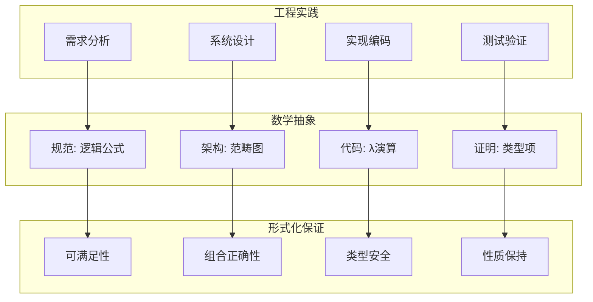
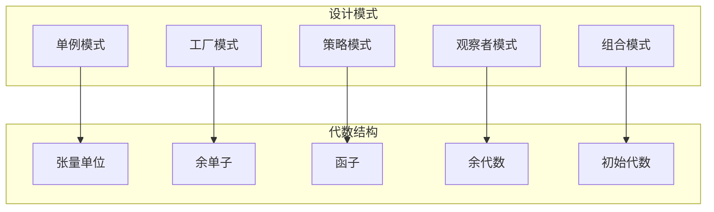
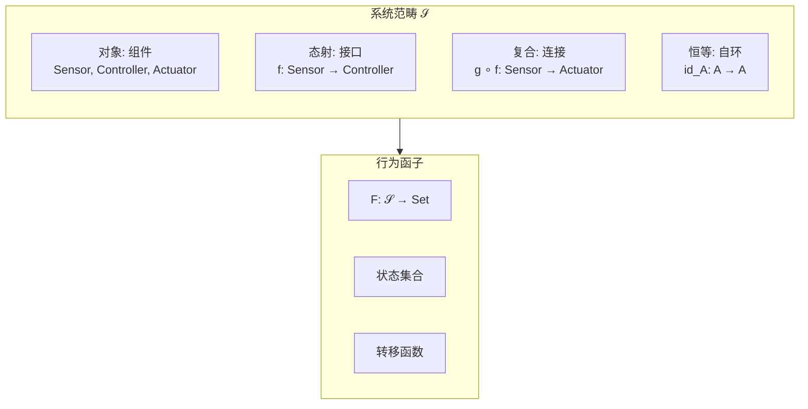
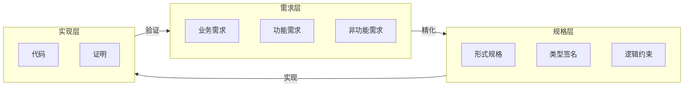
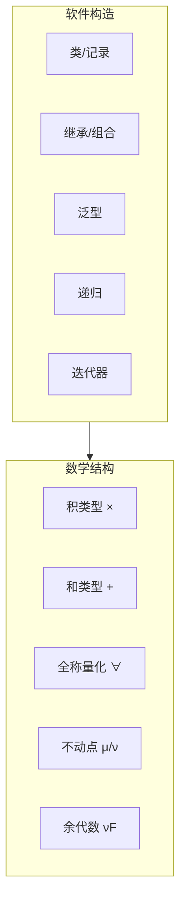

# 01.3 工程与数学对应

## 目录

- [01.3 工程与数学对应](#013-工程与数学对应)
  - [目录](#目录)
  - [1. 工程概念的数学本质](#1-工程概念的数学本质)
    - [1.1 引言：工程即应用数学](#11-引言工程即应用数学)
    - [1.2 工程的数学抽象层次](#12-工程的数学抽象层次)
  - [2. 软件工程的形式化映射](#2-软件工程的形式化映射)
    - [2.1 软件开发生命周期的形式化](#21-软件开发生命周期的形式化)
    - [2.2 类型系统作为规格语言](#22-类型系统作为规格语言)
    - [2.3 设计模式的形式化](#23-设计模式的形式化)
  - [3. 系统工程的范畴模型](#3-系统工程的范畴模型)
    - [3.1 系统作为范畴](#31-系统作为范畴)
    - [3.2 组件组合与泛性质](#32-组件组合与泛性质)
    - [3.3 涌现性质的数学刻画](#33-涌现性质的数学刻画)
  - [4. 设计模式与代数结构](#4-设计模式与代数结构)
    - [4.1 函子设计模式](#41-函子设计模式)
    - [4.2 Monad 作为计算模式](#42-monad-作为计算模式)
    - [4.3 代数和余代数的对偶性](#43-代数和余代数的对偶性)
  - [5. 从需求到证明的链条](#5-从需求到证明的链条)
    - [5.1 需求追踪的形式化](#51-需求追踪的形式化)
    - [5.2 B 方法：从需求到代码的严格转换](#52-b-方法从需求到代码的严格转换)
    - [5.3 契约式编程的形式化](#53-契约式编程的形式化)
  - [6. 综合对应表](#6-综合对应表)
    - [6.1 工程-数学完整映射表](#61-工程-数学完整映射表)
    - [6.2 软件构造-数学结构对应](#62-软件构造-数学结构对应)
    - [6.3 工程方法论的形式化分类](#63-工程方法论的形式化分类)
  - [参考与延伸](#参考与延伸)
    - [相关章节](#相关章节)
    - [关键文献](#关键文献)

---

## 1. 工程概念的数学本质

### 1.1 引言：工程即应用数学

所有工程学科都在构建**满足约束的解空间**——这本质上是数学问题：

| 工程领域 | 核心问题 | 数学框架 | 形式工具 |
|---------|---------|---------|---------|
| **软件工程** | 正确程序合成 | 类型论 | 依赖类型、精炼类型 |
| **系统工程** | 组件组合与涌现 | 范畴论 | 图论、Petri网 |
| **控制工程** | 稳定性与优化 | 分析学 | 微分方程、李代数 |
| **网络工程** | 协议正确性 | 进程代数 | CSP、π-演算 |

> **交叉引用**: 关于证明与程序的对应，参见 [01.4_证明与程序对应.md](01.4_证明与程序对应.md)

### 1.2 工程的数学抽象层次



---

## 2. 软件工程的形式化映射

### 2.1 软件开发生命周期的形式化

软件工程的每个阶段都有精确的形式对应：

| 工程阶段 | 工程产出 | 数学对象 | 形式方法 |
|---------|---------|---------|---------|
| 需求分析 | 用例/故事 | 模态逻辑公式 | 时序逻辑 (TLA) |
| 系统设计 | 架构图 | 范畴图 | 范畴语义 |
| 详细设计 | 接口规范 | 类型签名 | 接口类型论 |
| 编码实现 | 源代码 | λ项 | 依赖类型 (Lean) |
| 单元测试 | 测试用例 | 覆盖路径 | 精炼类型 |
| 集成验证 | 系统测试 | 迹集合 | 模型检验 |
| 部署运维 | 配置文件 | 资源约束 | 线性逻辑 |

### 2.2 类型系统作为规格语言

类型系统提供了从需求到实现的桥梁：

```haskell
-- 工程概念: 银行账户系统

-- 需求: 账户有余额，可以存取，余额不能为负

-- 数学表达: 状态机 + 不变式
type AccountId = String
type Amount = Integer  -- 使用整数表示最小单位(分)

-- 精炼类型: 余额非负
newtype Balance = Balance { unBalance :: Amount }
  -- 约束: unBalance >= 0

-- 操作: 存款 (total function)
deposit :: Amount -> Balance -> Balance
deposit amt (Balance b) = Balance (b + amt)
  -- 前置条件: amt >= 0 (隐含)
  -- 后置条件: 余额增加

-- 操作: 取款 (partial function 形式化)
withdraw :: Amount -> Balance -> Maybe Balance
withdraw amt (Balance b)
  | amt <= b  = Just (Balance (b - amt))
  | otherwise = Nothing
  -- 前置条件: amt <= balance
  -- 失败情况显式处理
```

```lean4
-- Lean: 完全形式化的账户系统

-- 余额定义为自然数(自动非负)
def Balance := Nat

-- 账户状态
structure Account where
  id : String
  balance : Balance

deriving Repr

-- 存款操作(完全正确)
def deposit (acct : Account) (amt : Nat) : Account :=
  { acct with balance := acct.balance + amt }

-- 取款操作(带前置条件证明)
def withdraw (acct : Account) (amt : Nat)
  (h : amt ≤ acct.balance) : Account :=
  { acct with balance := acct.balance - amt }
  -- 类型系统保证: 余额不会为负!

-- 不变式: 余额始终非负
theorem balance_invariant (acct : Account) :
  acct.balance ≥ 0 := by
  exact Nat.zero_le acct.balance

-- 操作保持不变式
theorem withdraw_preserves (acct : Account) (amt : Nat)
  (h : amt ≤ acct.balance) :
  (withdraw acct amt h).balance ≥ 0 := by
  simp [withdraw]
  apply Nat.zero_le
```

### 2.3 设计模式的形式化

常见设计模式对应数学结构：



| 设计模式 | 工程意图 | 数学结构 | 形式化表达 |
|---------|---------|---------|-----------|
| **单例** | 唯一实例 | 张量单位 $\mathbf{1}$ | $\exists! s : S$ |
| **工厂** | 对象创建 | 余单子 (Comonad) | $W A \to B$ |
| **策略** | 行为参数化 | 高阶函数 | $\Pi s:S. A(s) \to B(s)$ |
| **观察者** | 事件响应 | 余代数 | $\langle o, n \rangle : X \to O \times X$ |
| **组合** | 部分-整体 | 初始代数 | $\mu F$ (不动点) |
| **访问者** | 双重分派 | 余积消去器 | $[f, g] : A + B \to C$ |
| **Monad** | 计算序列 | Kleisli 范畴 | $A \to M B$ |

---

## 3. 系统工程的范畴模型

### 3.1 系统作为范畴

复杂系统可以用范畴论建模：



### 3.2 组件组合与泛性质

系统工程的核心是**正确组合**：

```
组件组合算子
├── 顺序组合 (;) : 管道/链式处理
│   └── 数学: 态射复合 ∘
├── 并行组合 (||) : 并发/独立执行
│   └── 数学: 积/张量积 ⊗
├── 选择组合 (⊕) : 条件/变体
│   └── 数学: 余积 +
└── 反馈组合 (μ) : 循环/递归
    └── 数学: 不动点 fix
```

```haskell
-- 组件组合的形式化

-- 顺序组合: 管道
compose :: (b -> c) -> (a -> b) -> (a -> c)
compose f g = f . g
  -- 范畴论: g ∘ f

-- 并行组合: 叉积
parallel :: (a -> c) -> (b -> d) -> (a, b) -> (c, d)
parallel f g (x, y) = (f x, g y)
  -- 范畴论: f × g

-- 选择组合
choice :: (a -> c) -> (b -> c) -> Either a b -> c
caseLeft f g (Left x)  = f x
caseLeft f g (Right y) = g y
  -- 范畴论: [f, g]: A + B → C

-- 反馈组合: 递归
feedback :: ((a, s) -> (b, s)) -> s -> a -> b
feedback f s0 a = let (b, s') = f (a, s0) in b
  -- 数学: 不动点
```

### 3.3 涌现性质的数学刻画

系统整体大于部分之和——涌现性质的形式化：

**定义 3.3.1** (涌现性质)
设系统 $S$ 由组件 $\{C_i\}$ 组成，性质 $P$ 是涌现的当且仅当：

$$
P(S) \land \forall i. \neg P(C_i)
$$

```lean4
-- 涌现性质的形式化定义

-- 系统由组件组成
structure Component where
  state : Type
  behavior : state → state

structure System (I : Type) where
  components : I → Component
  coupling : ∀ i j, components i → components j → Prop

-- 性质是系统的谓词
def Property (S : System I) := S.state → Prop

-- 涌现性质: 系统有，但组件都没有
def Emergent {I : Type} {S : System I} (P : Property S) : Prop :=
  P S.state ∧ ∀ (i : I), ¬ P (S.components i).state

-- 例子: 分布式共识是涌现性质
-- 单个节点无法达成共识，系统整体可以
```

---

## 4. 设计模式与代数结构

### 4.1 函子设计模式

函子模式统一了可映射结构：

```haskell
-- 函子: 统一的可映射接口
class Functor f where
    fmap :: (a -> b) -> f a -> f b

-- 工程应用:
-- 1. 容器映射
-- 2. 异步计算转换
-- 3. 解析器组合
-- 4. IO 操作链

-- 链式处理管道
pipeline :: Functor f => [a -> b] -> f a -> f b
pipeline [] fa = fmap id fa
pipeline (f:fs) fa = pipeline fs (fmap f fa)
```

### 4.2 Monad 作为计算模式

单子统一了有上下文计算的组合：


```lean4
-- Lean: 单子作为计算结构

-- 状态单子
structure StateM (S : Type) (A : Type) where
  run : S → A × S

instance : Monad (StateM S) where
  pure a := ⟨fun s => (a, s)⟩
  bind ma f := ⟨fun s =>
    let (a, s') := ma.run s
    (f a).run s'⟩

-- 工程应用: 事务处理
def transfer (from to : String) (amount : Nat) :
  StateM (List (String × Nat)) Bool := do
  let accounts ← get
  match lookup from accounts, lookup to accounts with
  | some f, some t =>
      if f ≥ amount then
        set (update from (f - amount)
              (update to (t + amount) accounts))
        return true
      else return false
  | _, _ => return false
```

### 4.3 代数和余代数的对偶性

```
代数 (构造)          余代数 (观察)
├── 初始代数: μF      ├── 终余代数: νF
├── 归纳定义          ├── 共归纳定义
├── 有限数据结构      ├── 无限行为
├── 语法              ├── 语义
└── 证明               └── 测试
```

```haskell
-- 代数: 构造数据结构 (归纳)
-- List a = μX. 1 + a × X
data List a = Nil | Cons a (List a)

-- 余代数: 观察系统行为 (共归纳)
-- Stream a = νX. a × X
data Stream a = Stream { head :: a, tail :: Stream a }

-- 代数折叠: 将结构归约为值
fold :: (b -> a -> b) -> b -> List a -> b
fold f z Nil = z
fold f z (Cons x xs) = fold f (f z x) xs

-- 余代数展开: 从种子生成无限结构
unfold :: (b -> (a, b)) -> b -> Stream a
unfold f s = let (a, s') = f s in Stream a (unfold f s')
```

---

## 5. 从需求到证明的链条

### 5.1 需求追踪的形式化



### 5.2 B 方法：从需求到代码的严格转换

B 方法展示了工程与数学的深度融合：

| B 方法层级 | 数学基础 | 工程内容 | 工具支持 |
|-----------|---------|---------|---------|
| 抽象机 | 集合论 | 系统状态 | Atelier B |
| 精化 | 关系代数 | 逐步细化 | Rodin |
| 实现 | λ演算 | 可执行代码 | 代码生成 |

```lean4
-- 抽象机到实现的转换示例

-- 抽象机: 集合论规格
machine AbstractSet where
  state : Set Nat
  invariant : state.Finite

  operation Insert (x : Nat)
    pre : x ∉ state
    post : state' = state ∪ {x}

-- 精化: 使用列表实现
def ConcreteSet := List Nat

-- 实现: 具体代码
def insert (s : ConcreteSet) (x : Nat)
  (h : x ∉ s) : ConcreteSet :=
  x :: s
  -- 类型保证 x 不在 s 中 (前置条件)
  -- 实现保证 x 现在在结果中 (后置条件)
```

### 5.3 契约式编程的形式化

```haskell
-- 契约式编程: 前置/后置/不变式

-- 前置条件: 函数要求
divide :: Integer -> Integer -> Integer
divide n d
  | d /= 0    = n `div` d
  | otherwise = error "前置条件违反: 除数不能为0"

-- 后置条件: 函数保证
-- (使用 QuickCheck 性质测试)
prop_divide :: Integer -> NonZero Integer -> Bool
prop_divide n (NonZero d) =
  let q = divide n d
  in q * d + (n `mod` d) == n

-- 不变式: 数据结构约束
data SortedList a = SortedList {
  elements :: [a],
  invariant :: elements == sort elements  -- 始终排序
}
```

---

## 6. 综合对应表

### 6.1 工程-数学完整映射表

| 工程概念 | 数学概念 | 形式表达 | 应用领域 |
|---------|---------|---------|---------|
| **模块** | 对象 | $M : \text{Ob}$ | 软件架构 |
| **接口** | 类型签名 | $f : A \to B$ | API 设计 |
| **组合** | 态射复合 | $g \circ f$ | 系统设计 |
| **配置** | 积 | $\prod_i C_i$ | 依赖注入 |
| **变体** | 余积 | $\sum_i V_i$ | 策略模式 |
| **状态** | 单子 | $S \to A \times S$ | 状态管理 |
| **异常** | 异常单子 | $A + E$ | 错误处理 |
| **并发** | 张量积 | $A \otimes B$ | 并行计算 |
| **协议** | 时序公式 | $\Box \Diamond P$ | 通信规范 |
| **资源** | 线性类型 | $A \multimap B$ | 内存管理 |
| **权限** | 效应类型 | $A \to^\epsilon B$ | 安全系统 |

### 6.2 软件构造-数学结构对应



### 6.3 工程方法论的形式化分类

| 方法论 | 形式基础 | 核心机制 | 适用问题 |
|-------|---------|---------|---------|
| **面向对象** | 子类型 + 递归类型 | 继承、多态 | 领域建模 |
| **函数式** | λ演算 + 代数数据 | 高阶函数 | 数据转换 |
| **逻辑式** | 一阶逻辑 | 统一、回溯 | 约束求解 |
| **响应式** | 时序逻辑 + 流 | 事件传播 | UI/实时 |
| **合约式** | 霍尔逻辑 | 前置/后置 | 可靠性 |
| **类型驱动** | 依赖类型 | 证明即程序 | 高可信 |

---

## 参考与延伸

### 相关章节

- [01.4_证明与程序对应.md](01.4_证明与程序对应.md) - 程序提取的详细讨论
- [02.3_形式-信息-系统映射.md](../02_多视角映射/02.3_形式-信息-系统映射.md) - 系统视角的深入
- [02.2_形式-计算-数学映射.md](../02_多视角映射/02.2_形式-计算-数学映射.md) - 计算的数学对应

### 关键文献

1. Hoare (1996): "How Did Software Get So Reliable Without Proof?"
2. Abrial (2010): _Modeling in Event-B: System and Software Engineering_
3. Moggi (1991): "Notions of Computation and Monads"
4. Back & von Wright (2012): _Refinement Calculus: A Systematic Introduction_

---

_工程与数学的对应不是理论的强加，而是实践的升华。当我们用范畴论理解系统设计、用类型论保证代码正确、用逻辑验证需求满足时，工程就变成了可以严格推理的应用数学——这正是形式科学追求的境界。_
