# 1.3 类型论统一视角

---

📌 **内容摘要**

本文档深入探讨类型论统一视角的核心原理和关键方法。内容涵盖形式化方法统一领域的主要知识点，包括函子, 范畴论, 范畴, 自然变换等关键主题。适合具备相关基础的学习者进行深入研究。

**关键词**: 函子, 范畴论, 范畴, 自然变换, 形式化方法统一

📚 **学习目标**

- 深入理解类型论统一视角的理论体系和形式化方法
- 能够进行相关定理的形式化证明
- 建立该领域的系统性知识框架

🎯 **难度级别**: 高级

⏱️ **预计阅读时间**: 15分钟

**前置知识**: 该领域的中级知识, 形式化方法基础, 离散数学

---


## 1.3.1 引言

### 1.3.1.1 类型论的统一能力

类型论（Type Theory）是连接逻辑、编程语言和数学证明的桥梁。通过 Curry-Howard 同构，类型论为形式化科学提供了：

- 统一的命题-类型对应
- 构造性数学基础
- 可计算的形式化验证

**核心原理**：$\text{Proposition} \equiv \text{Type}$，$\text{Proof} \equiv \text{Program}$

### 1.3.1.2 Curry-Howard-Lambek 对应

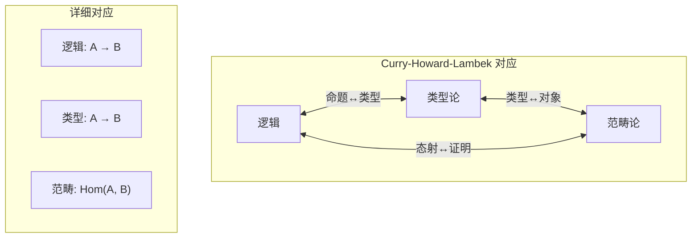

## 1.3.2 类型论基础

### 1.3.2.1 简单类型 $\lambda$ 演算

**定义 1.3.1（简单类型）**
类型 $T$ 归纳定义：
$$T ::= B \mid T \to T \mid T \times T \mid T + T$$
其中 $B$ 是基本类型。

**定义 1.3.2（类型判断）**
类型判断形式为 $\Gamma \vdash e : T$，其中：

- $\Gamma$ 是类型环境（变量类型假设）
- $e$ 是项
- $T$ 是类型

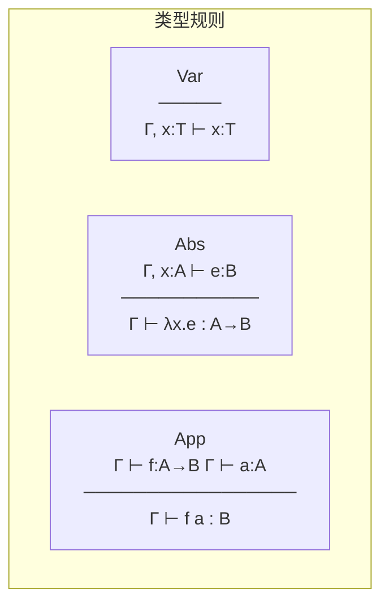

### 1.3.2.2 依赖类型

**定义 1.3.3（依赖类型）**
依赖类型允许类型依赖于项：

- 依赖积：$\Pi(x:A). B(x)$ - 依赖函数类型
- 依赖和：$\Sigma(x:A). B(x)$ - 依赖对类型

**Curry-Howard 解释**：

- $\Pi(x:A). B(x)$ 对应于全称量词 $\forall x:A. B(x)$
- $\Sigma(x:A). B(x)$ 对应于存在量词 $\exists x:A. B(x)$

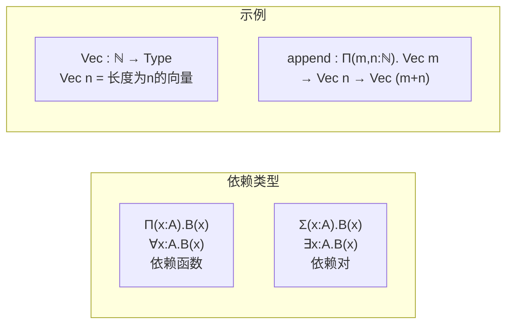

## 1.3.3 形式化方法的类型论模型

### 1.3.3.1 程序作为类型

**定义 1.3.4（程序类型）**
程序 $P$ 可表示为类型 $T_P$，其中：

- 输入类型 $T_{in}$
- 输出类型 $T_{out}$
- 效果类型 $T_{eff}$

$$T_P = T_{in} \to T_{eff}\langle T_{out}\rangle$$

**示例**：

```
readFile : Path → IO⟨Result String Error⟩
```

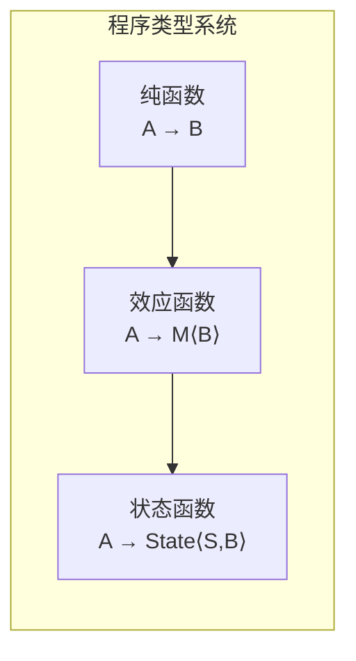

### 1.3.3.2 规约作为类型

**定义 1.3.5（规约类型）**
规约 $Spec$ 对应于类型 $T_{Spec}$：

- 前置条件 $P : A \to \text{Prop}$
- 后置条件 $Q : A \to B \to \text{Prop}$

$$T_{Spec} = \{f : A \to B \mid \forall a:A. P(a) \to Q(a, f(a))\}$$

这对应于 Hoare 逻辑的三元组：$\{P\}f\{Q\}$

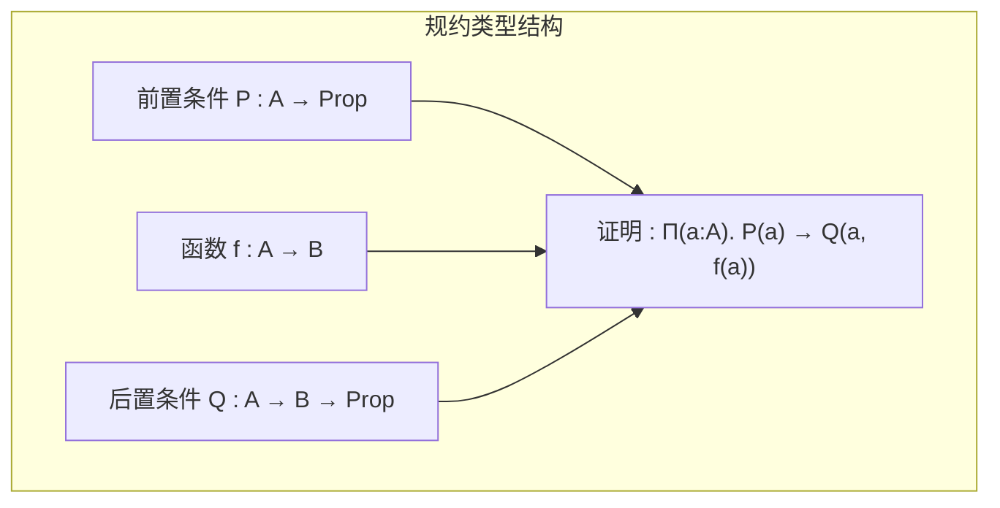

### 1.3.3.3 调度作为类型

**定义 1.3.6（调度类型）**
调度策略表示为依赖类型：

$$\text{Scheduler} : \Pi(\mathcal{T} : \text{TaskSet}). \Pi(\mathcal{R} : \text{ResourceSet}). \text{Schedule}\langle\mathcal{T}, \mathcal{R}\rangle$$

其中 $\text{Schedule}\langle\mathcal{T}, \mathcal{R}\rangle$ 保证：

- 每个任务获得所需资源
- 无资源冲突
- 满足实时约束（如果有）

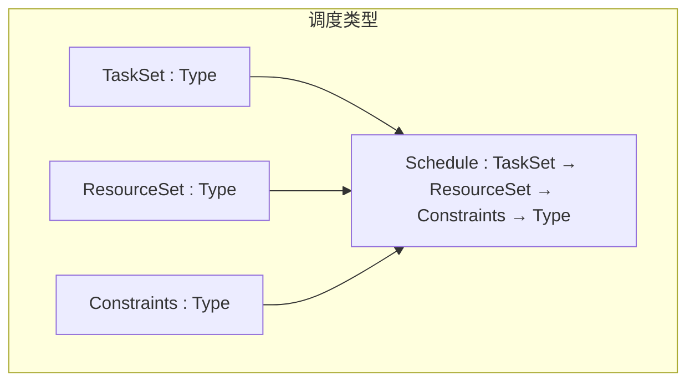

## 1.3.4 类型构造器与逻辑连接词

### 1.3.4.1 对应表

| 逻辑 | 类型 | 构造 | 消除 | 说明 |
|-----|------|-----|------|-----|
| $A \land B$ | $A \times B$ | 对构造 | 投影 | 合取/积类型 |
| $A \lor B$ | $A + B$ | 注入 | 案例分析 | 析取/和类型 |
| $A \to B$ | $A \to B$ | $\lambda$ 抽象 | 应用 | 蕴含/函数类型 |
| $\forall x:A.B$ | $\Pi(x:A).B$ | $\lambda$ 抽象 | 应用 | 全称/依赖积 |
| $\exists x:A.B$ | $\Sigma(x:A).B$ | 对构造 | 投影 | 存在/依赖和 |
| $\top$ | $\mathbf{1}$ | $()$ | - | 真/单位类型 |
| $\bot$ | $\mathbf{0}$ | - | 爆炸原理 | 假/空类型 |

### 1.3.4.2 构造与消除的可视化

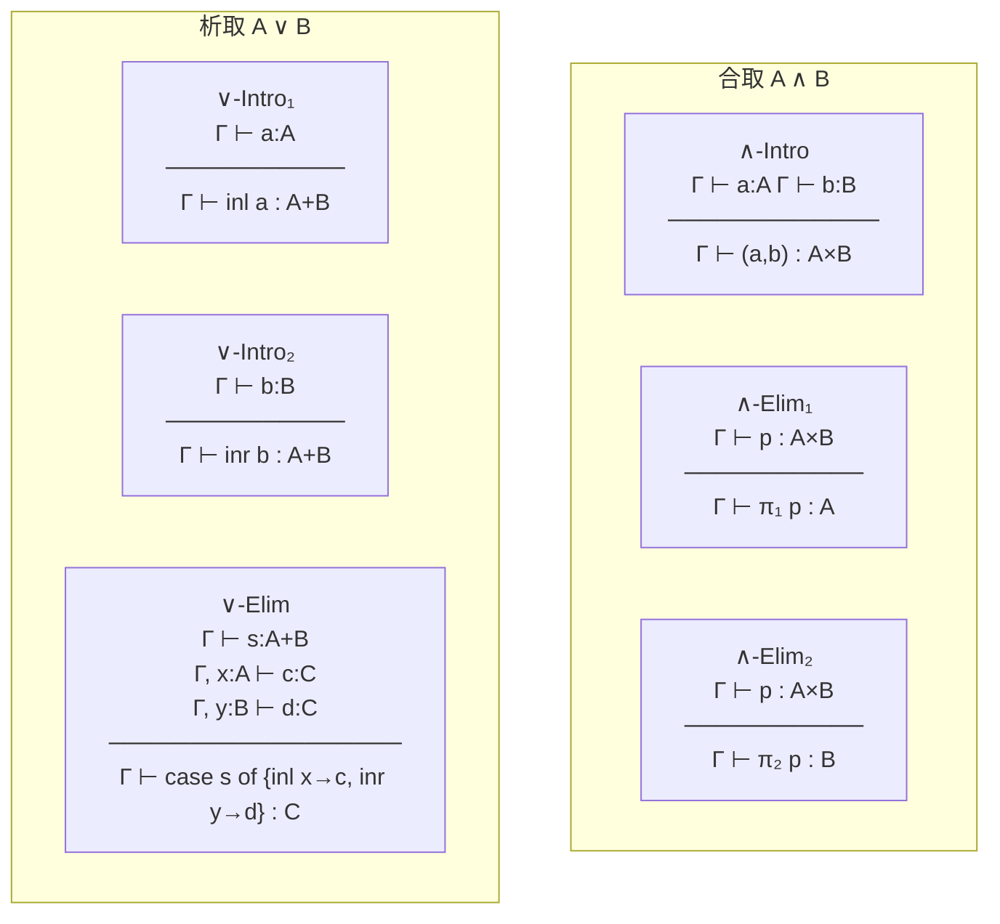

## 1.3.5 归纳类型与递归

### 1.3.5.1 归纳定义

**定义 1.3.7（归纳类型）**
归纳类型由其构造子归纳定义。例如自然数：

$$\text{Nat} ::= 0 \mid \text{Suc}\ \text{Nat}$$

在类型论中：

```
inductive Nat : Type where
| zero : Nat
| suc : Nat → Nat
```

### 1.3.5.2 归纳原理

**定理 1.3.1（归纳原理）**
对于性质 $P : \text{Nat} \to \text{Prop}$：

$$P(0) \to (\forall n. P(n) \to P(\text{suc}\ n)) \to \forall n. P(n)$$

**Curry-Howard 解释**：递归函数的定义

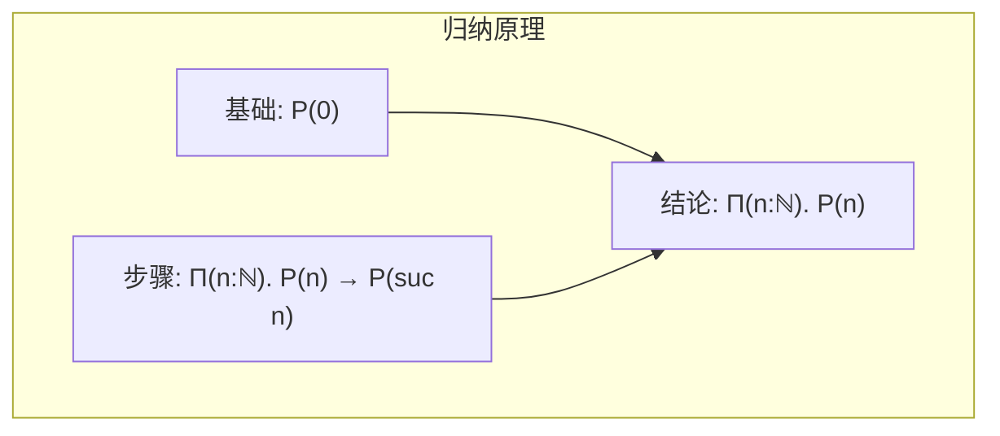

### 1.3.5.3 共归纳类型

**定义 1.3.8（共归纳类型）**
共归纳类型由观察/消去子定义，用于无限结构：

```
coinductive Stream (A : Type) : Type where
| head : Stream A → A
| tail : Stream A → Stream A
```

**应用**：反应式系统、无限行为规约

## 1.3.6 类型论中的等价与证明

### 1.3.6.1 命题相等

**定义 1.3.9（命题相等）**
命题相等（Leibniz 相等）：
$$a =_A b \triangleq \forall P : A \to \text{Prop}. P(a) \to P(b)$$

**性质**：

- 自反性：$\text{refl} : a = a$
- 对称性：$\text{sym} : a = b \to b = a$
- 传递性：$\text{trans} : a = b \to b = c \to a = c$

### 1.3.6.2 同伦类型论（HoTT）

**定义 1.3.10（同伦类型论）**
HoTT 扩展了类型论，将相等视为路径：

- $a =_A b$ 是从 $a$ 到 $b$ 的路径类型
- 路径可以复合、求逆
- 高阶路径（路径的路径）

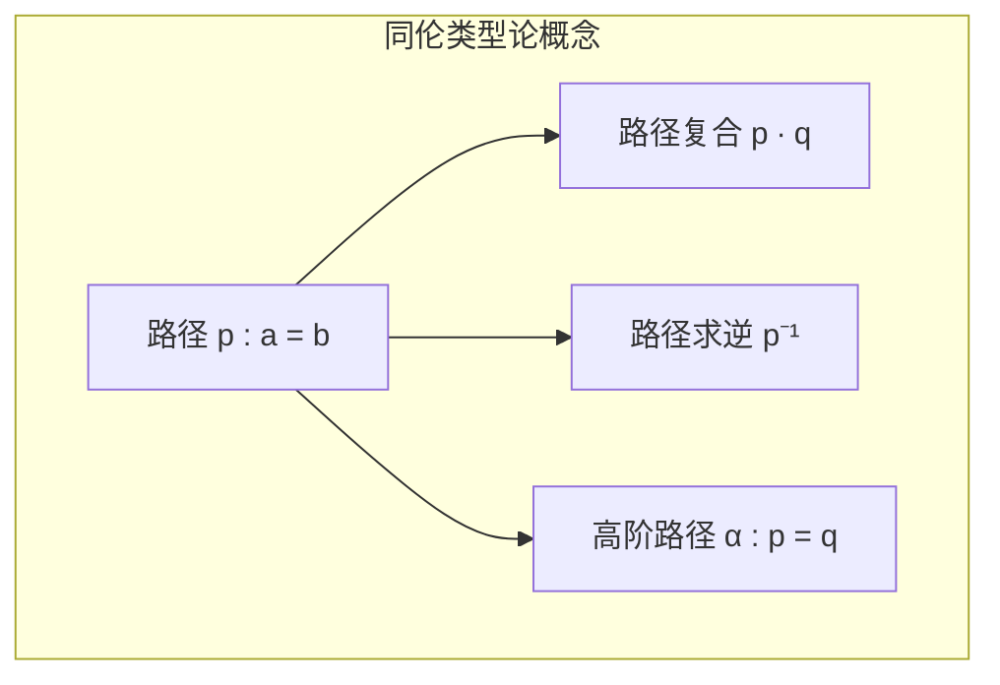

**应用**：在形式化验证中处理等价关系、代数结构同构等。

## 1.3.7 效应与单子

### 1.3.7.1 计算效应的类型

**定义 1.3.11（计算效应）**
计算效应封装副作用：

- 状态：$\text{State}\ S\ A = S \to (A \times S)$
- 异常：$\text{Except}\ E\ A = A + E$
- 非确定性：$\text{List}\ A$
- IO：$\text{IO}\ A$

### 1.3.7.2 单子结构

**定义 1.3.12（单子）**
单子 $(M, \text{return}, \bind)$ 满足：

- $\text{return} : A \to M\ A$
- $\bind : M\ A \to (A \to M\ B) \to M\ B$
- 单位律：$\text{return}(a) \bind f = f(a)$
- 结合律：$m \bind f \bind g = m \bind (\lambda x. f(x) \bind g)$

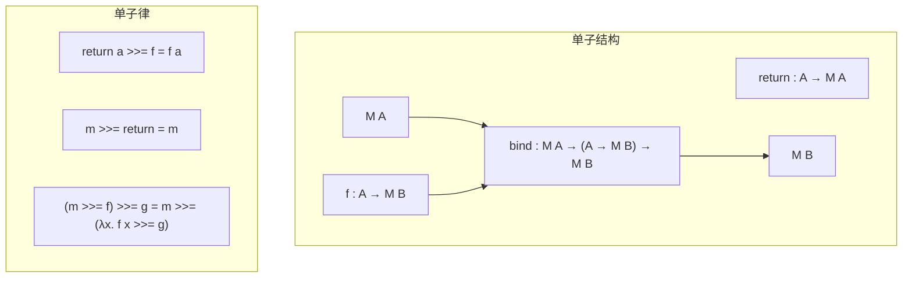

### 1.3.7.3 效应处理器

**定义 1.3.13（代数效应）**
代数效应将效应操作作为代数签名：

```
effect State S where
  get : S
  put : S → Unit
```

处理器（Handler）提供效应的解释：

```
handler StateHandler {
  return x ↦ (λs. (x, s))
  get () k ↦ (λs. k s s)
  put s' k ↦ (λs. k () s')
}
```

## 1.3.8 类型论实现工具

### 1.3.8.1 证明助手对比

| 工具 | 核心类型论 | 特性 | 应用领域 |
|-----|-----------|------|---------|
| Coq | 归纳构造演算 |  tactic、提取 | 程序验证、数学证明 |
| Agda | 依赖类型 |  项重写、Unicode | 编程、形式化数学 |
| Lean | 依赖类型 |  元编程、社区 | 数学库、教学 |
| Idris | 依赖类型 |  效应系统、编译 | 通用编程、验证 |

### 1.3.8.2 形式化工作流

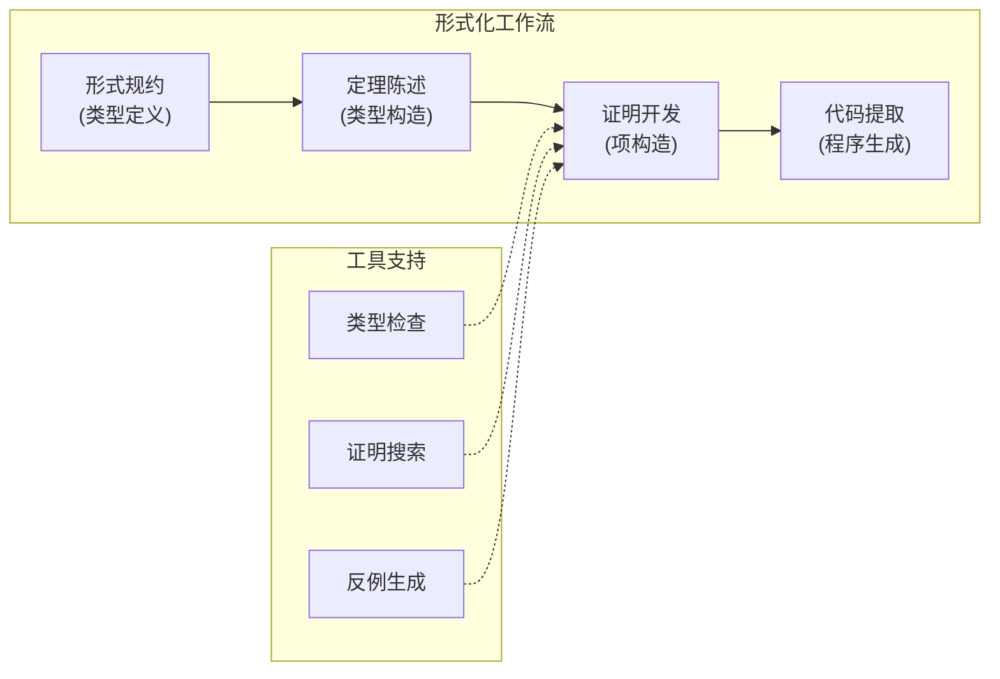

## 1.3.9 交叉引用

### 1.3.9.1 内部引用

- **1.3 ↔ 1.1**: 类型论为多视角统一框架提供 Curry-Howard 基础
- **1.3 ↔ 1.2**: 类型论与范畴论通过笛卡尔闭范畴连接
- **1.3 ↔ 1.4**: 调度理论的类型化表示

### 1.3.9.2 外部引用

- **↔ 2.1**: 类型论作为数学-程序映射的精确工具
- **↔ 2.2**: 类型论提供理论-工程映射的类型安全保证
- **↔ 2.3**: 类型论是形式-计算映射的核心机制
- **↔ 2.4**: 类型层次可用于知识图谱的概念分类

## 1.3.10 总结

类型论统一视角提供了：

1. **逻辑-程序统一**：通过 Curry-Howard 同构
2. **构造性数学**：可计算、可提取的证明
3. **精确规约**：依赖类型表达复杂约束
4. **可验证实现**：类型即规约，程序即证明

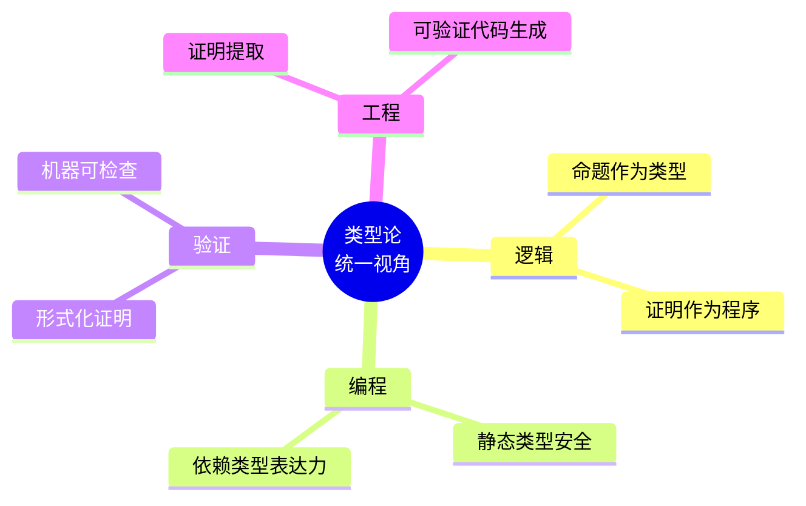

---

_最后更新: 2026-04-11_
_版本: 1.0_
---

## 📚 延伸阅读

- [04.1 范畴基本概念](../../02_形式语言/04_范畴论/04.1_范畴基本概念.md)
- [4.1 范畴基础 (Category Theory Foundations)](../../02_形式语言/04_范畴论/04.1_范畴基础.md)
- [1. 单子与函子](../../03_编程范式/04_函数式编程/04.2_单子与函子.md)
- [04.3 单子与函子](../../03_编程范式/04_函数式编程/04.3_单子与函子.md)
- [02.4 类型论与逻辑](../../02_形式语言/02_类型论/02.4_类型论与逻辑.md)
