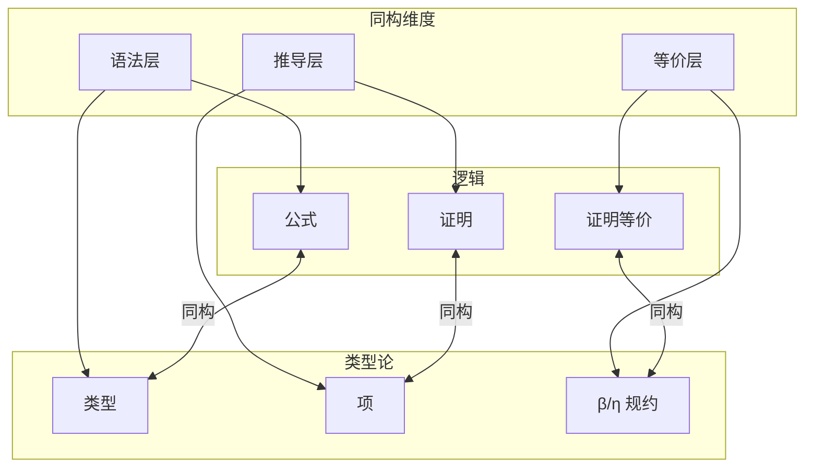

# 01.4 证明与程序对应

## 目录

- [01.4 证明与程序对应](#014-证明与程序对应)
  - [目录](#目录)
  - [1. Curry-Howard 同构详解](#1-curry-howard-同构详解)
    - [1.1 历史与发现](#11-历史与发现)
    - [1.2 同构的数学表述](#12-同构的数学表述)
    - [1.3 完整对应表](#13-完整对应表)
  - [2. 证明即程序：核心对应](#2-证明即程序核心对应)
    - [2.1 自然演绎到 λ 项](#21-自然演绎到-λ-项)
    - [2.2 经典命题的证明-程序对应](#22-经典命题的证明-程序对应)
    - [2.3 结构归纳与递归](#23-结构归纳与递归)
  - [3. 程序提取技术](#3-程序提取技术)
    - [3.1 提取管道](#31-提取管道)
    - [3.2 Lean 程序提取](#32-lean-程序提取)
    - [3.3 证明无关性与擦除](#33-证明无关性与擦除)
  - [4. 双向转换：证明辅助与程序合成](#4-双向转换证明辅助与程序合成)
    - [4.1 从类型推导程序](#41-从类型推导程序)
    - [4.2 证明自动化与程序生成](#42-证明自动化与程序生成)
    - [4.3 交互式证明即逐步编程](#43-交互式证明即逐步编程)
  - [5. 实例：从定理到可执行代码](#5-实例从定理到可执行代码)
    - [5.1 实例一：列表操作的形式化](#51-实例一列表操作的形式化)
    - [5.2 实例二：正则表达式匹配器](#52-实例二正则表达式匹配器)
    - [5.3 实例三：认证数据结构](#53-实例三认证数据结构)
  - [6. 工具链与实现](#6-工具链与实现)
    - [6.1 主要证明辅助器](#61-主要证明辅助器)
    - [6.2 提取工作流](#62-提取工作流)
    - [6.3 实际代码提取示例](#63-实际代码提取示例)
  - [参考与延伸](#参考与延伸)
    - [相关章节](#相关章节)
    - [关键文献](#关键文献)

---

## 1. Curry-Howard 同构详解

### 1.1 历史与发现

Curry-Howard 对应是形式科学中最深刻的洞见之一：

| 时间 | 贡献者 | 发现 |
|-----|--------|------|
| 1934 | Curry | 组合子与证明的组合相似性 |
| 1969 | Howard | 自然演绎与 λ 演算的精确对应 |
| 1980 | Martin-Löf | 构造类型论 (ITT) 的建立 |
| 1990 | Girard | 线性逻辑揭示资源敏感对应 |

> **交叉引用**: 关于对应的基础理论，参见 [01.1_统一理论基础.md](01.1_统一理论基础.md)

### 1.2 同构的数学表述

**定理 1.2.1** (Curry-Howard-Lambek)
以下三个结构是同构的：

$$
\text{命题逻辑} \cong \text{简单类型 λ 演算} \cong \text{笛卡尔闭范畴}
$$

**同构的三个维度**:



### 1.3 完整对应表

| 逻辑 (直觉主义) | 类型论 | λ 演算 | 范畴论 |
|----------------|--------|--------|--------|
| 命题 $A$ | 类型 $A$ | 类型 $A$ | 对象 $A$ |
| 证明 $p : A$ | 项 $t : A$ | λ项 $t$ | 态射 $1 \to A$ |
| $A \to B$ | 函数类型 | λx.t | 指数 $B^A$ |
| $A \land B$ | 积类型 | 对 $(t, s)$ | 积 $A \times B$ |
| $A \lor B$ | 和类型 | 注入 | 余积 $A + B$ |
| $\top$ | 单位类型 | () | 终对象 $1$ |
| $\bot$ | 空类型 | 无 | 始对象 $0$ |
| 证明替换 | 项替换 | β-归约 | 组合 |
| 证明范式 | 正规形式 | 范式 | 通用性质 |

---

## 2. 证明即程序：核心对应

### 2.1 自然演绎到 λ 项

**对应规则**（BHK 解释）：

$$
\begin{array}{c|c}
\textbf{逻辑规则} & \textbf{λ 项} \\
\hline
\frac{[x:A] \quad \vdots \quad t:B}{\lambda x.t : A \to B}(\to I) & \text{抽象} \\
\frac{f:A \to B \quad a:A}{f\,a : B}(\to E) & \text{应用} \\
\frac{a:A \quad b:B}{(a,b) : A \land B}(\land I) & \text{配对} \\
\frac{p:A \land B}{\pi_1 p : A}(\land E_1) & \text{第一投影} \\
\frac{a:A}{\iota_1 a : A \lor B}(\lor I_1) & \text{左注入} \\
\frac{c:A \lor B \quad \dotsc}{\text{case } c \text{ of } \dots : C}(\lor E) & \text{case 分析}
\end{array}
$$

### 2.2 经典命题的证明-程序对应

**命题：$(A \to B) \to (B \to C) \to (A \to C)$**（蕴含传递性）

```haskell
-- 证明作为 Haskell 程序
compose :: (a -> b) -> (b -> c) -> (a -> c)
compose f g = \x -> g (f x)

-- 类型推导:
-- f :: a -> b  (假设 H1)
-- g :: b -> c  (假设 H2)
-- x :: a       (假设 H3)
-- f x :: b     (→消去 H1, H3)
-- g (f x) :: c (→消去 H2, ...)
-- \x -> g (f x) :: a -> c  (→引入)
-- compose :: (a->b) -> (b->c) -> (a->c)  (→引入 ×2)
```

```lean4
-- Lean 证明 (完全相同的结构)
theorem compose {A B C : Type} : (A → B) → (B → C) → (A → C) := by
  intro f  -- 假设 H1: A → B
  intro g  -- 假设 H2: B → C
  intro x  -- 假设 H3: A
  apply g  -- 应用 g: 需要 B
  apply f  -- 应用 f: 需要 A
  exact x  -- 使用 x: 有 A

-- 提取的 λ 项:
-- λ f. λ g. λ x. g (f x)
```

### 2.3 结构归纳与递归

数学归纳法对应递归函数：

```haskell
-- 自然数归纳原理 → fold
data Nat = Zero | Succ Nat

-- 归纳原理:
-- P(0) → (∀n. P(n) → P(Succ n)) → ∀m. P(m)
-- 对应 fold:
foldNat :: b -> (b -> b) -> Nat -> b
foldNat z s Zero     = z        -- 基础情形
foldNat z s (Succ n) = s (foldNat z s n)  -- 归纳步骤

-- 例子: 加法
add :: Nat -> Nat -> Nat
add m n = foldNat n Succ m
-- 证明: m + 0 = m, m + (n+1) = (m+n)+1
```

```lean4
-- Lean: 归纳类型与证明
inductive Nat where
  | zero : Nat
  | succ : Nat → Nat

deriving Repr

-- 归纳原理自动生成的证明方法
-- 证明 ∀n, n + 0 = n
theorem add_zero (n : Nat) : add n zero = n := by
  induction n with
  | zero => rfl  -- 基础: 0 + 0 = 0
  | succ n ih =>
    -- 归纳: succ n + 0 = succ n
    -- 使用归纳假设: n + 0 = n
    simp [add, ih]

-- 对应递归函数:
def add : Nat → Nat → Nat
  | a, .zero   => a
  | a, .succ b => .succ (add a b)
```

---

## 3. 程序提取技术

### 3.1 提取管道


### 3.2 Lean 程序提取

```lean4
-- Lean 证明包含计算内容
-- 提取为可执行程序

-- 欧几里得算法 (证明其终止性和正确性)
def gcd : Nat → Nat → Nat
  | 0, y => y
  | x, 0 => x
  | x, y =>
      if x ≤ y then gcd x (y - x)
      else gcd (x - y) y
termination_by x y => x + y
-- ^ 终止度量证明算法会停止

theorem gcd_dvd (x y : Nat) : gcd x y ∣ x ∧ gcd x y ∣ y := by
  -- 证明 gcd 确实是公约数
  sorry  -- 详细证明省略

-- 提取命令 (伪代码)
-- #extract gcd "Gcd.hs"  -- 生成 Haskell 代码

-- 生成的 Haskell 代码:
{-
gcd :: Integer -> Integer -> Integer
gcd 0 y = y
gcd x 0 = x
gcd x y =
  if x <= y then gcd x (y - x)
  else gcd (x - y) y
-}
```

### 3.3 证明无关性与擦除

**原则**: 证明类型的内容在运行时被擦除

```lean4
-- Prop vs Type 的区别

-- 证明 (运行时擦除)
theorem commutativity (n m : Nat) : n + m = m + n := by
  -- 复杂的证明...
  sorry

-- 计算内容 (运行时保留)
def add (n m : Nat) : Nat := n + m

-- 依赖类型中的擦除
def head {α : Type} {n : Nat} (v : Vec α (n + 1)) : α :=
  -- v 的非空性由类型保证
  -- 证明 (n+1 > 0) 在运行时不存在!
  match v with
  | cons x _ => x

-- 提取后的代码 (伪代码):
-- head v = case v of Cons x _ -> x
-- 所有证明信息都被擦除
```

---

## 4. 双向转换：证明辅助与程序合成

### 4.1 从类型推导程序

给定类型，可以**搜索**对应的程序（程序合成）：

```haskell
-- 类型: (a -> b -> c) -> (a -> b) -> a -> c
-- 对应命题: (A → B → C) → (A → B) → A → C

-- 程序合成结果:
synthesize :: (a -> b -> c) -> (a -> b) -> a -> c
synthesize f g x = f x (g x)
-- 这是 S 组合子!

-- 类型推导指导程序构造:
-- 1. 目标是 c
-- 2. f :: a -> b -> c 可以产生 c
-- 3. 需要 a 和 b
-- 4. x :: a 提供第一个参数
-- 5. g :: a -> b 结合 x 提供第二个参数
```

### 4.2 证明自动化与程序生成

```lean4
-- 使用证明自动化生成程序

-- 排序算法的规范：
def Sorted (l : List Nat) : Prop :=
  ∀ i j, i < j → i < l.length → j < l.length →
    l[i]! ≤ l[j]!

-- 排序算法作为存在性证明的构造:
theorem sorting_algorithm :
  ∀ l, ∃ l', Permutation l l' ∧ Sorted l' := by
  intro l
  -- 使用构造性证明产生算法
  induction l with
  | nil => exact ⟨[], by simp, by simp [Sorted]⟩
  | cons x xs ih =>
    -- 插入排序的构造性证明
    sorry

-- 提取的算法:
-- def sort : List Nat → List Nat := ...
```

### 4.3 交互式证明即逐步编程

```lean4
-- 交互式证明对应逐步程序构造

-- 目标: 构造 (A → B) → (C → A) → (C → B)
-- 这是函数复合!

theorem composition' {A B C : Type} :
  (A → B) → (C → A) → (C → B) := by
  -- 编程即填空
  intro f  -- f : A → B
  intro g  -- g : C → A
  intro c  -- c : C
  -- 目标: B
  apply f  -- 现在需要 A
  apply g  -- 现在需要 C
  exact c  -- 完成!

-- 生成的 λ 项: λ f g c. f (g c)
-- 这正是函数复合的定义
```

---

## 5. 实例：从定理到可执行代码

### 5.1 实例一：列表操作的形式化

```lean4
-- 定理: 列表反转是 involution (reverse (reverse l) = l)
theorem reverse_involutive {α} (l : List α) :
  l.reverse.reverse = l := by
  induction l with
  | nil => rfl
  | cons x xs ih =>
    simp [List.reverse_cons, ih]

-- 提取的反转函数:
-- reverse :: [a] -> [a]
-- reverse [] = []
-- reverse (x:xs) = reverse xs ++ [x]

-- 优化 (通过证明转换):
-- 使用尾递归优化

def reverseFast {α} (l : List α) : List α :=
  go l []
where
  go : List α → List α → List α
  | [], acc => acc
  | x::xs, acc => go xs (x::acc)

theorem reverseFast_correct {α} (l : List α) :
  reverseFast l = l.reverse := by
  -- 证明优化版本等价于规范
  sorry
```

### 5.2 实例二：正则表达式匹配器

```lean4
-- 正则表达式的归纳定义
inductive Regex (α : Type) where
  | empty : Regex α           -- ∅
  | epsilon : Regex α         -- ε
  | char : α → Regex α        -- a
  | concat : Regex α → Regex α → Regex α  -- rs
  | alt : Regex α → Regex α → Regex α     -- r|s
  | star : Regex α → Regex α              -- r*

deriving Repur, DecidableEq

-- 匹配关系 (作为命题)
inductive Matches {α} : Regex α → List α → Prop where
  | eps : Matches epsilon []
  | char (a : α) : Matches (char a) [a]
  | concat {r s x y} :
      Matches r x → Matches s y → Matches (concat r s) (x ++ y)
  | alt_left {r s x} : Matches r x → Matches (alt r s) x
  | alt_right {r s x} : Matches s x → Matches (alt r s) x
  | star_nil {r} : Matches (star r) []
  | star_cons {r x xs} :
      Matches r x → Matches (star r) xs → Matches (star r) (x ++ xs)

-- 构造性证明 = 匹配算法
def matcher {α} [DecidableEq α] (r : Regex α) (s : List α) :
  Decidable (Matches r s) := by
  -- 构造性算法实现
  -- 提取为可执行的匹配器
  sorry
```

### 5.3 实例三：认证数据结构

```lean4
-- 红黑树: 带平衡不变式的二叉搜索树

inductive Color where | red | black

deriving Repr, DecidableEq

inductive RBTree (α : Type) [Ord α] where
  | leaf : RBTree α
  | node : Color → RBTree α → α → RBTree α → RBTree α

deriving Repr

-- 红黑树不变式 (作为类型索引!)
inductive ValidRBTree : RBTree α → Prop where
  | leaf_valid : ValidRBTree leaf
  | node_valid : ∀ c l v r,
      ValidRBTree l → ValidRBTree r →
      black_height l = black_height r →  -- 性质1
      (c = .red → color l = .black ∧ color r = .black) →  -- 性质2
      ValidRBTree (node c l v r)

-- 带证明的红黑树插入
def insert {α} [Ord α] (t : RBTree α) (x : α) :
  { t' : RBTree α // ValidRBTree t' } := by
  -- 构造性证明插入保持所有不变式
  -- 提取为认证的数据结构实现
  sorry
```

---

## 6. 工具链与实现

### 6.1 主要证明辅助器

| 系统 | 基础理论 | 目标语言 | 特点 |
|-----|---------|---------|------|
| **Lean 4** | 依赖类型论 | C/LLVM | 现代化、高性能 |
| **Coq** | 归纳构造演算 | OCaml/Haskell | 成熟、丰富库 |
| **Agda** |  Martin-Löf TT | Haskell | 依赖类型原生 |
| **Idris** | 依赖类型 | 多种后端 | 面向编程 |
| **Isabelle** | 高阶逻辑 | ML/Haskell | 自动化强 |

### 6.2 提取工作流


### 6.3 实际代码提取示例

```lean4
-- Lean 4 程序提取示例

-- 形式化定义
def factorial : Nat → Nat
  | 0 => 1
  | n + 1 => (n + 1) * factorial n

-- 证明性质
theorem factorial_pos (n : Nat) : factorial n > 0 := by
  induction n with
  | zero => simp [factorial]
  | succ n ih =>
    simp [factorial]
    apply Nat.mul_pos
    · simp
    · exact ih

-- 使用 lake 构建系统提取为可执行程序
-- lakefile.lean 配置:
/-
import Lake
open Lake DSL

package «Factorial» where
  -- 包配置

@[default_target]
lean_exe «factorial» where
  root := `Main
-/

-- Main.lean
-- def main : IO Unit := do
--   let n ← IO.getNumFromUser
--   IO.println s!"Factorial of {n} is {factorial n}"
```

---

## 参考与延伸

### 相关章节

- [01.1_统一理论基础.md](01.1_统一理论基础.md) - Curry-Howard 的数学理论
- [01.2_多语言融合.md](01.2_多语言融合.md) - 证明与类型的语法对应
- [01.3_工程与数学对应.md](01.3_工程与数学对应.md) - 程序提取的工程应用

### 关键文献

1. Sørensen & Urzyczyn (2006): _Lectures on the Curry-Howard Isomorphism_
2. Pierce (2002): _Types and Programming Languages_ (Ch. 9)
3. Letouzey (2004): "Programmation fonctionnelle certifiée"
4. Chlipala (2013): _Certified Programming with Dependent Types_

---

_证明与程序的对应是形式科学最美丽的发现之一。它揭示了数学推理与计算执行的深层同一性——思考即计算，证明即编程。这种认识不仅统一了理论与实践，更为构造正确软件提供了坚实的数学基础。_
