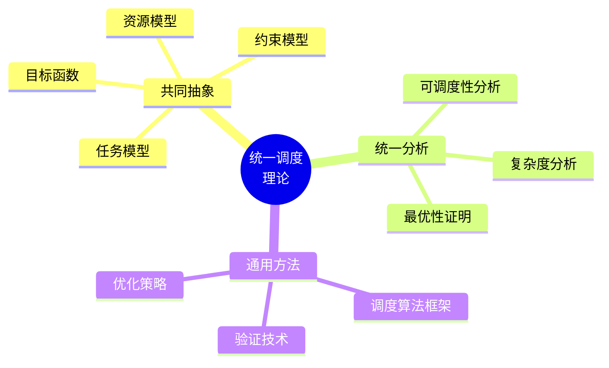
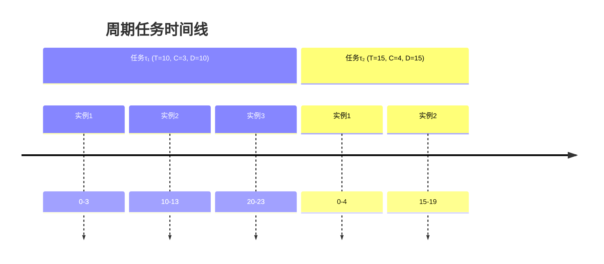
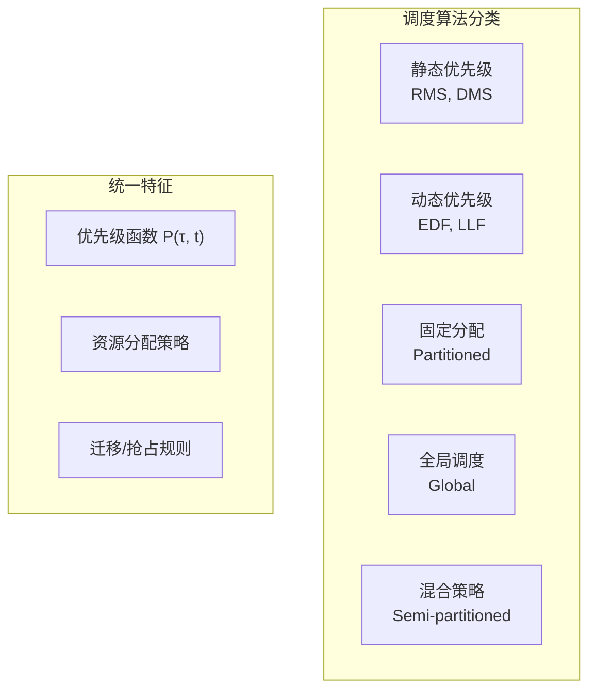
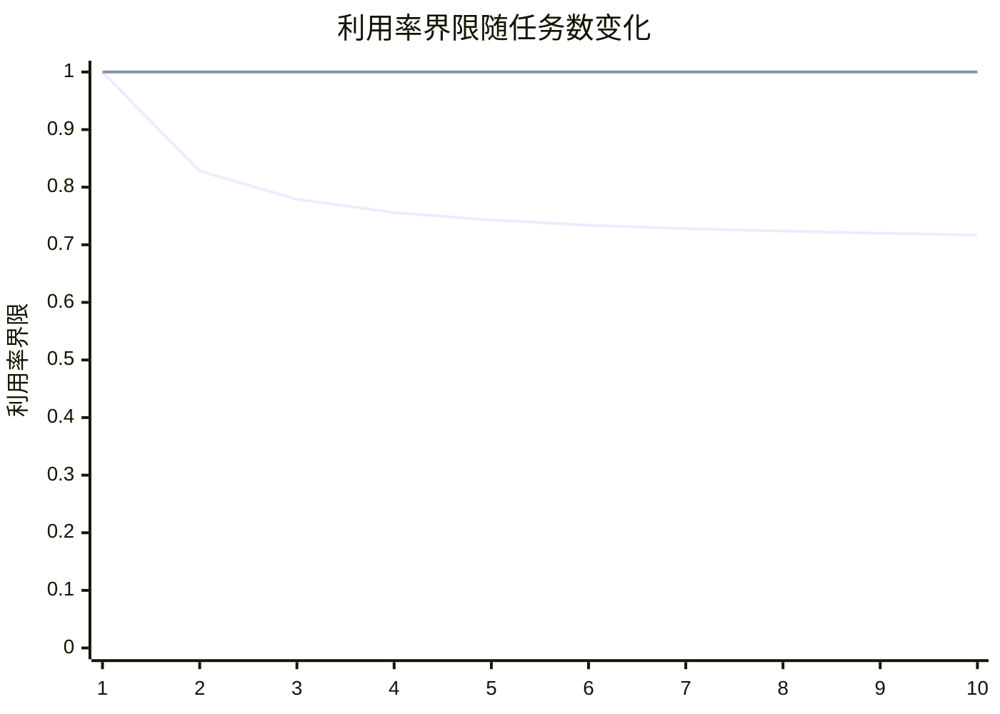
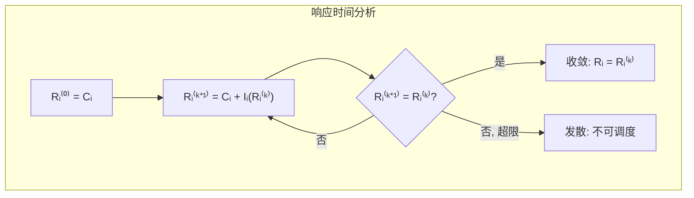
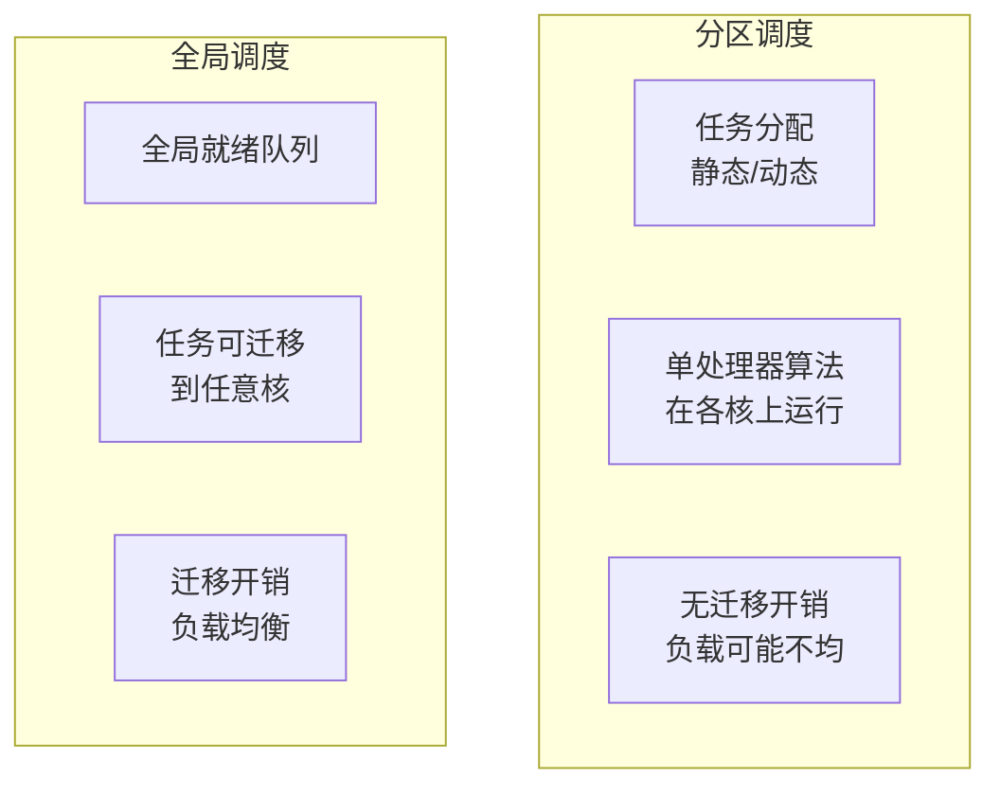
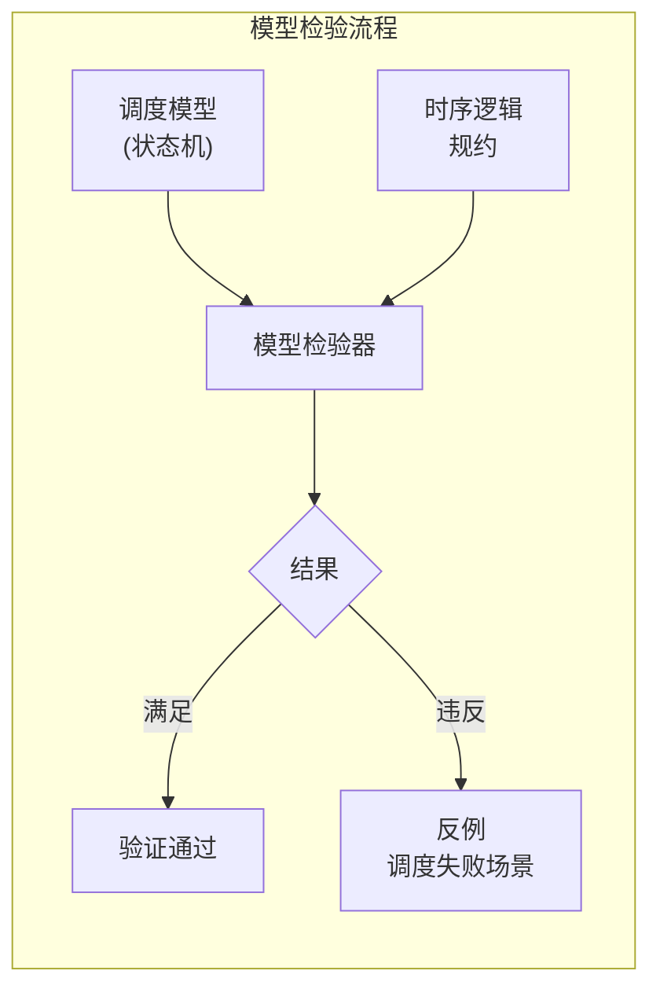
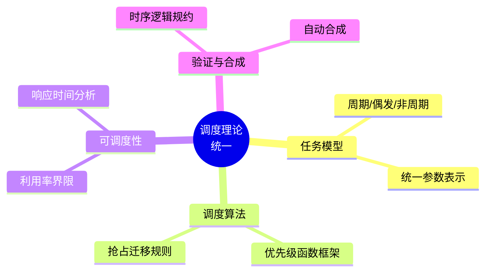

# 1.4 调度理论统一

## 1.4.1 引言

### 1.4.1.1 调度问题的多样性

调度问题广泛存在于：

- **操作系统**：进程/线程调度
- **实时系统**：任务截止时间调度
- **分布式系统**：分布式任务分配
- **网络系统**：包调度、流量整形
- **制造系统**：生产调度

这些调度问题表面差异巨大，但共享深层数学结构。

### 1.4.1.2 统一调度的目标



## 1.4.2 调度问题的形式化模型

### 1.4.2.1 通用调度三元组

**定义 1.4.1（调度三元组）**
调度问题表示为三元组 $\mathcal{S} = (\mathcal{T}, \mathcal{R}, \mathcal{C})$：

- $\mathcal{T}$: 任务集合，每个任务 $\tau_i = (C_i, D_i, T_i, ...)$
- $\mathcal{R}$: 资源集合，每个资源 $r_j = (capacity_j, ...)$
- $\mathcal{C}$: 约束集合（时序、资源、优先级等）

### 1.4.2.2 调度作为函数

**定义 1.4.2（调度函数）**
调度函数将任务映射到时间和资源：
$$S : \mathcal{T} \times \mathbb{T} \to \mathcal{R} \cup \{\bot\}$$

其中：

- $S(\tau_i, t) = r_j$ 表示任务 $\tau_i$ 在时间 $t$ 使用资源 $r_j$
- $S(\tau_i, t) = \bot$ 表示任务 $\tau_i$ 在时间 $t$ 不执行

```mermaid
gantt
    title 调度时间线示例
    dateFormat X
    axisFormat %s

    section 资源r₁
    τ₁ : 0, 2
    τ₃ : 4, 2

    section 资源r₂
    τ₂ : 2, 3
    τ₄ : 5, 2
```



## 1.4.3 任务模型分类

### 1.4.3.1 任务模型对比矩阵

| 特征 | 周期任务 | 偶发任务 | 非周期任务 | 非实时任务 |
|-----|---------|---------|-----------|-----------|
| **到达模式** | 固定周期 | 最小间隔 | 任意 | 任意 |
| **截止时间** | 周期末 | 相对到达 | 绝对/相对 | 软/无 |
| **可抢占** | 通常可 | 通常可 | 可变 | 可变 |
| **约束** | 周期性 | 最小间隔 | 无 | 无 |
| **典型应用** | 控制循环 | 事件响应 | 用户请求 | 后台作业 |

### 1.4.3.2 任务模型的形式化

**定义 1.4.3（周期任务）**
周期任务 $\tau_i = (C_i, T_i, D_i)$，其中：

- $C_i$: 最坏执行时间（WCET）
- $T_i$: 周期
- $D_i$: 相对截止时间（通常 $D_i = T_i$）

到达时间：$a_i^k = k \cdot T_i$（第 $k$ 个实例）
绝对截止时间：$d_i^k = a_i^k + D_i$



**定义 1.4.4（偶发任务）**
偶发任务 $\tau_i = (C_i, T_i^{min}, D_i)$，其中：

- $T_i^{min}$: 最小到达间隔

**定义 1.4.5（非周期任务）**
非周期任务 $J_i = (a_i, C_i, d_i)$，其中：

- $a_i$: 到达时间
- $d_i$: 绝对截止时间

## 1.4.4 调度算法统一框架

### 1.4.4.1 调度算法分类学



### 1.4.4.2 优先级函数统一

**定义 1.4.6（优先级函数）**
调度算法由优先级函数 $P(\tau_i, t)$ 定义：

| 算法 | 优先级函数 $P(\tau_i, t)$ | 类型 |
|-----|------------------------|------|
| **RMS** | $1/T_i$ | 静态 |
| **DMS** | $1/D_i$ | 静态 |
| **EDF** | $d_i - t$ | 动态 |
| **LLF** | $(d_i - t) - C_i^{rem}$ | 动态 |
| **LST** | $t_i^{start} - t$ | 动态 |

**调度规则**：在时刻 $t$，选择 $P(\tau_i, t)$ 最大的就绪任务执行。

### 1.4.4.3 抢占与迁移的统一模型

**定义 1.4.7（抢占规则）**
抢占决策函数：
$$\text{Preempt}(\tau_{running}, \tau_{ready}, t) = P(\tau_{ready}, t) > P(\tau_{running}, t) + \delta$$

其中 $\delta$ 是抢占开销阈值。

**定义 1.4.8（迁移规则）**
任务从资源 $r_i$ 迁移到 $r_j$ 的条件：
$$\text{Migrate}(\tau, r_i, r_j, t) = \text{Load}(r_i, t) - \text{Load}(r_j, t) > \theta$$

## 1.4.5 可调度性分析统一

### 1.4.5.1 利用率界限统一

**定理 1.4.1（统一利用率界限）**
对于 $n$ 个任务，在 $m$ 个相同处理器上：

| 算法 | 利用率界限 $U_{lub}$ | 条件 |
|-----|---------------------|------|
| RMS (单核) | $n(2^{1/n} - 1)$ | $D_i = T_i$ |
| EDF (单核) | $1.0$ | - |
| 全局EDF | $\frac{m+1}{2}$ | 约束 deadline |
| 分区EDF | $m$ | 完美分区 |



### 1.4.5.2 响应时间分析统一

**定义 1.4.9（响应时间）**
任务 $\tau_i$ 的响应时间 $R_i$ 满足：
$$R_i = C_i + I_i(R_i)$$

其中 $I_i(t)$ 是时间区间 $[0, t)$ 内的干扰。

**干扰计算（统一公式）**：
$$I_i(t) = \sum_{\tau_j \in hp(i)} \left\lceil \frac{t}{T_j} \right\rceil \cdot C_j$$

其中 $hp(i)$ 是优先级高于 $\tau_i$ 的任务集合。

### 1.4.5.3 可调度性条件

**定理 1.4.2（统一可调度性条件）**
任务集可调度当且仅当：
$$\forall i. R_i \leq D_i$$

**证明框架**：

1. 计算每个任务的响应时间 $R_i$
2. 检查 $R_i \leq D_i$
3. 若全部满足，则可调度



## 1.4.6 资源约束统一模型

### 1.4.6.1 资源模型分类

**定义 1.4.10（资源模型）**
资源 $r$ 由 $(C, Q, A)$ 定义：

- $C$: 容量（可同时服务的任务数）
- $Q$: 队列策略（FIFO、优先级等）
- $A$: 访问协议（PCP、PIP、MPCP等）

### 1.4.6.2 互斥资源分析

**定义 1.4.11（阻塞时间）**
任务 $\tau_i$ 的阻塞时间 $B_i$：
$$B_i = \max_{r \in \mathcal{R}_i} \left\{ \max_{\tau_j \in lp(i)} \{ \text{cs}_{j,r} \} \right\}$$

其中 $\text{cs}_{j,r}$ 是 $\tau_j$ 在资源 $r$ 上的临界区长度。

**PCP 阻塞时间**：
$$B_i^{PCP} = \max_{r \in \mathcal{R}_i} \left\{ \max_{\tau_j \in lp(i) \land P(r) > P(i)} \{ \text{cs}_{j,r} \} \right\}$$

### 1.4.6.3 资源约束的可调度性

**定理 1.4.3（考虑资源的响应时间）**
$$R_i = C_i + B_i + \sum_{\tau_j \in hp(i)} \left\lceil \frac{R_i}{T_j} \right\rceil \cdot C_j$$

## 1.4.7 多处理器调度统一

### 1.4.7.1 分区 vs 全局



### 1.4.7.2 统一多处理器模型

**定义 1.4.12（多处理器调度）**
$m$ 个处理器上的调度函数：
$$S : \mathcal{T} \times \mathbb{T} \to \{0, 1, ..., m\}$$

其中 $S(\tau_i, t) = k$ 表示任务 $\tau_i$ 在时间 $t$ 在处理器 $k$ 上执行（0 表示不执行）。

**约束**：
$$\forall t. \left| \{ \tau_i : S(\tau_i, t) > 0 \} \right| \leq m$$

## 1.4.8 形式化验证框架

### 1.4.8.1 调度正确性规约

**定义 1.4.13（调度正确性）**
调度 $S$ 满足正确性条件 $\Phi$：
$$S \models \Phi \triangleq \forall \tau_i \in \mathcal{T}. \forall k. f_i^k \leq d_i^k$$

其中 $f_i^k$ 是任务 $\tau_i$ 第 $k$ 个实例的完成时间。

### 1.4.8.2 时序逻辑规约

**LTL 规约示例**：

```
□(ready(τᵢ) → ◇_{≤Dᵢ} completed(τᵢ))
```

"总是：如果任务 τᵢ 就绪，则在 Dᵢ 时间内完成"

**CTL 规约示例**：

```
∀□ ∀◇ completed(τᵢ)
```

"对于所有路径，总是最终完成任务 τᵢ"

### 1.4.8.3 模型检验方法



## 1.4.9 调度算法合成

### 1.4.9.1 从规约到算法

**问题**：给定任务集和约束，合成最优调度算法。

**方法**：

1. 形式化约束为逻辑公式
2. 使用 SMT 求解器或约束求解
3. 提取调度策略

### 1.4.9.2 参数合成

**定义 1.4.14（参数合成）**
给定参数化调度算法 $A_{\vec{p}}$，合成参数值：
$$\vec{p}^* = \arg\min_{\vec{p}} \text{Cost}(A_{\vec{p}}, \mathcal{T})$$

约束：$A_{\vec{p}}$ 满足所有可调度性条件。

## 1.4.10 交叉引用

### 1.4.10.1 内部引用

- **1.4 ↔ 1.1**: 调度理论是多视角统一框架的应用实例
- **1.4 ↔ 1.2**: 调度范畴是形式化调度范畴的具体化
- **1.4 ↔ 1.3**: 调度策略可用依赖类型表达和验证

### 1.4.10.2 外部引用

- **↔ 2.1**: 调度理论到程序实现的映射
- **↔ 2.2**: 调度算法的工程实现
- **↔ 2.3**: 调度规约到计算实现
- **↔ 2.4**: 调度概念的知识图谱

## 1.4.11 总结

调度理论统一提供了：

1. **通用模型**：调度三元组 $(\mathcal{T}, \mathcal{R}, \mathcal{C})$
2. **统一分析**：优先级函数、响应时间分析
3. **形式化验证**：时序逻辑规约与模型检验
4. **算法合成**：从规约自动生成调度策略



---

_最后更新: 2026-04-11_
_版本: 1.0_
