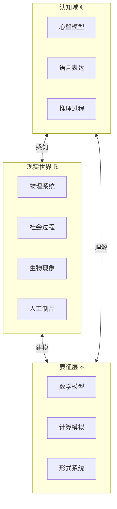
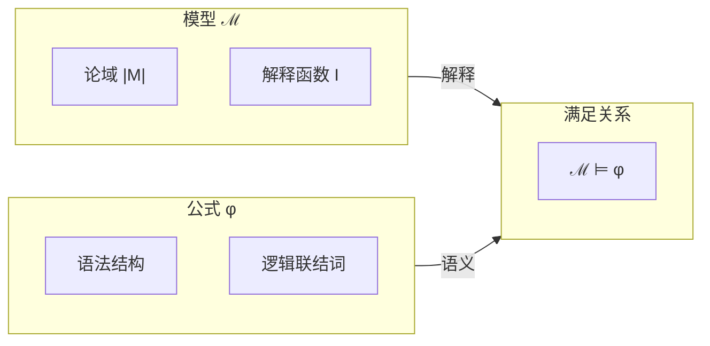
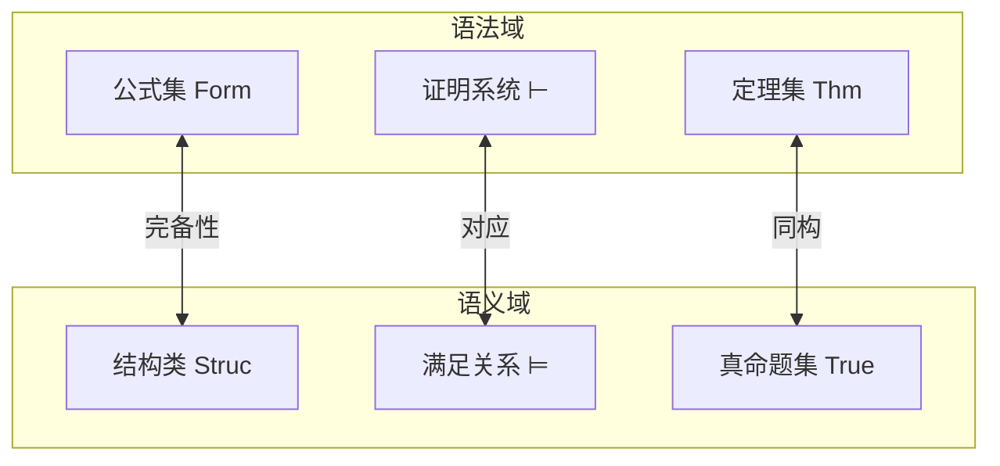
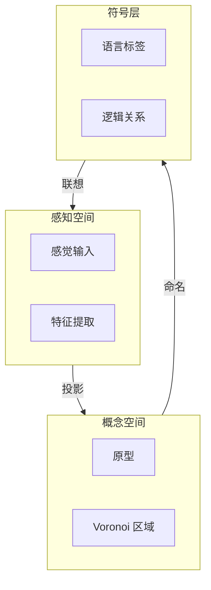
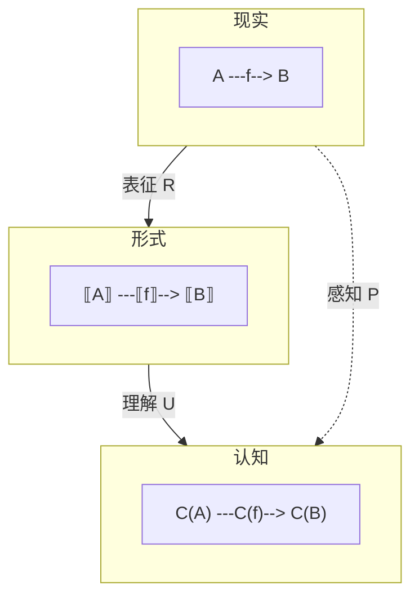
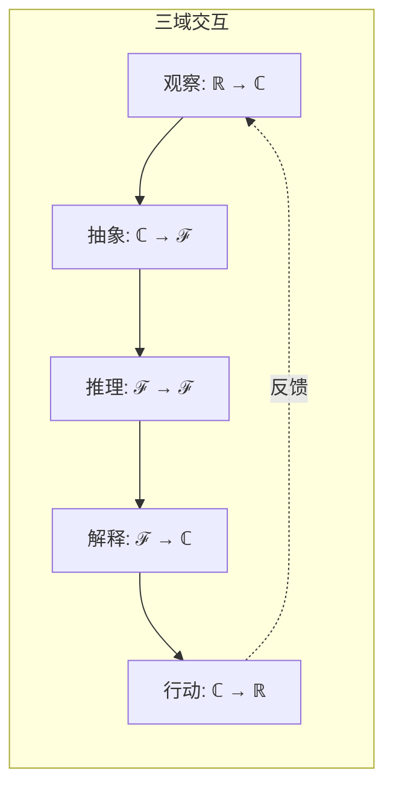
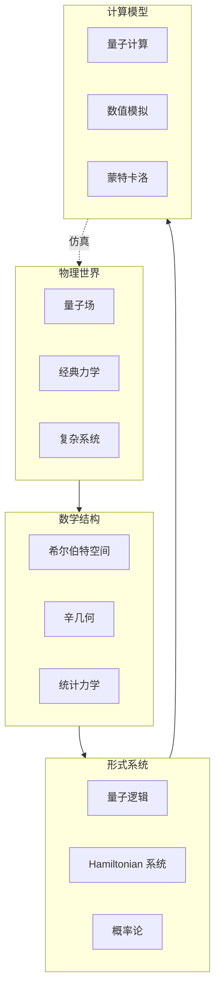

# 02.1 形式-现实-认知映射

## 目录

- [02.1 形式-现实-认知映射](#021-形式-现实-认知映射)
  - [目录](#目录)
  - [1. 三域框架：形式、现实与认知](#1-三域框架形式现实与认知)
    - [1.1 引言：三个世界](#11-引言三个世界)
    - [1.2 三域的基本特征](#12-三域的基本特征)
  - [2. 表征关系：从现实到形式](#2-表征关系从现实到形式)
    - [2.1 科学建模的层次](#21-科学建模的层次)
    - [2.2 表征的类型](#22-表征的类型)
    - [2.3 模型与现实的关系](#23-模型与现实的关系)
  - [3. 模型论：形式与现实的桥梁](#3-模型论形式与现实的桥梁)
    - [3.1 模型论基础](#31-模型论基础)
    - [3.2 满足与同构](#32-满足与同构)
    - [3.3 完备性与可靠性](#33-完备性与可靠性)
  - [4. 认知科学视角](#4-认知科学视角)
    - [4.1 心智模型理论](#41-心智模型理论)
    - [4.2 概念空间理论](#42-概念空间理论)
    - [4.3 数学认知的神经基础](#43-数学认知的神经基础)
  - [5. 跨域映射的形式化](#5-跨域映射的形式化)
    - [5.1 三域对应表](#51-三域对应表)
    - [5.2 映射的函子性](#52-映射的函子性)
    - [5.3 三域交互的动力学](#53-三域交互的动力学)
  - [6. 综合：统一的知识论](#6-综合统一的知识论)
    - [6.1 形式科学的知识论框架](#61-形式科学的知识论框架)
    - [6.2 综合映射网络](#62-综合映射网络)
    - [6.3 形式科学的三重身份](#63-形式科学的三重身份)
  - [参考与延伸](#参考与延伸)
    - [相关章节](#相关章节)
    - [关键文献](#关键文献)

---

## 1. 三域框架：形式、现实与认知

### 1.1 引言：三个世界

形式科学涉及三个基本领域：



> **交叉引用**: 关于形式的数学基础，参见 [../01_形式化方法统一/01.1_统一理论基础.md](../01_形式化方法统一/01.1_统一理论基础.md)

### 1.2 三域的基本特征

| 领域 | 本体 | 存在方式 | 研究对象 | 核心问题 |
|-----|------|---------|---------|---------|
| **现实 (ℝ)** | 物理实体 | 时空存在 | 事物本身 | "是什么?" |
| **形式 (ℱ)** | 抽象结构 | 必然性 | 模式关系 | "如何关联?" |
| **认知 (ℂ)** | 心智状态 | 意向性 | 表征内容 | "如何知道?" |

---

## 2. 表征关系：从现实到形式

### 2.1 科学建模的层次

```
现实系统
    ↓ 抽象化
数学结构 (S, R₁, R₂, ...)
    ↓ 形式化
形式系统 (签名, 公理, 规则)
    ↓ 计算化
计算模型 (算法, 复杂度)
    ↓ 实现
仿真/程序 (代码, 数据)
```

### 2.2 表征的类型

| 表征类型 | 形式工具 | 现实对应 | 认知功能 |
|---------|---------|---------|---------|
| **符号表征** | 形式语言 | 命名/分类 | 概念化 |
| **结构表征** | 关系系统 | 组织/连接 | 理解关系 |
| **动力学表征** | 微分方程 | 变化/过程 | 预测 |
| **随机表征** | 概率空间 | 不确定性 | 决策 |
| **计算表征** | 算法/自动机 | 信息处理 | 模拟 |

### 2.3 模型与现实的关系

**塔斯基语义的核心洞见**：

$$
\mathcal{M} \models \varphi \quad \text{iff} \quad \varphi^\mathcal{M} = \text{true}
$$



---

## 3. 模型论：形式与现实的桥梁

### 3.1 模型论基础

**定义 3.1.1** (结构)
给定签名 $Σ = \langle \mathcal{F}, \mathcal{R}, ar \rangle$，一个 $Σ$-结构 $ℳ$ 包含：

$$
\mathcal{M} = \langle M, \{f^\mathcal{M}\}_{f \in \mathcal{F}}, \{R^\mathcal{M}\}_{R \in \mathcal{R}} \rangle
$$

```lean4
-- 模型论的形式化 (Lean)
-- 签名定义
structure Signature where
  FunctionSymbols : Type
  RelationSymbols : Type
  arityF : FunctionSymbols → Nat
  arityR : RelationSymbols → Nat

-- 结构解释
structure Structure (σ : Signature) where
  Carrier : Type
  interpF (f : σ.FunctionSymbols) :
    (Fin (σ.arityF f) → Carrier) → Carrier
  interpR (r : σ.RelationSymbols) :
    (Fin (σ.arityR r) → Carrier) → Prop
```

### 3.2 满足与同构

| 概念 | 形式定义 | 直观意义 | 认知对应 |
|-----|---------|---------|---------|
| $\mathcal{M} \models \varphi$ | 满足 | 模型使公式为真 | 信念为真 |
| $\mathcal{M} \cong \mathcal{N}$ | 同构 | 结构相同 | 等价理解 |
| $\text{Th}(\mathcal{M})$ | 理论 | 全部真命题 | 完整知识 |
| $\text{Mod}(T)$ | 模型类 | 理论的全部模型 | 可能世界 |

### 3.3 完备性与可靠性

**核心对应**：

$$
\boxed{
\begin{aligned}
\Gamma \vdash \varphi & \quad \text{(语法可证性)} \\
\Updownarrow & \quad \text{(哥德尔完备性)} \\
\Gamma \models \varphi & \quad \text{(语义后承)}
\end{aligned}
}
$$



---

## 4. 认知科学视角

### 4.1 心智模型理论

Johnson-Laird 的心智模型理论：

```
现实情境
    ↓ 感知/抽象
心智模型 (Mental Model)
    ↓ 形式化
形式表征
    ↓ 推理
结论/预测
    ↓ 验证
现实检验
```

### 4.2 概念空间理论

Gärdenfors 的概念空间：

| 维度 | 认知空间 | 数学对应 | 实例 |
|-----|---------|---------|------|
| 感知维度 | 颜色、形状 | 向量空间 | RGB 颜色空间 |
| 概念距离 | 相似性度量 | 度量空间 | 语义距离 |
| 概念区域 | 原型理论 | 凸集 | 鸟类概念区 |
| 概念关系 | 维度关联 | 拓扑结构 | 语义网络 |



### 4.3 数学认知的神经基础

| 数学能力 | 神经基础 | 认知机制 |
|---------|---------|---------|
| 数感 | 顶叶皮层 | 近似数量表征 (ANS) |
| 算术 | 前额叶 + 顶叶 | 工作记忆 + 程序执行 |
| 几何 | 海马体 + 顶叶 | 空间导航机制 |
| 代数 | 前额叶 | 符号操作 + 抽象规则 |
| 逻辑 | 前额叶 + 语言区 | 条件推理 + 语言表达 |

---

## 5. 跨域映射的形式化

### 5.1 三域对应表

| 现实域 ℝ | 形式域 ℱ | 认知域 ℂ |
|---------|---------|---------|
| 对象/实体 | 常量/项 | 概念/名词 |
| 属性/性质 | 谓词 | 形容词 |
| 关系 | 关系符号 | 介词/动词 |
| 事件/过程 | 函数/算子 | 动作表征 |
| 状态 | 模型 | 心智状态 |
| 变化 | 状态转移 | 推理过程 |
| 规律 | 公理/定理 | 信念/知识 |
| 不确定性 | 概率/模态 | 信念度 |

### 5.2 映射的函子性

三域间的映射具有**结构保持性**：



**函子定律**：

$$
\begin{aligned}
\mathcal{R}(id_A) &= id_{\mathcal{R}(A)} & \text{(恒等保持)} \\
\mathcal{R}(g \circ f) &= \mathcal{R}(g) \circ \mathcal{R}(f) & \text{(复合保持)}
\end{aligned}
$$

```lean4
-- 表征作为函子 (伪代码)

structure Representation (ℝ : Type) (ℱ : Type) [Category ℝ] [Category ℱ] where
  F : ℝ → ℱ  -- 对象映射
  map : ∀ {X Y : ℝ}, (X → Y) → (F X → F Y)  -- 态射映射

  -- 函子定律
  id_law : ∀ X, map (id X) = id (F X)
  comp_law : ∀ {X Y Z} (f : X → Y) (g : Y → Z),
    map (g ∘ f) = map g ∘ map f

-- 现实到形式的表征函子
-- ℝ = 物理系统范畴
-- ℱ = 数学结构范畴
-- R : ℝ → ℱ 保持系统组合结构
```

### 5.3 三域交互的动力学



**科学方法的循环**：

1. **观察**：从现实获取数据到认知
2. **抽象**：在认知中形成形式模型
3. **推理**：在形式域进行逻辑推导
4. **解释**：将形式结果映射回认知
5. **验证/行动**：在现实检验预测

---

## 6. 综合：统一的知识论

### 6.1 形式科学的知识论框架

```
知识层次
├── 元层次 (Meta)
│   ├── 元数学: 关于形式系统的理论
│   └── 认识论: 关于知识的理论
├── 对象层次 (Object)
│   ├── 形式系统: 逻辑、类型、范畴
│   ├── 数学理论: 代数、分析、几何
│   └── 计算理论: 算法、复杂度、可计算性
├── 应用层次 (Applied)
│   ├── 物理建模: 自然现象的形式化
│   ├── 工程系统: 人工制品的设计
│   └── 认知模型: 心智的形式理论
└── 实践层次 (Practice)
    ├── 证明辅助: Coq, Lean, Isabelle
    ├── 程序验证: Dafny, F*, LiquidHaskell
    └── 仿真平台: 计算实验环境
```

### 6.2 综合映射网络



### 6.3 形式科学的三重身份

| 视角 | 形式科学的角色 | 核心问题 |
|-----|---------------|---------|
| **本体论** | 研究抽象存在的学科 | 数学对象存在吗？ |
| **认识论** | 获得确定知识的方法 | 如何确知真理？ |
| **方法论** | 精确推理的工具 | 如何正确推理？ |

---

## 参考与延伸

### 相关章节

- [../01_形式化方法统一/01.1_统一理论基础.md](../01_形式化方法统一/01.1_统一理论基础.md) - 形式统一理论
- [02.2_形式-计算-数学映射.md](02.2_形式-计算-数学映射.md) - 计算视角
- [02.4_形式-语言-编程映射.md](02.4_形式-语言-编程映射.md) - 语言视角

### 关键文献

1. Gärdenfors (2000): _Conceptual Spaces: The Geometry of Thought_
2. Johnson-Laird (1983): _Mental Models_
3. Tarski (1936): "Der Wahrheitsbegriff in den formalisierten Sprachen"
4. van Fraassen (1980): _The Scientific Image_

---

_形式、现实与认知的三角关系是人类知识的核心结构。形式科学通过严格的数学工具，建立了从现实抽象到形式、从形式推理到认知理解的完整链条。理解这一映射关系，不仅是掌握形式科学的关键，也是理解人类知识本质的窗口。_
