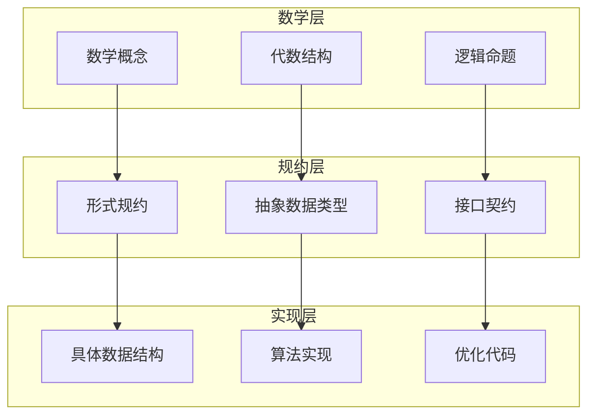
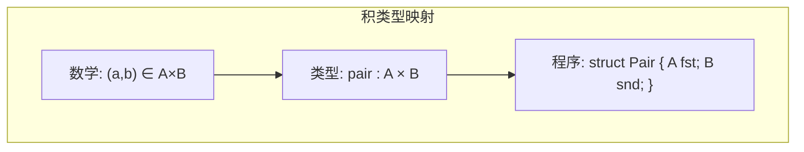
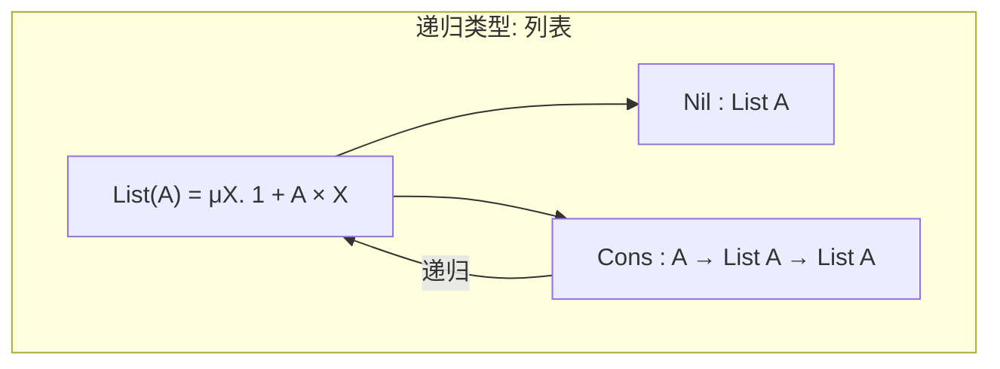
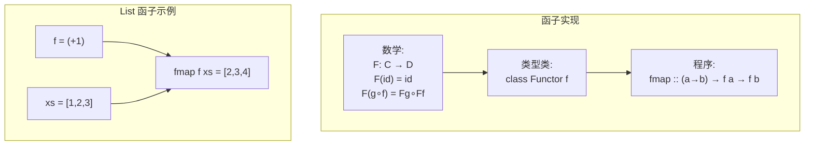
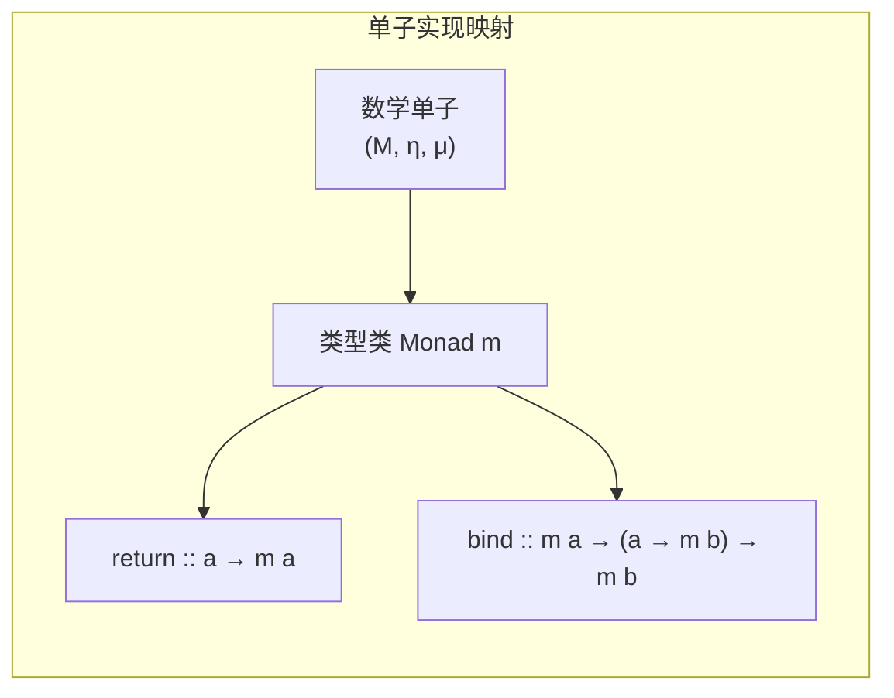
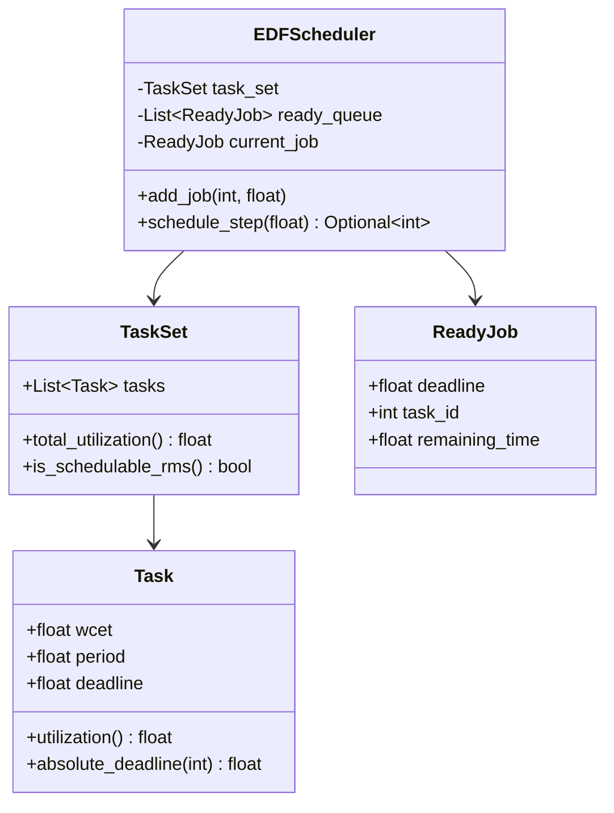
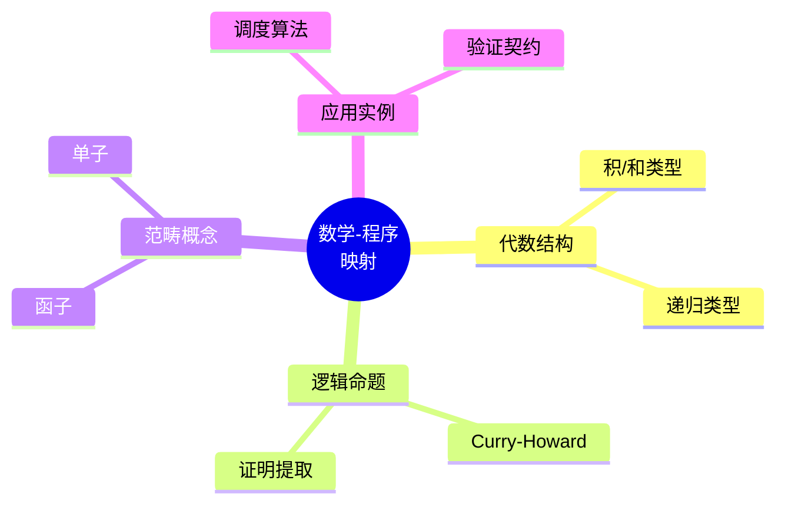

# 2.1 数学-程序映射

## 2.1.1 引言

### 2.1.1.1 映射的必要性

形式化科学的核心挑战之一是将抽象的数学概念转化为可执行的程序实现。这种映射涉及：

- **语义保持**：程序行为符合数学规约
- **效率考量**：实现满足性能要求
- **可验证性**：实现可被形式化验证

### 2.1.1.2 映射的多层次结构



## 2.1.2 代数结构到数据类型

### 2.1.2.1 代数数据类型对应

| 数学结构 | 类型理论 | 编程实现 | 示例 |
|---------|---------|---------|------|
| 积 $A \times B$ | 积类型 | 元组/结构体 | `Pair<A,B>` |
| 和 $A + B$ | 和类型 | 枚举/联合 | `Either<A,B>` |
| 函数 $A \to B$ | 函数类型 | 函数/方法 | `A -> B` |
| 单位 $1$ | 单位类型 | `void`/空元组 | `()` |
| 空 $0$ | 空类型 | 永不为真的类型 | `Never` |

### 2.1.2.2 构造与消去

**积类型的数学-程序映射**：

```
数学: (a, b) : A × B
类型: pair : A × B
程序: (a, b) 或 Pair(a, b)

构造规则:
  Γ ⊢ a : A    Γ ⊢ b : B
  ───────────────────────
  Γ ⊢ (a, b) : A × B

消去规则:
  Γ ⊢ p : A × B
  ───────────────
  Γ ⊢ fst p : A
  Γ ⊢ snd p : B
```



**和类型的数学-程序映射**：

```
数学: inl(a) : A + B 或 inr(b) : A + B
类型: left : A → A + B, right : B → A + B
程序: enum Either { Left(A), Right(B) }

消去 (case 分析):
  case e of
    inl x → f(x)
    inr y → g(y)
```

### 2.1.2.3 递归类型的实现

**数学定义**：
$$\text{List}(A) = \mu X. 1 + A \times X$$

**类型定义**：

```
List A = Nil | Cons A (List A)
```

**程序实现**：

```python
# Python
@dataclass
class List:
    pass

@dataclass
class Nil(List):
    pass

@dataclass
class Cons(List):
    head: Any
    tail: List
```

```rust
// Rust
enum List<A> {
    Nil,
    Cons(A, Box<List<A>>)
}
```



## 2.1.3 逻辑命题到类型

### 2.1.3.1 Curry-Howard 映射实例

| 逻辑命题 | 类型 | 证明/程序 | 含义 |
|---------|-----|----------|------|
| $A \to B$ | $A \to B$ | $\lambda x. e$ | 函数抽象 |
| $A \land B$ | $A \times B$ | $(a, b)$ | 对构造 |
| $A \lor B$ | $A + B$ | $\text{inl}(a)$ / $\text{inr}(b)$ | 注入 |
| $\forall x:A. B$ | $\Pi(x:A). B$ | $\lambda x. e$ | 依赖函数 |
| $\exists x:A. B$ | $\Sigma(x:A). B$ | $(a, b)$ | 依赖对 |

### 2.1.3.2 证明提取

**定理**：对于所有列表，反转两次等于原列表
$$\forall xs : \text{List}(A). \text{reverse}(\text{reverse}(xs)) = xs$$

**证明程序**：

```agda
-- Agda 风格
reverse-involutive : ∀ {A} (xs : List A) →
                     reverse (reverse xs) ≡ xs
reverse-involutive [] = refl
reverse-involutive (x ∷ xs) =
  begin
    reverse (reverse (x ∷ xs))
  ≡⟨ cong reverse (reverse-++-distrib (x ∷ []) xs) ⟩
    reverse (reverse xs ++ (x ∷ []))
  ≡⟨ reverse-++-distrib (reverse xs) (x ∷ []) ⟩
    x ∷ reverse (reverse xs)
  ≡⟨ cong (x ∷_) (reverse-involutive xs) ⟩
    x ∷ xs
  ∎
```

**提取为程序**：

```python
def reverse_involutive_proof(xs):
    """
    证明: reverse(reverse(xs)) == xs
    返回: 等式证明对象（在证明辅助工具中）
    提取后: 该函数确保 reverse(reverse(xs)) 的类型正确性
    """
    if not xs:  # Nil case
        return Refl()  # 空列表的反转是空列表
    else:  # Cons case
        x, rest = xs[0], xs[1:]
        # 使用归纳假设
        induction_hypothesis = reverse_involutive_proof(rest)
        # 构造证明
        return congruence(x, induction_hypothesis)
```

## 2.1.4 范畴结构到程序架构

### 2.1.4.1 函子的实现

**数学定义**：
函子 $F : \mathcal{C} \to \mathcal{D}$ 映射：

- 对象 $A \mapsto F(A)$
- 态射 $f : A \to B \mapsto F(f) : F(A) \to F(B)$

**满足**：

- $F(\text{id}_A) = \text{id}_{F(A)}$
- $F(g \circ f) = F(g) \circ F(f)$

**程序实现（Haskell 风格）**：

```haskell
class Functor f where
    fmap :: (a -> b) -> f a -> f b

-- 定律（需程序员保证）
-- fmap id = id
-- fmap (g . f) = fmap g . fmap f
```



### 2.1.4.2 单子的实现

**数学定义**：
单子 $(M, \eta, \mu)$ 在幺半范畴中：

- $\eta : I \to M$ （return）
- $\mu : M \circ M \to M$ （join）

**程序实现**：

```haskell
class Monad m where
    return :: a -> m a           -- η
    (>>=)  :: m a -> (a -> m b) -> m b  -- bind

    -- join 可用 bind 定义
    join :: m (m a) -> m a
    join mma = mma >>= id
```

**单子定律**：

```
return a >>= f      = f a              -- 左单位
m >>= return        = m                -- 右单位
(m >>= f) >>= g     = m >>= (\x -> f x >>= g)  -- 结合律
```



## 2.1.5 调度理论的程序实现

### 2.1.5.1 任务模型实现

**数学模型**：
$$\tau_i = (C_i, T_i, D_i)$$

**程序实现**：

```python
from dataclasses import dataclass
from typing import List, Optional

@dataclass(frozen=True)
class Task:
    """周期任务模型"""
    wcet: float      # C_i: 最坏执行时间
    period: float    # T_i: 周期
    deadline: float  # D_i: 相对截止时间

    @property
    def utilization(self) -> float:
        """任务利用率 U_i = C_i / T_i"""
        return self.wcet / self.period

    def absolute_deadline(self, job_id: int) -> float:
        """第 job_id 个实例的绝对截止时间"""
        return job_id * self.period + self.deadline

@dataclass
class TaskSet:
    """任务集合"""
    tasks: List[Task]

    @property
    def total_utilization(self) -> float:
        return sum(t.utilization for t in self.tasks)

    def is_schedulable_rms(self) -> bool:
        """RMS 可调度性测试（充分条件）"""
        n = len(self.tasks)
        bound = n * (2 ** (1/n) - 1)
        return self.total_utilization <= bound
```

### 2.1.5.2 调度算法实现

**EDF 算法（最早截止时间优先）**：

```python
from heapq import heappush, heappop
from dataclasses import dataclass, field

@dataclass(order=True)
class ReadyJob:
    """就绪作业（按截止时间排序）"""
    deadline: float
    task_id: int = field(compare=False)
    remaining_time: float = field(compare=False)

class EDFScheduler:
    """EDF 调度器实现"""

    def __init__(self, task_set: TaskSet):
        self.task_set = task_set
        self.ready_queue: List[ReadyJob] = []
        self.current_job: Optional[ReadyJob] = None
        self.time = 0.0

    def add_job(self, task_id: int, arrival_time: float):
        """添加新作业到就绪队列"""
        task = self.task_set.tasks[task_id]
        job = ReadyJob(
            deadline=arrival_time + task.deadline,
            task_id=task_id,
            remaining_time=task.wcet
        )
        heappush(self.ready_queue, job)

    def schedule_step(self, dt: float) -> Optional[int]:
        """执行一个调度步骤，返回执行的任务ID"""
        # 检查抢占
        if self.ready_queue:
            next_job = self.ready_queue[0]
            if (self.current_job is None or
                next_job.deadline < self.current_job.deadline):
                # 抢占
                if self.current_job:
                    heappush(self.ready_queue, self.current_job)
                self.current_job = heappop(self.ready_queue)

        if self.current_job:
            self.current_job.remaining_time -= dt
            if self.current_job.remaining_time <= 0:
                task_id = self.current_job.task_id
                self.current_job = None
                return task_id

        return None
```



## 2.1.6 形式化规约到契约

### 2.1.6.1 Hoare 三元组到函数契约

**数学**：$\{P\} C \{Q\}$

**程序契约**：

```python
from functools import wraps
from typing import Callable, TypeVar

T = TypeVar('T')

def contract(precondition: Callable[[T], bool],
             postcondition: Callable[[T, T], bool]):
    """函数契约装饰器"""
    def decorator(func: Callable[[T], T]) -> Callable[[T], T]:
        @wraps(func)
        def wrapper(x: T) -> T:
            # 检查前置条件 {P}
            assert precondition(x), f"Precondition failed for {x}"

            # 执行函数 C
            result = func(x)

            # 检查后置条件 {Q}
            assert postcondition(x, result), \
                f"Postcondition failed: {x} -> {result}"

            return result
        return wrapper
    return decorator

# 使用示例
@contract(
    precondition=lambda n: n >= 0,      # {n ≥ 0}
    postcondition=lambda n, r: r >= 0 and r*r <= n < (r+1)*(r+1)  # {r = ⌊√n⌋}
)
def integer_sqrt(n: int) -> int:
    """整数平方根"""
    if n < 2:
        return n
    # 牛顿迭代法
    x = n
    while x * x > n:
        x = (x + n // x) // 2
    return x
```

### 2.1.6.2 类型契约

```python
from typing import NewType, Annotated

# 使用类型注解表达契约
PositiveInt = Annotated[int, lambda x: x > 0]
SortedList = Annotated[list, lambda xs: all(xs[i] <= xs[i+1]
                                            for i in range(len(xs)-1))]

def binary_search(arr: SortedList, target: int) -> int:
    """在已排序数组中二分查找"""
    # 前置条件隐含在类型中: arr 已排序
    left, right = 0, len(arr) - 1
    while left <= right:
        mid = (left + right) // 2
        if arr[mid] == target:
            return mid
        elif arr[mid] < target:
            left = mid + 1
        else:
            right = mid - 1
    return -1
```

## 2.1.7 验证与测试的映射

### 2.1.7.1 数学证明到单元测试

| 数学证明 | 测试策略 | 示例 |
|---------|---------|------|
| 归纳证明（基础+步骤） | 边界值+归纳测试 | 空列表、单元素、多元素 |
| 分类证明 | 等价类划分 | 正数、负数、零 |
| 反证法 | 异常测试 | 无效输入处理 |
| 构造性证明 | 基于属性的测试 | QuickCheck风格 |

### 2.1.7.2 基于属性的测试

```python
from hypothesis import given, strategies as st

# 数学命题: reverse(reverse(xs)) = xs
@given(st.lists(st.integers()))
def test_reverse_involutive(xs):
    """测试: 反转两次等于原列表"""
    assert list(reversed(list(reversed(xs)))) == xs

# 数学命题: len(xs ++ ys) = len(xs) + len(ys)
@given(st.lists(st.integers()), st.lists(st.integers()))
def test_concat_length(xs, ys):
    """测试: 连接后长度等于长度之和"""
    assert len(xs + ys) == len(xs) + len(ys)

# 调度理论: 可调度任务集在 EDF 下调度成功
@given(st.lists(
    st.tuples(
        st.floats(min_value=0.1, max_value=10),  # WCET
        st.floats(min_value=1.0, max_value=20),  # Period
        st.floats(min_value=1.0, max_value=20)   # Deadline
    ).filter(lambda x: x[0] <= x[2] <= x[1]),
    min_size=1, max_size=5
))
def test_edf_schedulability(task_params):
    """测试: 低利用率任务集可被 EDF 调度"""
    tasks = [Task(c, t, d) for c, t, d in task_params]
    task_set = TaskSet(tasks)

    # 如果总利用率低于界限，应该可调度
    if task_set.total_utilization <= 1.0:
        scheduler = EDFScheduler(task_set)
        # 模拟一个超周期
        hyperperiod = lcm([t.period for t in tasks])
        # ... 调度验证逻辑
```

## 2.1.8 交叉引用

### 2.1.8.1 内部引用

- **2.1 ↔ 2.2**: 数学-程序映射是理论-工程映射的具体化
- **2.1 ↔ 2.3**: 数学-程序映射使用形式-计算映射的方法
- **2.1 ↔ 2.4**: 数学-程序映射关系可纳入知识图谱

### 2.1.8.2 外部引用

- **↔ 1.1**: 多视角统一框架指导数学-程序映射
- **↔ 1.2**: 范畴论提供数学-程序映射的理论基础
- **↔ 1.3**: 类型论提供数学-程序映射的类型基础
- **↔ 1.4**: 调度理论是数学-程序映射的应用实例

## 2.1.9 总结

数学-程序映射提供：

1. **结构化映射**：代数结构 → 数据类型
2. **逻辑映射**：命题证明 → 类型程序
3. **架构映射**：范畴概念 → 设计模式
4. **应用映射**：调度理论 → 可执行实现
5. **验证映射**：形式规约 → 程序契约



---

_最后更新: 2026-04-11_
_版本: 1.0_
