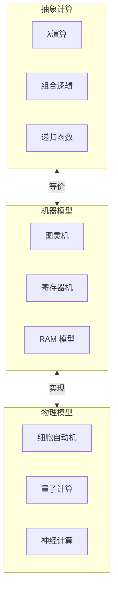
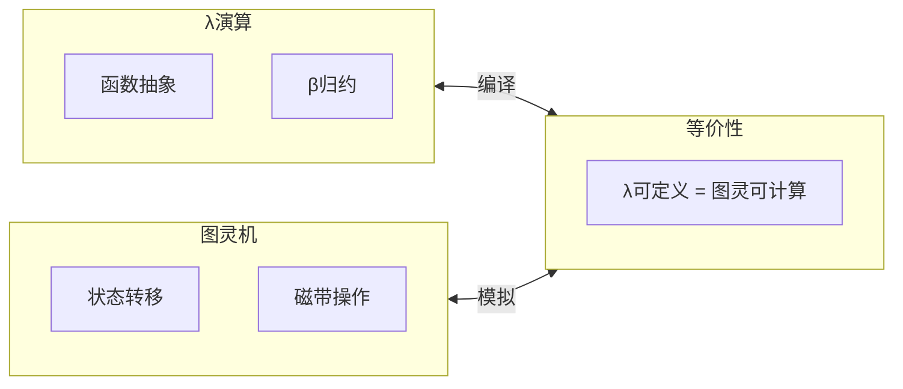
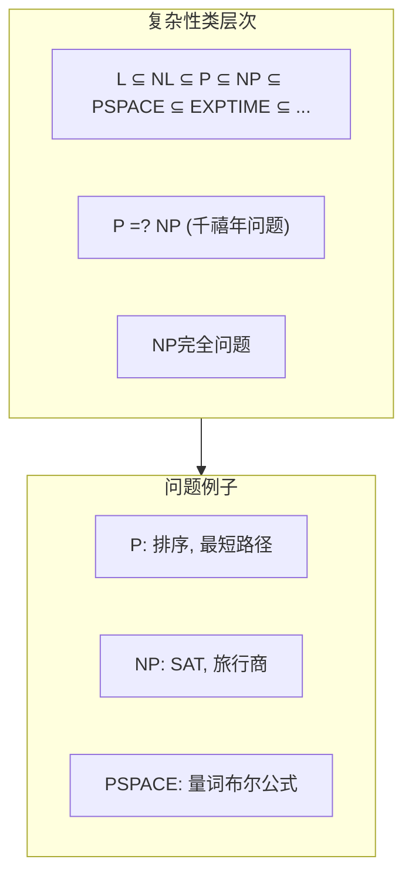
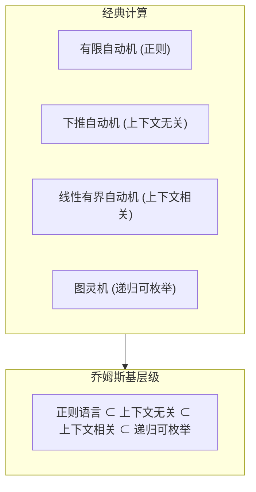

# 02.2 形式-计算-数学映射

---

📌 **内容摘要**

本文档深入探讨形式-计算-数学映射的核心原理和关键方法。内容涵盖多视角映射领域的主要知识点，包括函数式, λ演算, 图灵机, 可计算性, 归约等关键主题。适合有一定基础的学习者系统学习。

**关键词**: 函数式, λ演算, 图灵机, 可计算性, 归约, 复杂性, 多视角映射

📚 **学习目标**

- 掌握形式-计算-数学映射的核心概念和主要方法
- 理解相关理论的应用场景
- 建立该领域的系统性知识框架

🎯 **难度级别**: 中级

⏱️ **预计阅读时间**: 15分钟

**前置知识**: 相关领域的基础概念

---


## 目录

- [02.2 形式-计算-数学映射](#022-形式-计算-数学映射)
  - [目录](#目录)
  - [1. 计算的数学本质](#1-计算的数学本质)
    - [1.1 什么是计算？](#11-什么是计算)
    - [1.2 计算的三种等价定义](#12-计算的三种等价定义)
    - [1.3 计算的形式定义](#13-计算的形式定义)
  - [2. λ演算与组合逻辑](#2-λ演算与组合逻辑)
    - [2.1 λ演算基础](#21-λ演算基础)
    - [2.2 组合子逻辑](#22-组合子逻辑)
    - [2.3 Church 编码](#23-church-编码)
  - [3. 可计算性理论](#3-可计算性理论)
    - [3.1 图灵机](#31-图灵机)
    - [3.2 可计算性层次](#32-可计算性层次)
    - [3.3 归约与完备性](#33-归约与完备性)
  - [4. 计算复杂性](#4-计算复杂性)
    - [4.1 复杂性类谱系](#41-复杂性类谱系)
    - [4.2 问题归约网络](#42-问题归约网络)
    - [4.3 类型论中的复杂性](#43-类型论中的复杂性)
  - [5. 计算模型谱系](#5-计算模型谱系)
    - [5.1 经典计算模型](#51-经典计算模型)
    - [5.2 并行与分布式计算](#52-并行与分布式计算)
    - [5.3 非经典计算](#53-非经典计算)
  - [6. 从数学到程序的转换](#6-从数学到程序的转换)
    - [6.1 数学的算法化](#61-数学的算法化)
    - [6.2 提取数学内容](#62-提取数学内容)
    - [6.3 综合映射表](#63-综合映射表)
  - [参考与延伸](#参考与延伸)
    - [相关章节](#相关章节)
    - [关键文献](#关键文献)
  - [_计算是数学的执行形式。从 λ 演算的纯粹函数到图灵机的物理实现，从多项式时间的可解问题到不可判定的停机问题，计算的数学理论揭示了信息处理的本质边界。理解这些映射，使我们能够在数学抽象与程序实现之间自由穿梭。_](#计算是数学的执行形式从-λ-演算的纯粹函数到图灵机的物理实现从多项式时间的可解问题到不可判定的停机问题计算的数学理论揭示了信息处理的本质边界理解这些映射使我们能够在数学抽象与程序实现之间自由穿梭)
  - [📋 前置知识](#-前置知识)
  - [📚 延伸阅读](#-延伸阅读)

---

## 1. 计算的数学本质

### 1.1 什么是计算？

计算的本质是**符号变换**：

```
计算 = 输入 → 转换规则 → 输出
     = 状态 → 转移函数 → 新状态
     = 问题 → 算法 → 解
```

> **交叉引用**: 关于 Curry-Howard 对应，参见 [../01_形式化方法统一/01.4_证明与程序对应.md](../01_形式化方法统一/01.4_证明与程序对应.md)

### 1.2 计算的三种等价定义

| 定义 | 创始人 | 核心概念 | 特点 |
|-----|--------|---------|------|
| **递归函数** | Gödel, Kleene | 部分递归函数 | 数论基础 |
| **λ演算** | Church | λ抽象与应用 | 函数式编程 |
| **图灵机** | Turing | 状态+磁带 | 物理可实现 |

**丘奇-图灵论题**：

$$
\boxed{
\text{直观可计算的} = \text{递归函数可计算的} = \text{λ可定义的} = \text{图灵可计算的}
}
$$

### 1.3 计算的形式定义



---

## 2. λ演算与组合逻辑

### 2.1 λ演算基础

λ演算是函数式编程的数学基础：

**语法**：

$$
t ::= x \mid \lambda x.t \mid t\,s
$$

**核心概念**：

| 概念 | 符号 | 说明 | 编程对应 |
|-----|------|------|---------|
| 变量 | $x$ | 绑定占位符 | 变量名 |
| 抽象 | $\lambda x.t$ | 函数定义 | `\x -> t` |
| 应用 | $t\,s$ | 函数调用 | `t s` |
| α-转换 | $\lambda x.t =_\alpha \lambda y.t[y/x]$ | 重命名 | 无 |
| β-归约 | $(\lambda x.t)\,s \to_\beta t[s/x]$ | 求值 | 函数调用 |
| η-规约 | $\lambda x.(f\,x) \to_\eta f$ | 扩展性 | 等价优化 |

### 2.2 组合子逻辑

组合子逻辑消除了显式变量绑定：

```haskell
-- 基本组合子
-- S f g x = f x (g x)
-- K x y = x
-- I x = x

s = \f g x -> f x (g x)
k = \x y -> x
i = \x -> x

-- 所有 λ 项都可以用 S, K 表示!
-- I = S K K
-- B = S (K S) K  -- 函数复合
-- C = S (B B S) (K K)  -- 参数交换
```

```lean4
-- Lean 中的组合子定义
namespace Combinators

def S {A B C : Type}
  (f : A → B → C) (g : A → B) (x : A) : C :=
  f x (g x)

def K {A B : Type} (x : A) (y : B) : A := x

def I {A : Type} (x : A) : A := x

-- I = S K K 的证明
theorem I_SKK : @I = @S (@K) (@K) := by
  funext A x
  simp [I, S, K]

end Combinators
```

### 2.3 Church 编码

自然数可以用 λ 项编码：

```haskell
-- Church 数
type Church = forall a. (a -> a) -> a -> a

-- 0 = \f x. x
zero :: Church
zero = \f x -> x

-- 1 = \f x. f x
one :: Church
one = \f x -> f x

-- succ = \n f x. f (n f x)
succ :: Church -> Church
succ n = \f x -> f (n f x)

-- 加法
add :: Church -> Church -> Church
add m n = \f x -> m f (n f x)

-- 乘法
mul :: Church -> Church -> Church
mul m n = \f -> m (n f)

-- 2 + 3 = 5
test = add (succ one) (succ (succ one))
```

```lean4
-- Church 数的形式化

def Church := {T : Type} → (T → T) → T → T

def churchZero : Church := fun _f x => x

def churchSucc (n : Church) : Church :=
  fun f x => f (n f x)

def churchAdd (m n : Church) : Church :=
  fun f x => m f (n f x)

-- 转换为自然数用于验证
def churchToNat (c : Church) : Nat :=
  c Nat.succ 0

-- 验证: 2 + 3 = 5
example :
  churchToNat (churchAdd (churchSucc (churchSucc churchZero))
                         (churchSucc (churchSucc (churchSucc churchZero)))) = 5 :=
  rfl
```

---

## 3. 可计算性理论

### 3.1 图灵机

图灵机是计算的物理可实现模型：

```
图灵机 = (Q, Σ, Γ, δ, q₀, q_accept, q_reject)
  Q: 有限状态集
  Σ: 输入字母表
  Γ: 磁带字母表 (Σ ⊂ Γ)
  δ: Q × Γ → Q × Γ × {L, R}  (转移函数)
  q₀: 初始状态
  q_accept, q_reject: 接受/拒绝状态
```

**与 λ 演算的等价性**：



### 3.2 可计算性层次

| 类别 | 定义 | 例子 | 判定问题 |
|-----|------|------|---------|
| **递归 (R)** | 图灵机总停机 | 质数判定 | 可判定 |
| **递归可枚举 (RE)** | 图灵机接受 | 停机问题 | 半可判定 |
| **非 RE** | 甚至无法枚举 | 停机补集 | 不可判定 |

**核心结果**：

```lean4
-- 停机问题的不可判定性 (伪代码说明)

-- 假设存在停机判定器
-- H : (Program × Input) → Bool
-- H(p, i) = true  如果 p 在 i 上停机
-- H(p, i) = false 如果 p 在 i 上不停机

-- 构造对角线程序
def diagonal (p : Program) : Bool :=
  if H(p, p) then loopForever else return true

-- 矛盾: diagonal(diagonal) ?
-- 如果 H(diagonal, diagonal) = true, 则 diagonal 不停机
-- 如果 H(diagonal, diagonal) = false, 则 diagonal 停机
-- 矛盾! 故 H 不存在
```

### 3.3 归约与完备性

**定义 3.3.1** (多对一归约)
$A \leq_m B$ 当且仅当存在可计算函数 $f$ 使得：

$$
x \in A \iff f(x) \in B
$$

**归约链**：

```
停机问题 ≤m 程序验证 ≤m 类型检查(含递归类型)
   ↓
Post 对应问题 ≤m 词问题 ≤m 同胚判定
```

---

## 4. 计算复杂性

### 4.1 复杂性类谱系



| 复杂性类 | 资源限制 | 典型问题 | 实际意义 |
|---------|---------|---------|---------|
| **L** | 对数空间 | 可达性 | 流算法 |
| **P** | 多项式时间 | 排序、最短路径 | 高效可解 |
| **NP** | 多项式时间验证 | SAT、3-COL | 可能难解 |
| **PSPACE** | 多项式空间 | QBF、博弈 | 记忆受限 |
| **EXPTIME** | 指数时间 | 棋类游戏 | 实际难解 |

### 4.2 问题归约网络

```
Cook-Levin 定理: SAT 是 NP-完全的

SAT ≤p 3-SAT ≤p CLIQUE ≤p VERTEX-COVER ≤p HAMILTONIAN ≤p TSP
  ↓
3-COLOR ≤p ...
```

```lean4
-- NP 完全性的形式化概念

-- 验证器定义
def Verifier (Q : Type) (A : Type) : Type :=
  Q → A → Bool  -- 问题实例 × 候选解 → 是否有效

-- NP 的定义: 存在多项式时间验证器
def InNP {Q A : Type} (problem : Q → Prop)
  (verify : Verifier Q A) : Prop :=
  ∀ q, problem q ↔ ∃ a, verify q a = true
  -- 解存在当且仅当存在证书被验证器接受
  -- ∧ 验证器运行多项式时间 (省略)
```

### 4.3 类型论中的复杂性

| 类型系统 | 表达力 | 复杂性 | 对应逻辑 |
|---------|-------|-------|---------|
| 简单类型 | 原始递归 | P | 命题逻辑 |
| System F | 高阶函数 | 2EXPTIME | 二阶逻辑 |
| 依赖类型 | 全函数 | 不可判定 | 高阶逻辑 |
| 线性类型 | 资源敏感 | P | 线性逻辑 |

---

## 5. 计算模型谱系

### 5.1 经典计算模型



| 自动机 | 文法 | 语言类 | 闭包性质 | 判定问题 |
|-------|------|-------|---------|---------|
| DFA/NFA | 正则 | 正则语言 | 并/交/补/连接/星 | 全部可判定 |
| PDA | 上下文无关 | CFL | 并/连接/星 | 成员可判定 |
| LBA | 上下文有关 | CSL | 并/交/连接 | 成员可判定 |
| TM | 无限制 | RE | 并/连接/星 | 成员半可判定 |

### 5.2 并行与分布式计算

| 模型 | 特征 | 复杂性 | 应用 |
|-----|------|-------|------|
| **PRAM** | 共享内存并行 | NC 类 | 理论分析 |
| **电路** | 布尔门网络 | P/poly | 硬件设计 |
| **消息传递** | 分布式系统 | 一致性理论 | 分布式算法 |
| **进程代数** | 交互系统 | 互模拟 | 协议验证 |

```haskell
-- PRAM 模型: 并行随机存取机
-- 并行前缀和 (PRAM 算法)
parPrefixSum :: [Int] -> [Int]
parPrefixSum xs =
  if length xs == 1 then xs
  else
    let evens = parPrefixSum [xs !! i | i <- [0,2..]]
        odds  = parPrefixSum [xs !! i | i <- [1,3..]]
    in merge evens odds  -- 并行合并
  where
    merge (e:es) (o:os) = e : (e+o) : merge es os
    merge es [] = es
    merge [] os = os
```

### 5.3 非经典计算

| 模型 | 计算原理 | 能力 | 实现状态 |
|-----|---------|------|---------|
| **概率计算** | 随机选择 | BPP ⊆ PSPACE | 实用 |
| **量子计算** | 叠加+纠缠 | BQP ⊆ PSPACE | 发展中 |
| **生物计算** | DNA 反应 | 图灵完备 | 实验阶段 |
| **神经计算** | 并行激活 | 近似计算 | 实用 |

```lean4
-- 概率计算的单子表示

structure Prob (A : Type) where
  run : List (A × Rational)  -- 值 × 概率

deriving Repr

instance : Monad Prob where
  pure a := ⟨[(a, 1)]⟩
  bind pa f :=
    ⟨pa.run.bind fun (a, p) =>
      (f a).run.map fun (b, q) => (b, p * q)⟩

-- 概率选择
def choose (p : Rational) (a b : A) : Prob A :=
  ⟨[(a, p), (b, 1 - p)]⟩

-- 蒙特卡洛模拟
```

---

## 6. 从数学到程序的转换

### 6.1 数学的算法化

```
数学定义 → 算法设计 → 程序实现 → 正确性证明
```

| 数学概念 | 算法技术 | 程序实现 | 验证方法 |
|---------|---------|---------|---------|
| 不动点 | 迭代逼近 | while循环 | 不变式 |
| 归纳定义 | 递归函数 | 递归调用 | 结构归纳 |
| 最优解 | 贪心/DP | 高效实现 | 最优性证明 |
| 等价类 | 并查集 | 路径压缩 | 不变式 |
| 拓扑序 | DFS/Kahn | 显式排序 | 顺序验证 |

### 6.2 提取数学内容

```lean4
-- 从数学定义到可计算函数

-- 数学: 最大公约数
def gcd_spec (a b : Nat) : Nat :=
  Nat.gcd a b  -- 库函数

-- 算法: 欧几里得算法
def gcd_algo : Nat → Nat → Nat
  | 0, b => b
  | a, 0 => a
  | a, b =>
      if a ≤ b then gcd_algo a (b - a)
      else gcd_algo (a - b) b
termination_by a b => a + b

-- 正确性证明
theorem gcd_algo_correct (a b : Nat) :
  gcd_algo a b = gcd_spec a b := by
  -- 通过数学归纳法证明
  sorry

-- 提取为高效实现
-- 可以进一步优化为模运算版本
```

### 6.3 综合映射表

| 数学领域 | 计算概念 | 实现语言 | 应用实例 |
|---------|---------|---------|---------|
| 代数 | 抽象数据类型 | Haskell | 群、环、域库 |
| 分析 | 数值计算 | Fortran/C++ | 科学计算 |
| 拓扑 | 计算几何 | C++ | CAD/CAM |
| 逻辑 | 自动推理 | Prolog/Lean | 定理证明 |
| 组合 | 算法设计 | Python | 优化求解 |
| 概率 | 统计计算 | R/Python | 机器学习 |
| 范畴 | 函数式编程 | Haskell/Scala | 领域建模 |

---

## 参考与延伸

### 相关章节

- [../01_形式化方法统一/01.1_统一理论基础.md](../01_形式化方法统一/01.1_统一理论基础.md) - λ演算的理论基础
- [../01_形式化方法统一/01.4_证明与程序对应.md](../01_形式化方法统一/01.4_证明与程序对应.md) - 计算与证明
- [02.3_形式-信息-系统映射.md](02.3_形式-信息-系统映射.md) - 系统视角

### 关键文献

1. Barendregt (1984): _The Lambda Calculus: Its Syntax and Semantics_
2. Sipser (2012): _Introduction to the Theory of Computation_
3. Papadimitriou (1994): _Computational Complexity_
4. Arora & Barak (2009): _Computational Complexity: A Modern Approach_

---

_计算是数学的执行形式。从 λ 演算的纯粹函数到图灵机的物理实现，从多项式时间的可解问题到不可判定的停机问题，计算的数学理论揭示了信息处理的本质边界。理解这些映射，使我们能够在数学抽象与程序实现之间自由穿梭。_
---

## 📋 前置知识

- [2.1 数学-程序映射](../02_多视角映射/02.1_数学-程序映射.md)

---

## 📚 延伸阅读

- [1. 单子与函子](../../03_编程范式/04_函数式编程/04.2_单子与函子.md)
- [04.3 单子与函子](../../03_编程范式/04_函数式编程/04.3_单子与函子.md)
- [04.2 高阶函数](../../03_编程范式/04_函数式编程/04.2_高阶函数.md)
- [04.3 计算复杂性理论](../../05_形式化理论/04_计算理论/04.3_计算复杂性.md)
- [02.3 依赖类型](../../02_形式语言/02_类型论/02.3_依赖类型.md)
