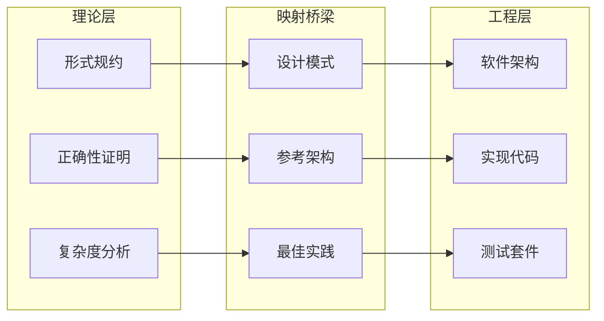
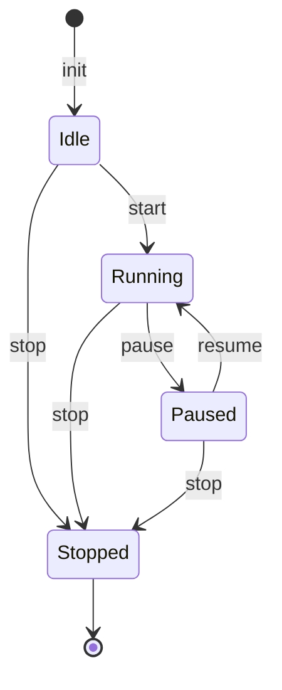
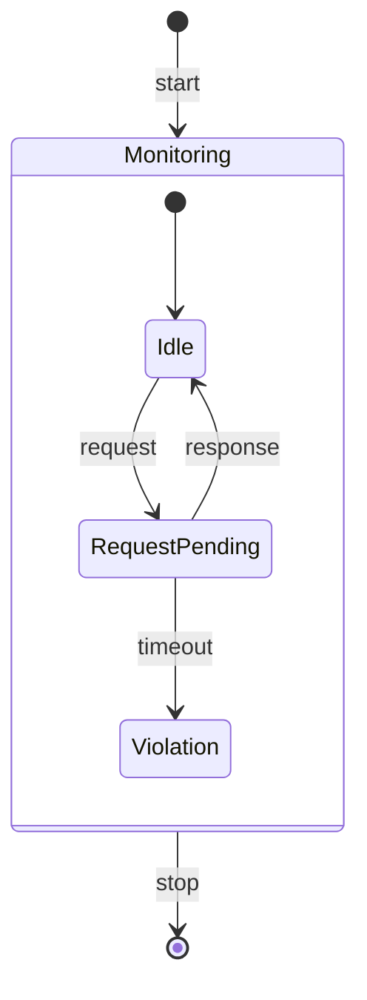
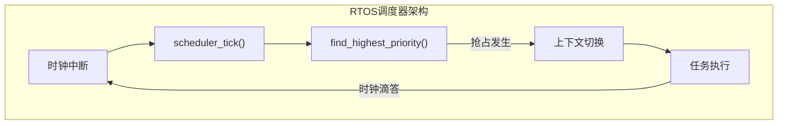
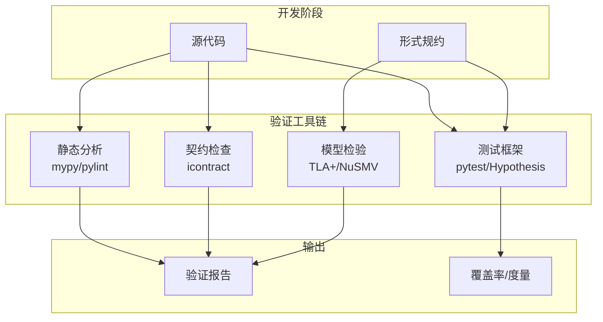
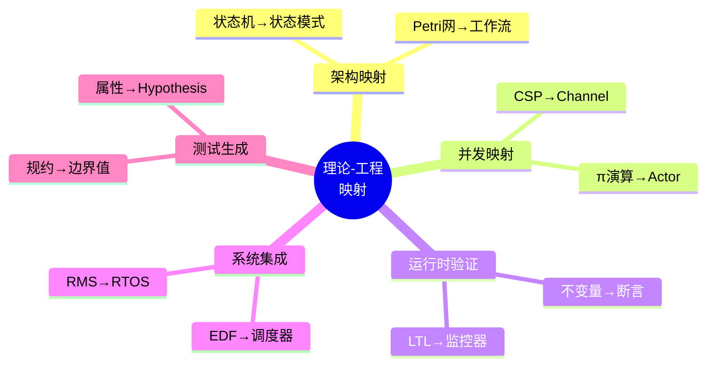

# 2.2 理论-工程映射

---

📌 **内容摘要**

本文档深入探讨理论-工程映射的核心原理和关键方法。内容涵盖多视角映射领域的主要知识点，包括创建型, 结构型, 设计模式等关键主题。适合有一定基础的学习者系统学习。

**关键词**: 创建型, 多视角映射, 结构型, 设计模式

📚 **学习目标**

- 掌握-工程映射的核心概念和主要方法
- 理解相关理论的应用场景
- 建立该领域的系统性知识框架

🎯 **难度级别**: 中级

⏱️ **预计阅读时间**: 15分钟

**前置知识**: 相关领域的基础概念

---


## 2.2.1 引言

### 2.2.1.1 理论与工程的鸿沟

形式化理论与工程实践之间存在显著差距：

- **抽象层次**：理论关注数学抽象，工程关注具体实现
- **完备性要求**：理论追求精确，工程接受近似和启发式
- **验证标准**：理论需要证明，工程依赖测试
- **资源约束**：理论忽略计算资源，工程必须考虑效率

### 2.2.1.2 映射的目标



## 2.2.2 形式化规约到软件架构

### 2.2.2.1 架构风格映射

| 形式化模型 | 架构风格 | 关键特征 | 工程实现 |
|-----------|---------|---------|---------|
| 有限状态机 | 状态驱动架构 | 事件-响应 | 状态模式、工作流引擎 |
| 进程代数 | 并发架构 | 消息传递 | Actor模型、CSP库 |
| 时序逻辑 | 反应式架构 | 事件流 | RxJava、响应式编程 |
| Petri网 | 工作流架构 | 令牌流 | BPMN引擎、工作流系统 |
| 代数规约 | 面向对象 | 抽象数据类型 | 类层次、接口设计 |

### 2.2.2.2 状态机到状态模式

**形式化规约**：

```
状态机 M = (S, Σ, δ, s₀, F)
  S = {Idle, Running, Paused, Stopped}
  Σ = {start, pause, resume, stop}
  δ: S × Σ → S
```

**工程实现（状态模式）**：

```python
from abc import ABC, abstractmethod
from enum import Enum, auto
from typing import Optional

class State(ABC):
    """抽象状态类 - 对应形式化状态S的元素"""

    @abstractmethod
    def start(self, context: 'TaskManager') -> 'State':
        pass

    @abstractmethod
    def pause(self, context: 'TaskManager') -> 'State':
        pass

    @abstractmethod
    def resume(self, context: 'TaskManager') -> 'State':
        pass

    @abstractmethod
    def stop(self, context: 'TaskManager') -> 'State':
        pass

class Idle(State):
    """空闲状态 - 对应形式化状态 s₀"""

    def start(self, context: 'TaskManager') -> 'State':
        context.execute_task()
        return Running()

    def pause(self, context: 'TaskManager') -> 'State':
        return self  # 无操作

    def resume(self, context: 'TaskManager') -> 'State':
        return self  # 无操作

    def stop(self, context: 'TaskManager') -> 'State':
        return Stopped()

class Running(State):
    """运行状态"""

    def start(self, context: 'TaskManager') -> 'State':
        return self  # 已在运行

    def pause(self, context: 'TaskManager') -> 'State':
        context.suspend_task()
        return Paused()

    def resume(self, context: 'TaskManager') -> 'State':
        return self  # 已是运行

    def stop(self, context: 'TaskManager') -> 'State':
        context.terminate_task()
        return Stopped()

class Paused(State):
    """暂停状态"""

    def start(self, context: 'TaskManager') -> 'State':
        return self  # 需先resume

    def pause(self, context: 'TaskManager') -> 'State':
        return self  # 已是暂停

    def resume(self, context: 'TaskManager') -> 'State':
        context.continue_task()
        return Running()

    def stop(self, context: 'TaskManager') -> 'State':
        context.terminate_task()
        return Stopped()

class Stopped(State):
    """停止状态 - 对应形式化终态F的元素"""

    def start(self, context: 'TaskManager') -> 'State':
        raise ValueError("已停止，无法重新开始")

    def pause(self, context: 'TaskManager') -> 'State':
        return self

    def resume(self, context: 'TaskManager') -> 'State':
        return self

    def stop(self, context: 'TaskManager') -> 'State':
        return self

class TaskManager:
    """上下文类 - 对应形式化状态机M"""

    def __init__(self):
        self._state: State = Idle()  # 初始状态 s₀

    def start(self):
        self._state = self._state.start(self)

    def pause(self):
        self._state = self._state.pause(self)

    def resume(self):
        self._state = self._state.resume(self)

    def stop(self):
        self._state = self._state.stop(self)

    # 业务操作
    def execute_task(self): pass
    def suspend_task(self): pass
    def continue_task(self): pass
    def terminate_task(self): pass
```



## 2.2.3 进程代数到消息传递系统

### 2.2.3.1 CSP到Go Channel

**形式化规约（CSP）**：

```
Sender = send!x → Sender
Receiver = recv?y → process(y) → Receiver
System = Sender || Receiver
```

**工程实现（Go）**：

```go
package main

import (
    "fmt"
    "time"
)

// Sender 进程 - 对应形式化 Sender
type Sender struct {
    out chan<- int
}

func (s *Sender) Run() {
    x := 0
    for {
        s.out <- x  // send!x
        x++
        time.Sleep(100 * time.Millisecond)
    }
}

// Receiver 进程 - 对应形式化 Receiver
type Receiver struct {
    in <-chan int
}

func (r *Receiver) Run() {
    for {
        y := <-r.in  // recv?y
        process(y)   // process(y)
    }
}

func process(y int) {
    fmt.Printf("Processed: %d\n", y)
}

// System = Sender || Receiver
type System struct {
    sender   *Sender
    receiver *Receiver
    channel  chan int
}

func NewSystem() *System {
    ch := make(chan int, 10)  // 缓冲通道
    return &System{
        sender:   &Sender{out: ch},
        receiver: &Receiver{in: ch},
        channel:  ch,
    }
}

func (s *System) Start() {
    go s.sender.Run()
    go s.receiver.Run()
}
```

### 2.2.3.2 π演算到Actor模型

**形式化规约（π演算）**：

```
Server(c) = c(x).c'<f(x)>.Server(c)
Client(c, v) = c'<v>.c'(r).P(r)
System = (νc)(Server(c) | Client(c, v))
```

**工程实现（Akka风格）**：

```scala
import akka.actor.{Actor, ActorRef, ActorSystem, Props}

// 对应形式化进程 Server(c)
class Server extends Actor {
  def f(x: Int): Int = x * 2  // 服务功能

  def receive = {
    case (client: ActorRef, x: Int) =>
      // c(x).c'<f(x)>
      val result = f(x)
      client ! result  // 发送响应
  }
}

// 对应形式化进程 Client(c, v)
class Client(server: ActorRef, v: Int) extends Actor {
  override def preStart(): Unit = {
    // c'<v>
    server ! (self, v)
  }

  def receive = {
    case r: Int =>
      // c'(r).P(r)
      println(s"Client received: $r")
      context.stop(self)
  }
}

// System = (νc)(Server(c) | Client(c, v))
object System extends App {
  val system = ActorSystem("PiCalculusSystem")

  // (νc) - 创建私有通道（Actor引用）
  val server = system.actorOf(Props[Server], "server")

  // 创建客户端
  system.actorOf(Props(new Client(server, 21)))
}
```

## 2.2.4 时序逻辑到监控运行时验证

### 2.2.4.1 LTL到运行时监控

**形式化规约**：

```
□(request → ◇ response)
```

"总是：请求之后最终有响应"

**工程实现（监控器）**：

```python
from enum import Enum, auto
from typing import Optional, Set
from dataclasses import dataclass
import time

class EventType(Enum):
    REQUEST = auto()
    RESPONSE = auto()
    TIMEOUT = auto()

@dataclass
class Event:
    type: EventType
    timestamp: float
    id: str

class LTLMonitor:
    """LTL □(request → ◇ response) 运行时监控器"""

    def __init__(self, timeout: float = 5.0):
        self.timeout = timeout
        self.pending_requests: Set[str] = set()
        self.violations: list = []

    def on_event(self, event: Event):
        """处理事件，更新监控状态"""
        if event.type == EventType.REQUEST:
            self.pending_requests.add(event.id)

        elif event.type == EventType.RESPONSE:
            if event.id in self.pending_requests:
                self.pending_requests.remove(event.id)
            else:
                # 无匹配的请求
                self.violations.append(("Orphan response", event))

        elif event.type == EventType.TIMEOUT:
            # 检查超时请求
            current_time = time.time()
            expired = [req_id for req_id in self.pending_requests
                      if self._is_expired(req_id, current_time)]
            for req_id in expired:
                self.pending_requests.remove(req_id)
                self.violations.append(("Response timeout", req_id))

    def _is_expired(self, req_id: str, current_time: float) -> bool:
        # 简化实现：实际应记录请求时间
        return False

    def is_satisfied(self) -> bool:
        """检查当前状态是否满足规约"""
        return len(self.pending_requests) == 0 and len(self.violations) == 0

    def get_status(self) -> dict:
        return {
            "pending_requests": len(self.pending_requests),
            "violations": len(self.violations),
            "satisfied": self.is_satisfied()
        }
```



## 2.2.5 调度理论到实时操作系统

### 2.2.5.1 固定优先级调度实现

**形式化理论（RMS）**：

```
优先级 P(τᵢ) = 1/Tᵢ
可调度性: Σ(Cᵢ/Tᵢ) ≤ n(2^(1/n) - 1)
```

**工程实现（RTOS风格）**：

```c
// task.h - 任务控制块定义
#ifndef TASK_H
#define TASK_H

#include <stdint.h>
#include <stdbool.h>

typedef enum {
    TASK_READY,
    TASK_RUNNING,
    TASK_BLOCKED,
    TASK_SUSPENDED
} TaskState;

typedef struct {
    uint32_t id;
    uint32_t period;          // T_i
    uint32_t wcet;           // C_i
    uint32_t deadline;       // D_i
    uint32_t priority;       // 静态优先级 (RMS: 越小越高)
    uint32_t next_release;   // 下次释放时间
    uint32_t remaining_time; // 剩余执行时间
    TaskState state;
    void (*task_func)(void); // 任务函数
} TaskControlBlock;

// 调度器接口
void scheduler_init(void);
void task_create(uint32_t period, uint32_t wcet,
                 void (*func)(void), uint32_t id);
void scheduler_tick(void);  // 时钟中断处理
void scheduler_run(void);   // 调度主循环

#endif
```

```c
// scheduler.c - RMS调度器实现
#include "task.h"
#include <string.h>

#define MAX_TASKS 32

static TaskControlBlock tasks[MAX_TASKS];
static uint32_t task_count = 0;
static TaskControlBlock* current_task = NULL;
static uint32_t system_tick = 0;

// RMS优先级计算: 周期越小，优先级越高
static uint32_t calculate_priority(uint32_t period) {
    // 简单实现：优先级 = 最大周期 / 当前周期
    // 实际系统中使用更精细的优先级分配
    return 1000 / period;
}

void scheduler_init(void) {
    memset(tasks, 0, sizeof(tasks));
    task_count = 0;
    current_task = NULL;
    system_tick = 0;
}

void task_create(uint32_t period, uint32_t wcet,
                 void (*func)(void), uint32_t id) {
    if (task_count >= MAX_TASKS) return;

    TaskControlBlock* tcb = &tasks[task_count++];
    tcb->id = id;
    tcb->period = period;
    tcb->wcet = wcet;
    tcb->deadline = period;  // 默认 deadline = period
    tcb->priority = calculate_priority(period);
    tcb->next_release = 0;
    tcb->remaining_time = wcet;
    tcb->state = TASK_READY;
    tcb->task_func = func;
}

// 查找最高优先级就绪任务
static TaskControlBlock* find_highest_priority_task(void) {
    TaskControlBlock* highest = NULL;
    uint32_t highest_priority = 0xFFFFFFFF;

    for (uint32_t i = 0; i < task_count; i++) {
        if (tasks[i].state == TASK_READY &&
            tasks[i].priority < highest_priority) {
            highest = &tasks[i];
            highest_priority = tasks[i].priority;
        }
    }
    return highest;
}

// 时钟中断处理 - 触发调度
void scheduler_tick(void) {
    system_tick++;

    // 检查任务释放
    for (uint32_t i = 0; i < task_count; i++) {
        if (system_tick >= tasks[i].next_release) {
            tasks[i].state = TASK_READY;
            tasks[i].remaining_time = tasks[i].wcet;
            tasks[i].next_release += tasks[i].period;

            // 检查截止时间错过
            if (system_tick > tasks[i].next_release - tasks[i].period +
                tasks[i].deadline) {
                // Deadline miss! 记录或处理
            }
        }
    }

    // 抢占检查
    TaskControlBlock* next = find_highest_priority_task();
    if (next && next != current_task &&
        (!current_task || next->priority < current_task->priority)) {
        // 发生抢占
        if (current_task) {
            current_task->state = TASK_READY;
        }
        current_task = next;
        current_task->state = TASK_RUNNING;
    }
}

void scheduler_run(void) {
    while (1) {
        if (current_task && current_task->state == TASK_RUNNING) {
            current_task->task_func();
            current_task->remaining_time--;

            if (current_task->remaining_time == 0) {
                current_task->state = TASK_SUSPENDED;
                current_task = NULL;
            }
        }
        // 等待下一个时钟滴答
    }
}
```



## 2.2.6 形式化规约到测试策略

### 2.2.6.1 规约驱动测试生成

**形式化规约**：

```
pre: x > 0 ∧ y > 0
post: result = gcd(x, y) ∧ result | x ∧ result | y
```

**测试生成策略**：

```python
import unittest
from hypothesis import given, strategies as st
from math import gcd

class GCDSpecificationTest(unittest.TestCase):
    """基于形式化规约的测试"""

    # 边界值测试 - 对应前置条件边界
    def test_boundary_values(self):
        """测试边界值: x > 0 ∧ y > 0"""
        test_cases = [
            (1, 1),    # 最小值
            (1, 100),  # 一边最小
            (100, 1),  # 另一边最小
            (2**31-1, 2**31-1),  # 大值
        ]
        for x, y in test_cases:
            with self.subTest(x=x, y=y):
                result = self.gcd_impl(x, y)
                # 验证后置条件
                self.assertEqual(result, gcd(x, y))
                self.assertEqual(x % result, 0)
                self.assertEqual(y % result, 0)

    # 等价类测试 - 基于输入域划分
    @given(st.integers(min_value=1, max_value=1000),
           st.integers(min_value=1, max_value=1000))
    def test_property_based(self, x, y):
        """属性测试: ∀x>0, y>0. post(x,y)"""
        result = self.gcd_impl(x, y)

        # 后置条件验证
        self.assertTrue(self._divides(result, x))
        self.assertTrue(self._divides(result, y))
        self.assertTrue(all(
            not (self._divides(d, x) and self._divides(d, y))
            or self._divides(d, result)
            for d in range(result + 1, min(x, y) + 1)
        ))

    def _divides(self, a: int, b: int) -> bool:
        return b % a == 0

    def gcd_impl(self, x: int, y: int) -> int:
        """GCD实现 - 欧几里得算法"""
        while y:
            x, y = y, x % y
        return x
```

## 2.2.7 验证工具链集成

### 2.2.7.1 CI/CD 中的形式化验证

```yaml
# .github/workflows/formal-verification.yml
name: Formal Verification Pipeline

on: [push, pull_request]

jobs:
  verify:
    runs-on: ubuntu-latest
    steps:
      - uses: actions/checkout@v3

      # 1. 静态分析
      - name: Static Analysis
        run: |
          pip install mypy pylint
          mypy --strict src/
          pylint src/

      # 2. 契约检查
      - name: Contract Checking
        run: |
          pip install deal icontract
          python -m pytest tests/contracts/ -v

      # 3. 模型检验（如果适用）
      - name: Model Checking
        run: |
          # 使用 TLC 检查 TLA+ 规约
          # 使用 NuSMV 检查状态机
          echo "Running model checkers..."

      # 4. 基于属性的测试
      - name: Property-based Testing
        run: |
          pip install hypothesis
          python -m pytest tests/properties/ --hypothesis-seed=0

      # 5. 覆盖率报告
      - name: Coverage
        run: |
          pip install pytest-cov
          pytest --cov=src --cov-report=xml
```

### 2.2.7.2 验证工具链架构



## 2.2.8 交叉引用

### 2.2.8.1 内部引用

- **2.2 ↔ 2.1**: 理论-工程映射使用数学-程序映射的技术
- **2.2 ↔ 2.3**: 理论-工程映射是形式-计算映射的工程视角
- **2.2 ↔ 2.4**: 理论-工程映射关系可纳入知识图谱

### 2.2.8.2 外部引用

- **↔ 1.1**: 多视角统一框架指导理论-工程映射
- **↔ 1.2**: 范畴论提供理论-工程映射的结构基础
- **↔ 1.3**: 类型论提供理论-工程映射的类型保证
- **↔ 1.4**: 调度理论是理论-工程映射的核心应用

## 2.2.9 总结

理论-工程映射提供了：

1. **架构映射**：形式模型到软件架构
2. **并发映射**：进程代数到消息系统
3. **运行时映射**：时序逻辑到监控验证
4. **系统映射**：调度理论到实时系统
5. **测试映射**：形式规约到测试策略



---

_最后更新: 2026-04-11_
_版本: 1.0_
---

## 📚 延伸阅读

- [04.1 范畴基本概念](../../02_形式语言/04_范畴论/04.1_范畴基本概念.md)
- [4.1 范畴基础 (Category Theory Foundations)](../../02_形式语言/04_范畴论/04.1_范畴基础.md)
- [03.3 工作流引擎](../../04_软件工程/03_工作流系统/03.3_工作流引擎.md)
- [02.4 类型论与逻辑](../../02_形式语言/02_类型论/02.4_类型论与逻辑.md)
- [2.4 类型论进阶 (Advanced Type Theory)](../../02_形式语言/02_类型论/02.4_类型论进阶.md)
