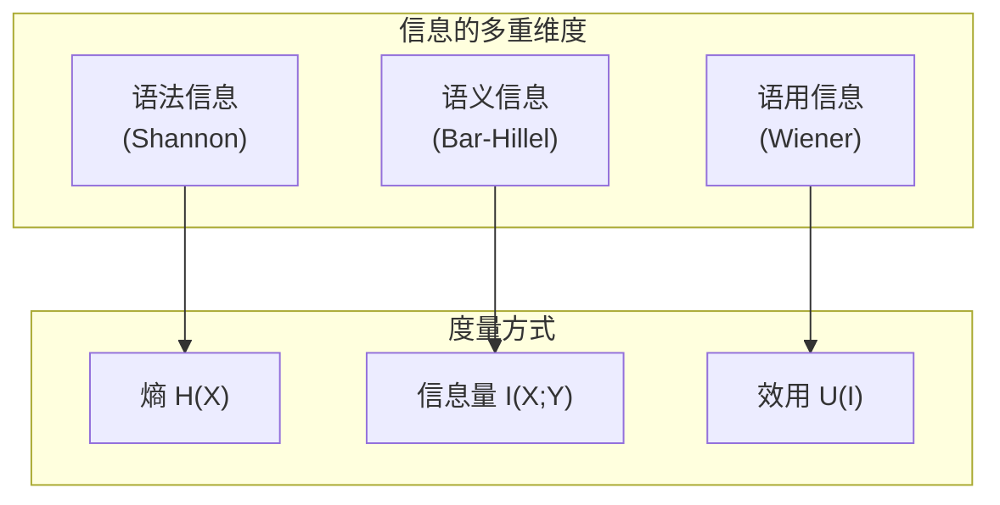
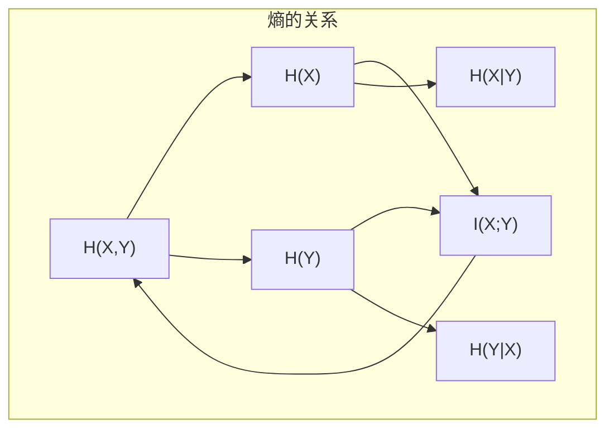
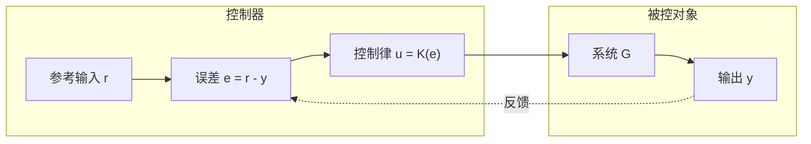
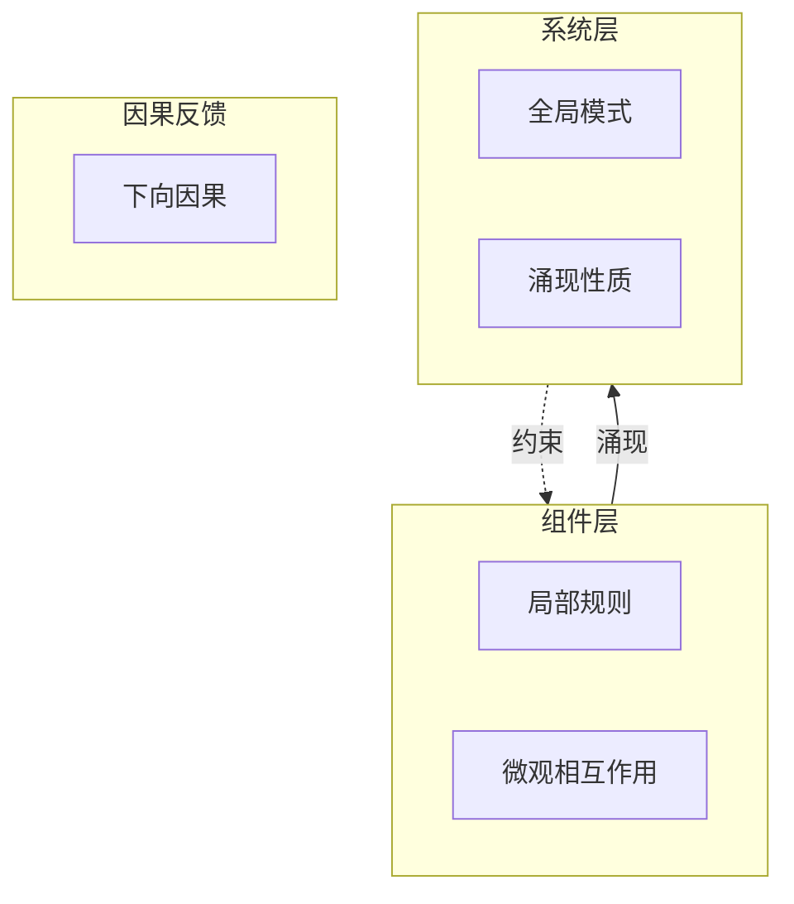
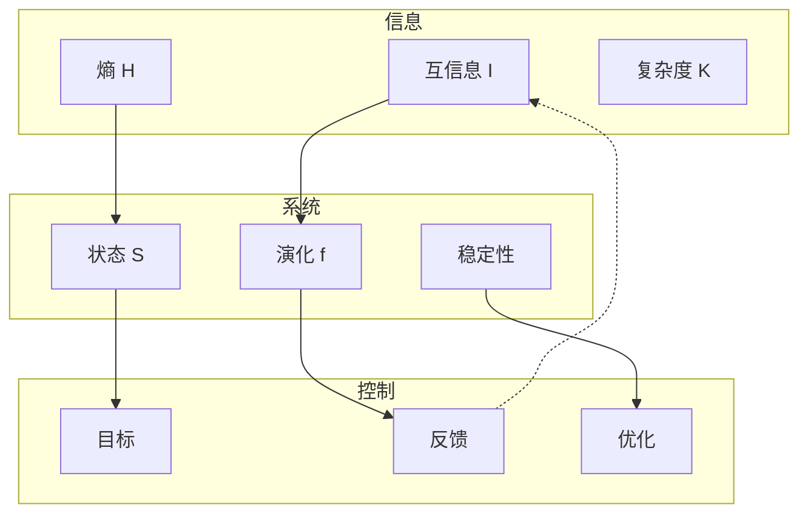

# 02.3 形式-信息-系统映射

---

📌 **内容摘要**

本文档深入探讨形式-信息-系统映射的核心原理和关键方法。内容涵盖多视角映射领域的主要知识点，包括信息论, 函子, 互信息, 范畴论, 范畴等关键主题。适合有一定基础的学习者系统学习。

**关键词**: 信息论, 函子, 互信息, 范畴论, 范畴, 控制论, 反馈, 熵

📚 **学习目标**
- 掌握形式-信息-系统映射的核心概念和主要方法
- 理解相关理论的应用场景
- 建立该领域的系统性知识框架

🎯 **难度级别**: 中级

⏱️ **预计阅读时间**: 15分钟

**前置知识**: 相关领域的基础概念

---


## 目录

- [02.3 形式-信息-系统映射](#023-形式-信息-系统映射)
  - [目录](#目录)
  - [1. 信息的形式化理论](#1-信息的形式化理论)
    - [1.1 信息的数学定义](#11-信息的数学定义)
    - [1.2 信息的多重含义](#12-信息的多重含义)
    - [1.3 算法信息论 (Kolmogorov 复杂度)](#13-算法信息论-kolmogorov-复杂度)
  - [2. 熵与复杂度](#2-熵与复杂度)
    - [2.1 熵的多重解释](#21-熵的多重解释)
    - [2.2 互信息与依赖](#22-互信息与依赖)
    - [2.3 计算复杂度与信息](#23-计算复杂度与信息)
  - [3. 系统理论的形式基础](#3-系统理论的形式基础)
    - [3.1 系统作为动态过程](#31-系统作为动态过程)
    - [3.2 系统范畴](#32-系统范畴)
    - [3.3 开放系统与接口](#33-开放系统与接口)
  - [4. 控制论与反馈](#4-控制论与反馈)
    - [4.1 反馈控制的形式化](#41-反馈控制的形式化)
    - [4.2 控制作为伴随](#42-控制作为伴随)
    - [4.3 控制系统的稳定性](#43-控制系统的稳定性)
  - [5. 涌现与自组织](#5-涌现与自组织)
    - [5.1 涌现的形式定义](#51-涌现的形式定义)
    - [5.2 自组织的数学模型](#52-自组织的数学模型)
    - [5.3 复杂网络](#53-复杂网络)
  - [6. 综合：信息与系统的统一视角](#6-综合信息与系统的统一视角)
    - [6.1 三域综合映射](#61-三域综合映射)
    - [6.2 综合对应表](#62-综合对应表)
    - [6.3 从信息到智能](#63-从信息到智能)
  - [参考与延伸](#参考与延伸)
    - [相关章节](#相关章节)
    - [关键文献](#关键文献)

---

## 1. 信息的形式化理论

### 1.1 信息的数学定义

信息论由香农 (Shannon, 1948) 建立，提供了信息的量化度量：

**定义 1.1.1** (信息量)
对于概率为 $p$ 的事件，其信息量为：

$$
I(p) = -\log_2 p \quad \text{(比特)}
$$

**定义 1.1.2** (香农熵)
随机变量 $X$ 的熵为：

$$
H(X) = -\sum_{x} p(x) \log_2 p(x) = \mathbb{E}[I(p(X))]
$$

> **交叉引用**: 关于系统的范畴模型，参见 [../01_形式化方法统一/01.3_工程与数学对应.md](../01_形式化方法统一/01.3_工程与数学对应.md)

### 1.2 信息的多重含义



| 信息类型 | 核心问题 | 数学工具 | 应用领域 |
|---------|---------|---------|---------|
| **语法信息** | 符号的不确定性 | 概率论、熵 | 数据压缩、信道编码 |
| **语义信息** | 内容的真值 | 逻辑语义 | 知识表示 |
| **语用信息** | 对行动的价值 | 决策论 | AI、经济学 |

### 1.3 算法信息论 (Kolmogorov 复杂度)

**定义 1.3.1** (Kolmogorov 复杂度)
字符串 $x$ 的复杂度是最短描述的长度：

$$
K(x) = \min\{|p| : U(p) = x\}
$$

其中 $U$ 是通用图灵机。

```haskell
-- Kolmogorov 复杂度的直观理解
-- "abababababab" 的低复杂度描述:
description1 = "ab" 重复 6 次  -- 短描述

-- "a8f2k9m3p7q" 的高复杂度描述:
description2 = "a8f2k9m3p7q"  -- 必须逐字符描述

-- 不可压缩串: K(x) ≈ |x|
-- 可压缩串: K(x) << |x|
```

```lean4
-- 算法信息论的形式化概念

-- 描述语言
def Description := String

-- 通用机 (概念性)
axiom U : Description → Option String

-- Kolmogorov 复杂度 (不可计算但可定义)
noncomputable def K (x : String) : Nat :=
  sInf { n | ∃ p, p.length = n ∧ U p = some x }

-- 基本性质
theorem K_upper_bound (x : String) : K x ≤ x.length + c := by
  -- 存在常数 c 使得任意串可用自身 + c 描述
  sorry

theorem K_incompressibility :
  ∀ n, ∃ x, x.length = n ∧ K x ≥ n := by
  -- 不可压缩串的存在性 (计数论证)
  sorry
```

---

## 2. 熵与复杂度

### 2.1 熵的多重解释

| 领域 | 熵的含义 | 公式 | 解释 |
|-----|---------|------|------|
| **热力学** | 无序度 | $S = k_B \ln \Omega$ | 微观状态数 |
| **统计力学** | 不确定性 | $H = -\sum p_i \ln p_i$ | 概率分布的展宽 |
| **信息论** | 信息量 | $H(X) = \mathbb{E}[-\log p(X)]$ | 平均惊奇度 |
| **量子** | 纠缠度量 | $S(\rho) = -\text{tr}(\rho \ln \rho)$ | 冯·诺依曼熵 |

### 2.2 互信息与依赖

**定义 2.2.1** (互信息)
两个随机变量的信息共享：

$$
I(X; Y) = H(X) - H(X|Y) = H(Y) - H(Y|X)
$$



**公式链**：

$$
H(X, Y) = H(X) + H(Y) - I(X; Y) = H(X|Y) + H(Y) = H(X) + H(Y|X)
$$

### 2.3 计算复杂度与信息

| 概念 | 信息论视角 | 计算视角 | 关系 |
|-----|-----------|---------|------|
| **熵** | 不确定性 | 描述长度 | $H(X) \approx \mathbb{E}[K(X)]$ |
| **信道容量** | 最大传输率 | 可区分状态 | $C = \max_{p(x)} I(X;Y)$ |
| **压缩极限** | 熵率 | Kolmogorov 复杂度 | 无损压缩 $\geq H$ |
| **随机性** | 不可预测性 | 不可计算 | Martin-Löf 随机 |

---

## 3. 系统理论的形式基础

### 3.1 系统作为动态过程

**定义 3.1.1** (动态系统)
一个动态系统由状态空间 $S$ 和演化规则组成：

- **离散时间**: $s_{t+1} = f(s_t)$
- **连续时间**: $\frac{ds}{dt} = f(s)$


### 3.2 系统范畴

```lean4
-- 系统的范畴论模型

structure DynamicalSystem (S : Type) where
  state : S
  evolution : S → S  -- 离散时间演化

-- 系统态射 (保持动力学)
structure SystemMorphism {S T : Type}
  (DS : DynamicalSystem S) (DT : DynamicalSystem T) where
  map : S → T
  preserve : ∀ s, map (DS.evolution s) = DT.evolution (map s)

-- 系统复合 (级联)
def composeSystems {S T U : Type}
  (f : S → T) (g : T → U) :
  DynamicalSystem S → DynamicalSystem U := fun ds =>
  { state := g (f ds.state)
    evolution := fun u => g (f (ds.evolution (inv (g ∘ f) u)))
  }
  -- 需要适当的可逆性假设
```

### 3.3 开放系统与接口

| 系统类型 | 特征 | 数学模型 | 例子 |
|---------|------|---------|------|
| **封闭系统** | 无外部交互 | 自治 ODE | 保守力学 |
| **开放系统** | 输入/输出 | 控制论 | 热机、生物 |
| **网络系统** | 组件互联 | 图动力学 | 神经网络 |
| **自适应系统** | 参数变化 | 参数化系统 | 学习系统 |

```haskell
-- 开放系统的单子表示
-- 输入 → 状态转移 → 输出

newtype System s i o = System {
  runSystem :: s -> i -> (o, s)
}

instance Category (System s) where
  id = System $ \s _ -> ((), s)
  System f . System g = System $ \s i ->
    let (o1, s1) = g s i
        (o2, s2) = f s1 o1
    in (o2, s2)

-- 反馈连接
feedback :: System s (i, o) o -> System s i o
feedback (System f) = System $ \s i ->
  let loop s' =
        let (o, s'') = f s' (i, o)  -- 递归
        in (o, s'')
  in loop s
```

---

## 4. 控制论与反馈

### 4.1 反馈控制的形式化



**基本控制方程**：

$$
\begin{aligned}
e(t) &= r(t) - y(t) & \text{(误差)} \\
u(t) &= K_p e(t) + K_i \int e(\tau) d\tau + K_d \frac{de}{dt} & \text{(PID)} \\
y(t) &= G(u(t)) & \text{(系统响应)}
\end{aligned}
$$

### 4.2 控制作为伴随

控制与观测形成**伴随对**：

| 操作 | 方向 | 数学 | 控制论 |
|-----|------|------|--------|
| 观测 | $S \to O$ | 遗忘函子 | 测量 |
| 控制 | $O \to S$ | 自由函子 | 驱动 |
| 最优控制 | 最小化 | 变分法 | 性能指标 |
| 滤波 | 估计 | 条件期望 | 卡尔曼滤波 |

### 4.3 控制系统的稳定性

```lean4
-- Lyapunov 稳定性分析

structure ControlSystem (S : Type) [NormedAddCommGroup S] where
  state : S
  dynamics : S → S → S  -- 状态 × 控制 → 新状态
  equilibrium : S  -- 平衡点

-- Lyapunov 函数
def LyapunovFunction {S} (sys : ControlSystem S)
  (V : S → ℝ) : Prop :=
  V sys.equilibrium = 0 ∧
  ∀ s ≠ sys.equilibrium, V s > 0 ∧
  ∀ s u, V (sys.dynamics s u) ≤ V s  -- 非增

-- 稳定性定理
theorem lyapunov_stability {S} (sys : ControlSystem S)
  (V : S → ℝ) (h : LyapunovFunction sys V) :
  Stable sys.equilibrium := by
  -- 若存在 Lyapunov 函数，则系统稳定
  sorry
```

---

## 5. 涌现与自组织

### 5.1 涌现的形式定义

**定义 5.1.1** (弱涌现)
性质 $P$ 是弱涌现的，如果：

- $P$ 在系统层面可观测
- $P$ 不能从组件属性通过简单聚合推导

**定义 5.1.2** (强涌现)
性质 $P$ 是强涌现的，如果：

- $P$ 是弱涌现的
- $P$ 对组件有因果下向作用



### 5.2 自组织的数学模型

| 现象 | 数学模型 | 特征 | 例子 |
|-----|---------|------|------|
| **相变** | 朗道理论 | 序参量 | 铁磁相变 |
| **模式形成** | 反应-扩散 | Turing 不稳定 | 斑图 |
| **同步** | 耦合振子 | Kuramoto 模型 | 萤火虫 |
| **临界现象** | 幂律分布 | 无标度 | 地震、网络 |

```haskell
-- 元胞自动机: 自组织的简单模型
type Cell = Bool
type Grid = [[Cell]]

-- Conway 生命游戏规则
lifeRule :: Cell -> Int -> Cell  -- 当前状态, 邻居数 -> 新状态
lifeRule alive neighbors
  | alive && neighbors `elem` [2,3] = True   -- 存活
  | not alive && neighbors == 3     = True   -- 出生
  | otherwise                       = False  -- 死亡

-- 模拟步骤
step :: Grid -> Grid
step grid = [[lifeRule (grid !! i !! j) (countNeighbors i j)
             | j <- [0..width-1]]
            | i <- [0..height-1]]
  where
    countNeighbors i j = length [() | di <- [-1..1], dj <- [-1..1],
                                  let ni = i+di, nj = j+dj,
                                  (di,dj) /= (0,0),
                                  inBounds ni nj,
                                  grid !! ni !! nj]
```

### 5.3 复杂网络

```lean4
-- 复杂网络的随机图模型

structure Graph (V : Type) where
  vertices : Finset V
  edges : V → V → Prop
  symmetric : ∀ u v, edges u v → edges v u

-- Erdős–Rényi 随机图
structure RandomGraph (V : Type) (p : ℝ) where
  graph : Graph V
  prob : ∀ u v, u ≠ v →
    if graph.edges u v then p else 1-p

-- 小世界网络 (Watts-Strogatz)
structure SmallWorldNetwork (n : Nat) (k : Nat) (β : ℝ) where
  -- n: 节点数, k: 最近邻数, β: 重连概率
  regularRing : Graph (Fin n)  -- 规则环
  randomEdges : List (Fin n × Fin n)  -- 随机长连接

-- 网络性质
def clusteringCoefficient {V} (g : Graph V) : ℝ :=
  -- 局部聚类系数的平均
  sorry

def averagePathLength {V} (g : Graph V) : ℝ :=
  -- 最短路径的平均
  sorry
```

---

## 6. 综合：信息与系统的统一视角

### 6.1 三域综合映射



### 6.2 综合对应表

| 信息概念 | 系统概念 | 控制概念 | 统一解释 |
|---------|---------|---------|---------|
| **熵 $H$** | 状态不确定性 | 干扰大小 | 系统无知度 |
| **信道容量 $C$** | 信息传输 | 控制带宽 | 行动能力 |
| **互信息 $I$** | 组件依赖 | 反馈增益 | 协调能力 |
| **Kolmogorov 复杂度** | 系统描述长度 | 控制器复杂度 | 内在复杂性 |
| **临界性** | 相变点 | 边缘控制 | 最优适应性 |

### 6.3 从信息到智能

```
信息处理层次
├── 语法层 (Shannon)
│   ├── 数据压缩
│   ├── 信道编码
│   └── 加密
├── 语义层 (逻辑)
│   ├── 知识表示
│   ├── 推理
│   └── 学习
├── 语用层 (控制)
│   ├── 决策
│   ├── 规划
│   └── 行动
└── 涌现层 (认知)
    ├── 自我意识
    ├── 意图性
    └── 创造力
```

---

## 参考与延伸

### 相关章节

- [../01_形式化方法统一/01.3_工程与数学对应.md](../01_形式化方法统一/01.3_工程与数学对应.md) - 系统工程的范畴模型
- [02.2_形式-计算-数学映射.md](02.2_形式-计算-数学映射.md) - 计算理论
- [02.1_形式-现实-认知映射.md](02.1_形式-现实-认知映射.md) - 认知视角

### 关键文献

1. Shannon (1948): "A Mathematical Theory of Communication"
2. Cover & Thomas (2006): _Elements of Information Theory_
3. Li & Vitányi (2019): _An Introduction to Kolmogorov Complexity_
4. Ashby (1956): _An Introduction to Cybernetics_
5. Holland (1995): _Hidden Order: How Adaptation Builds Complexity_

---

_信息是系统的血液，系统是信息的载体。从香农的熵到 Kolmogorov 复杂度，从控制论的反馈到复杂系统的涌现，形式科学为理解信息、系统与控制提供了统一的数学语言。这种统一不仅是理论的优雅，更是理解和设计复杂适应系统的基础。_
---

## 📚 延伸阅读

- [04.1 范畴基本概念](./02_形式语言/04_范畴论/04.1_范畴基本概念.md)
- [4.1 范畴基础 (Category Theory Foundations)](./02_形式语言/04_范畴论/04.1_范畴基础.md)
- [10.3.1 信道容量](./10_信息论/03_信道编码/03.1_信道容量.md)
- [11.3 涌现与层次](./11_系统科学/01_一般系统论/01.3_涌现与层次.md)
- [11.6 稳定性分析](./11_系统科学/02_控制论/02.2_稳定性分析.md)
