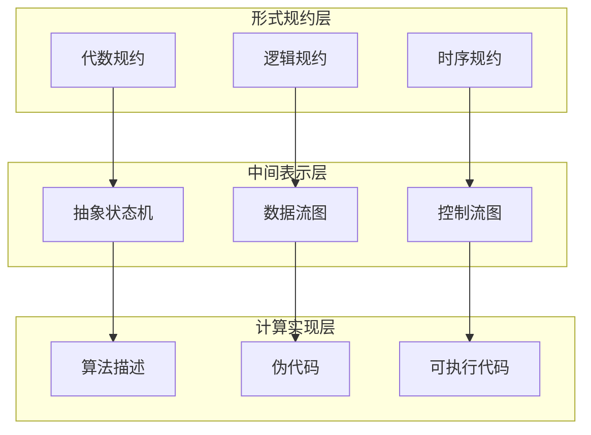
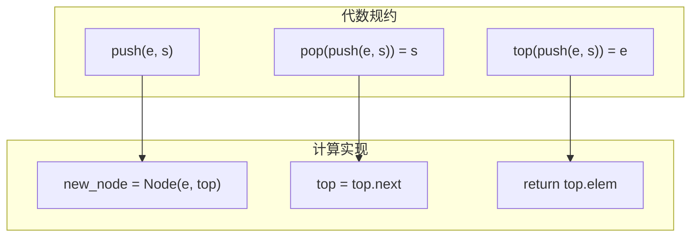
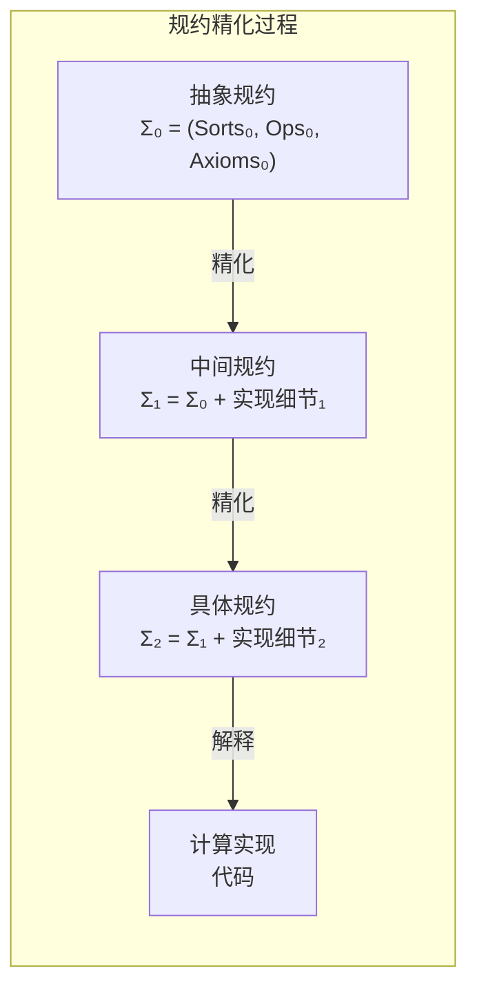
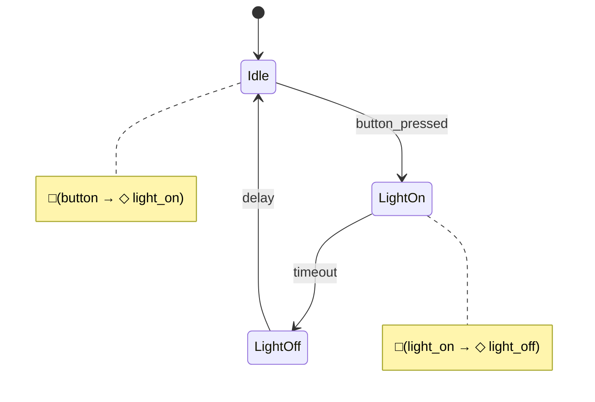
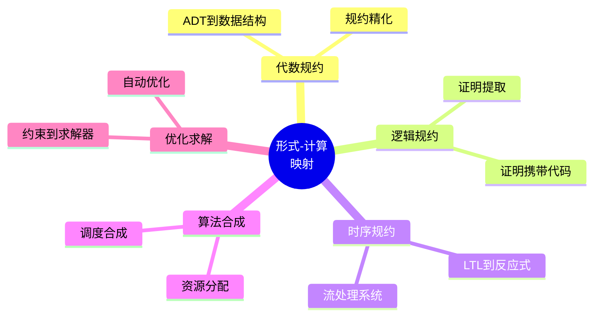

# 2.3 形式-计算映射

## 2.3.1 引言

### 2.3.1.1 形式规约与计算实现

形式-计算映射研究如何将高层次的形式规约转化为可执行的计算实现。这涉及：

- **规约精化**：从抽象规约逐步细化到可执行代码
- **语义保持**：确保实现满足规约的语义要求
- **计算复杂性**：权衡规约的完整性与计算的可行性
- **自动化合成**：从规约自动生成或推导实现

### 2.3.1.2 映射的层次结构



## 2.3.2 代数规约的计算实现

### 2.3.2.1 抽象数据类型到具体实现

**代数规约**：

```
spec Stack[T] =
  sort Stack, Elem
  ops  empty: → Stack
       push: Elem × Stack → Stack
       pop: Stack → Stack
       top: Stack → Elem
       isEmpty: Stack → Bool

  vars s: Stack, e: Elem

  axioms
    pop(push(e, s)) = s
    top(push(e, s)) = e
    isEmpty(empty) = true
    isEmpty(push(e, s)) = false
```

**计算实现（多种策略）**：

| 实现策略 | 数据结构 | push | pop | 空间复杂度 | 适用场景 |
|---------|---------|------|-----|-----------|---------|
| 数组 | 动态数组 | O(1)* | O(1) | O(n) | 已知最大容量 |
| 链表 | 单链表 | O(1) | O(1) | O(n) | 动态增长 |
| 不可变 | 持久化结构 | O(1) | O(1) | O(n)共享 | 函数式编程 |

**链表实现**：

```python
from dataclasses import dataclass
from typing import Generic, TypeVar, Optional

T = TypeVar('T')

@dataclass
class Node(Generic[T]):
    """链表节点 - 代数规约中 push(e, s) 的内存表示"""
    elem: T
    next: Optional['Node[T]']

class Stack(Generic[T]):
    """栈的计算实现 - 满足代数规约公理"""

    def __init__(self):
        self._top: Optional[Node[T]] = None  # 对应 empty
        self._size: int = 0

    def empty(self) -> 'Stack[T]':
        """创建空栈 - 对应 ops empty"""
        return Stack()

    def push(self, elem: T) -> None:
        """入栈 - 对应 ops push(e, s)"""
        # push(e, s) 在内存中创建新节点
        self._top = Node(elem, self._top)
        self._size += 1

    def pop(self) -> T:
        """出栈 - 对应 ops pop"""
        if self._top is None:
            raise IndexError("pop from empty stack")
        elem = self._top.elem
        # pop(push(e, s)) = s 通过更新指针实现
        self._top = self._top.next
        self._size -= 1
        return elem

    def top(self) -> T:
        """查看栈顶 - 对应 ops top"""
        if self._top is None:
            raise IndexError("top from empty stack")
        # top(push(e, s)) = e 直接返回存储的元素
        return self._top.elem

    def is_empty(self) -> bool:
        """检查空栈 - 对应 ops isEmpty"""
        return self._top is None

    # 规约公理的验证方法
    def verify_axioms(self) -> bool:
        """验证代数公理在实现中成立"""
        test_stack = Stack[int]()

        # 公理: isEmpty(empty) = true
        assert test_stack.is_empty(), "公理 isEmpty(empty)=true 违反"

        # 公理: isEmpty(push(e, s)) = false
        test_stack.push(1)
        assert not test_stack.is_empty(), "公理 isEmpty(push)=false 违反"

        # 公理: pop(push(e, s)) = s
        original_state = test_stack._top
        test_stack.push(2)
        test_stack.pop()
        assert test_stack._top == original_state, "公理 pop(push)=s 违反"

        # 公理: top(push(e, s)) = e
        test_stack.push(3)
        assert test_stack.top() == 3, "公理 top(push)=e 违反"

        return True
```



### 2.3.2.2 规约精化关系

**定义 2.3.1（规约精化）**
实现 $I$ 精化规约 $S$（记作 $I \sqsubseteq S$），当且仅当：
$$\forall op \in Ops(S). \forall \vec{x}. I(op)(\vec{x}) \sim S(op)(\vec{x})$$

其中 $\sim$ 表示观察等价。



## 2.3.3 逻辑规约的程序提取

### 2.3.3.1 构造性证明到程序

**逻辑规约**：

```
定理: ∀l: List. ∀x: Elem. x ∈ l → ∃i: Nat. l[i] = x
```

**构造性证明（类型理论风格）**：

```agda
findIndex : ∀ {A} (x : A) (xs : List A) →
            x ∈ xs → ∃ λ i → lookup i xs ≡ x
findIndex x (x ∷ xs) (here refl) =
  zero , refl
findIndex x (y ∷ xs) (there p) =
  let (i , q) = findIndex x xs p
  in suc i , q
```

**提取的计算实现**：

```python
from typing import TypeVar, List, Tuple, Optional

T = TypeVar('T')

def find_index(x: T, xs: List[T]) -> Optional[int]:
    """
    构造性证明提取的程序:
    ∀x∈xs. ∃i. xs[i] = x

    对应证明中的归纳情况:
    - 基础: x ∈ (x:xs) → i = 0
    - 归纳: x ∈ xs → x ∈ (y:xs) 且 index 增加 1
    """
    # 证明的归纳结构 → 循环/递归结构
    for i, elem in enumerate(xs):
        if elem == x:
            return i  # 构造出存在量词的见证 i
    return None  # 无证明（前提不成立）

# 依赖类型风格（Python 模拟）
from dataclasses import dataclass

@dataclass
class ExistsIndex:
    """∃i. xs[i] = x 的构造性证据"""
    index: int
    proof: str  # 在实际证明系统中是等式证明

def find_index_constructive(x: T, xs: List[T]) -> Optional[ExistsIndex]:
    """
    完全保持证明结构的实现
    """
    def helper(remaining: List[T], offset: int) -> Optional[ExistsIndex]:
        if not remaining:
            return None  # 无证明
        if remaining[0] == x:
            # 对应 proof 中的 (here refl)
            return ExistsIndex(offset, "refl")
        else:
            # 对应 proof 中的 (there p)
            result = helper(remaining[1:], offset + 1)
            if result:
                # suc i 在实现中是 i + 1
                return ExistsIndex(result.index, result.proof)
            return None

    return helper(xs, 0)
```

### 2.3.3.2 证明携带代码（PCC）

**概念**：程序附带其正确性证明，运行时验证证明有效性。

```python
from typing import Callable, Generic, TypeVar
from dataclasses import dataclass

T = TypeVar('T')
U = TypeVar('U')

@dataclass
class ProofCarryingCode(Generic[T, U]):
    """证明携带代码"""
    code: Callable[[T], U]
    specification: str
    proof_certificate: str  # 编码的证明

    def execute(self, input_data: T) -> U:
        """执行前先验证证明"""
        if not self._verify_proof():
            raise SecurityError("Proof verification failed")
        return self.code(input_data)

    def _verify_proof(self) -> bool:
        """验证证明证书（简化示意）"""
        # 实际中使用证明检查器
        return len(self.proof_certificate) > 0

# 示例：二分查找的PCC
binary_search_pcc = ProofCarryingCode(
    code=lambda arr_x: binary_search(arr_x[0], arr_x[1]),
    specification="∀arr:SortedArray. ∀x. result = index(x) ∨ result = -1",
    proof_certificate="proof_of_correctness_12345"
)
```

## 2.3.4 时序规约的反应式实现

### 2.3.4.1 LTL到反应式系统

**时序规约**：

```
□(button_pressed → ◇ light_on)
□(light_on → ◇ light_off)
```

**反应式实现（状态机+事件处理）**：

```python
from enum import Enum, auto
from dataclasses import dataclass
from typing import Callable, Set
import asyncio

class State(Enum):
    IDLE = auto()
    LIGHT_ON = auto()
    LIGHT_OFF = auto()

class Event(Enum):
    BUTTON_PRESSED = auto()
    TIMER_EXPIRED = auto()

@dataclass
class ReactiveSystem:
    """反应式系统实现 - 满足时序规约"""
    state: State = State.IDLE

    # LTL □(button → ◇ light_on) 的实现机制
    button_handler: Callable[[], None]
    # LTL □(light_on → ◇ light_off) 的实现机制
    timeout_handler: Callable[[], None]

    def __init__(self):
        self.observers: Set[Callable] = set()

    async def handle_event(self, event: Event):
        """事件处理 - 保证时序性质"""
        if event == Event.BUTTON_PRESSED:
            await self._on_button()
        elif event == Event.TIMER_EXPIRED:
            await self._on_timeout()

    async def _on_button(self):
        """
        实现: □(button_pressed → ◇ light_on)
        保证: 每次按钮按下后，最终会点亮
        """
        if self.state == State.IDLE:
            self.state = State.LIGHT_ON
            self._notify_observers("light_on")
            # 启动定时器以满足下一个性质
            asyncio.create_task(self._start_timeout())

    async def _start_timeout(self):
        """启动定时器 - 实现 ◇ light_off"""
        await asyncio.sleep(5)  # 5秒后自动关闭
        await self.handle_event(Event.TIMER_EXPIRED)

    async def _on_timeout(self):
        """
        实现: □(light_on → ◇ light_off)
        保证: 灯亮后最终会关闭
        """
        if self.state == State.LIGHT_ON:
            self.state = State.LIGHT_OFF
            self._notify_observers("light_off")
            await asyncio.sleep(1)
            self.state = State.IDLE

    def _notify_observers(self, event: str):
        for obs in self.observers:
            obs(event)
```



### 2.3.4.2 流处理系统

**规约（流式性质）**：

```
∀input_stream. ∀n. |output[n] - moving_avg(input, n)| < ε
```

**计算实现（流处理器）**：

```python
from collections import deque
from typing import Iterator, Callable, Iterable

def moving_average_processor(
    window_size: int,
    tolerance: float
) -> Callable[[Iterable[float]], Iterator[float]]:
    """
    流处理器 - 满足时序规约:
    ∀input. output[n] ≈ moving_avg(input, n, window_size)
    """
    window = deque(maxlen=window_size)

    def processor(input_stream: Iterable[float]) -> Iterator[float]:
        for value in input_stream:
            window.append(value)
            # 计算滑动窗口平均
            avg = sum(window) / len(window)
            # 规约保证: 输出值与真实平均的误差在容差内
            yield avg

    return processor

# 带背压控制的流处理器
def bounded_stream_processor(
    processor: Callable[[T], U],
    buffer_size: int = 100
) -> Callable[[Iterator[T]], Iterator[U]]:
    """
    带背压控制的流处理
    规约: ∀input. output_rate ≤ max_processing_rate
    """
    from queue import Queue
    import threading

    def wrapper(input_iter: Iterator[T]) -> Iterator[U]:
        buffer: Queue = Queue(maxsize=buffer_size)

        def producer():
            for item in input_iter:
                buffer.put(item)  # 阻塞当缓冲区满

        thread = threading.Thread(target=producer)
        thread.start()

        while thread.is_alive() or not buffer.empty():
            item = buffer.get()
            yield processor(item)

    return wrapper
```

## 2.3.5 调度规约的算法合成

### 2.3.5.1 从约束到算法

**形式化规约**：

```
调度问题:
  输入: 任务集 {τᵢ = (Cᵢ, Tᵢ, Dᵢ)}
  约束: ∀i. ∀k. fᵢᵏ ≤ dᵢᵏ
  目标: 合成调度函数 S(t)
```

**算法合成（EDF）**：

```python
import heapq
from dataclasses import dataclass, field
from typing import List, Optional

@dataclass(order=True)
class Job:
    """作业 - 带优先级比较"""
    deadline: float  # 用于堆排序
    task_id: int = field(compare=False)
    remaining_time: float = field(compare=False)

class SynthesizedScheduler:
    """
    从规约合成的调度器
    规约: □(ready → ◇_{≤D} completed)
    策略: EDF (最早截止时间优先)
    """

    def __init__(self, tasks: List['Task']):
        self.tasks = tasks
        self.ready_queue: List[Job] = []
        self.current_job: Optional[Job] = None
        self.time = 0.0

        # 验证静态可调度性（充分条件）
        self._check_schedulability()

    def _check_schedulability(self):
        """合成时检查 - 快速拒绝"""
        total_util = sum(t.wcet / t.period for t in self.tasks)
        if total_util > 1.0:
            raise ValueError(f"Utilization {total_util} > 1.0, may not be schedulable")

    def schedule_next(self) -> Optional[int]:
        """
        调度决策 - 保证 □(ready → ◇_{≤D} completed)
        策略: 选择截止时间最近的作业
        """
        if not self.ready_queue:
            return None

        # EDF策略: deadline 越小优先级越高
        next_job = heapq.heappop(self.ready_queue)

        # 抢占检查
        if (self.current_job is None or
            next_job.deadline < self.current_job.deadline):
            if self.current_job:
                heapq.heappush(self.ready_queue, self.current_job)
            self.current_job = next_job
        else:
            heapq.heappush(self.ready_queue, next_job)

        return self.current_job.task_id if self.current_job else None

    def tick(self, delta: float):
        """执行一个时间片"""
        if self.current_job:
            self.current_job.remaining_time -= delta
            if self.current_job.remaining_time <= 0:
                completed_id = self.current_job.task_id
                self.current_job = None
                return completed_id
        return None
```

### 2.3.5.2 资源分配算法合成

**规约**：

```
资源分配:
  输入: 资源集合 R, 请求集合 {reqᵢ}
  约束: ∀r∈R. Σ allocᵢ(r) ≤ capacity(r)
  目标: 最大化满足的请求数
```

**合成实现**：

```python
from typing import Dict, Set, List
from dataclasses import dataclass

@dataclass
class Resource:
    id: str
    capacity: int

@dataclass
class Request:
    id: str
    demands: Dict[str, int]  # resource_id -> amount
    priority: float

def synthesize_allocator(
    resources: List[Resource],
    strategy: str = "priority"
) -> Callable[[List[Request]], Dict[str, str]]:
    """
    从规约合成资源分配器
    规约: ∀r. Σ demands ≤ capacity
    """
    available = {r.id: r.capacity for r in resources}

    def allocate(requests: List[Request]) -> Dict[str, str]:
        """返回 request_id -> resource_assignment"""
        allocation = {}

        # 按策略排序请求
        if strategy == "priority":
            sorted_reqs = sorted(requests, key=lambda r: -r.priority)
        elif strategy == "smallest_first":
            sorted_reqs = sorted(requests,
                               key=lambda r: sum(r.demands.values()))
        else:
            sorted_reqs = requests

        for req in sorted_reqs:
            # 检查资源约束
            can_allocate = all(
                available.get(res_id, 0) >= amount
                for res_id, amount in req.demands.items()
            )

            if can_allocate:
                # 分配资源
                for res_id, amount in req.demands.items():
                    available[res_id] -= amount
                allocation[req.id] = "allocated"
            else:
                allocation[req.id] = "rejected"

        return allocation

    return allocate
```

## 2.3.6 形式化到优化的映射

### 2.3.6.1 优化问题的形式化与求解

**形式化规约**：

```
优化问题:
  最小化: f(x)
  约束:   gᵢ(x) ≤ 0, i = 1..m
         hⱼ(x) = 0, j = 1..p
         x ∈ Ω
```

**求解器合成**：

```python
from typing import Callable, List, Tuple, Optional
import numpy as np
from scipy.optimize import minimize

class OptimizerSynthesizer:
    """从形式化规约合成优化器"""

    def __init__(self):
        self.objective: Optional[Callable] = None
        self.ineq_constraints: List[Callable] = []
        self.eq_constraints: List[Callable] = []

    def specify_objective(self, f: Callable[[np.ndarray], float]):
        """指定目标函数 f(x)"""
        self.objective = f

    def add_inequality(self, g: Callable[[np.ndarray], float]):
        """添加不等式约束 g(x) ≤ 0"""
        self.ineq_constraints.append(g)

    def add_equality(self, h: Callable[[np.ndarray], float]):
        """添加等式约束 h(x) = 0"""
        self.eq_constraints.append(h)

    def synthesize(self, method: str = 'SLSQP') -> Callable:
        """
        合成优化求解器
        规约: min f(x) s.t. g(x)≤0, h(x)=0
        """
        def solve(initial_guess: np.ndarray) -> dict:
            # 转换约束格式
            constraints = []

            for g in self.ineq_constraints:
                constraints.append({
                    'type': 'ineq',
                    'fun': lambda x, g=g: -g(x)  # scipy 需要 ≥0
                })

            for h in self.eq_constraints:
                constraints.append({
                    'type': 'eq',
                    'fun': h
                })

            result = minimize(
                self.objective,
                initial_guess,
                method=method,
                constraints=constraints
            )

            return {
                'x': result.x,
                'fun': result.fun,
                'success': result.success,
                'constraint_violation': self._check_constraints(result.x)
            }

        return solve

    def _check_constraints(self, x: np.ndarray) -> dict:
        """验证约束满足情况"""
        return {
            'inequalities': [g(x) for g in self.ineq_constraints],
            'equalities': [h(x) for h in self.eq_constraints]
        }
```

## 2.3.7 交叉引用

### 2.3.7.1 内部引用

- **2.3 ↔ 2.1**: 形式-计算映射使用数学-程序映射的技术
- **2.3 ↔ 2.2**: 形式-计算映射是理论-工程映射的形式化视角
- **2.3 ↔ 2.4**: 形式-计算映射关系可纳入知识图谱

### 2.3.7.2 外部引用

- **↔ 1.1**: 多视角统一框架指导形式-计算映射
- **↔ 1.2**: 范畴论提供形式-计算映射的结构基础
- **↔ 1.3**: 类型论是形式-计算映射的核心工具
- **↔ 1.4**: 调度理论是形式-计算映射的应用领域

## 2.3.8 总结

形式-计算映射提供了：

1. **代数映射**：ADT规约到计算实现
2. **逻辑映射**：构造性证明到程序提取
3. **时序映射**：LTL规约到反应式系统
4. **合成映射**：从约束规约合成算法
5. **优化映射**：优化问题到求解器合成



---

_最后更新: 2026-04-11_
_版本: 1.0_
