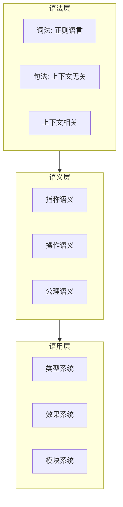
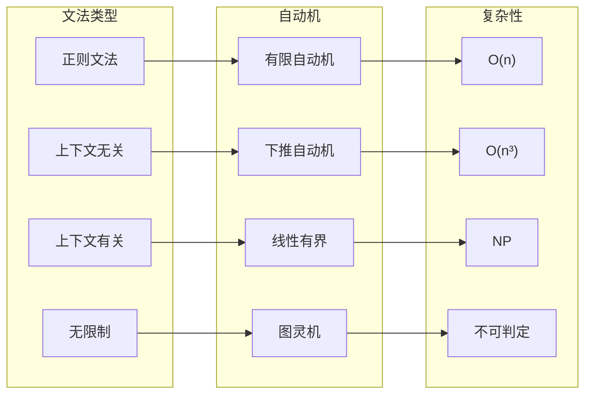
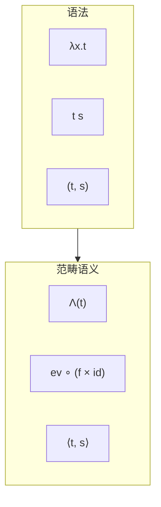
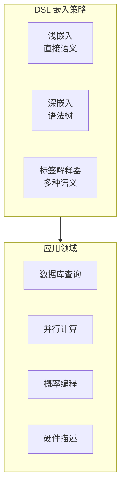
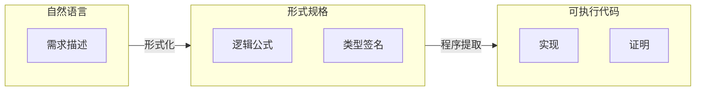

# 02.4 形式-语言-编程映射

## 目录

- [02.4 形式-语言-编程映射](#024-形式-语言-编程映射)
  - [目录](#目录)
  - [1. 语言的形式化理论](#1-语言的形式化理论)
    - [1.1 语言的数学定义](#11-语言的数学定义)
    - [1.2 语言的三层结构](#12-语言的三层结构)
    - [1.3 语言的代数结构](#13-语言的代数结构)
  - [2. 乔姆斯基层级与计算](#2-乔姆斯基层级与计算)
    - [2.1 文法-自动机对应](#21-文法-自动机对应)
    - [2.2 完整的对应表](#22-完整的对应表)
    - [2.3 从语法到语义](#23-从语法到语义)
  - [3. 类型即意义](#3-类型即意义)
    - [3.1 类型系统的逻辑基础](#31-类型系统的逻辑基础)
    - [3.2 类型推导作为证明搜索](#32-类型推导作为证明搜索)
    - [3.3 精炼类型 (Refinement Types)](#33-精炼类型-refinement-types)
  - [4. 编程语言的范畴语义](#4-编程语言的范畴语义)
    - [4.1 笛卡尔闭范畴 (CCC)](#41-笛卡尔闭范畴-ccc)
    - [4.2 单子与计算效应](#42-单子与计算效应)
    - [4.3 线性逻辑与资源管理](#43-线性逻辑与资源管理)
  - [5. 领域特定语言 (DSL)](#5-领域特定语言-dsl)
    - [5.1 DSL 的设计模式](#51-dsl-的设计模式)
    - [5.2 数据库查询 DSL](#52-数据库查询-dsl)
    - [5.3 概率编程 DSL](#53-概率编程-dsl)
  - [6. 元语言与反射](#6-元语言与反射)
    - [6.1 元编程的层次](#61-元编程的层次)
    - [6.2 Lean 的元编程](#62-lean-的元编程)
    - [6.3 综合映射：从自然语言到代码](#63-综合映射从自然语言到代码)
  - [参考与延伸](#参考与延伸)
    - [相关章节](#相关章节)
    - [关键文献](#关键文献)

---

## 1. 语言的形式化理论

### 1.1 语言的数学定义

形式语言理论用数学工具研究语言的结构：

**定义 1.1.1** (形式语言)
字母表 $Σ$ 上的语言是 $Σ^*$ 的子集：

$$
L \subseteq \Sigma^*
$$

**定义 1.1.2** (语法)
语法 $G = \langle V, \Sigma, R, S \rangle$ 其中：

- $V$: 非终结符集合
- $\Sigma$: 终结符集合
- $R$: 产生式规则
- $S \in V$: 开始符号

> **交叉引用**: 关于范畴论语义，参见 [../01_形式化方法统一/01.1_统一理论基础.md](../01_形式化方法统一/01.1_统一理论基础.md)

### 1.2 语言的三层结构



### 1.3 语言的代数结构

| 结构 | 运算 | 代数定律 | 编程对应 |
|-----|------|---------|---------|
| **幺半群** | 连接 $\cdot$ | 结合律、单位元 $\epsilon$ | 字符串 |
| **半环** | $+, \cdot$ | 分配律 | 正则表达式 |
| **Kleene 代数** | $+, \cdot, *$ | 不动点 | 正则语言 |
| **剩余格** | $\to, \leftarrow$ | 伴随 | 类型推导 |

```haskell
-- 正则表达式的代数结构

infixl 5 :+:
infixl 6 :.:

data Regex a
  = Empty         -- ∅
  | Epsilon       -- ε
  | Sym a         -- 单字符
  | Regex a :+: Regex a   -- 并
  | Regex a :.: Regex a   -- 连接
  | Star (Regex a)        -- Kleene 星

-- Kleene 代数定律
-- r :+: s = s :+: r           (交换)
-- r :+: (s :+: t) = (r :+: s) :+: t  (结合)
-- r :.: (s :.: t) = (r :.: s) :.: t  (结合)
-- r :.: Epsilon = r           (右单位)
-- Epsilon :.: r = r           (左单位)
-- r :+: Empty = r             (单位)
-- r :.: Empty = Empty         (零元)
-- Star r = Epsilon :+: (r :.: Star r)  (展开)
```

---

## 2. 乔姆斯基层级与计算

### 2.1 文法-自动机对应



### 2.2 完整的对应表

| 文法 | 自动机 | 语言类 | 闭包 | 主要问题 | 应用 |
|-----|--------|--------|------|---------|------|
| **Type-3** | DFA/NFA | 正则 | 全闭包 | 成员、空、等价 | 词法分析 |
| **Type-2** | PDA | 上下文无关 | 并、连接、星 | 成员 | 语法分析 |
| **Type-1** | LBA | 上下文有关 | 交、并 | 成员 | 自然语言 |
| **Type-0** | TM | 递归可枚举 | 并、连接、星 | 成员半可判定 | 通用计算 |

### 2.3 从语法到语义

```lean4
-- 简单语言的指称语义

-- 抽象语法
def Expr : Type
  | num : Nat → Expr
  | add : Expr → Expr → Expr
  | mul : Expr → Expr → Expr

deriving Repr

-- 指称语义: 表达式 → 自然数
def denotation : Expr → Nat
  | .num n     => n
  | .add e1 e2 => denotation e1 + denotation e2
  | .mul e1 e2 => denotation e1 * denotation e2

-- 操作语义: 小步规约
inductive Steps : Expr → Expr → Prop where
  | add_num n m : Steps (.add (.num n) (.num m)) (.num (n + m))
  | mul_num n m : Steps (.mul (.num n) (.num m)) (.num (n * m))
  | add_left e1 e1' e2 :
      Steps e1 e1' → Steps (.add e1 e2) (.add e1' e2)
  | add_right n e2 e2' :
      Steps e2 e2' → Steps (.add (.num n) e2) (.add (.num n) e2')
  -- 类似地处理 mul

-- 语义一致性
theorem denotation_sound (e e' : Expr) :
  Steps e e' → denotation e = denotation e' := by
  intro h
  induction h with
  | add_num n m => simp [denotation]
  | mul_num n m => simp [denotation]
  | add_left _ _ _ ih => simp [denotation, ih]
  | add_right _ _ _ ih => simp [denotation, ih]
```

---

## 3. 类型即意义

### 3.1 类型系统的逻辑基础

类型系统是编程语言的逻辑基础：

| 类型系统 | 对应逻辑 | 表达能力 | 典型语言 |
|---------|---------|---------|---------|
| 简单类型 | 直觉主义命题 | 基础 | Haskell, ML |
| 多态 | 二阶逻辑 | 参数化 | Haskell, Rust |
| 依赖类型 | 谓词逻辑 | 规范 | Lean, Coq, Idris |
| 线性类型 | 线性逻辑 | 资源 | Rust, Linear Haskell |
| 效应类型 | 模态逻辑 | 上下文 | Koka, Eff |

### 3.2 类型推导作为证明搜索

```haskell
-- Hindley-Milner 类型推导

-- 类型推导 = 构造证明
-- 合一 (Unification) = 约束求解

identity :: a -> a
identity x = x
-- 推导: 假设 x :: a, 结果 x :: a, 故 identity :: a -> a

compose :: (b -> c) -> (a -> b) -> (a -> c)
compose f g = \x -> f (g x)
-- 推导:
-- g :: a -> b, f :: b -> c
-- x :: a, g x :: b, f (g x) :: c
-- 结果 :: a -> c
```

```lean4
-- Lean: 类型即命题

-- 多态类型对应全称量词
def polyId : (A : Type) → A → A :=
  fun A x => x
-- 类型: ∀A. A → A

-- 类型推导 = 构造性证明
def compose' : (A B C : Type) → (B → C) → (A → B) → (A → C) :=
  fun A B C f g x => f (g x)
-- 证明: (A → B) → (B → C) → (A → C) 的传递性

-- 依赖类型: 类型依赖值
def Vector (α : Type) (n : Nat) := { l : List α // l.length = n }

-- 类型安全的长度索引
def vmap {α β : Type} {n : Nat} (f : α → β) :
  Vector α n → Vector β n :=
  fun v => ⟨v.val.map f, by simp [v.property]⟩
-- 长度信息在类型层面保持!
```

### 3.3 精炼类型 (Refinement Types)

```haskell
-- Liquid Haskell: 精炼类型

-- 向量长度在类型中
{-@ type Vector a N = {v:[a] | len v = N} @-}

-- 安全的 head 操作
{-@ head :: {v:[a] | len v > 0} -> a @-}
head (x:_) = x
-- 前置条件: 列表非空
-- 类型系统证明: 永远不会对空列表调用 head

-- 排序验证
{-@ type SortedList a = [a]<{\xi xj -> xi <= xj}> @-}
-- 列表已排序的精炼类型
```

---

## 4. 编程语言的范畴语义

### 4.1 笛卡尔闭范畴 (CCC)

简单类型 λ 演算的语义是 CCC：

| 语法 | 类型 | 范畴 | 操作 |
|-----|------|------|------|
| $x : A \vdash x : A$ | 变量 | 恒等 | $\text{id}_A$ |
| $\Gamma, x:A \vdash t : B$ | 抽象 | 转置 | $\Lambda$ |
| $\Gamma \vdash f : A \to B$ | 应用 | 求值 | $\text{ev}$ |
| $\Gamma \vdash (t, s) : A \times B$ | 配对 | 积 | $\langle -, - \rangle$ |
| $\Gamma \vdash \pi_1 p : A$ | 投影 | 投射 | $\pi_1$ |



### 4.2 单子与计算效应

```haskell
-- 单子统一计算效应

class Monad m where
  return :: a -> m a
  (>>=) :: m a -> (a -> m b) -> m b

-- 效应对应逻辑模态
-- return: A → □A  (必然引入)
-- >>=: □A → (A → □B) → □B  (必然消去)

-- 状态单子: 带状态计算
newtype State s a = State { runState :: s -> (a, s) }

instance Monad (State s) where
  return a = State $ \s -> (a, s)
  ma >>= f = State $ \s ->
    let (a, s') = runState ma s
    in runState (f a) s'

-- 语义: State s a = s → (a × s) = aˢ × s = a^(s) × s (指数伴随积)
```

```lean4
-- Lean 中的单子

-- 状态作为单子
structure StateM (S : Type) (A : Type) where
  run : S → A × S

instance : Monad (StateM S) where
  pure a := ⟨fun s => (a, s)⟩
  bind ma f := ⟨fun s =>
    let (a, s') := ma.run s
    (f a).run s'⟩

-- 范畴论解释
-- State S = (- × S)^S  (reader + writer 的组合)
-- State S A = S → A × S 是 Store 单子
```

### 4.3 线性逻辑与资源管理

| 线性逻辑 | 类型系统 | 资源解释 | 实现 |
|---------|---------|---------|------|
| $A \otimes B$ | 张量积 | 同时拥有 | 线性对 |
| $A \multimap B$ | 线性函数 | 消费 A 产生 B | 所有权转移 |
| $!A$ | 指数模态 | 可复制资源 | Rc/Arc |
| $A \& B$ | 选择 | 可选择的 | enum |
| $A \oplus B$ | 和 | 互斥的 | 变体 |

```rust
// Rust: 线性类型的实际应用

fn consume<T>(x: T) -> () {
    // x 被消费，之后不可用
}

fn linear_use() {
    let s = String::from("hello");
    consume(s);
    // println!("{}", s);  // 错误! s 已被移动
}

// 借用: 线性类型的对偶
fn borrow(s: &String) -> usize {
    s.len()  // 借用检查，不转移所有权
}
```

---

## 5. 领域特定语言 (DSL)

### 5.1 DSL 的设计模式



### 5.2 数据库查询 DSL

```haskell
-- Haskell: 类型安全的数据库查询 (Esqueleto 风格)

-- 表定义
share [mkPersist sqlSettings, mkMigrate "migrateAll"] [persistLowerCase|
Person
    name String
    age Int
    deriving Show
|]

-- 类型安全的查询
peopleOver18 :: SqlPersistT IO [Entity Person]
peopleOver18 =
    select $ from $ \person -> do
    where_ (person ^. PersonAge >=. val 18)
    return person

-- 编译时检查:
-- - 字段存在性
-- - 类型兼容性
-- - 引用的正确性
```

### 5.3 概率编程 DSL

```lean4
-- Lean: 概率模型的嵌入

structure Prob (A : Type) where
  samples : IO (List A)
  pdf : A → ℝ  -- 概率密度

def Prob.pure (a : A) : Prob A where
  samples := return [a]
  pdf _ := 0  -- 点质量

def Prob.bind (p : Prob A) (f : A → Prob B) : Prob B where
  samples := do
    as ← p.samples
    bs ← as.mapM (fun a => (f a).samples)
    return bs.flatten
  pdf b := ∫ a, p.pdf a * (f a).pdf b

-- 高斯分布
def gaussian (μ σ : ℝ) : Prob ℝ where
  samples := -- Box-Muller 采样
  pdf x := (1 / (σ * √(2 * π))) * exp (-(x - μ)² / (2 * σ²))

-- 概率模型: 线性回归
-- y ~ N(ax + b, σ)
def linearRegression (a b σ : ℝ) (x : ℝ) : Prob ℝ :=
  gaussian (a * x + b) σ
```

---

## 6. 元语言与反射

### 6.1 元编程的层次

```
元编程层次
├── 语法宏 (Macro)
│   ├── 编译时代码生成
│   └── 语法转换
├── 反射 (Reflection)
│   ├── 类型检查期访问
│   └── 程序结构检查
├── 同像性 (Homoiconicity)
│   ├── 代码即数据
│   └── 运行时代码操作
└── 证明反射 (Proof Reflection)
    ├── 元理论内嵌
    └── 自证系统
```

### 6.2 Lean 的元编程

```lean4
-- Lean 的元编程能力

-- 语法扩展
syntax "myif" term "then" term "else" term : term

macro_rules
  | `(myif $c then $t else $e) => `(if $c then $t else $e)

-- 证明自动化 (Tactic)
macro "solve_arith" : tactic =>
  `(tactic| try { omega } <|> try { linarith })

-- 类型类派生
class ToString (α : Type) where
  toString : α → String

deriving instance ToString for Prod, Sum, Option

-- 元程序操作证明
open Lean Meta Elab Tactic

def solveTrivial : TacticM Unit := do
  -- 访问目标类型
  let goal ← getMainGoal
  let target ← getMVarType goal

  -- 根据目标选择策略
  match target with
  | .app (.const `Eq _) _ =>
    -- 等式目标: 尝试 rfl
    evalTactic (← `(tactic| rfl))
  | .app (.const `And _) _ =>
    -- 合取目标: 拆分
    evalTactic (← `(tactic| constructor))
  | _ => throwError "无法自动解决"
```

### 6.3 综合映射：从自然语言到代码



---

## 参考与延伸

### 相关章节

- [../01_形式化方法统一/01.2_多语言融合.md](../01_形式化方法统一/01.2_多语言融合.md) - 逻辑、类型、范畴的语法融合
- [../01_形式化方法统一/01.4_证明与程序对应.md](../01_形式化方法统一/01.4_证明与程序对应.md) - Curry-Howard 的程序视角
- [02.2_形式-计算-数学映射.md](02.2_形式-计算-数学映射.md) - 计算理论

### 关键文献

1. Pierce (2002): _Types and Programming Languages_
2. Harper (2016): _Practical Foundations for Programming Languages_
3. Gibbons (2013): "Functional Programming for Domain-Specific Languages"
4. Christiansen (2019): _Functional Reactive Programming_

---

_语言是思维的载体，形式语言是精确思维的载体。从自然语言的模糊到形式语言的精确，从正则表达式到依赖类型，从乔姆斯基层级到 CCC 语义，编程语言的设计展现了形式科学的力量——用严格的数学结构表达人类意图，用可靠的计算过程实现抽象思想。_
