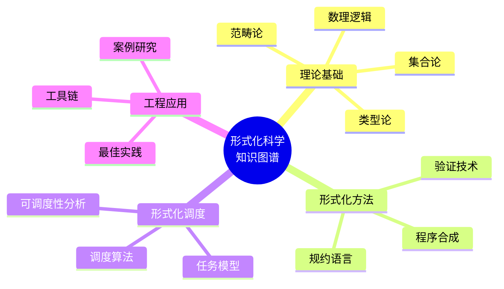
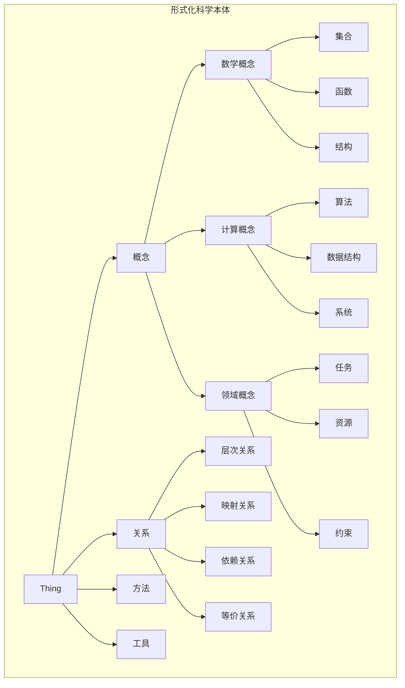
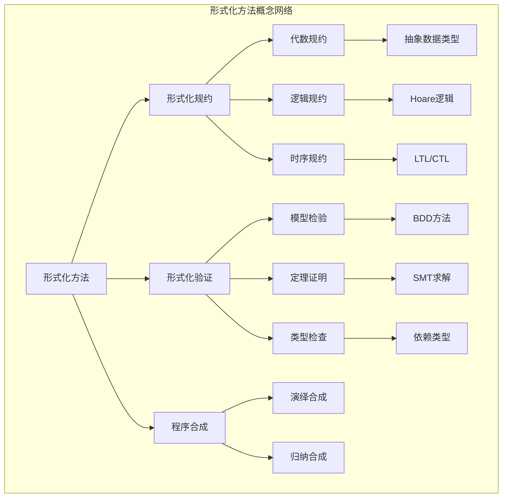
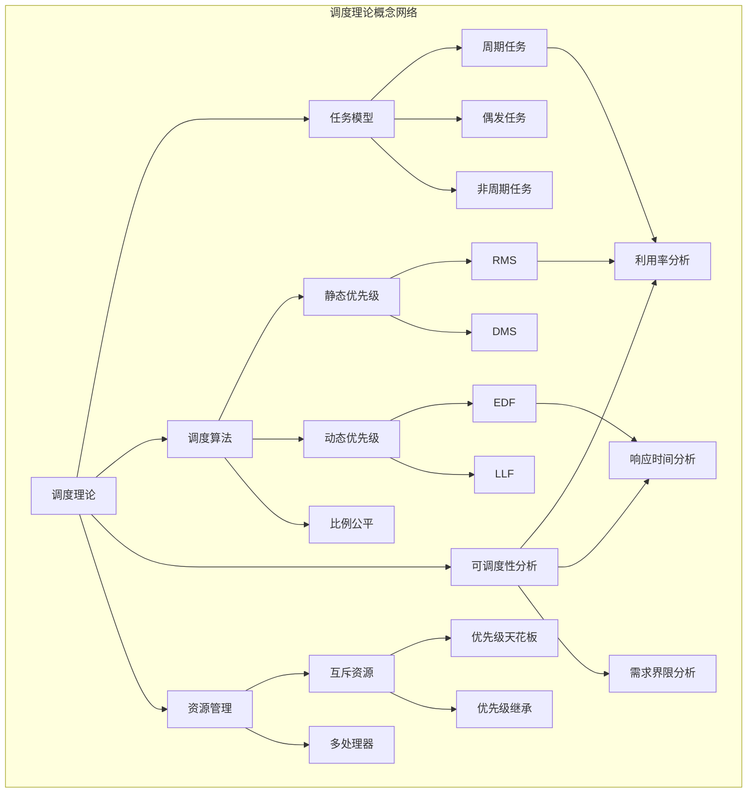
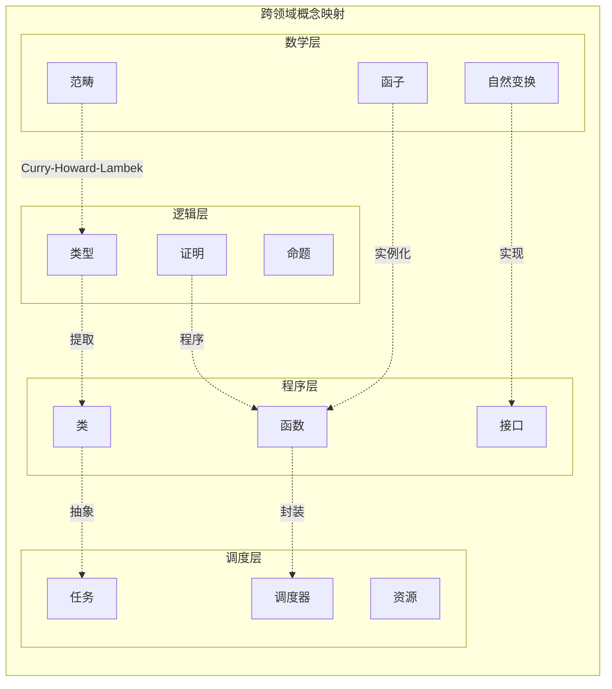
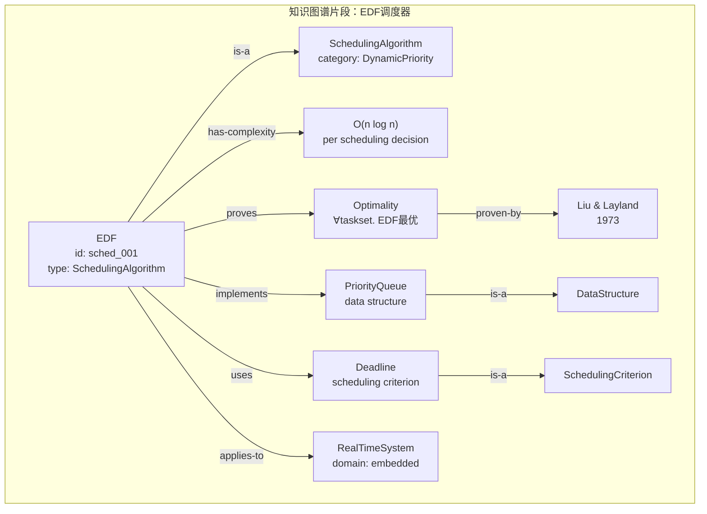
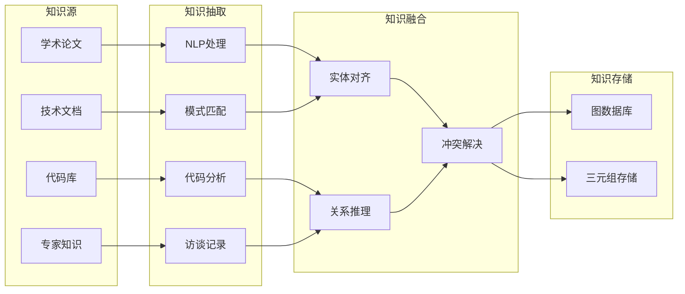
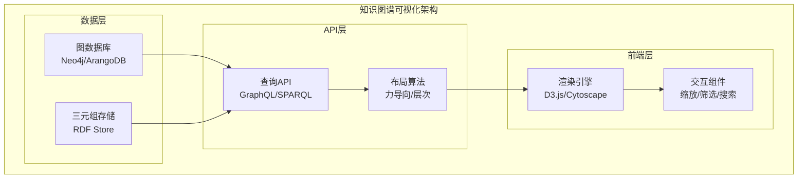
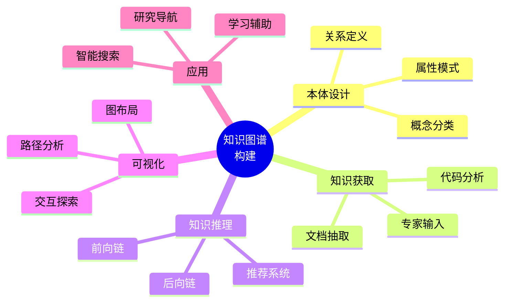

# 2.4 知识图谱构建

## 2.4.1 引言

### 2.4.1.1 知识图谱的必要性

形式化科学涵盖多个领域，概念众多且关系复杂。知识图谱提供：

- **概念组织**：系统化组织形式化领域的核心概念
- **关系发现**：揭示概念间的显式和隐式关系
- **智能检索**：支持语义搜索和推理
- **可视化理解**：提供全局视图和导航

### 2.4.1.2 知识图谱的范围



## 2.4.2 知识图谱本体设计

### 2.4.2.1 核心概念类别

**本体层次结构**：



### 2.4.2.2 概念定义示例

```turtle
# 形式化科学本体 (Turtle格式)
@prefix fs: <http://formalscience.org/ontology#> .
@prefix rdfs: <http://www.w3.org/2000/01/rdf-schema#> .
@prefix owl: <http://www.w3.org/2002/07/owl#> .

# 核心类定义
fs:MathematicalConcept a owl:Class ;
    rdfs:label "数学概念" ;
    rdfs:comment "形式化科学中的数学抽象" .

fs:ComputationalConcept a owl:Class ;
    rdfs:label "计算概念" ;
    rdfs:comment "可计算的概念实现" .

fs:FormalMethod a owl:Class ;
    rdfs:subClassOf fs:MathematicalConcept ;
    rdfs:label "形式化方法" .

fs:SchedulingTheory a owl:Class ;
    rdfs:subClassOf fs:FormalMethod ;
    rdfs:label "调度理论" .

# 属性定义
fs:formalizedBy a owl:ObjectProperty ;
    rdfs:domain fs:DomainConcept ;
    rdfs:range fs:MathematicalConcept ;
    rdfs:label "形式化表示" .

fs:implementedBy a owl:ObjectProperty ;
    rdfs:domain fs:ComputationalConcept ;
    rdfs:range fs:Algorithm ;
    rdfs:label "由...实现" .

fs:equivalentTo a owl:ObjectProperty ;
    rdfs:domain fs:Concept ;
    rdfs:range fs:Concept ;
    rdfs:label "等价于" .
```

## 2.4.3 概念关系网络

### 2.4.3.1 形式化方法概念图



### 2.4.3.2 调度理论概念图



### 2.4.3.3 跨领域映射关系



## 2.4.4 知识图谱数据模型

### 2.4.4.1 实体-关系模式

| 实体类型 | 属性 | 示例 |
|---------|------|------|
| **概念** | id, name, definition, category | EDF算法 |
| **方法** | id, name, complexity, correctness | 响应时间分析 |
| **工具** | id, name, language, license | Coq, Z3 |
| **定理** | id, name, statement, proof | Liu-Layland定理 |
| **案例** | id, name, domain, outcome | 汽车ECU调度 |

| 关系类型 | 源实体 | 目标实体 | 示例 |
|---------|--------|---------|------|
| **is-a** | 概念 | 概念 | EDF is-a 调度算法 |
| **implements** | 工具 | 方法 | Coq implements 定理证明 |
| **proves** | 定理 | 方法 | Liu-Layland proves RMS最优性 |
| **applies-to** | 方法 | 领域 | EDF applies-to 实时系统 |
| **equivalent-to** | 概念 | 概念 | LTL equivalent-to 时序逻辑 |

### 2.4.4.2 知识图谱可视化



## 2.4.5 知识获取与构建

### 2.4.5.1 知识抽取流程



### 2.4.5.2 自动知识抽取

```python
from typing import List, Dict, Tuple
from dataclasses import dataclass
import re

@dataclass
class Concept:
    name: str
    category: str
    definition: str
    source: str

@dataclass
class Relation:
    source: str
    target: str
    relation_type: str
    confidence: float

class KnowledgeExtractor:
    """从文档中抽取知识"""

    # 定义抽取模式
    CONCEPT_PATTERNS = {
        'definition': r'定义[\s]*([\d.]+)[\s]*[（(]([^)]+)[)）][\s]*(.+?)(?=\n\n|\n定义|$)',
        'theorem': r'定理[\s]*([\d.]+)[\s]*[（(]([^)]+)[)）][\s]*(.+?)(?=证明|$)',
        'algorithm': r'算法[\s]*([\d.]+)[\s]*[:：]\s*(.+?)(?=输入|$)'
    }

    RELATION_PATTERNS = {
        'is_a': r'(\w+)\s*(?:是|is a|is an)\s*(\w+)',
        'implements': r'(\w+)\s*(?:实现|实现了|implements)\s*(\w+)',
        'proves': r'(\w+)\s*(?:证明|证明了|proves)\s*(\w+)'
    }

    def extract_from_text(self, text: str, source: str) -> Tuple[List[Concept], List[Relation]]:
        """从文本中抽取概念和关系"""
        concepts = []
        relations = []

        # 抽取概念
        for concept_type, pattern in self.CONCEPT_PATTERNS.items():
            matches = re.finditer(pattern, text, re.DOTALL)
            for match in matches:
                concept = Concept(
                    name=match.group(2).strip(),
                    category=concept_type,
                    definition=match.group(3).strip(),
                    source=source
                )
                concepts.append(concept)

        # 抽取关系
        for rel_type, pattern in self.RELATION_PATTERNS.items():
            matches = re.finditer(pattern, text)
            for match in matches:
                relation = Relation(
                    source=match.group(1).strip(),
                    target=match.group(2).strip(),
                    relation_type=rel_type,
                    confidence=0.8  # 基于模式匹配的置信度
                )
                relations.append(relation)

        return concepts, relations

    def extract_from_code(self, code: str, language: str) -> List[Concept]:
        """从代码中抽取概念"""
        concepts = []

        if language == 'python':
            # 抽取类定义
            class_pattern = r'class\s+(\w+)(?:\(([^)]+)\))?[\s]*:[\s]*(?:"""|\'\'\')?([^"]*(?:"""|\'\'\'))?'
            matches = re.finditer(class_pattern, code)
            for match in matches:
                concepts.append(Concept(
                    name=match.group(1),
                    category='class',
                    definition=match.group(3) or '',
                    source='code'
                ))

        return concepts
```

## 2.4.6 知识推理与应用

### 2.4.6.1 推理规则

```python
from typing import Set, Callable
from dataclasses import dataclass

@dataclass
class InferenceRule:
    name: str
    premises: List[str]
    conclusion: str

    def apply(self, facts: Set[str]) -> Set[str]:
        """应用推理规则"""
        new_facts = set()
        if all(p in facts for p in self.premises):
            new_facts.add(self.conclusion)
        return new_facts

class KnowledgeReasoner:
    """知识推理引擎"""

    def __init__(self):
        self.rules: List[InferenceRule] = []
        self.facts: Set[str] = set()

    def add_rule(self, rule: InferenceRule):
        self.rules.append(rule)

    def forward_chain(self, max_iterations: int = 100) -> Set[str]:
        """前向链推理"""
        new_facts = set()

        for _ in range(max_iterations):
            iteration_facts = set()
            for rule in self.rules:
                result = rule.apply(self.facts | new_facts)
                iteration_facts.update(result)

            if iteration_facts.issubset(new_facts):
                break  # 达到不动点

            new_facts.update(iteration_facts)

        return new_facts

    def backward_chain(self, goal: str) -> bool:
        """后向链推理"""
        if goal in self.facts:
            return True

        for rule in self.rules:
            if rule.conclusion == goal:
                if all(self.backward_chain(p) for p in rule.premises):
                    return True

        return False

# 示例推理规则
reasoner = KnowledgeReasoner()

# 规则1: EDF是动态优先级算法，动态优先级算法可用于实时系统
# → EDF可用于实时系统
reasoner.add_rule(InferenceRule(
    name="applicability_transitivity",
    premises=["EDF is-a DynamicPriorityAlgorithm",
              "DynamicPriorityAlgorithm applies-to RealTimeSystem"],
    conclusion="EDF applies-to RealTimeSystem"
))

# 规则2: 如果算法是最优的且任务集可调度，则算法可调度该任务集
reasoner.add_rule(InferenceRule(
    name="optimality_implies_schedulability",
    premises=["Algorithm is-optimal",
              "TaskSet is-schedulable"],
    conclusion="Algorithm can-schedule TaskSet"
))
```

### 2.4.6.2 智能查询接口

```python
from typing import List, Dict, Any
from dataclasses import dataclass

@dataclass
class QueryResult:
    entity: str
    properties: Dict[str, Any]
    related: List[str]
    path: List[str]  # 推理路径

class KnowledgeQuery:
    """知识图谱查询接口"""

    def __init__(self, graph):
        self.graph = graph

    def search(self, query: str, query_type: str = "keyword") -> List[QueryResult]:
        """语义搜索"""
        results = []

        if query_type == "keyword":
            # 关键词匹配
            for node in self.graph.nodes:
                if query.lower() in node.name.lower():
                    results.append(QueryResult(
                        entity=node.name,
                        properties=node.properties,
                        related=self._get_related(node),
                        path=[node.name]
                    ))

        elif query_type == "semantic":
            # 语义搜索（基于关系推理）
            results = self._semantic_search(query)

        return results

    def find_path(self, source: str, target: str) -> List[str]:
        """查找概念间的路径"""
        # 使用BFS查找最短路径
        from collections import deque

        queue = deque([(source, [source])])
        visited = {source}

        while queue:
            current, path = queue.popleft()

            if current == target:
                return path

            for neighbor in self.graph.get_neighbors(current):
                if neighbor not in visited:
                    visited.add(neighbor)
                    queue.append((neighbor, path + [neighbor]))

        return []  # 无路径

    def recommend(self, entity: str, relation_type: str = "related") -> List[str]:
        """推荐相关知识"""
        # 基于图结构的推荐
        recommendations = []

        # 1. 直接相关
        direct = self.graph.get_related(entity, relation_type)
        recommendations.extend(direct)

        # 2. 间接相关（二阶邻居）
        for neighbor in direct:
            second_order = self.graph.get_related(neighbor, relation_type)
            recommendations.extend([e for e in second_order if e != entity])

        # 去重并排序
        return list(set(recommendations))

    def _get_related(self, node) -> List[str]:
        """获取相关实体"""
        return [edge.target for edge in node.outgoing_edges]

    def _semantic_search(self, query: str) -> List[QueryResult]:
        """基于语义的搜索"""
        # 解析查询意图
        # 例如: "哪些调度算法支持周期任务？"
        # 解析为: 查找 (is-a SchedulingAlgorithm) ∧ (supports PeriodicTask)

        results = []
        # 实现语义解析和查询...
        return results
```

## 2.4.7 知识图谱可视化

### 2.4.7.1 交互式可视化方案



### 2.4.7.2 可视化组件设计

```python
from dataclasses import dataclass
from typing import List, Dict, Tuple

@dataclass
class NodeStyle:
    """节点样式配置"""
    color: str
    shape: str
    size: float
    label_font: str
    label_size: int

@dataclass
class EdgeStyle:
    """边样式配置"""
    color: str
    width: float
    style: str  # solid, dashed, dotted
    arrow: bool

class KnowledgeGraphVisualizer:
    """知识图谱可视化器"""

    # 类别到样式的映射
    CATEGORY_STYLES = {
        'MathematicalConcept': NodeStyle('#4A90D9', 'circle', 20, 'Arial', 12),
        'ComputationalConcept': NodeStyle('#5FB878', 'rect', 18, 'Arial', 11),
        'Algorithm': NodeStyle('#F6A623', 'diamond', 22, 'Arial', 12),
        'Theorem': NodeStyle('#BD10E0', 'star', 25, 'Arial', 13),
        'Tool': NodeStyle('#D0021B', 'hexagon', 20, 'Arial', 12),
    }

    RELATION_STYLES = {
        'is-a': EdgeStyle('#333333', 2, 'solid', True),
        'implements': EdgeStyle('#5FB878', 1.5, 'dashed', True),
        'proves': EdgeStyle('#BD10E0', 2, 'solid', True),
        'applies-to': EdgeStyle('#F6A623', 1.5, 'dotted', True),
        'equivalent-to': EdgeStyle('#4A90D9', 2, 'solid', False),
    }

    def __init__(self, graph):
        self.graph = graph

    def generate_layout(self, algorithm: str = 'force') -> Dict[str, Tuple[float, float]]:
        """生成布局"""
        if algorithm == 'force':
            return self._force_directed_layout()
        elif algorithm == 'hierarchical':
            return self._hierarchical_layout()
        else:
            return self._circular_layout()

    def _force_directed_layout(self) -> Dict[str, Tuple[float, float]]:
        """力导向布局"""
        # 简化的力导向算法
        positions = {}
        # 初始化随机位置
        import random
        for node in self.graph.nodes:
            positions[node.id] = (random.random() * 800, random.random() * 600)

        # 迭代优化位置（简化版）
        for _ in range(100):
            # 计算斥力和引力
            # ...
            pass

        return positions

    def export_to_d3(self) -> Dict:
        """导出为D3.js可用的JSON格式"""
        nodes = []
        links = []

        for node in self.graph.nodes:
            style = self.CATEGORY_STYLES.get(node.category,
                                             NodeStyle('#999999', 'circle', 15, 'Arial', 10))
            nodes.append({
                'id': node.id,
                'name': node.name,
                'category': node.category,
                'color': style.color,
                'shape': style.shape,
                'size': style.size
            })

        for edge in self.graph.edges:
            style = self.RELATION_STYLES.get(edge.relation_type,
                                             EdgeStyle('#999999', 1, 'solid', True))
            links.append({
                'source': edge.source,
                'target': edge.target,
                'relation': edge.relation_type,
                'color': style.color,
                'style': style.style
            })

        return {'nodes': nodes, 'links': links}

    def generate_mermaid(self, focus_node: str = None, depth: int = 2) -> str:
        """生成Mermaid图表示"""
        lines = ['graph TB']

        # 如果指定了焦点节点，只显示相关子图
        if focus_node:
            nodes, edges = self._get_subgraph(focus_node, depth)
        else:
            nodes = self.graph.nodes
            edges = self.graph.edges

        # 生成节点定义
        for node in nodes:
            style = self.CATEGORY_STYLES.get(node.category)
            if style:
                lines.append(f'    {node.id}[{node.name}]')
                lines.append(f'    style {node.id} fill:{style.color}')

        # 生成边定义
        for edge in edges:
            lines.append(f'    {edge.source} -->|{edge.relation_type}| {edge.target}')

        return '\n'.join(lines)
```

## 2.4.8 交叉引用

### 2.4.8.1 内部引用

- **2.4 ↔ 2.1**: 知识图谱包含数学-程序映射关系
- **2.4 ↔ 2.2**: 知识图谱包含理论-工程映射关系
- **2.4 ↔ 2.3**: 知识图谱包含形式-计算映射关系

### 2.4.8.2 外部引用

- **↔ 1.1**: 知识图谱可视化和查询多视角统一框架
- **↔ 1.2**: 知识图谱可表达范畴论结构
- **↔ 1.3**: 知识图谱与类型层次对应
- **↔ 1.4**: 知识图谱包含调度理论的知识体系

## 2.4.9 总结

知识图谱构建提供了：

1. **概念组织**：系统化的形式化科学概念体系
2. **关系网络**：概念间的多层次关联
3. **知识获取**：自动和半自动的知识抽取
4. **智能推理**：基于规则的推理和查询
5. **可视化**：交互式知识探索



---

_最后更新: 2026-04-11_
_版本: 1.0_
