# 07.3 学习路线图

---

📌 **内容摘要**

本文档深入探讨学习路线图的核心原理和关键方法。内容涵盖交叉视角领域的主要知识点，包括调度, Σ类型, 资源分配, 依赖类型, Π类型等关键主题。适合有一定基础的学习者系统学习。

**关键词**: 调度, Σ类型, 资源分配, 依赖类型, Π类型, 交叉视角, 任务调度

📚 **学习目标**
- 掌握学习路线图的核心概念和主要方法
- 理解相关理论的应用场景
- 建立该领域的系统性知识框架

🎯 **难度级别**: 中级

⏱️ **预计阅读时间**: 15分钟

**前置知识**: 相关领域的基础概念

---


> **版本**: 1.0
> **更新日期**: 2026-04-11
> **适用范围**: 形式化方法学习者、调度理论研究者
> **规划周期**: 基础(2月) → 进阶(3月) → 高级(持续)

---

## 1. 路线图概览

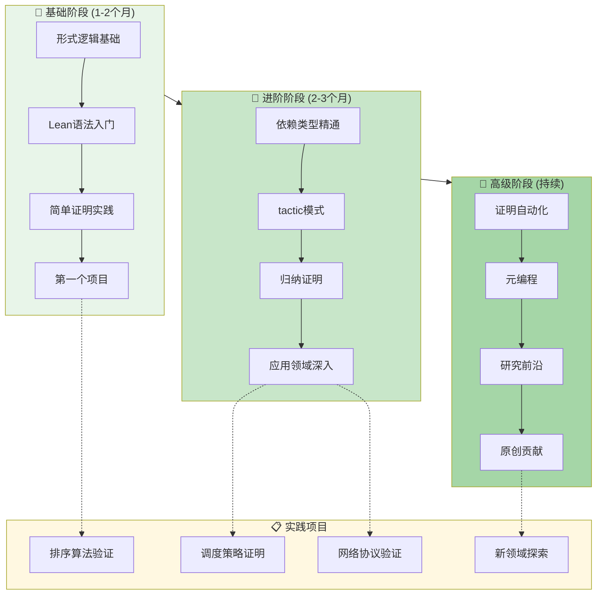

---

## 2. 阶段一：基础阶段（1-2个月）

### 2.1 阶段目标

- ✅ 理解命题逻辑和一阶逻辑
- ✅ 掌握 Lean 基本语法和类型系统
- ✅ 能够编写 10-50 行规模的简单证明
- ✅ 完成首个完整的形式化验证项目

### 2.2 详细学习计划

#### 第1-2周：数学与逻辑基础

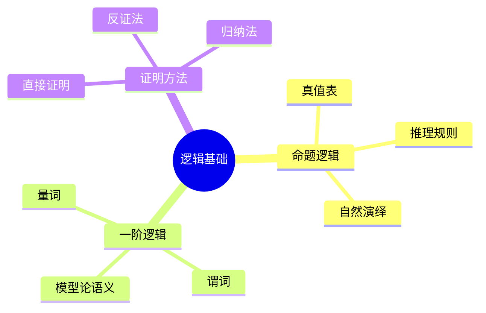

**学习目标**:

| 主题 | 产出 | 验证方式 |
|-----|------|---------|
| 命题逻辑 | 真值表计算程序 | 手工验证 |
| 自然演绎 | 10个证明练习 | 对照标准答案 |
| 归纳原理 | 理解数学归纳法 | 能解释Peano公理 |

**推荐资源**:

- [01_基础理论/01_命题逻辑基础](../01_基础理论/01_命题逻辑基础.md)
- 《Logic in Computer Science》第1-2章
- 视频: Lean Prover 官方教程

**每日投入**: 1-2 小时理论学习

---

#### 第3-4周：Lean环境搭建与语法

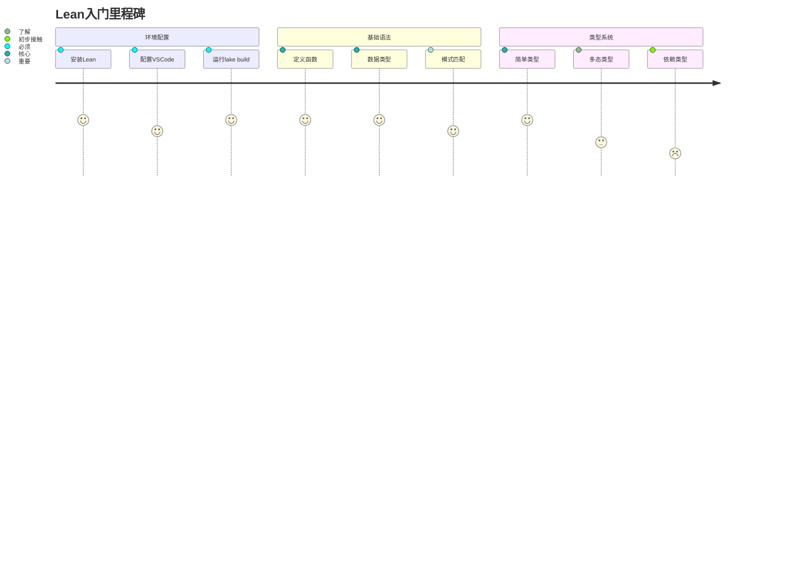

**核心任务清单**:

- [ ] 成功运行 `lean --version` 和 `lake build`
- [ ] 理解 `def`, `inductive`, `structure` 关键字
- [ ] 掌握函数定义和递归
- [ ] 完成 20 个基础语法练习

**代码示例目标**:

```lean
-- 第3周末应能编写
inductive Nat where
  | zero : Nat
  | succ : Nat → Nat

def add : Nat → Nat → Nat
  | Nat.zero, n => n
  | Nat.succ m, n => Nat.succ (add m n)

theorem add_zero (n : Nat) : add n Nat.zero = n := by
  induction n with
  | zero => rfl
  | succ n ih => simp [add, ih]
```

**参考文档**:

- [00_GETTING_STARTED.md](../00_GETTING_STARTED.md)
- [02_实现技术/01_Lean语法速览](../02_实现技术/01_Lean语法速览.md)

---

#### 第5-6周：简单证明实践

**学习主题**:

| 主题 | 难度 | 关键概念 |
|-----|------|---------|
| tactic基础 | ⭐⭐ | `intro`, `apply`, `exact` |
| 等式推理 | ⭐⭐ | `rw`, `simp`, `calc` |
| 反证法 | ⭐⭐⭐ | `by_contra`, `exfalso` |
| 存在证明 | ⭐⭐⭐ | `use`, `constructor` |

**练习计划**:

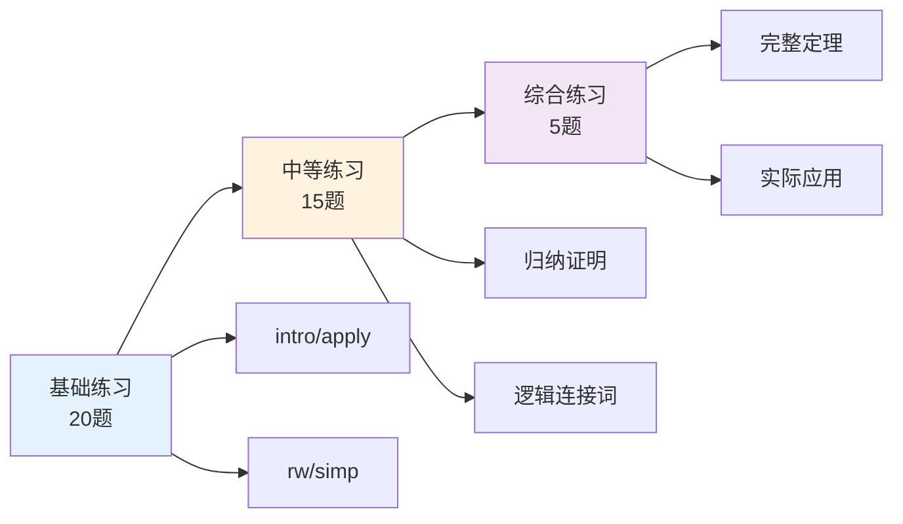

**参考文档**: [02_实现技术/02_证明策略](../02_实现技术/02_证明策略.md)

---

#### 第7-8周：首个项目

**项目选择**（任选其一）:

| 项目 | 难度 | 产出 | 前置要求 |
|-----|------|------|---------|
| 列表操作验证 | ⭐⭐ | 证明 `reverse (reverse xs) = xs` | 基础归纳 |
| 自然数性质 | ⭐⭐ | 证明加法交换律、结合律 | 等式推理 |
| 布尔函数 | ⭐ | 验证逻辑门正确性 | 真值表 |

**项目里程碑**:

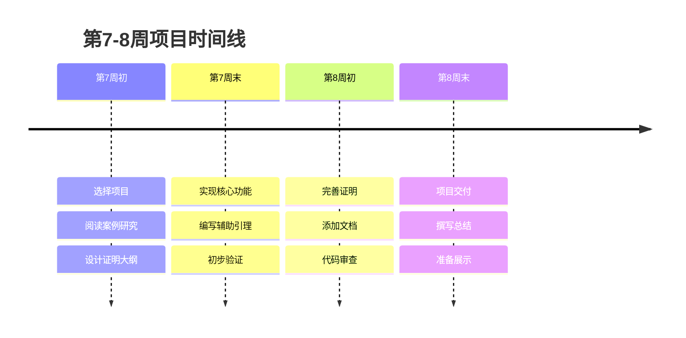

**检查清单**:

- [ ] 代码通过 `lake build` 无警告
- [ ] 包含定理陈述和完整证明
- [ ] 添加文档注释 `/-- ... -/`
- [ ] 撰写项目 README

---

## 3. 阶段二：进阶阶段（2-3个月）

### 3.1 阶段目标

- ✅ 精通依赖类型和高级类型特性
- ✅ 熟练使用 tactic 模式完成复杂证明
- ✅ 掌握归纳证明的多种变体
- ✅ 在特定应用领域完成中等复杂度项目

### 3.2 详细学习计划

#### 第9-12周：依赖类型与高级类型

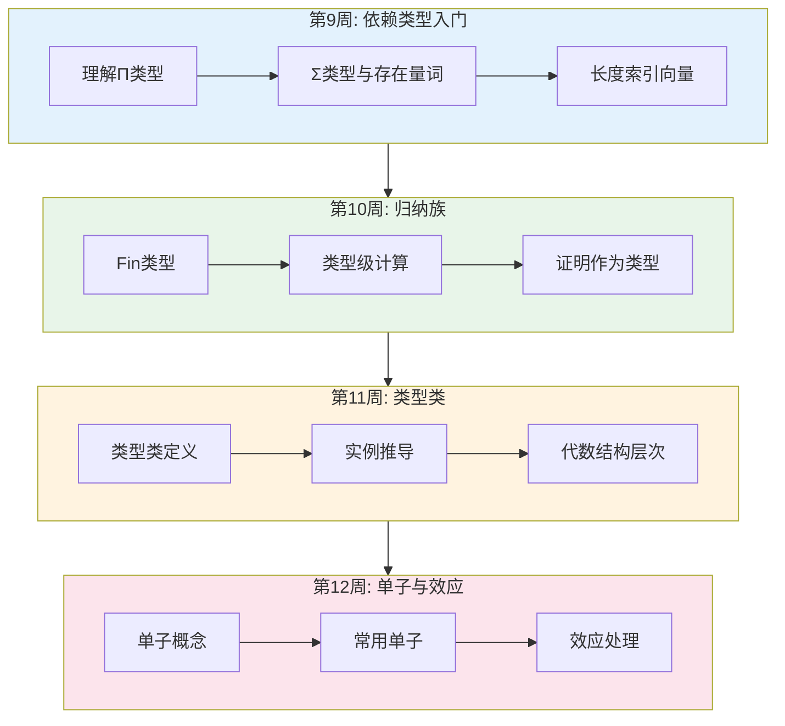

**关键学习点**:

| 周次 | 核心概念 | 练习产出 | 验证标准 |
|-----|---------|---------|---------|
| 9 | Π类型、Σ类型 | 实现 `Vec` 基本操作 | 类型检查通过 |
| 10 | 归纳族、索引 | 证明 `Vec` 性质 | 无公理依赖 |
| 11 | 类型类、隐式参数 | 定义群/环结构 | 实例自动推导 |
| 12 | Monad、bind | 实现状态monad | 满足monad律 |

**参考文档**:

- [01_基础理论/03_依赖类型](../01_基础理论/03_依赖类型.md)
- [01_基础理论/04_归纳族与归纳原理](../01_基础理论/04_归纳族与归纳原理.md)
- [01_基础理论/05_类型类系统](../01_基础理论/05_类型类系统.md)

---

#### 第13-16周：证明策略精通

**Tactic进阶路线图**:

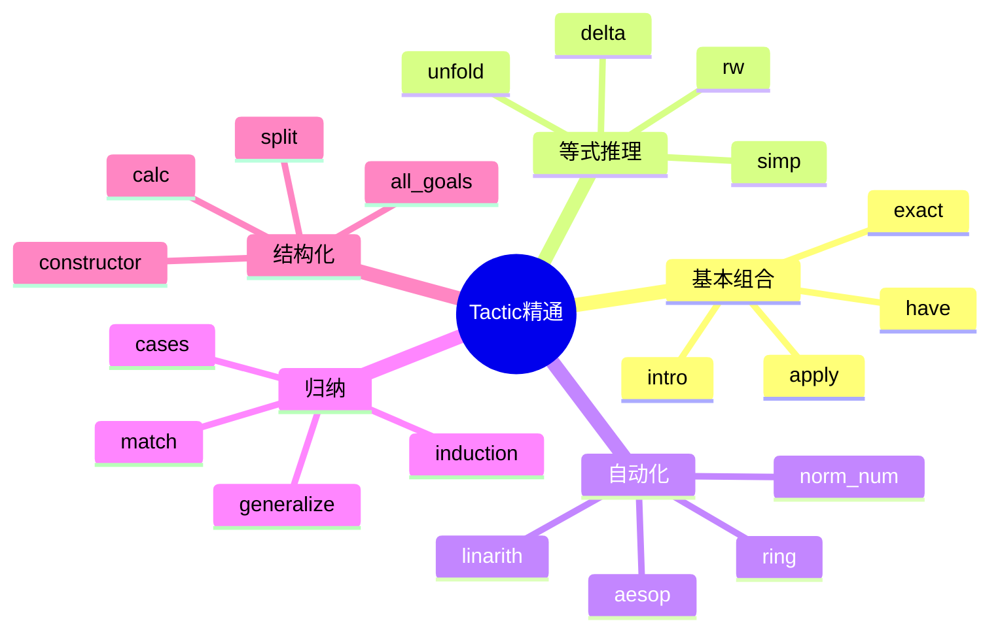

**每周目标**:

| 周 | 主题 | 核心Tactic | 练习数量 |
|---|------|-----------|---------|
| 13 | 控制流 | `have`, `suffices`, `show` | 10 |
| 14 | 目标管理 | `all_goals`, `any_goals`, `focus` | 10 |
| 15 | 自动化 | `aesop`, `simp_all`, `done` | 15 |
| 16 | 自定义 | `macro`, `elab`, `syntax` | 5 |

**案例研究**:

- [05_案例研究/02_中等复杂度证明](../05_案例研究/02_中等复杂度证明.md)
- [02_实现技术/03_归纳证明模式](../02_实现技术/03_归纳证明模式.md)

---

#### 第17-20周：应用领域深入

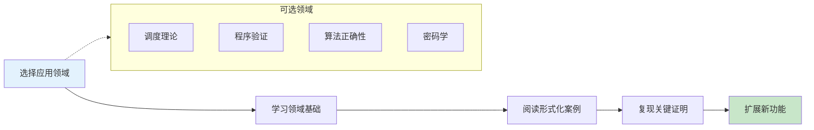

**调度理论专项路径**（示例）:

| 阶段 | 内容 | 参考文档 |
|-----|------|---------|
| 基础 | 调度模型、符号、分类法 | [03_应用领域/01_调度理论/00_概述](../03_应用领域/01_调度理论/00_概述.md) |
| 简单算法 | FCFS、SJF证明 | [03_应用领域/01_调度理论/01_基础调度算法](../03_应用领域/01_调度理论/01_基础调度算法.md) |
| 实时调度 | EDF、RMS可调度性 | [03_应用领域/01_调度理论/02_实时调度分析](../03_应用领域/01_调度理论/02_实时调度分析.md) |
| 高级性质 | 最优性、稳定性 | [03_应用领域/01_调度理论/03_高级性质证明](../03_应用领域/01_调度理论/03_高级性质证明.md) |

**阶段产出要求**:

- 完整理解一个调度算法的形式化证明
- 能够修改算法条件并重新证明
- 撰写技术分析报告（2000字）

---

## 4. 阶段三：高级阶段（持续学习）

### 4.1 阶段目标

- ✅ 掌握证明自动化技术
- ✅ 能够开发自定义 tactic 和工具
- ✅ 跟踪研究前沿，理解最新进展
- ✅ 在特定领域做出原创贡献

### 4.2 高级主题路径

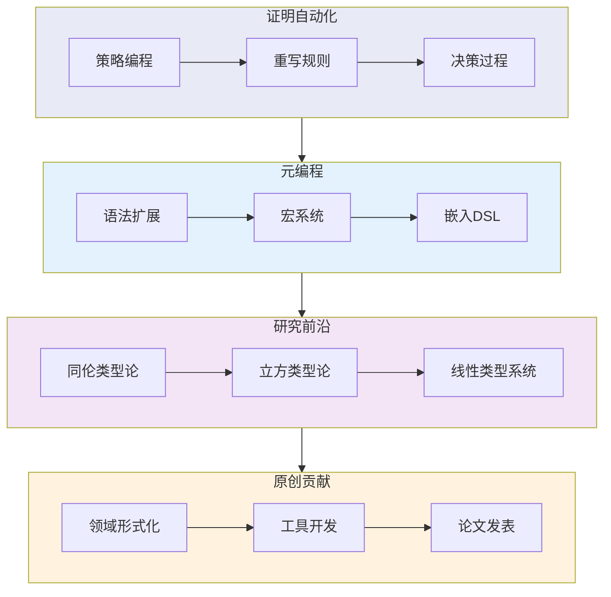

### 4.3 专项能力培养

#### 证明自动化

| 主题 | 难度 | 应用 | 学习资源 |
|-----|------|-----|---------|
| Aesop配置 | ⭐⭐⭐ | 自动证明搜索 | Aesop文档 |
| 重写策略 | ⭐⭐⭐⭐ | 等式自动推理 | `simp` 实现 |
| SMT集成 | ⭐⭐⭐⭐ | 复杂约束求解 | Lean-SMT |
| 反射证明 | ⭐⭐⭐⭐⭐ | 高效可计算证明 | `Decidable` |

#### 元编程

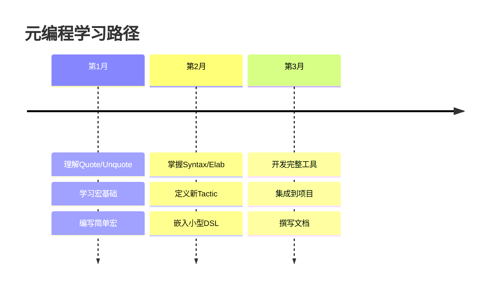

#### 研究前沿

**前沿主题及入门路径**:

| 领域 | 当前热点 | 入门论文 | Lean支持 |
|-----|---------|---------|---------|
| HoTT | 计算解释 | HoTT Book | `lean4-hott` |
| 立方类型论 | 高阶归纳类型 | CCHM论文 | `yacctt` |
| 线性逻辑 | 资源敏感推理 | Girard论文 | 实验性支持 |
| 效应系统 | 代数效应 | Plotkin/Power | 研究中 |

**参考**: [04_研究前沿.md](./04_研究前沿.md)

---

## 5. 实践项目建议

### 5.1 项目分级

```mermaid
quadrantChart
    title 项目复杂度 vs 学习价值
    x-axis 低复杂度 --> 高复杂度
    y-axis 基础练习 --> 研究价值

    quadrant-1 探索性研究项目
    quadrant-2 核心学习项目
    quadrant-3 入门练习项目
    quadran-4 工程挑战项目

    "列表反转": [0.2, 0.2]
    "排序算法": [0.4, 0.4]
    "调度策略": [0.6, 0.7]
    "网络协议": [0.7, 0.6]
    "HoTT基础": [0.8, 0.8]
    "编译器验证": [0.9, 0.9]
```

### 5.2 推荐项目列表

#### 入门级（基础阶段）

| 项目 | 描述 | 预计时间 | 关键技能 |
|-----|------|---------|---------|
| 布尔代数 | 定义布尔运算并验证德摩根律 | 1周 | 基本定义、等式证明 |
| 自然数运算 | 实现加减乘除并证明基本性质 | 2周 | 归纳证明、递归 |
| 列表操作 | 实现 map/filter/reduce 并验证 | 2周 | 高阶函数、结构归纳 |
| 二叉树 | 定义树结构并验证遍历性质 | 1周 | 递归数据类型 |

#### 进阶级（进阶阶段）

| 项目 | 描述 | 预计时间 | 关键技能 |
|-----|------|---------|---------|
| 插入排序 | 验证排序正确性 | 2周 | 排列、有序性 |
| 优先队列 | 实现堆并验证性质 | 3周 | 复杂归纳、不变式 |
| 简单调度器 | FCFS/SJF 可调度性证明 | 3周 | 时序逻辑、量词 |
| 栈机语义 | 定义操作语义并证明类型安全 | 4周 | 形式语义、关系 |

#### 高级级（高级阶段）

| 项目 | 描述 | 预计时间 | 关键技能 |
|-----|------|---------|---------|
| EDF可调度性 | 完全形式化实时调度理论 | 1月 | 高级分析、优化 |
| 正则表达式 | 形式化匹配算法并验证 | 1月 | 自动机、语言理论 |
| 类型推断 | 实现Hindley-Milner并证明正确 | 2月 | 元理论、约束求解 |
| HoTT基础 | 形式化基本同伦概念 | 持续 | 同伦类型论 |

---

## 6. 学习资源汇总

### 6.1 文档地图

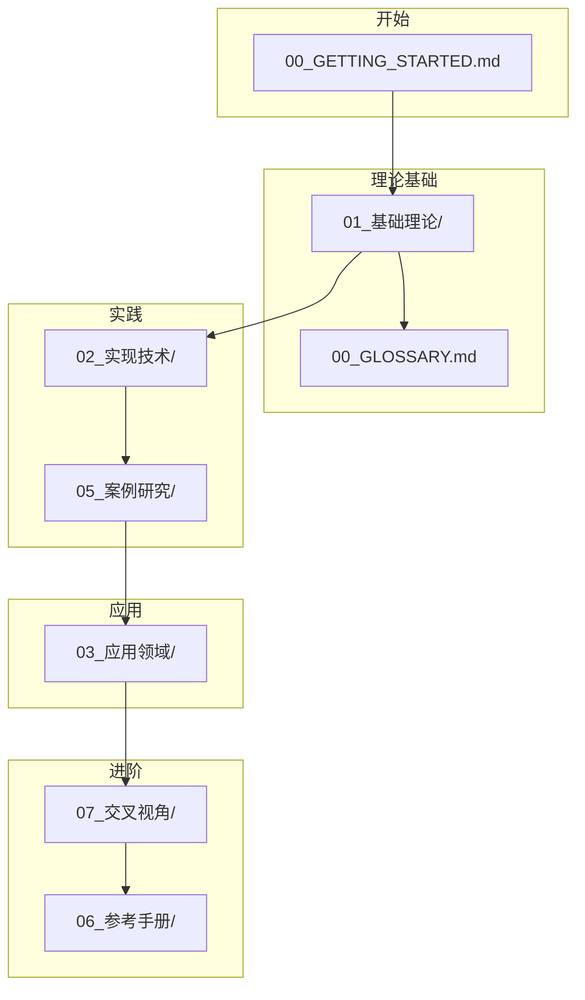

### 6.2 外部资源

| 类型 | 资源 | 用途 |
|-----|------|-----|
| 官方 | [Lean 4 Manual](https://leanprover.github.io/lean4/doc/) | 权威参考 |
| 书籍 | _Theorem Proving in Lean 4_ | 系统学习 |
| 书籍 | _Functional Programming in Lean_ | FP视角 |
| 课程 | CMU 15-818 | 高级类型论 |
| 社区 | [Lean Zulip](https://leanprover.zulipchat.com/) | 问题求助 |
| 仓库 | [Lean 4 Examples](https://github.com/leanprover/lean4-samples) | 实例代码 |

---

## 7. 学习评估

### 7.1 自评检查点

#### 基础阶段完成标准

- [ ] 能够解释 Curry-Howard 同构
- [ ] 独立编写 50 行以内的正确证明
- [ ] 理解并能够使用 10 个以上常用 tactic
- [ ] 完成至少 1 个完整小项目

#### 进阶阶段完成标准

- [ ] 能够使用依赖类型设计数据结构
- [ ] 掌握结构归纳和良基归纳
- [ ] 能够阅读中等复杂度的库代码
- [ ] 在应用领域完成有实质内容的项目

#### 高级阶段里程碑

- [ ] 开发自定义 tactic 或工具
- [ ] 跟踪并理解研究前沿论文
- [ ] 为开源项目贡献代码或证明
- [ ] 发表技术文章或论文

### 7.2 进度追踪表

| 阶段 | 开始日期 | 目标完成 | 实际完成 | 状态 |
|-----|---------|---------|---------|-----|
| 基础阶段 | | | | ⬜ |
| 进阶阶段 | | | | ⬜ |
| 高级阶段 | | | | ⬜ |

---

> 💡 **提示**: 学习形式化方法是一场马拉松而非短跑。保持规律的学习节奏，定期复习和实践，比短期高强度学习更有效。

**相关文档**:

- [00_GETTING_STARTED.md](../00_GETTING_STARTED.md) - 入门指南
- [00_GLOSSARY.md](../00_GLOSSARY.md) - 术语速查
- [04_研究前沿.md](./04_研究前沿.md) - 研究动态
---

## 📚 延伸阅读

- [11.6 稳定性分析](./11_系统科学/02_控制论/02.2_稳定性分析.md)
- [1.2 形式语义 (Formal Semantics)](./02_形式语言/01_形式语言基础/01.2_形式语义.md)
- [1. 单子与函子](./03_编程范式/04_函数式编程/04.2_单子与函子.md)
- [04.3 单子与函子](./03_编程范式/04_函数式编程/04.3_单子与函子.md)
- [04.2 高阶函数](./03_编程范式/04_函数式编程/04.2_高阶函数.md)
