# 07.4 研究前沿综述

> **版本**: 1.0
> **更新日期**: 2026-04-11
> **覆盖领域**: 形式化方法、类型论、调度理论
> **更新周期**: 建议每季度回顾

---

## 1. 前沿概览

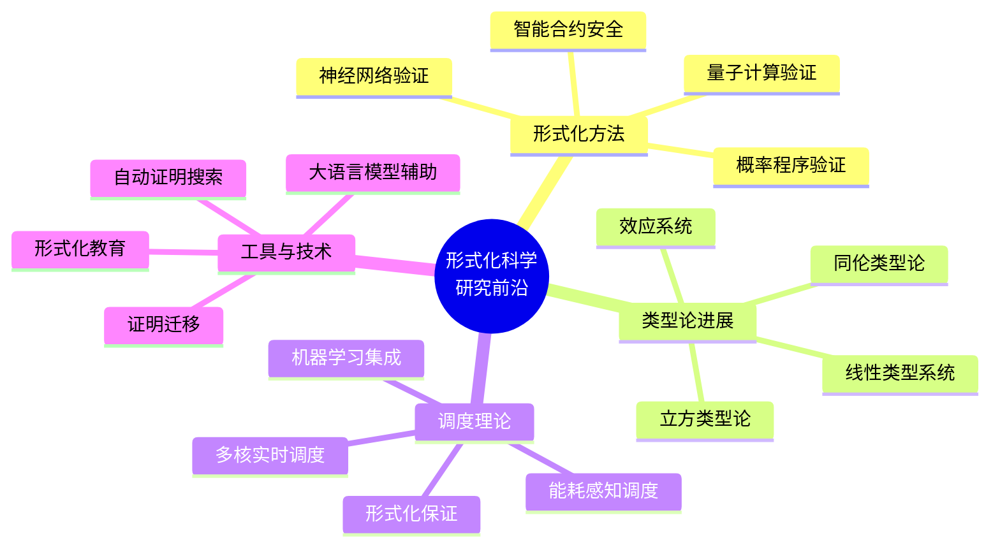

---

## 2. 形式化方法最新进展

### 2.1 神经网络验证 (Neural Network Verification)

#### 2.1.1 研究背景

深度学习系统在安全关键领域的应用推动了对神经网络形式化验证的需求。主要挑战在于处理高维输入空间和非线性激活函数。

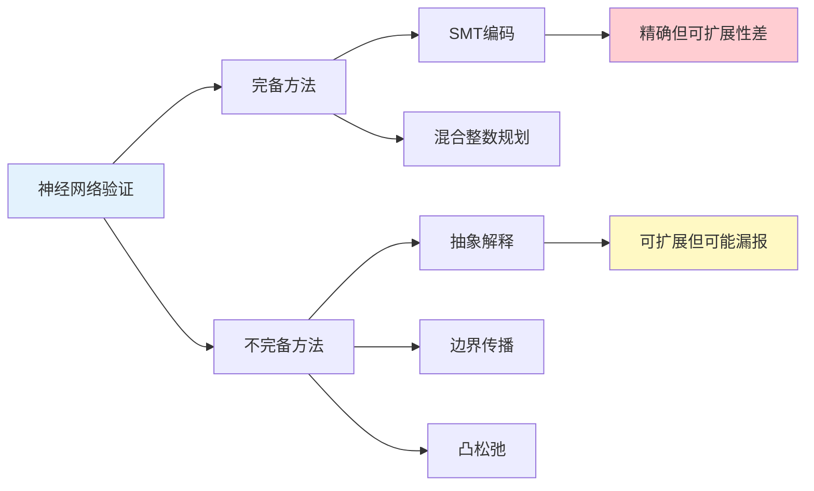

#### 2.1.2 当前热点

| 方向 | 代表工作 | 关键进展 | 挑战 |
|-----|---------|---------|-----|
| **凸松弛优化** | α-β-CROWN | 大规模图像分类验证 | 精度-效率权衡 |
| **抽象域设计** | DeepPoly | 多项式时间验证 | 近似误差累积 |
| **规范学习** | NNVerification-Spec | 从数据中推断规范 | 规范正确性 |
| **形式化基础** | Isabelle/Lean形式化 | 验证工具的可靠性 | 复杂性高 |

#### 2.1.3 形式化潜力

Lean 在这方面的潜在贡献：

- **理论形式化**: 验证凸松弛的正确性证明
- **算法验证**: 证明边界计算算法的可靠性
- **组合框架**: 建立不同验证方法的统一理论

**相关代码示例**:

```lean
-- 神经网络层的抽象表示
structure NeuralNetworkLayer (inputDim outputDim : Nat) where
  weights : Matrix (Fin outputDim) (Fin inputDim) Float
  bias : Vector (Fin outputDim) Float
  activation : ActivationFunction

-- 鲁棒性规范
inductive RobustnessProperty where
  | localEpsilon : (x : Input) → (ε : Float) → (f : NeuralNetwork) →
                   (∀ y, ‖y - x‖ ≤ ε → f.classify y = f.classify x) →
                   RobustnessProperty
  | globalLipschitz : (L : Float) → (∀ x y, ‖f x - f y‖ ≤ L * ‖x - y‖) →
                     RobustnessProperty
```

---

### 2.2 概率程序验证 (Probabilistic Program Verification)

#### 2.2.1 核心挑战

概率程序结合了传统计算与随机采样，其验证需要处理：

- 概率分布的精确定义
- 期望性质的证明
- 几乎必然性质的建立

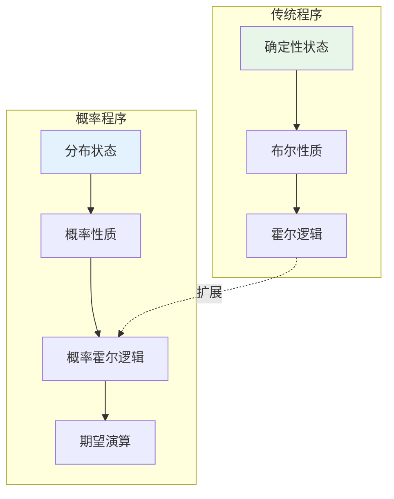

#### 2.2.2 理论进展

| 框架 | 核心创新 | 形式化状态 | Lean适用性 |
|-----|---------|-----------|-----------|
| **pGCL** | 概率卫式命令语言 | 部分形式化 (Coq) | 高 |
| **PrHL** | 概率关系霍尔逻辑 | 有原型实现 | 高 |
| **Iris** | 高阶分离逻辑扩展 | 完整 (Coq) | 中等 |
| **PPAML** | 概率程序ML验证 | 进行中 | 高 |

#### 2.2.3 调度理论联系

概率方法在实时系统中的应用：

- **随机任务到达**: 泊松过程建模
- **概率截止时间满足**: 服务质量保证
- **能耗优化**: 随机动态规划

---

### 2.3 智能合约形式化验证

#### 2.3.1 领域重要性

区块链智能合约一旦部署无法修改，形式化验证成为确保安全的终极手段。

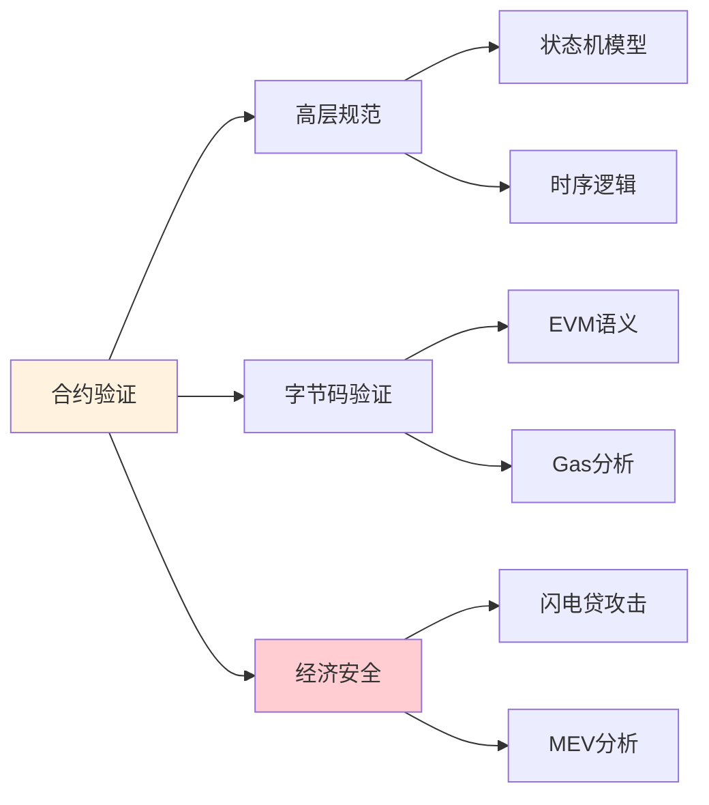

#### 2.3.2 最新工具与成果

| 项目 | 目标链 | 技术特色 | 验证规模 |
|-----|-------|---------|---------|
| **CertiK** | 多链 | 自动化+专家审核 | 1000+合约 |
| **KEVM** | 以太坊 | K框架完整语义 | EVM完整 |
| **ConCert** | ConCert | Coq框架 | 中等复杂度 |
| **Scribble** | 以太坊 | 运行时验证 | 轻量级 |

---

## 3. 类型论研究热点

### 3.1 同伦类型论 (Homotopy Type Theory, HoTT)

#### 3.1.1 核心思想

HoTT将类型视为空间，相等性证明视为路径，革命性地改变了数学基础。

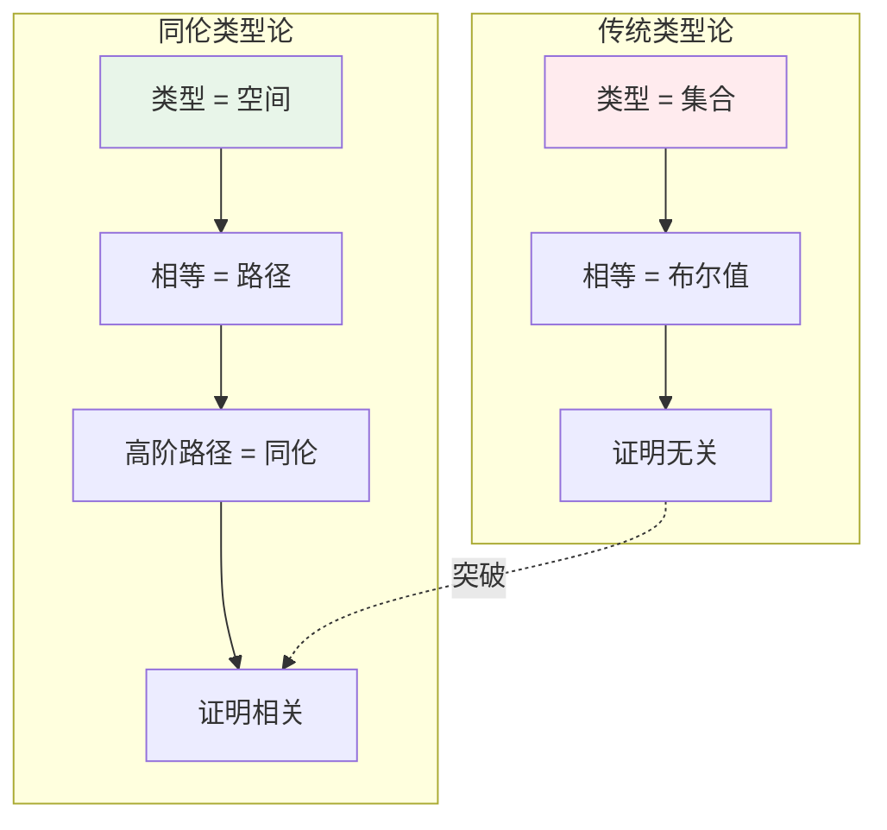

#### 3.1.2 理论框架

| 概念 | 直觉解释 | 形式化定义 | 应用价值 |
|-----|---------|-----------|---------|
| **恒等类型** | 点之间的路径空间 | `x =_A y` | 同伦不变量 |
| **单值性** | 等价即相等 | `(A ≃ B) ≃ (A = B)` | 结构传递 |
| **高阶归纳类型** | 生成元和关系 | HITs | 商类型、几何对象 |
| **截断层** | 路径层数限制 | `is-n-type` | 逻辑层次 |

#### 3.1.3 立方类型论 (Cubical Type Theory)

作为 HoTT 的计算化实现，立方类型论解决了单值性公理的计算解释问题。

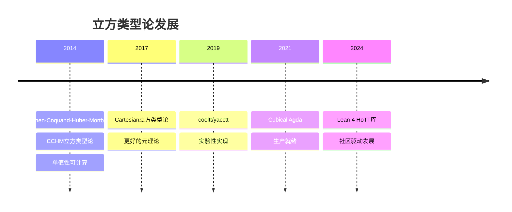

**当前状态**:

- **Agda**: 最成熟的立方类型论实现
- **Lean 4**: `lean4-hott` 库积极开发中
- **Coq**: HoTT库持续维护

#### 3.1.4 本仓库相关潜力

```lean
-- HoTT风格的向量相等（概念示例）
namespace HoTT

  -- 路径类型（恒等类型）
  inductive Path {A : Type} : A → A → Type where
    | refl (a : A) : Path a a

  -- 路径复合（路径传递性）
  def Path.trans {A : Type} {a b c : A} :
    Path a b → Path b c → Path a c := sorry

  -- 单值性原理（概念）
  axiom univalence : ∀ (A B : Type),
    (A ≃ B) ≃ (Path A B)

end HoTT
```

---

### 3.2 线性类型系统 (Linear Type Systems)

#### 3.2.1 理论动机

线性逻辑通过限制资源使用次数，实现：

- 内存安全管理
- 协议正确性保证
- 并发程序验证

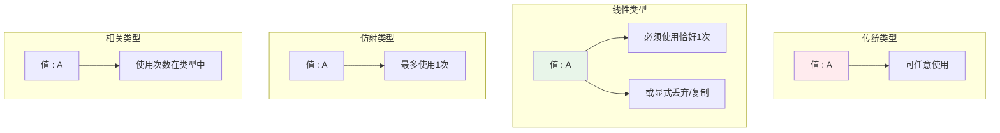

#### 3.2.2 当前研究方向

| 方向 | 代表系统 | 关键特性 | 与Lean关系 |
|-----|---------|---------|-----------|
| **线性Haskell** | Linear Haskell | 后向兼容 | 借鉴设计 |
| **Rust借用检查** | RustBelt | 分离逻辑基础 | 可形式化 |
| **ATS** | ATS2 | 依赖+线性 | 理论参考 |
| **Quill** | 研究原型 | 量化类型 | 实验性 |

#### 3.2.3 调度理论应用

资源受限调度中的线性类型应用：

- **处理器资源**: 确保每个任务获取恰好一个处理器
- **共享锁**: 防止死锁的线性协议
- **能源预算**: 精确追踪能量消耗

---

### 3.3 效应系统 (Effect Systems)

#### 3.3.1 从单子到代数效应

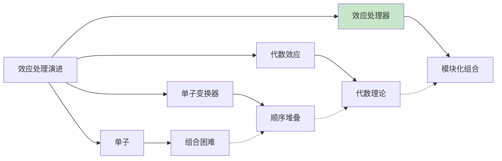

#### 3.3.2 形式化现状

| 系统 | 特性 | 形式化程度 | 学习资源 |
|-----|------|-----------|---------|
| **Eff** | 原生代数效应 | 理论完备 | Eff语言文档 |
| **Koka** | 行多态+效应 | 部分形式化 | Koka书籍 |
| **Frank** | 效应处理器 | 类型安全证明 | 论文 |
| **Lean Effect** | 实验性 | 原型 | 社区讨论 |

---

## 4. 调度理论前沿

### 4.1 多核实时调度新进展

#### 4.1.1 分区 vs 全局 vs 混合

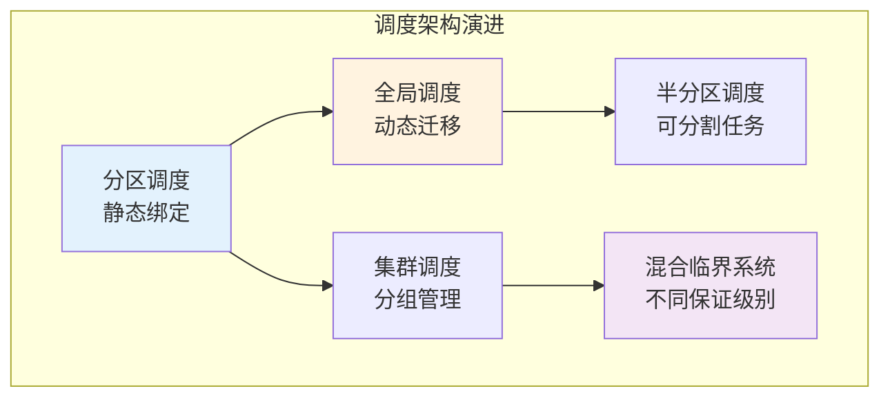

#### 4.1.2 最新理论结果

| 问题 | 经典结果 | 最新进展 | 形式化状态 |
|-----|---------|---------|-----------|
| **EDF可调度性** | 密度≤m可调度 | 更精确测试 | 部分形式化 |
| **优先级分配** | Audsley算法 | 最优性证明 | 可形式化 |
| **资源共享** | PCP/PIP | 更优协议 | 待形式化 |
| **温度约束** | 热感知调度 | 形式化保证 | 研究中 |

#### 4.1.3 形式化机遇

本仓库在调度理论形式化方面的潜在贡献：

```lean
-- 多核可调度性定义（研究方向）
structure MultiprocessorSchedule where
  numCores : Nat
  tasks : List Task
  schedule : Time → Core → Option Task

-- 全局EDF可调度性条件
inductive GlobalEDFSchedulable : MultiprocessorSchedule → Prop where
  | schedulable :
      ∀ (task : Task),
      task ∈ schedule.tasks →
      totalUtilization schedule.tasks ≤ numCores →
      densityTest task →
      (∀ t, cumulativeExecution task t ≥ requiredExecution task t) →
      GlobalEDFSchedulable schedule
```

---

### 4.2 能耗感知调度

#### 4.2.1 研究动机

嵌入式系统和数据中心的能耗优化需求催生新调度理论。

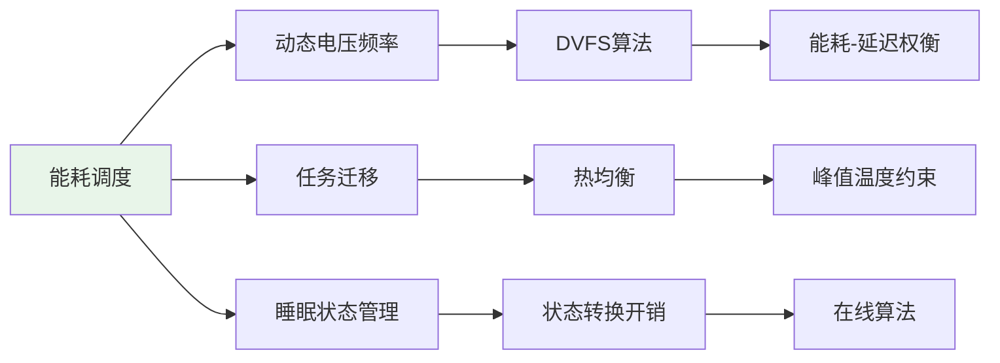

#### 4.2.2 理论挑战

| 挑战 | 描述 | 形式化难点 |
|-----|------|-----------|
| **能耗模型** | 非线性、硬件相关 | 抽象与精确平衡 |
| **竞争分析** | 在线算法性能界 | 最坏情况枚举 |
| **温度动态** | RC热模型 | 连续-离散混合 |
| **可靠性** | DVFS对错误率影响 | 概率推理 |

---

### 4.3 机器学习与调度

#### 4.3.1 学习增强调度

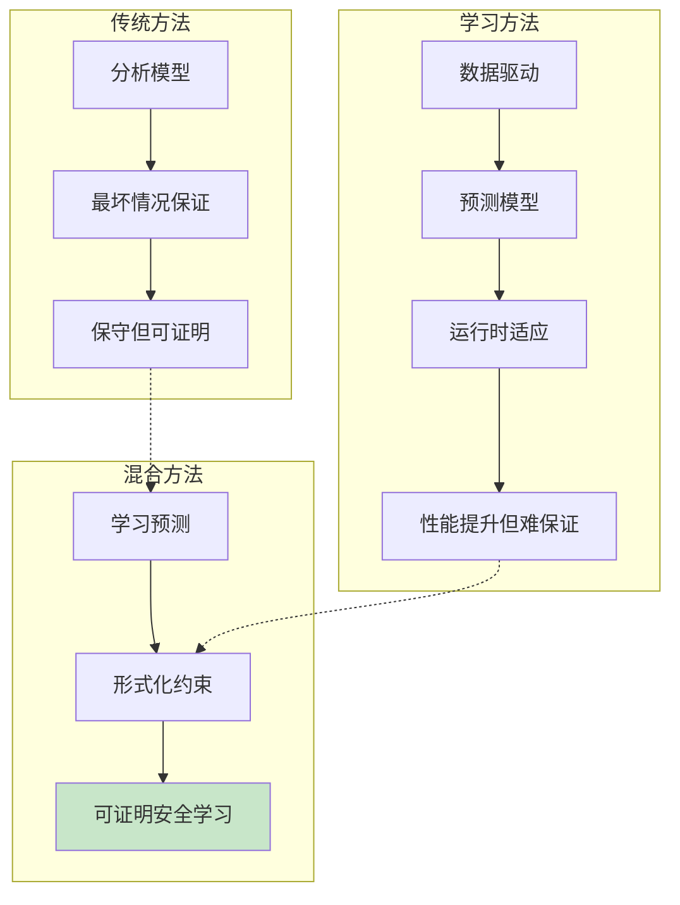

#### 4.3.2 研究前沿

| 方向 | 方法 | 保证类型 | 与本仓库联系 |
|-----|------|---------|-----------|
| **学习型WCET** | 神经网络预测 | 概率保证 | 概率形式化 |
| **强化学习调度** | DQN/PPO | 经验安全 | 安全强化学习 |
| **神经符号** | 可微分逻辑 | 结构保证 | 结合方向 |

---

## 5. 未来趋势预测

### 5.1 技术融合趋势

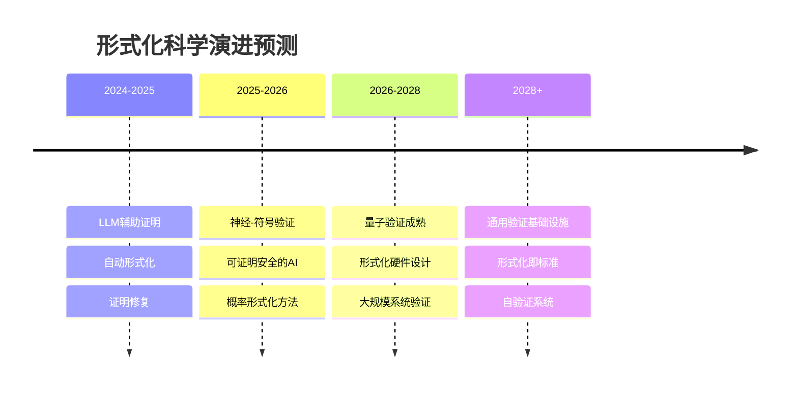

### 5.2 大语言模型与形式化方法

#### 5.2.1 当前应用

| 应用 | 代表工作 | 效果 | 局限 |
|-----|---------|-----|-----|
| **自动证明搜索** | Copra, Thoral | 中等难度证明 | 复杂归纳困难 |
| **证明修复** | GPT-4修复 | 简单错误 | 深层错误难处理 |
| **形式化翻译** | LeanDojo | 自然语言→形式化 | 需要大量标注 |
| **代码生成** | CodeT5, Codex | 模板代码 | 保证缺失 |

#### 5.2.2 未来方向

- **神经定理证明器**: 端到端证明生成
- **交互式协助**: 人机协作证明开发
- **教育工具**: 个性化形式化学习

---

### 5.3 形式化基础设施

#### 5.3.1 标准化需求

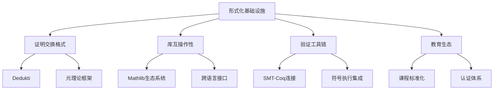

#### 5.3.2 产业应用趋势

| 领域 | 当前状态 | 5年预测 | 关键驱动力 |
|-----|---------|--------|-----------|
| **航空航天** | 广泛使用 | 完全形式化 | DO-178C更新 |
| **汽车** | 起步 | ISO 26262强化 | 自动驾驶 |
| **金融** | 智能合约 | 核心系统 | 监管要求 |
| **医疗** | 设备验证 | AI/ML验证 | FDA指导原则 |

---

## 6. 本仓库研究机会

### 6.1 短期目标（1年内）

| 方向 | 具体任务 | 预期产出 | 难度 |
|-----|---------|---------|-----|
| 调度形式化 | 完成EDF最优性证明 | 形式化论文 | ⭐⭐⭐ |
| 教育材料 | 开发交互式教程 | 教程系列 | ⭐⭐ |
| 工具链 | Lake构建优化 | 工作流改进 | ⭐⭐ |

### 6.2 中期目标（2-3年）

| 方向 | 具体任务 | 预期产出 | 创新性 |
|-----|---------|---------|-------|
| 概率调度 | 随机任务模型形式化 | 新理论框架 | 高 |
| 多核分析 | 全局调度可调度性 | 完整形式化 | 高 |
| 案例库 | 工业规模案例 | 参考实现 | 中 |

### 6.3 长期愿景（5年+）

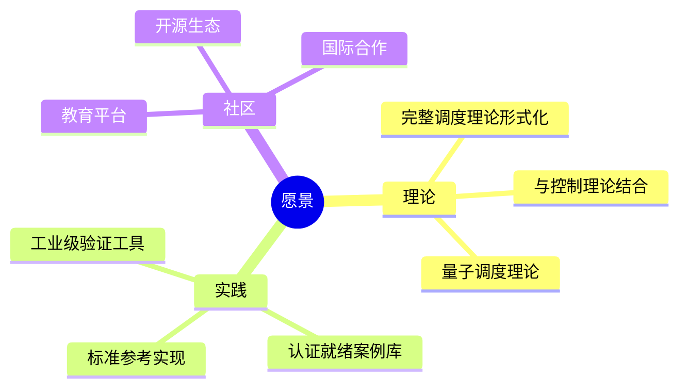

---

## 7. 参考资源

### 7.1 顶级会议与期刊

| 类型 | 名称 | 重点领域 |
|-----|------|---------|
| 会议 | POPL | 编程语言原理 |
| 会议 | CAV | 计算机辅助验证 |
| 会议 | ITP | 交互式定理证明 |
| 会议 | RTSS/ECRTS | 实时系统 |
| 期刊 | JAR | 自动推理 |
| 期刊 | FMSD | 形式化方法 |

### 7.2 重要论文

| 年份 | 作者 | 标题 | 影响 |
|-----|------|-----|-----|
| 2013 | Univalent Foundations | HoTT Book | 数学基础革命 |
| 2018 | Jung et al. | Iris from the ground up | 分离逻辑标准 |
| 2021 | Baanen et al. | Mathlib | 数学库典范 |
| 2023 | Gmehlich et al. | RT-Proofs | 实时形式化 |

### 7.3 在线资源

- [Lean Community](https://leanprover-community.github.io/)
- [arXiv cs.LO](https://arxiv.org/list/cs.LO/recent)
- [Formal Methods Wiki](https://formalmethods.wikia.org/)

---

> 🔬 **研究提示**: 形式化科学是一个快速发展的领域。建议定期关注顶级会议论文，参与社区讨论，并保持对新工具的开放态度。

**相关文档**:

- [03_学习路线图.md](./03_学习路线图.md) - 学习规划
- [00_GLOSSARY.md](../00_GLOSSARY.md) - 术语参考
- [03_应用领域/01_调度理论/](./03_应用领域/01_调度理论/) - 应用基础
