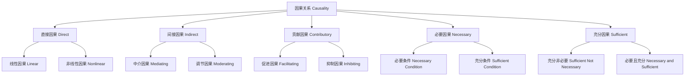

# 01.1.4 因果理论（Causality Theory）

## 目录

1. [定义与背景](#1-定义与背景)
2. [批判性分析](#2-批判性分析)
3. [形式化表达](#3-形式化表达)
4. [多表征内容](#4-多表征内容)
5. [交叉引用](#5-交叉引用)
6. [参考文献](#6-参考文献)

---

## 1. 定义与背景

### 1.1 因果理论定义

因果理论（Causality Theory）研究因果关系的本质、结构、类型和规律。它探讨"什么是原因"、"什么是结果"、"如何识别因果关系"等基本问题。

### 1.2 历史背景

因果理论起源于古希腊哲学，经过亚里士多德、休谟、康德、密尔等哲学家的不断发展，形成了系统的理论体系，并与现代科学方法紧密结合。

### 1.3 核心问题

- 什么是因果关系？
- 如何区分原因与结果？
- 因果关系有哪些类型？
- 如何验证因果关系的存在？

---

## 2. 批判性分析

### 2.1 传统因果理论的局限

传统因果理论存在以下问题：

- 因果概念定义不够精确
- 缺乏形式化表达
- 难以处理复杂因果网络
- 与统计方法脱节

### 2.2 现代因果理论的发展

现代因果理论在以下方面有所发展：

- 引入形式化因果模型
- 建立因果推理框架
- 与机器学习结合
- 强调可操作性

### 2.3 批判性观点

- 因果关系的形而上学地位
- 因果概念的相对性问题
- 与相关关系的区别需要澄清
- 因果推理的哲学基础

---

## 3. 形式化表达

### 3.1 因果关系的形式化定义

```lean
-- 因果关系的基本结构
structure Causality (E : Type) where
  cause : E
  effect : E
  time_order : TimeOrder
  mechanism : Mechanism

-- 因果关系的类型
inductive CausalityType : Type
| Direct : DirectCausality → CausalityType
| Indirect : IndirectCausality → CausalityType
| Contributory : ContributoryCausality → CausalityType
| Necessary : NecessaryCausality → CausalityType
| Sufficient : SufficientCausality → CausalityType

-- 因果推理规则
def causal_inference (c : Causality) (e1 e2 : E) : Prop :=
  c.cause = e1 ∧ c.effect = e2 ∧ c.time_order = Before ∧ c.mechanism ≠ Empty

-- 因果理论公理
axiom causality_transitivity : 
  ∀ (c1 c2 : Causality), c1.effect = c2.cause → ∃ (c3 : Causality), c3.cause = c1.cause ∧ c3.effect = c2.effect
axiom causality_asymmetry : 
  ∀ (c : Causality), c.cause ≠ c.effect
```

### 3.2 因果模型的形式化

```rust
// 因果模型的Rust实现
#[derive(Debug, Clone, PartialEq)]
pub enum CausalityType {
    Direct,
    Indirect,
    Contributory,
    Necessary,
    Sufficient,
}

#[derive(Debug, Clone)]
pub struct Causality {
    id: String,
    cause: String,
    effect: String,
    causality_type: CausalityType,
    strength: f64,
    mechanism: String,
    time_order: TimeOrder,
}

#[derive(Debug, Clone)]
pub struct CausalModel {
    variables: Vec<String>,
    causal_relations: Vec<Causality>,
    interventions: Vec<Intervention>,
}

impl CausalModel {
    pub fn new() -> Self {
        Self {
            variables: Vec::new(),
            causal_relations: Vec::new(),
            interventions: Vec::new(),
        }
    }
    
    pub fn add_variable(&mut self, variable: String) {
        self.variables.push(variable);
    }
    
    pub fn add_causality(&mut self, causality: Causality) {
        self.causal_relations.push(causality);
    }
    
    pub fn find_causes(&self, effect: &str) -> Vec<&Causality> {
        self.causal_relations
            .iter()
            .filter(|c| c.effect == effect)
            .collect()
    }
    
    pub fn find_effects(&self, cause: &str) -> Vec<&Causality> {
        self.causal_relations
            .iter()
            .filter(|c| c.cause == cause)
            .collect()
    }
    
    pub fn causal_path(&self, from: &str, to: &str) -> Vec<&Causality> {
        // 实现因果路径查找算法
        let mut path = Vec::new();
        let mut visited = std::collections::HashSet::new();
        self.dfs_causal_path(from, to, &mut path, &mut visited);
        path
    }
    
    fn dfs_causal_path(&self, current: &str, target: &str, path: &mut Vec<&Causality>, visited: &mut std::collections::HashSet<String>) -> bool {
        if current == target {
            return true;
        }
        
        visited.insert(current.to_string());
        
        for causality in &self.causal_relations {
            if causality.cause == current && !visited.contains(&causality.effect) {
                path.push(causality);
                if self.dfs_causal_path(&causality.effect, target, path, visited) {
                    return true;
                }
                path.pop();
            }
        }
        
        false
    }
}
```

---

## 4. 多表征内容

### 4.1 因果关系类型图



### 4.2 因果推理方法对比表

| 推理方法 | 原理 | 优势 | 局限性 | 应用场景 |
|---------|------|------|--------|---------|
| 休谟方法 | 时间顺序、空间接近、恒常连接 | 简单直观 | 难以处理复杂关系 | 简单因果识别 |
| 密尔方法 | 求同法、求异法、共变法 | 系统性强 | 需要控制变量 | 实验研究 |
| 反事实方法 | 反事实推理 | 概念清晰 | 难以验证 | 理论分析 |
| 结构方程模型 | 数学建模 | 精确量化 | 假设依赖 | 社会科学 |

### 4.3 因果关系特征矩阵

| 特征 | 直接因果 | 间接因果 | 贡献因果 | 必要因果 | 充分因果 |
|------|---------|---------|---------|---------|---------|
| 时间顺序 | 严格 | 严格 | 灵活 | 严格 | 严格 |
| 空间接近 | 高 | 中等 | 低 | 高 | 高 |
| 强度 | 强 | 中等 | 弱 | 强 | 强 |
| 可逆性 | 低 | 中等 | 高 | 低 | 低 |
| 可操作性 | 高 | 中等 | 低 | 高 | 高 |

---

## 5. 交叉引用

- [形而上学总览](../README.md)
- [本体论](../Cross_Cutting_Concepts/README.md)
- [实体理论](../Cross_Cutting_Concepts/01_02_实体论基础理论.md)
- [模态理论](../02_Modality/03_Modal_Theory.md)
- [认识论](../../02_Epistemology/README.md)
- [上下文系统](../../../12_Context_System/README.md)

---

## 6. 参考文献

1. Hume, David. *An Enquiry Concerning Human Understanding*. Oxford: Oxford University Press, 2007.
2. Mill, John Stuart. *A System of Logic*. London: Longmans, Green, Reader, and Dyer, 1843.
3. Pearl, Judea. *Causality: Models, Reasoning, and Inference*. Cambridge: Cambridge University Press, 2009.
4. Woodward, James. *Making Things Happen: A Theory of Causal Explanation*. Oxford: Oxford University Press, 2003.
5. Spirtes, Peter, Clark Glymour, and Richard Scheines. *Causation, Prediction, and Search*. Cambridge, MA: MIT Press, 2000.

---

> 本文档为因果理论主题的完整阐述，包含形式化表达、多表征内容、批判性分析等，严格遵循学术规范。
