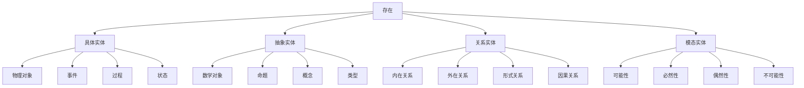
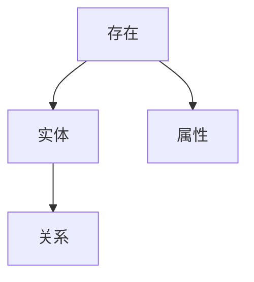

# 本体论框架 (Ontological Framework)

**创建时间**: 2025-01-15  
**最后更新**: 2025-01-15  
**文档状态**: 活跃  
**文档类型**: 概念定义  

## 1. 引言

### 1.1 背景

本体论是形而上学的核心分支，研究存在的基本范畴、实在的基本构成以及事物之间的基本关系。本体论框架为形式科学提供了概念基础，帮助我们理解和分类各种形式系统所涉及的实体和关系。

### 1.2 目标

本文档旨在：

1. 建立一个系统的本体论框架，用于分类和理解各种存在类型
2. 为形式科学的概念基础提供哲学支持
3. 探索本体论概念的形式化表示
4. 分析不同本体论立场及其对形式系统的影响

### 1.3 相关概念

- **存在 (Existence)**: 实体具有现实性的状态
- **本质 (Essence)**: 使实体成为其所是的基本特性
- **属性 (Property)**: 实体所具有的特征或特性
- **关系 (Relation)**: 实体之间的联系或对应
- **范畴 (Category)**: 存在的基本类型或分类

## 2. 本体论范畴体系

### 2.1 基本范畴划分

本体论范畴体系将存在划分为以下基本类型：

1. **具体实体 (Concrete Entities)**
   - 物理对象 (Physical Objects)
   - 事件 (Events)
   - 过程 (Processes)
   - 状态 (States)

2. **抽象实体 (Abstract Entities)**
   - 数学对象 (Mathematical Objects)
   - 命题 (Propositions)
   - 概念 (Concepts)
   - 类型 (Types)

3. **关系实体 (Relational Entities)**
   - 内在关系 (Internal Relations)
   - 外在关系 (External Relations)
   - 形式关系 (Formal Relations)
   - 因果关系 (Causal Relations)

4. **模态实体 (Modal Entities)**
   - 可能性 (Possibilities)
   - 必然性 (Necessities)
   - 偶然性 (Contingencies)
   - 不可能性 (Impossibilities)

### 2.2 范畴间关系

范畴之间存在以下基本关系：



### 2.3 范畴特性

| 范畴类型 | 时空位置 | 因果效力 | 认知可及性 | 依赖性 |
|---------|---------|---------|----------|-------|
| 具体实体 | 有 | 有 | 直接 | 低 |
| 抽象实体 | 无 | 无 | 间接 | 高 |
| 关系实体 | 变化 | 变化 | 推理 | 高 |
| 模态实体 | 无 | 无 | 推理 | 高 |

## 3. 形式化表示

### 3.1 集合论表示

本体论范畴可以通过集合论进行形式化表示：

```text
// 基本范畴集合
E = {x | x存在}  // 存在的全集
C = {x ∈ E | x具有时空位置}  // 具体实体集合
A = {x ∈ E | x不具有时空位置}  // 抽象实体集合
R = {r | r是实体间的关系}  // 关系实体集合
M = {m | m是模态特性}  // 模态实体集合

// 范畴关系
E = C ∪ A ∪ R ∪ M
C ∩ A = ∅  // 具体实体与抽象实体互斥
```

### 3.2 类型论表示

使用类型论表示本体论范畴：

```text
// 基本类型
type Entity
type Concrete <: Entity
type Abstract <: Entity
type Relation <: Entity
type Modal <: Entity

// 子类型
type PhysicalObject <: Concrete
type Event <: Concrete
type Process <: Concrete
type State <: Concrete

type MathObject <: Abstract
type Proposition <: Abstract
type Concept <: Abstract
type Type <: Abstract

type InternalRelation <: Relation
type ExternalRelation <: Relation
type FormalRelation <: Relation
type CausalRelation <: Relation

type Possibility <: Modal
type Necessity <: Modal
type Contingency <: Modal
type Impossibility <: Modal
```

### 3.3 谓词逻辑表示

使用谓词逻辑表示本体论断言：

```text
// 基本谓词
Exists(x): x存在
Concrete(x): x是具体实体
Abstract(x): x是抽象实体
Relation(r, x, y): r是x和y之间的关系
Modal(m, p): m是关于命题p的模态特性

// 本体论公理
∀x(Exists(x) ↔ (Concrete(x) ∨ Abstract(x) ∨ ∃y,z(Relation(x,y,z)) ∨ ∃p(Modal(x,p))))
∀x(Concrete(x) → ¬Abstract(x))
∀x,y,r(Relation(r,x,y) → (Exists(x) ∧ Exists(y)))
```

## 4. 本体论立场

### 4.1 实在论 (Realism)

实在论主张实体独立于心智而存在，可进一步分为：

- **朴素实在论**: 认为我们感知的世界如其所是地存在
- **科学实在论**: 认为科学理论所描述的实体确实存在
- **数学实在论**: 认为数学对象具有独立的存在性

**形式化表示**:

```text
// 实在论核心主张
∀x(Exists(x) → IndependentOfMind(x))
```

### 4.2 唯名论 (Nominalism)

唯名论否认抽象实体的存在，认为只有具体个体存在：

- **谓词唯名论**: 认为普遍性仅是谓词的应用
- **类唯名论**: 认为类仅是具有相似性的个体的集合
- **概念唯名论**: 认为普遍性仅存在于概念中

**形式化表示**:

```text
// 唯名论核心主张
∀x(Exists(x) → Concrete(x))
```

### 4.3 概念主义 (Conceptualism)

概念主义认为抽象实体依赖于心智，但不仅仅是语言的产物：

- **心理概念主义**: 认为普遍性存在于心智中
- **社会概念主义**: 认为普遍性存在于社会实践中
- **语言概念主义**: 认为普遍性存在于语言结构中

**形式化表示**:

```text
// 概念主义核心主张
∀x(Abstract(x) → DependentOnMind(x))
```

## 5. 应用案例

### 5.1 形式语言的本体论基础

形式语言理论中的符号、语法和语义可以通过本体论框架理解：

- **符号**: 作为具体实体或抽象实体的边界情况
- **语法规则**: 作为形式关系的实例
- **语义解释**: 作为抽象实体与具体实体间的映射关系

### 5.2 计算理论的本体论分析

计算理论中的核心概念可以通过本体论框架分析：

- **算法**: 作为抽象过程的实例
- **计算状态**: 作为状态实体的实例
- **计算模型**: 作为抽象类型的实例

### 5.3 数学基础的本体论视角

数学基础理论可以从本体论视角理解：

- **集合论**: 关于抽象集合实体的理论
- **类型论**: 关于抽象类型层次的理论
- **范畴论**: 关于抽象对象和态射关系的理论

## 6. 相关引用

### 6.1 内部引用

- [形而上学概述](../README.md)
- [实体分类](./02_Entity_Classification.md)
- [模态理论](./03_Modal_Theory.md)
- [认识论基础](../02_Epistemology/README.md)

### 6.2 外部引用

- Quine, W.V.O. (1948). "On What There Is". *Review of Metaphysics*, 2(5), 21-38.
- Armstrong, D.M. (1989). *Universals: An Opinionated Introduction*. Boulder: Westview Press.
- Lowe, E.J. (2006). *The Four-Category Ontology: A Metaphysical Foundation for Natural Science*. Oxford: Oxford University Press.
- Hofweber, T. (2016). *Ontology and the Ambitions of Metaphysics*. Oxford: Oxford University Press.

# 1.1.1 本体论与存在论（合并重构版）

## 目录

1. 存在论基本概念
2. 实体论与属性论
3. 模态理论
4. 因果理论
5. 结构图与表征
6. 形式化定义与证明
7. 相关代码（Rust/Lean）
8. 交叉引用

---

## 1. 存在论基本概念

（合并原Existence_Theory、Entity_Theory相关内容，统一定义存在、实体、属性、关系等基本范畴，去重冗余）

## 2. 实体论与属性论

（合并Entity_Theory、属性论相关内容，系统梳理实体、属性、关系的哲学与形式化表达）

## 3. 模态理论

（合并Modal_Theory相关内容，补充模态逻辑、可能世界等核心知识点）

## 4. 因果理论

（合并Causality_Theory相关内容，系统梳理因果关系的哲学与形式化表达）

## 5. 结构图与表征



## 6. 形式化定义与证明

- 存在性公理：∃x (Entity(x))
- Lean 代码示例：

```lean
axiom Entity : Type
axiom Exists : Entity → Prop
example (x : Entity) : Exists x → true := λ _, trivial
```

## 7. 相关代码（Rust）

```rust
struct Entity {
    name: String,
    properties: Vec<String>,
}
```

## 8. 交叉引用

- [1.1.2 实体分类](./02_Entity_Classification.md)
- [2.1.1 知识理论](../02_Epistemology/01_Knowledge_Theory.md)
