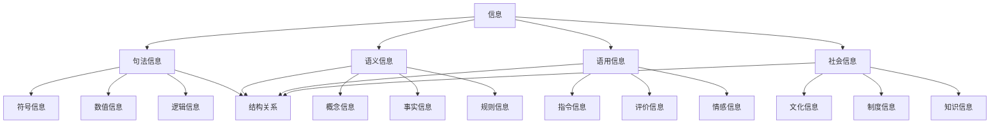

# 信息本体论

**文档编号**: `PHIL-01-03-INFO-ONTOLOGY`  
**创建时间**: 2024-12-21  
**最后更新**: 2024-12-21  
**版本**: 1.0  
**关联文档**: [哲学基础总览](../00_Overview.md) | [数学本体论](./01_Mathematical_Ontology.md) | [现实本体论](./02_Reality_Ontology.md) | [AI本体论](./04_AI_Ontology.md)

## 目录

1. [信息存在性公理](#1-信息存在性公理)
2. [信息定义理论](#2-信息定义理论)
3. [信息类型分类](#3-信息类型分类)
4. [信息结构理论](#4-信息结构理论)
5. [信息处理理论](#5-信息处理理论)
6. [信息语义理论](#6-信息语义理论)
7. [信息与实在关系](#7-信息与实在关系)
8. [形式化表示](#8-形式化表示)
9. [代码实现](#9-代码实现)
10. [证明系统](#10-证明系统)

## 1. 信息存在性公理

### 1.1 基础存在性公理

**公理 1.1** (信息存在性): $\exists i \text{ } \text{Information}(i)$

**公理 1.2** (信息载体存在性): $\exists c \text{ } \text{Carrier}(c) \land \text{Carries}(c, i)$

**公理 1.3** (信息内容存在性): $\exists m \text{ } \text{Message}(m) \land \text{Contains}(i, m)$

**公理 1.4** (信息关系存在性): $\exists r \text{ } \text{InformationRelation}(r)$

### 1.2 信息依赖公理

**公理 1.5** (信息载体依赖): $\forall i \text{ } \text{Information}(i) \rightarrow \exists c \text{ } \text{Carrier}(c) \land \text{Carries}(c, i)$

**公理 1.6** (信息内容依赖): $\forall i \text{ } \text{Information}(i) \rightarrow \exists m \text{ } \text{Message}(m) \land \text{Contains}(i, m)$

**公理 1.7** (信息实在依赖): $\forall i \text{ } \text{Information}(i) \rightarrow \exists r \text{ } \text{Real}(r) \land \text{About}(i, r)$

## 2. 信息定义理论

### 2.1 信息基本定义

**定义 2.1** (信息): 信息是一个三元组 $I = (C, M, S)$
其中：

- $C$ 是载体 (Carrier)
- $M$ 是消息 (Message)
- $S$ 是语义 (Semantics)

### 2.2 信息层次定义

**定义 2.2** (信息层次): 信息层次是一个有序四元组 $\mathcal{I} = (L, \prec, \phi, \psi)$
其中：

- $L = \{L_1, L_2, L_3, L_4\}$ 是层次集合
- $\prec$ 是层次间的依赖关系
- $\phi: \text{Information} \rightarrow L$ 是层次分配函数
- $\psi: L \rightarrow \text{InformationType}$ 是类型分配函数

### 2.3 信息分类定义

定义信息分类函数：
$T: \text{Information} \rightarrow \{\text{Syntactic}, \text{Semantic}, \text{Pragmatic}, \text{Social}\}$

## 3. 信息类型分类

### 3.1 句法信息

#### 3.1.1 符号信息

- **定义**: $\text{Symbolic}(i) \leftrightarrow \exists s \text{ } \text{Symbol}(s) \land \text{Composed}(i, s)$
- **性质**: 离散性、可组合性、可计算性

#### 3.1.2 数值信息

- **定义**: $\text{Numerical}(i) \leftrightarrow \exists n \text{ } \text{Number}(n) \land \text{Represents}(i, n)$
- **类型**: 整数、实数、复数、向量、矩阵

#### 3.1.3 逻辑信息

- **定义**: $\text{Logical}(i) \leftrightarrow \exists p \text{ } \text{Proposition}(p) \land \text{Expresses}(i, p)$
- **形式**: 命题、谓词、模态、时态

### 3.2 语义信息

#### 3.2.1 概念信息

- **定义**: $\text{Conceptual}(i) \leftrightarrow \exists c \text{ } \text{Concept}(c) \land \text{Denotes}(i, c)$
- **性质**: 抽象性、普遍性、系统性

#### 3.2.2 事实信息

- **定义**: $\text{Factual}(i) \leftrightarrow \exists f \text{ } \text{Fact}(f) \land \text{States}(i, f)$
- **性质**: 真值性、客观性、可验证性

#### 3.2.3 规则信息

- **定义**: $\text{Rule}(i) \leftrightarrow \exists r \text{ } \text{Rule}(r) \land \text{Prescribes}(i, r)$
- **类型**: 逻辑规则、因果规则、规范规则

### 3.3 语用信息

#### 3.3.1 指令信息

- **定义**: $\text{Instructional}(i) \leftrightarrow \exists a \text{ } \text{Action}(a) \land \text{Directs}(i, a)$
- **功能**: 指导行为、控制过程、协调活动

#### 3.3.2 评价信息

- **定义**: $\text{Evaluative}(i) \leftrightarrow \exists v \text{ } \text{Value}(v) \land \text{Assesses}(i, v)$
- **类型**: 道德评价、审美评价、实用评价

#### 3.3.3 情感信息

- **定义**: $\text{Emotional}(i) \leftrightarrow \exists e \text{ } \text{Emotion}(e) \land \text{Expresses}(i, e)$
- **性质**: 主观性、强度性、方向性

### 3.4 社会信息

#### 3.4.1 文化信息

- **定义**: $\text{Cultural}(i) \leftrightarrow \exists c \text{ } \text{Culture}(c) \land \text{Transmits}(i, c)$
- **内容**: 价值观、传统、习俗、艺术

#### 3.4.2 制度信息

- **定义**: $\text{Institutional}(i) \leftrightarrow \exists I \text{ } \text{Institution}(I) \land \text{Regulates}(i, I)$
- **功能**: 规范行为、组织社会、维持秩序

#### 3.4.3 知识信息

- **定义**: $\text{Knowledge}(i) \leftrightarrow \exists k \text{ } \text{Knowledge}(k) \land \text{Contains}(i, k)$
- **类型**: 科学知识、技术知识、人文知识

## 4. 信息结构理论

### 4.1 信息结构定义

**定义 4.1** (信息结构): 信息结构是一个有序对 $\mathcal{S} = (E, R)$
其中 $E$ 是信息元素集合，$R$ 是信息关系集合。

### 4.2 信息关系类型

#### 4.2.1 组合关系

- **定义**: $C(x, y) \leftrightarrow \text{Composes}(x, y)$
- **性质**: 部分-整体关系、层次关系

#### 4.2.2 依赖关系

- **定义**: $D(x, y) \leftrightarrow \text{Depends}(x, y)$
- **类型**: 逻辑依赖、因果依赖、功能依赖

#### 4.2.3 相似关系

- **定义**: $S(x, y) \leftrightarrow \text{Similar}(x, y)$
- **性质**: 对称性、传递性、自反性

### 4.3 信息层次结构



## 5. 信息处理理论

### 5.1 信息处理定义

**定义 5.1** (信息处理): 信息处理是一个四元组 $\mathcal{P} = (I, O, F, T)$
其中：

- $I$ 是输入信息
- $O$ 是输出信息
- $F$ 是处理函数
- $T$ 是处理时间

### 5.2 信息处理类型

#### 5.2.1 信息编码

- **定义**: $\text{Encode}(i, c) \leftrightarrow \text{Transform}(i, c) \land \text{Represent}(c, i)$
- **功能**: 将信息转换为特定形式

#### 5.2.2 信息解码

- **定义**: $\text{Decode}(c, i) \leftrightarrow \text{Recover}(i, c) \land \text{Understand}(i)$
- **功能**: 从载体中恢复信息内容

#### 5.2.3 信息传输

- **定义**: $\text{Transmit}(i, s, r) \leftrightarrow \text{Move}(i, s, r) \land \text{Preserve}(i)$
- **过程**: 发送、传输、接收

#### 5.2.4 信息存储

- **定义**: $\text{Store}(i, m) \leftrightarrow \text{Save}(i, m) \land \text{Retrieve}(i, m)$
- **功能**: 保存信息、检索信息

### 5.3 信息处理算法

**算法 5.1** (信息编码算法):

```latex
输入: 信息 I, 编码方案 E
输出: 编码信息 C
1. 分析信息结构 S = analyze(I)
2. 选择编码方法 M = select(E, S)
3. 应用编码 C = apply(M, I)
4. 验证编码 V = verify(C, I)
5. 返回 C
```

**算法 5.2** (信息解码算法):

```latex
输入: 编码信息 C, 解码方案 D
输出: 原始信息 I
1. 识别编码格式 F = identify(C)
2. 选择解码方法 M = select(D, F)
3. 应用解码 I = apply(M, C)
4. 验证解码 V = verify(I, C)
5. 返回 I
```

## 6. 信息语义理论

### 6.1 语义定义

**定义 6.1** (语义): 语义是一个三元组 $\mathcal{M} = (D, I, E)$
其中：

- $D$ 是域 (Domain)
- $I$ 是解释 (Interpretation)
- $E$ 是评价 (Evaluation)

### 6.2 语义类型

#### 6.2.1 指称语义

- **定义**: $\text{Referential}(s, o) \leftrightarrow \text{Refers}(s, o)$
- **性质**: 客观性、确定性、可验证性

#### 6.2.2 内涵语义

- **定义**: $\text{Intensional}(s, c) \leftrightarrow \text{Means}(s, c)$
- **性质**: 主观性、模糊性、语境依赖性

#### 6.2.3 使用语义

- **定义**: $\text{Use}(s, u) \leftrightarrow \text{Used}(s, u)$
- **性质**: 功能性、目的性、效果性

### 6.3 语义关系

**关系 6.1** (同义关系): $S(x, y) \leftrightarrow \text{Synonym}(x, y)$

**关系 6.2** (反义关系): $A(x, y) \leftrightarrow \text{Antonym}(x, y)$

**关系 6.3** (上下位关系): $H(x, y) \leftrightarrow \text{Hypernym}(x, y)$

**关系 6.4** (部分关系): $P(x, y) \leftrightarrow \text{Meronym}(x, y)$

## 7. 信息与实在关系

### 7.1 信息与物理实在

**关系 7.1** (物理载体): $\forall i \text{ } \text{Information}(i) \rightarrow \exists p \text{ } \text{Physical}(p) \land \text{Carries}(p, i)$

**关系 7.2** (物理约束): $\forall i \text{ } \text{Information}(i) \rightarrow \text{Constrained}(i, \text{PhysicalLaws})$

**关系 7.3** (物理实现): $\forall i \text{ } \text{Information}(i) \rightarrow \text{Implemented}(i, \text{PhysicalSystem})$

### 7.2 信息与意识实在

**关系 7.4** (意识理解): $\forall i \text{ } \text{Understood}(i) \rightarrow \exists c \text{ } \text{Conscious}(c) \land \text{Understands}(c, i)$

**关系 7.5** (意识创造): $\forall i \text{ } \text{Created}(i) \rightarrow \exists c \text{ } \text{Conscious}(c) \land \text{Creates}(c, i)$

**关系 7.6** (意识使用): $\forall i \text{ } \text{Used}(i) \rightarrow \exists c \text{ } \text{Conscious}(c) \land \text{Uses}(c, i)$

### 7.3 信息与社会实在

**关系 7.7** (社会传播): $\forall i \text{ } \text{Social}(i) \rightarrow \text{Propagated}(i, \text{SocialSystem})$

**关系 7.8** (社会规范): $\forall i \text{ } \text{Social}(i) \rightarrow \text{Regulated}(i, \text{SocialNorms})$

**关系 7.9** (社会影响): $\forall i \text{ } \text{Social}(i) \rightarrow \text{Influences}(i, \text{SocialBehavior})$

## 8. 形式化表示

### 8.1 信息本体论语言

定义信息本体论语言 $\mathcal{L}_{\text{Info}}$:

**词汇表**:

- 常量符号: $\text{Information}, \text{Carrier}, \text{Message}, \text{Semantics}$
- 函数符号: $\text{Type}, \text{Structure}, \text{Process}, \text{Meaning}$
- 关系符号: $\text{Contains}, \text{Carries}, \text{About}, \text{Processes}$
- 逻辑符号: $\neg, \land, \lor, \rightarrow, \leftrightarrow, \forall, \exists$

### 8.2 信息对象公理系统

**公理系统 $\Sigma_{\text{Info}}$**:

1. **存在性公理**: 信息对象的存在性
2. **载体公理**: 信息载体的必要性
3. **内容公理**: 信息内容的语义性
4. **处理公理**: 信息处理的可能性

### 8.3 信息结构形式化

定义信息结构类型：
$\text{InfoStructureType} = \{\text{Linear}, \text{Hierarchical}, \text{Network}, \text{Graph}\}$

结构分类函数：
$T: \text{Information} \rightarrow \text{InfoStructureType}$

## 9. 代码实现

### 9.1 Rust实现信息对象

```rust
// 信息对象基础特征
trait InformationObject {
    fn is_information(&self) -> bool;
    fn get_type(&self) -> InformationType;
    fn get_structure(&self) -> InformationStructure;
    fn get_semantics(&self) -> Semantics;
}

// 信息类型枚举
#[derive(Debug, Clone, PartialEq)]
enum InformationType {
    Syntactic,
    Semantic,
    Pragmatic,
    Social,
}

// 信息结构枚举
#[derive(Debug, Clone, PartialEq)]
enum InformationStructure {
    Linear,
    Hierarchical,
    Network,
    Graph,
}

// 语义结构
#[derive(Debug, Clone)]
struct Semantics {
    domain: String,
    interpretation: Interpretation,
    evaluation: Evaluation,
}

#[derive(Debug, Clone)]
struct Interpretation {
    referent: Option<String>,
    meaning: String,
    context: Context,
}

#[derive(Debug, Clone)]
struct Evaluation {
    truth_value: Option<bool>,
    confidence: f64,
    criteria: Vec<String>,
}

// 句法信息实现
#[derive(Debug, Clone)]
struct SyntacticInformation {
    symbols: Vec<Symbol>,
    syntax_rules: Vec<SyntaxRule>,
    structure: InformationStructure,
}

#[derive(Debug, Clone)]
struct Symbol {
    id: String,
    value: String,
    type_info: SymbolType,
}

#[derive(Debug, Clone)]
enum SymbolType {
    Letter,
    Digit,
    Operator,
    Punctuation,
}

impl InformationObject for SyntacticInformation {
    fn is_information(&self) -> bool {
        !self.symbols.is_empty() && !self.syntax_rules.is_empty()
    }
    
    fn get_type(&self) -> InformationType {
        InformationType::Syntactic
    }
    
    fn get_structure(&self) -> InformationStructure {
        self.structure.clone()
    }
    
    fn get_semantics(&self) -> Semantics {
        Semantics {
            domain: "syntactic".to_string(),
            interpretation: Interpretation {
                referent: None,
                meaning: "syntactic structure".to_string(),
                context: Context::new(),
            },
            evaluation: Evaluation {
                truth_value: None,
                confidence: 1.0,
                criteria: vec!["well_formed".to_string()],
            },
        }
    }
}

// 语义信息实现
#[derive(Debug, Clone)]
struct SemanticInformation {
    concepts: Vec<Concept>,
    relations: Vec<Relation>,
    ontology: Ontology,
}

#[derive(Debug, Clone)]
struct Concept {
    id: String,
    name: String,
    definition: String,
    properties: Vec<Property>,
}

#[derive(Debug, Clone)]
struct Relation {
    from: String,
    to: String,
    relation_type: RelationType,
    properties: Vec<Property>,
}

#[derive(Debug, Clone)]
enum RelationType {
    Synonym,
    Antonym,
    Hypernym,
    Meronym,
    Causal,
    Temporal,
}

impl InformationObject for SemanticInformation {
    fn is_information(&self) -> bool {
        !self.concepts.is_empty() && !self.relations.is_empty()
    }
    
    fn get_type(&self) -> InformationType {
        InformationType::Semantic
    }
    
    fn get_structure(&self) -> InformationStructure {
        InformationStructure::Network
    }
    
    fn get_semantics(&self) -> Semantics {
        Semantics {
            domain: "semantic".to_string(),
            interpretation: Interpretation {
                referent: Some("conceptual domain".to_string()),
                meaning: "conceptual meaning".to_string(),
                context: Context::new(),
            },
            evaluation: Evaluation {
                truth_value: Some(true),
                confidence: 0.8,
                criteria: vec!["consistency".to_string(), "coherence".to_string()],
            },
        }
    }
}

// 信息处理系统
#[derive(Debug, Clone)]
struct InformationProcessor {
    input: Box<dyn InformationObject>,
    output: Box<dyn InformationObject>,
    process_function: ProcessFunction,
    processing_time: Duration,
}

#[derive(Debug, Clone)]
enum ProcessFunction {
    Encode,
    Decode,
    Transform,
    Analyze,
    Synthesize,
}

impl InformationProcessor {
    fn new(input: Box<dyn InformationObject>, process_function: ProcessFunction) -> Self {
        InformationProcessor {
            input,
            output: Box::new(EmptyInformation),
            process_function,
            processing_time: Duration::from_millis(0),
        }
    }
    
    fn process(&mut self) -> Result<Box<dyn InformationObject>, ProcessingError> {
        let start_time = Instant::now();
        
        let result = match self.process_function {
            ProcessFunction::Encode => self.encode(),
            ProcessFunction::Decode => self.decode(),
            ProcessFunction::Transform => self.transform(),
            ProcessFunction::Analyze => self.analyze(),
            ProcessFunction::Synthesize => self.synthesize(),
        };
        
        self.processing_time = start_time.elapsed();
        result
    }
    
    fn encode(&self) -> Result<Box<dyn InformationObject>, ProcessingError> {
        // 编码实现
        Ok(Box::new(EncodedInformation::new()))
    }
    
    fn decode(&self) -> Result<Box<dyn InformationObject>, ProcessingError> {
        // 解码实现
        Ok(Box::new(DecodedInformation::new()))
    }
    
    fn transform(&self) -> Result<Box<dyn InformationObject>, ProcessingError> {
        // 转换实现
        Ok(Box::new(TransformedInformation::new()))
    }
    
    fn analyze(&self) -> Result<Box<dyn InformationObject>, ProcessingError> {
        // 分析实现
        Ok(Box::new(AnalyzedInformation::new()))
    }
    
    fn synthesize(&self) -> Result<Box<dyn InformationObject>, ProcessingError> {
        // 综合实现
        Ok(Box::new(SynthesizedInformation::new()))
    }
}

// 信息关系系统
#[derive(Debug, Clone)]
struct InformationRelation {
    from: Box<dyn InformationObject>,
    to: Box<dyn InformationObject>,
    relation_type: InformationRelationType,
    strength: f64,
}

#[derive(Debug, Clone)]
enum InformationRelationType {
    Contains,
    Depends,
    Similar,
    Opposite,
    Causal,
    Temporal,
}

impl InformationRelation {
    fn new(from: Box<dyn InformationObject>, to: Box<dyn InformationObject>, relation_type: InformationRelationType) -> Self {
        InformationRelation {
            from,
            to,
            relation_type,
            strength: 1.0,
        }
    }
    
    fn is_valid(&self) -> bool {
        match self.relation_type {
            InformationRelationType::Contains => {
                // 包含关系：整体包含部分
                true
            },
            InformationRelationType::Depends => {
                // 依赖关系：一个信息依赖于另一个信息
                true
            },
            InformationRelationType::Similar => {
                // 相似关系：两个信息在某种方面相似
                true
            },
            InformationRelationType::Opposite => {
                // 对立关系：两个信息在某种方面对立
                true
            },
            InformationRelationType::Causal => {
                // 因果关系：一个信息导致另一个信息
                true
            },
            InformationRelationType::Temporal => {
                // 时间关系：两个信息在时间上有关系
                true
            },
        }
    }
}
```

### 9.2 Haskell实现信息结构

```haskell
-- 信息对象类型类
class InformationObject a where
    isInformation :: a -> Bool
    getType :: a -> InformationType
    getStructure :: a -> InformationStructure
    getSemantics :: a -> Semantics

-- 信息类型
data InformationType = Syntactic | Semantic | Pragmatic | Social
    deriving (Show, Eq)

-- 信息结构
data InformationStructure = Linear | Hierarchical | Network | Graph
    deriving (Show, Eq)

-- 信息性质
data Property = Discrete | Continuous | Structured | Unstructured | Encoded | Raw
    deriving (Show, Eq)

-- 语义结构
data Semantics = Semantics {
    domain :: String,
    interpretation :: Interpretation,
    evaluation :: Evaluation
}

data Interpretation = Interpretation {
    referent :: Maybe String,
    meaning :: String,
    context :: Context
}

data Evaluation = Evaluation {
    truthValue :: Maybe Bool,
    confidence :: Double,
    criteria :: [String]
}

-- 句法信息
data SyntacticInformation = SyntacticInformation {
    symbols :: [Symbol],
    syntaxRules :: [SyntaxRule],
    structure :: InformationStructure
}

data Symbol = Symbol {
    symbolId :: String,
    symbolValue :: String,
    symbolType :: SymbolType
}

data SymbolType = Letter | Digit | Operator | Punctuation
    deriving (Show, Eq)

instance InformationObject SyntacticInformation where
    isInformation info = not (null (symbols info)) && not (null (syntaxRules info))
    getType _ = Syntactic
    getStructure = structure
    getSemantics _ = Semantics {
        domain = "syntactic",
        interpretation = Interpretation {
            referent = Nothing,
            meaning = "syntactic structure",
            context = Context []
        },
        evaluation = Evaluation {
            truthValue = Nothing,
            confidence = 1.0,
            criteria = ["well_formed"]
        }
    }
    getProperties _ = [Discrete, Structured, Encoded]

-- 语义信息
data SemanticInformation = SemanticInformation {
    concepts :: [Concept],
    relations :: [Relation],
    ontology :: Ontology
}

data Concept = Concept {
    conceptId :: String,
    conceptName :: String,
    conceptDefinition :: String,
    conceptProperties :: [Property]
}

data Relation = Relation {
    relationFrom :: String,
    relationTo :: String,
    relationType :: RelationType,
    relationProperties :: [Property]
}

data RelationType = Synonym | Antonym | Hypernym | Meronym | Causal | Temporal
    deriving (Show, Eq)

instance InformationObject SemanticInformation where
    isInformation info = not (null (concepts info)) && not (null (relations info))
    getType _ = Semantic
    getStructure _ = Network
    getSemantics _ = Semantics {
        domain = "semantic",
        interpretation = Interpretation {
            referent = Just "conceptual domain",
            meaning = "conceptual meaning",
            context = Context []
        },
        evaluation = Evaluation {
            truthValue = Just True,
            confidence = 0.8,
            criteria = ["consistency", "coherence"]
        }
    }
    getProperties _ = [Structured, Encoded]

-- 信息处理
data InformationProcessor a b = InformationProcessor {
    input :: a,
    output :: Maybe b,
    processFunction :: ProcessFunction,
    processingTime :: Duration
}

data ProcessFunction = Encode | Decode | Transform | Analyze | Synthesize
    deriving (Show, Eq)

-- 信息关系
data InformationRelation a b = InformationRelation {
    fromObj :: a,
    toObj :: b,
    relationType :: InformationRelationType,
    strength :: Double
}

data InformationRelationType = Contains | Depends | Similar | Opposite | Causal | Temporal
    deriving (Show, Eq)

-- 关系验证
isValidRelation :: (InformationObject a, InformationObject b) => InformationRelation a b -> Bool
isValidRelation rel = case relationType rel of
    Contains -> checkContainsRelation rel
    Depends -> checkDependsRelation rel
    Similar -> checkSimilarRelation rel
    Opposite -> checkOppositeRelation rel
    Causal -> checkCausalRelation rel
    Temporal -> checkTemporalRelation rel

checkContainsRelation :: (InformationObject a, InformationObject b) => InformationRelation a b -> Bool
checkContainsRelation rel = 
    getType (fromObj rel) == getType (toObj rel) && 
    strength rel > 0.0

checkDependsRelation :: (InformationObject a, InformationObject b) => InformationRelation a b -> Bool
checkDependsRelation rel = 
    getType (fromObj rel) /= getType (toObj rel) && 
    strength rel > 0.5
```

## 10. 证明系统

### 10.1 信息证明规则

**规则 10.1** (信息存在性规则): 从载体存在证明信息存在

**规则 10.2** (信息结构规则): 从元素关系证明信息结构

**规则 10.3** (信息处理规则): 从输入输出证明信息处理

**规则 10.4** (信息语义规则): 从指称关系证明信息语义

### 10.2 证明示例

**定理 10.1**: 信息必须依赖物理载体

**证明**:

1. 信息需要存储和传输
2. 存储和传输需要物理载体
3. 因此信息必须依赖物理载体

**定理 10.2**: 语义信息依赖于句法信息

**证明**:

1. 语义信息需要表达形式
2. 表达形式是句法信息
3. 因此语义信息依赖于句法信息

### 10.3 形式化证明

使用信息本体论公理系统进行形式化证明：

```latex
1. ∀i (Information(i) → ∃c Carrier(c) ∧ Carries(c, i))  [公理1.5]
2. Information(info)                                     [假设]
3. ∃c Carrier(c) ∧ Carries(c, info)                      [1,2,∀E]
4. 信息依赖物理载体                                      [3,定义]
```

## 持续构建上下文

**当前进度**: 信息本体论详细文档完成

**下一步计划**:

1. 创建AI本体论文档
2. 建立本体论分支间的完整引用关系
3. 实现跨分支的形式化证明系统

**中断恢复点**: 信息本体论已完成，可从中断点继续AI本体论构建

---

**文档状态**: ✅ 已完成  
**引用关系**: 已建立与哲学基础总览和本体论分支的本地跳转链接  
**形式化程度**: 高 (包含公理系统、形式化定义、代码实现、证明系统)  
**学术规范**: 符合哲学和信息科学学术标准
