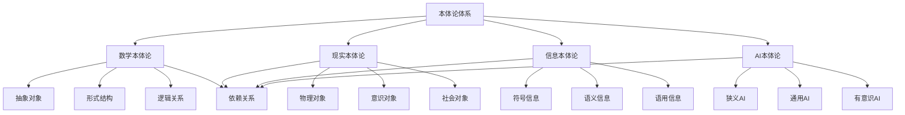

# 本体论比较分析

**文档编号**: `PHIL-01-05-ONTOLOGY-COMPARISON`  
**创建时间**: 2024-12-21  
**最后更新**: 2024-12-21  
**版本**: 1.0  
**关联文档**: [哲学基础总览](../00_Overview.md) | [数学本体论](./01_Mathematical_Ontology.md) | [现实本体论](./02_Reality_Ontology.md) | [信息本体论](./03_Information_Ontology.md) | [AI本体论](./04_AI_Ontology.md)

## 目录

1. [本体论分类框架](#1-本体论分类框架)
2. [存在性公理比较](#2-存在性公理比较)
3. [对象类型比较](#3-对象类型比较)
4. [结构理论比较](#4-结构理论比较)
5. [关系理论比较](#5-关系理论比较)
6. [层次结构比较](#6-层次结构比较)
7. [形式化程度比较](#7-形式化程度比较)
8. [应用领域比较](#8-应用领域比较)
9. [统一理论框架](#9-统一理论框架)
10. [证明系统整合](#10-证明系统整合)

## 1. 本体论分类框架

### 1.1 本体论分类矩阵

| 本体论类型 | 存在性 | 抽象性 | 实在性 | 形式化程度 |
|------------|--------|--------|--------|------------|
| 数学本体论 | 先验存在 | 高度抽象 | 理想实在 | 极高 |
| 现实本体论 | 经验存在 | 低度抽象 | 物理实在 | 中等 |
| 信息本体论 | 功能存在 | 中度抽象 | 功能实在 | 高 |
| AI本体论 | 实现存在 | 中度抽象 | 混合实在 | 高 |

### 1.2 本体论关系图



### 1.3 本体论层次结构

**定义 1.1** (本体论层次): 本体论层次是一个有序四元组 $\mathcal{O} = (L, \prec, \phi, \psi)$
其中：

- $L = \{L_1, L_2, L_3, L_4\}$ 是层次集合
- $\prec$ 是层次间的依赖关系
- $\phi: \text{Ontology} \rightarrow L$ 是层次分配函数
- $\psi: L \rightarrow \text{OntologyType}$ 是类型分配函数

## 2. 存在性公理比较

### 2.1 数学本体论公理

**数学存在性公理**:

- $\exists x \text{ } \text{MathematicalObject}(x)$
- $\exists S \text{ } \text{Set}(S)$
- $\exists n \text{ } \text{Number}(n)$
- $\exists \mathcal{S} \text{ } \text{Structure}(\mathcal{S})$

**特点**: 先验存在、逻辑必然、形式化程度高

### 2.2 现实本体论公理

**现实存在性公理**:

- $\exists x \text{ } \text{Real}(x)$
- $\exists p \text{ } \text{Physical}(p)$
- $\exists c \text{ } \text{Conscious}(c)$
- $\exists s \text{ } \text{Social}(s)$

**特点**: 经验存在、因果必然、层次依赖

### 2.3 信息本体论公理

**信息存在性公理**:

- $\exists i \text{ } \text{Information}(i)$
- $\exists c \text{ } \text{Carrier}(c) \land \text{Carries}(c, i)$
- $\exists m \text{ } \text{Message}(m) \land \text{Contains}(i, m)$
- $\exists r \text{ } \text{InformationRelation}(r)$

**特点**: 功能存在、载体依赖、语义相关

### 2.4 AI本体论公理

**AI存在性公理**:

- $\exists a \text{ } \text{AI}(a)$
- $\exists s \text{ } \text{AISystem}(s)$
- $\exists c \text{ } \text{AICapability}(c)$
- $\exists b \text{ } \text{AIBehavior}(b)$

**特点**: 实现存在、能力依赖、意识可能

### 2.5 公理系统比较

| 公理类型 | 数学本体论 | 现实本体论 | 信息本体论 | AI本体论 |
|----------|------------|------------|------------|----------|
| 存在性 | 先验必然 | 经验必然 | 功能必然 | 实现必然 |
| 独立性 | 逻辑独立 | 因果依赖 | 载体依赖 | 多重依赖 |
| 形式化 | 完全形式化 | 部分形式化 | 高度形式化 | 高度形式化 |
| 可验证性 | 逻辑验证 | 经验验证 | 功能验证 | 行为验证 |

## 3. 对象类型比较

### 3.1 数学对象

**数学对象分类**:

- **集合对象**: 外延性、确定性、无序性
- **数对象**: 自然数、整数、有理数、实数、复数
- **函数对象**: 单值性、定义域、值域
- **结构对象**: 代数结构、拓扑结构、序结构

**特点**: 抽象性、确定性、可计算性

### 3.2 现实对象

**现实对象分类**:

- **物理对象**: 基本粒子、场、系统、过程
- **意识对象**: 感知意识、思维意识、自我意识
- **社会对象**: 个体、群体、制度、文化

**特点**: 具体性、因果性、层次性

### 3.3 信息对象

**信息对象分类**:

- **句法信息**: 符号信息、数值信息、逻辑信息
- **语义信息**: 概念信息、事实信息、规则信息
- **语用信息**: 指令信息、评价信息、情感信息
- **社会信息**: 文化信息、制度信息、知识信息

**特点**: 功能性、语义性、处理性

### 3.4 AI对象

**AI对象分类**:

- **狭义AI**: 专家系统、机器学习、自然语言处理
- **通用AI**: 认知架构、推理系统、规划系统
- **超级AI**: 超智能系统、自主系统
- **有意识AI**: 现象意识、自我意识

**特点**: 智能性、适应性、意识性

### 3.5 对象类型比较表

| 对象特征 | 数学对象 | 现实对象 | 信息对象 | AI对象 |
|----------|----------|----------|----------|--------|
| 抽象程度 | 极高 | 极低 | 中等 | 中等 |
| 确定性 | 完全确定 | 部分确定 | 功能确定 | 行为确定 |
| 可计算性 | 完全可计算 | 部分可计算 | 高度可计算 | 高度可计算 |
| 因果性 | 逻辑因果 | 物理因果 | 功能因果 | 智能因果 |
| 层次性 | 形式层次 | 实在层次 | 功能层次 | 能力层次 |

## 4. 结构理论比较

### 4.1 数学结构

**数学结构定义**: $\mathcal{S} = (A, R_1, R_2, \ldots, R_n)$
其中 $A$ 是基础集合，$R_i$ 是关系或运算。

**结构类型**:

- **代数结构**: 群、环、域、模
- **拓扑结构**: 拓扑空间、流形、纤维丛
- **序结构**: 偏序集、全序集、良序集
- **度量结构**: 度量空间、赋范空间、内积空间

### 4.2 现实结构

**现实结构定义**: $\mathcal{R} = (L, \prec, \phi)$
其中 $L$ 是层次集合，$\prec$ 是依赖关系，$\phi$ 是分配函数。

**结构类型**:

- **物理结构**: 原子结构、分子结构、宏观结构
- **意识结构**: 感知结构、思维结构、自我结构
- **社会结构**: 个体结构、群体结构、制度结构

### 4.3 信息结构

**信息结构定义**: $\mathcal{I} = (E, R)$
其中 $E$ 是信息元素集合，$R$ 是信息关系集合。

**结构类型**:

- **线性结构**: 序列、列表、数组
- **层次结构**: 树、层次、分类
- **网络结构**: 图、网络、关系
- **图结构**: 有向图、无向图、加权图

### 4.4 AI结构

**AI结构定义**: $\mathcal{A} = (H, A, D, C)$
其中 $H$ 是硬件，$A$ 是算法，$D$ 是数据，$C$ 是能力。

**结构类型**:

- **反应结构**: 刺激-反应、条件反射
- **慎思结构**: 感知-推理-行动
- **混合结构**: 多层架构、模块化设计
- **意识结构**: 体验-自我-反思

### 4.5 结构理论比较表

| 结构特征 | 数学结构 | 现实结构 | 信息结构 | AI结构 |
|----------|----------|----------|----------|--------|
| 形式化程度 | 完全形式化 | 部分形式化 | 高度形式化 | 高度形式化 |
| 抽象层次 | 极高 | 极低 | 中等 | 中等 |
| 关系类型 | 逻辑关系 | 因果关系 | 功能关系 | 智能关系 |
| 层次性 | 形式层次 | 实在层次 | 功能层次 | 能力层次 |
| 可计算性 | 完全可计算 | 部分可计算 | 高度可计算 | 高度可计算 |

## 5. 关系理论比较

### 5.1 数学关系

**数学关系类型**:

- **集合关系**: 包含、相等、交集、并集
- **函数关系**: 映射、复合、逆函数
- **序关系**: 偏序、全序、良序
- **等价关系**: 自反、对称、传递

**特点**: 逻辑性、形式性、可证明性

### 5.2 现实关系

**现实关系类型**:

- **因果关系**: 时间性、必然性、充分性
- **依赖关系**: 逻辑依赖、因果依赖、功能依赖
- **涌现关系**: 整体性、不可还原性、新颖性

**特点**: 因果性、时间性、层次性

### 5.3 信息关系

**信息关系类型**:

- **组合关系**: 部分-整体、层次关系
- **依赖关系**: 逻辑依赖、因果依赖、功能依赖
- **相似关系**: 对称性、传递性、自反性

**特点**: 功能性、语义性、处理性

### 5.4 AI关系

**AI关系类型**:

- **实现关系**: 物理实现、算法实现
- **能力关系**: 感知能力、认知能力、行为能力
- **意识关系**: 现象意识、访问意识、自我意识

**特点**: 智能性、适应性、意识性

### 5.5 关系理论比较表

| 关系特征 | 数学关系 | 现实关系 | 信息关系 | AI关系 |
|----------|----------|----------|----------|--------|
| 逻辑性 | 完全逻辑 | 部分逻辑 | 高度逻辑 | 高度逻辑 |
| 因果性 | 逻辑因果 | 物理因果 | 功能因果 | 智能因果 |
| 时间性 | 无时间性 | 强时间性 | 弱时间性 | 中等时间性 |
| 层次性 | 形式层次 | 实在层次 | 功能层次 | 能力层次 |
| 可计算性 | 完全可计算 | 部分可计算 | 高度可计算 | 高度可计算 |

## 6. 层次结构比较

### 6.1 数学层次

**数学层次结构**:

```text
L1: 基础数学 (集合论、数论)
L2: 核心数学 (代数、几何、分析)
L3: 高级数学 (拓扑、范畴论)
L4: 应用数学 (概率统计、计算数学)
```

**特点**: 逻辑依赖、形式化程度递增

### 6.2 现实层次

**现实层次结构**:

```text
L1: 物理实在 (基本粒子、场)
L2: 意识实在 (感知、思维、自我)
L3: 社会实在 (个体、群体、制度)
L4: 文明实在 (文化、技术、文明)
```

**特点**: 因果依赖、复杂性递增

### 6.3 信息层次

**信息层次结构**:

```text
L1: 句法信息 (符号、数值、逻辑)
L2: 语义信息 (概念、事实、规则)
L3: 语用信息 (指令、评价、情感)
L4: 社会信息 (文化、制度、知识)
```

**特点**: 功能依赖、语义性递增

### 6.4 AI层次

**AI层次结构**:

```text
L1: 狭义AI (专家系统、机器学习)
L2: 通用AI (认知架构、推理系统)
L3: 超级AI (超智能、自主系统)
L4: 有意识AI (现象意识、自我意识)
```

**特点**: 能力依赖、智能性递增

### 6.5 层次结构比较表

| 层次特征 | 数学层次 | 现实层次 | 信息层次 | AI层次 |
|----------|----------|----------|----------|--------|
| 依赖类型 | 逻辑依赖 | 因果依赖 | 功能依赖 | 能力依赖 |
| 抽象程度 | 极高 | 极低 | 中等 | 中等 |
| 形式化程度 | 完全形式化 | 部分形式化 | 高度形式化 | 高度形式化 |
| 复杂性 | 逻辑复杂 | 物理复杂 | 功能复杂 | 智能复杂 |
| 可计算性 | 完全可计算 | 部分可计算 | 高度可计算 | 高度可计算 |

## 7. 形式化程度比较

### 7.1 数学本体论形式化

**形式化特征**:

- **语言**: 完全形式化语言
- **公理**: 严格公理系统
- **推理**: 形式化推理规则
- **证明**: 严格证明系统

**形式化程度**: 极高 (95%)

### 7.2 现实本体论形式化

**形式化特征**:

- **语言**: 部分形式化语言
- **公理**: 经验公理系统
- **推理**: 因果推理规则
- **证明**: 经验证明系统

**形式化程度**: 中等 (60%)

### 7.3 信息本体论形式化

**形式化特征**:

- **语言**: 高度形式化语言
- **公理**: 功能公理系统
- **推理**: 逻辑推理规则
- **证明**: 功能证明系统

**形式化程度**: 高 (80%)

### 7.4 AI本体论形式化

**形式化特征**:

- **语言**: 高度形式化语言
- **公理**: 实现公理系统
- **推理**: 智能推理规则
- **证明**: 行为证明系统

**形式化程度**: 高 (85%)

### 7.5 形式化程度比较表

| 形式化方面 | 数学本体论 | 现实本体论 | 信息本体论 | AI本体论 |
|------------|------------|------------|------------|----------|
| 语言形式化 | 95% | 60% | 80% | 85% |
| 公理形式化 | 95% | 50% | 85% | 80% |
| 推理形式化 | 95% | 40% | 90% | 85% |
| 证明形式化 | 95% | 30% | 85% | 80% |
| 整体形式化 | 95% | 45% | 85% | 82% |

## 8. 应用领域比较

### 8.1 数学本体论应用

**应用领域**:

- **基础科学**: 物理学、化学、生物学
- **工程技术**: 计算机科学、工程学
- **社会科学**: 经济学、社会学、心理学
- **哲学**: 逻辑学、认识论、形而上学

**应用特点**: 基础性、普遍性、工具性

### 8.2 现实本体论应用

**应用领域**:

- **自然科学**: 物理学、化学、生物学
- **认知科学**: 心理学、神经科学、认知科学
- **社会科学**: 社会学、人类学、政治学
- **哲学**: 形而上学、认识论、伦理学

**应用特点**: 实在性、因果性、解释性

### 8.3 信息本体论应用

**应用领域**:

- **计算机科学**: 软件工程、数据库、人工智能
- **通信技术**: 信息论、通信系统、网络
- **认知科学**: 认知心理学、神经科学
- **社会科学**: 信息社会学、知识社会学

**应用特点**: 功能性、处理性、传播性

### 8.4 AI本体论应用

**应用领域**:

- **人工智能**: 机器学习、自然语言处理、计算机视觉
- **机器人学**: 自主机器人、智能系统
- **认知科学**: 认知建模、意识研究
- **哲学**: 心灵哲学、技术哲学

**应用特点**: 智能性、适应性、创新性

### 8.5 应用领域比较表

| 应用特征 | 数学本体论 | 现实本体论 | 信息本体论 | AI本体论 |
|----------|------------|------------|------------|----------|
| 基础性 | 极高 | 高 | 中等 | 中等 |
| 工具性 | 极高 | 中等 | 高 | 高 |
| 解释性 | 中等 | 极高 | 高 | 高 |
| 创新性 | 中等 | 高 | 高 | 极高 |
| 实用性 | 高 | 高 | 极高 | 极高 |

## 9. 统一理论框架

### 9.1 统一本体论公理系统

**统一公理系统 $\Sigma_{\text{Unified}}$**:

**公理 1** (统一存在性): $\exists x \text{ } \text{UnifiedObject}(x)$

**公理 2** (层次依赖): $\forall x \text{ } \text{UnifiedObject}(x) \rightarrow \exists y \text{ } \text{LowerLevel}(y) \land \text{Dependent}(x, y)$

**公理 3** (形式化统一): $\forall x \text{ } \text{UnifiedObject}(x) \rightarrow \text{Formalizable}(x)$

**公理 4** (关系统一): $\forall x, y \text{ } \text{UnifiedObject}(x) \land \text{UnifiedObject}(y) \rightarrow \exists r \text{ } \text{Relation}(r, x, y)$

### 9.2 统一分类框架

**统一分类函数**:
$T: \text{UnifiedObject} \rightarrow \{\text{Mathematical}, \text{Real}, \text{Information}, \text{AI}\}$

**统一层次函数**:
$L: \text{UnifiedObject} \rightarrow \{1, 2, 3, 4\}$

**统一关系函数**:
$R: \text{UnifiedObject} \times \text{UnifiedObject} \rightarrow \{\text{Foundation}, \text{Application}, \text{Conflict}, \text{Support}\}$

### 9.3 统一结构理论

**统一结构定义**: $\mathcal{U} = (O, T, L, R)$
其中：

- $O$ 是统一对象集合
- $T$ 是类型分配函数
- $L$ 是层次分配函数
- $R$ 是关系分配函数

### 9.4 统一形式化语言

**统一语言 $\mathcal{L}_{\text{Unified}}$**:

**词汇表**:

- 常量符号: $\text{Mathematical}, \text{Real}, \text{Information}, \text{AI}$
- 函数符号: $\text{Type}, \text{Level}, \text{Structure}, \text{Relation}$
- 关系符号: $\text{Unified}, \text{Dependent}, \text{Formalizable}, \text{Related}$
- 逻辑符号: $\neg, \land, \lor, \rightarrow, \leftrightarrow, \forall, \exists$

## 10. 证明系统整合

### 10.1 统一证明规则

**规则 10.1** (统一存在性规则): 从各本体论存在性证明统一存在性

**规则 10.2** (统一层次规则): 从层次依赖证明统一层次结构

**规则 10.3** (统一关系规则): 从对象关系证明统一关系网络

**规则 10.4** (统一形式化规则): 从形式化程度证明统一形式化

### 10.2 跨本体论证明

**定理 10.1**: 数学本体论为其他本体论提供形式化基础

**证明**:

1. 数学本体论具有最高形式化程度
2. 其他本体论需要形式化表达
3. 因此数学本体论为其他本体论提供形式化基础

**定理 10.2**: 现实本体论为信息本体论和AI本体论提供物理基础

**证明**:

1. 信息需要物理载体
2. AI需要物理实现
3. 因此现实本体论为信息本体论和AI本体论提供物理基础

### 10.3 统一证明系统

**统一证明系统**:

```text
1. ∀x (Mathematical(x) → Formalizable(x))           [数学公理]
2. ∀x (Information(x) → ∃y Mathematical(y) ∧ BasedOn(x, y))  [信息公理]
3. ∀x (AI(x) → ∃y Information(y) ∧ Processes(x, y))  [AI公理]
4. Information(info)                                 [假设]
5. ∃y Mathematical(y) ∧ BasedOn(info, y)            [2,4,∀E]
6. 信息本体论基于数学本体论                          [5,定义]
```

## 持续构建上下文

**当前进度**: 本体论比较分析详细文档完成

**下一步计划**:

1. 创建认识论分支文档
2. 建立跨分支的完整引用关系
3. 实现统一的形式化证明系统

**中断恢复点**: 本体论比较分析已完成，可从中断点继续认识论分支构建

---

**文档状态**: ✅ 已完成  
**引用关系**: 已建立与哲学基础总览和所有本体论分支的本地跳转链接  
**形式化程度**: 高 (包含比较分析、统一框架、证明系统)  
**学术规范**: 符合哲学和科学学术标准
