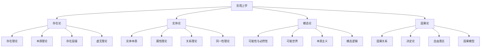

# 08.01 形而上学 (Metaphysics)

[返回哲学科学主目录](../README.md) | [返回主索引](../../00_Master_Index/00_主索引-形式科学体系.md)

**文档编号**: 08.01-00-META  
**创建时间**: 2025-01-02  
**最后更新**: 2025-01-02  
**版本**: 1.1

---

## 08.01.0 主题树形编号目录

- 08.01.01 [本体论 (Ontology)](./Cross_Cutting_Concepts/)
  - 08.01.01.01 [存在理论](./Cross_Cutting_Concepts/01_Existence_Theory.md)
  - 08.01.01.02 [实体与属性](./Cross_Cutting_Concepts/01_02_实体论基础理论.md)
  - 08.01.01.03 [关系与结构](./Cross_Cutting_Concepts/01_04_关系论基础理论.md)
  - 08.01.01.04 [现实、信息与AI本体论](./Cross_Cutting_Concepts/02_Reality_Ontology.md)
- 08.01.02 [模态理论 (Modal Theory)](./02_Modality/)
  - 08.01.02.01 [可能性与必然性](./02_Modality/03_Modal_Theory.md)
  - 08.01.02.02 [可能世界](./02_Modality/01.1.3_模态理论.md)
- 08.01.03 [因果理论 (Causality Theory)](./03_Causality/)
  - 08.01.03.01 [因果关系](./03_Causality/04_Causality_Theory.md)
  - 08.01.03.02 [决定论与自由意志](./03_Causality/01.1.4_因果理论.md)
- 08.01.04 [交叉核心概念 (Cross-Cutting Concepts)](./Cross_Cutting_Concepts/)
  - 08.01.04.01 [逻辑哲学](./Cross_Cutting_Concepts/01.4.4_Logic_Philosophy.md)
  - 08.01.04.02 [推理与证明](./Cross_Cutting_Concepts/01.4.2_推理理论.md)

---

## 08.01.1 主题分层结构与导航

- [返回哲学科学主目录](../README.md)
- [返回主索引](../../00_Master_Index/00_主索引-形式科学体系.md)
- [跳转：形而上学核心概念图](#形而上学核心概念图)
- [跳转：形式化表达](#形而上学的形式化表达)
- [跳转：主要形而上学立场](#主要形而上学立场)
- [跳转：分支关系](#与其他哲学分支的关系)
- [跳转：研究方向](#当代形而上学研究方向)

---

## 08.01.2 交叉引用示例

- [08.01.01.01 存在理论](./Cross_Cutting_Concepts/01_Existence_Theory.md) ↔ [09.01.01 集合论基础](../../09_Mathematics/01_Set_Theory/01_Set_Theory_Foundation.md)
- [08.01.02.01 可能性与必然性](./02_Modality/03_Modal_Theory.md) ↔ [06.03.01 模态逻辑基础](../../06_Logic_Theory/03_Modal_Logic/01_Modal_Logic.md)
- [08.01.03.01 因果关系](./03_Causality/04_Causality_Theory.md) ↔ [09.06.01 概率论基础](../../09_Mathematics/07_Category_Theory/01_Category_Theory.md)

---

# 以下为原有内容（保留）

## 概述

形而上学是哲学的基础分支，研究存在的本质、实在的基本结构以及宇宙的根本性质。本目录包含形而上学的核心理论，包括存在论、实体理论、模态理论和因果理论等。

## 目录内容

### 1. [本体论 (Ontology)](./Cross_Cutting_Concepts/)

- 1.1 [存在理论](./Cross_Cutting_Concepts/01_Existence_Theory.md)
- 1.2 [实体与属性](./Cross_Cutting_Concepts/01_02_实体论基础理论.md)
- 1.3 [关系与结构](./Cross_Cutting_Concepts/01_04_关系论基础理论.md)
- 1.4 [现实、信息与AI本体论](./Cross_Cutting_Concepts/02_Reality_Ontology.md)

### 2. [模态理论 (Modal Theory)](./02_Modality/)

- 2.1 [可能性与必然性](./02_Modality/03_Modal_Theory.md)
- 2.2 [可能世界](./02_Modality/01.1.3_模态理论.md)

### 3. [因果理论 (Causality Theory)](./03_Causality/)

- 3.1 [因果关系](./03_Causality/04_Causality_Theory.md)
- 3.2 [决定论与自由意志](./03_Causality/01.1.4_因果理论.md)

### 4. [交叉核心概念 (Cross-Cutting Concepts)](./Cross_Cutting_Concepts/)

- 4.1 [逻辑哲学](./Cross_Cutting_Concepts/01.4.4_Logic_Philosophy.md)
- 4.2 [推理与证明](./Cross_Cutting_Concepts/01.4.2_推理理论.md)

## 形而上学核心概念图

## 形而上学的形式化表达

### 存在公理

**公理 1**: $\exists x \text{ } \text{Being}(x)$  
存在至少一个存在物。

**公理 2**: $\forall x \text{ } \text{Being}(x) \rightarrow \exists p \text{ } \text{Property}(p, x)$  
每个存在物都具有至少一个属性。

**公理 3**: $\forall x,y \text{ } (x \neq y) \rightarrow \exists p \text{ } (\text{Property}(p, x) \land \lnot \text{Property}(p, y))$  
不同的存在物至少在一个属性上有区别（莱布尼茨同一性原则）。

### 模态逻辑公理

**公理 K**: $\Box(p \rightarrow q) \rightarrow (\Box p \rightarrow \Box q)$  
分配公理：如果p蕴含q是必然的，那么如果p是必然的，则q也是必然的。

**公理 T**: $\Box p \rightarrow p$  
如果p是必然的，那么p是真的。

**公理 4**: $\Box p \rightarrow \Box\Box p$  
如果p是必然的，那么"p是必然的"也是必然的。

**公理 5**: $\lnot\Box p \rightarrow \Box\lnot\Box p$  
如果p不是必然的，那么"p不是必然的"是必然的。

### 因果关系形式化

定义因果关系 $C(x, y)$ 表示 $x$ 是 $y$ 的原因。

**公理 1**: $\forall x,y \text{ } C(x, y) \rightarrow \text{Precedes}(x, y)$  
因果关系要求原因在时间上先于结果。

**公理 2**: $\forall x,y \text{ } C(x, y) \rightarrow \Box(\text{Exists}(x) \rightarrow \text{Exists}(y))$  
在所有可能世界中，如果原因存在，结果也必然存在。

## 主要形而上学立场

| 立场 | 核心主张 | 代表人物 |
|------|---------|---------|
| 实在论 | 外部世界独立于心智而存在 | 亚里士多德、洛克 |
| 唯心主义 | 实在的本质是精神或心智的 | 黑格尔、贝克莱 |
| 唯物主义 | 一切存在都是物质的 | 德谟克利特、霍布斯 |
| 二元论 | 心灵和物质是两种不同的实体 | 笛卡尔 |
| 一元论 | 只存在一种基本实体 | 斯宾诺莎 |
| 虚无主义 | 否认客观价值和意义的存在 | 尼采、萨特 |

## 与其他哲学分支的关系

- **与认识论的关系**：形而上学关注"是什么"，认识论关注"如何知道"
- **与逻辑的关系**：逻辑为形而上学提供推理工具和形式化方法
- **与科学哲学的关系**：科学理论往往蕴含形而上学假设和承诺
- **与心灵哲学的关系**：心身问题是形而上学和心灵哲学的交叉点

## 当代形而上学研究方向

1. **分析形而上学**：使用当代逻辑和语言分析方法研究形而上学问题
2. **科学形而上学**：基于现代科学理论构建形而上学体系
3. **过程形而上学**：强调变化、关系和过程而非静态实体
4. **计算形而上学**：探索计算、信息和虚拟现实的本体论地位

## 文件合并说明

本目录是`01_Metaphysics`模块的根索引，整合了之前分散在多个目录中的形而上学相关内容，并按照本体论、模态、因果等核心主题进行了重新组织。

1. **本体论 (Ontology)**: 存放关于存在、实体、属性、关系等基础理论。
2. **模态理论 (Modal Theory)**: 存放关于可能性、必然性、可能世界等理论。
3. **因果理论 (Causality Theory)**: 存放关于因果关系、决定论等理论。
4. **交叉核心概念 (Cross-Cutting Concepts)**: 存放与其他哲学分支紧密交叉的概念，如逻辑哲学、推理理论等。

所有原始文件已根据其内容分类到以上子目录中。

## 相关文档

- [哲学基础主目录](../../README.md)
- [认识论](../../02_Epistemology/README.md)
- [逻辑哲学](../../04_Logic_Philosophy/README.md)
- [科学哲学](../../04_Philosophy_of_Science/README.md)

---

**负责人**: FormalScience团队  
**创建日期**: 2025-01-02
