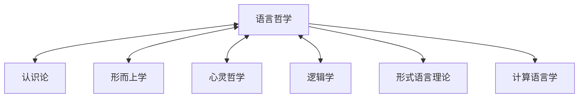

# 语言哲学 (Philosophy of Language)

## 1. 简介

语言哲学是哲学的一个核心分支，专注于研究语言的本质、意义的构成、语言与现实世界之间的关系，以及语言如何作为思想和知识的载体。本模块采用系统化、形式化的方法探讨语言的哲学问题，并为语言哲学的核心理论提供严格的形式表示和计算实现。

## 2. 核心问题

语言哲学关注的核心问题包括：

1. **意义理论**：语言表达式如何获得其意义？
2. **指称理论**：语言符号如何指称现实世界中的对象？
3. **真值条件**：语句的真值如何确定？
4. **语用现象**：语言在使用情境中如何产生额外的意义？
5. **语言行为**：语言如何作为行动的工具？
6. **语言与思维**：语言与思维之间存在什么关系？

## 3. 文件结构

本模块包含以下核心子目录：

- **[01_Semantics](./01_Semantics/)**: 语义学理论，研究意义和指称。
- **[02_Pragmatics](./02_Pragmatics/)**: 语用学理论，研究语言在上下文中的使用。
- **[03_Grammar_Theory](./03_Grammar_Theory/)**: 语法理论，研究语言的结构规则。
- **[04_Speech_Acts](./04_Speech_Acts/)**: 语言行为理论，研究语言如何作为行动。

## 4. 理论框架

### 4.1 语义学框架

```text
语义理论 = <L, M, ·>
```

其中：

- L 是形式语言
- M 是模型结构
- · 是解释函数，将语言表达式映射到模型中的实体

### 4.2 语用学框架

```text
语用理论 = <L, M, C, ·_C>
```

其中：

- L 是形式语言
- M 是模型结构
- C 是上下文集合
- ·_C 是上下文相关的解释函数

### 4.3 语言行为框架

```text
语言行为 = <F(p), C, E>
```

其中：

- F 是言语行为类型 (断言、承诺、命令等)
- p 是命题内容
- C 是行为成功条件
- E 是预期效果

## 5. 与其他哲学领域的关系

语言哲学与其他哲学分支的关系可表示为：



### 5.1 交叉引用

| 哲学领域 | 主要交叉点 |
|----------|----------|
| 认识论 | 语言与知识表示、真理理论 |
| 形而上学 | 指称理论、实在论/反实在论争论 |
| 心灵哲学 | 语言与思维关系、表征理论 |
| 逻辑学 | 形式语义学、逻辑形式、推理理论 |
| 伦理学 | 规范语言、评价表达 |

## 6. 形式化方法

本模块采用以下形式化方法：

1. **模型论语义学**：使用模型论为自然语言表达式提供精确语义
2. **可能世界语义学**：使用可能世界框架分析模态表达和命题态度
3. **动态语义学**：使用上下文变化潜力分析语用现象
4. **博弈论语用学**：使用博弈论分析会话中的策略互动

## 7. 代码实现

所有核心理论都配有Rust实现，例如：

```rust
// 简化的指称理论实现
pub struct ReferenceTheory<W, E> {
    worlds: Vec<W>,                     // 可能世界集
    entities: Vec<E>,                   // 实体集
    intension: HashMap<String, Vec<E>>, // 词汇到实体集映射
}

impl<W, E> ReferenceTheory<W, E> 
where 
    W: Clone + Eq + Hash,
    E: Clone + Eq + Hash
{
    // 计算表达式在特定世界中的指称
    pub fn reference(&self, expression: &str, world: &W) -> Option<&E> {
        // 实现代码
    }
    
    // 其他方法...
}
```

## 8. 研究方向

未来研究将重点关注：

1. 语言哲学与形式语言理论的深度集成
2. 语言行为理论的计算机实现
3. 语用学与AI自然语言处理的结合
4. 语言与实在的表征理论扩展

## 9. 参考文档

- [认识论文档](../02_Epistemology/README.md)
- [心灵哲学文档](../07_Philosophy_of_Mind/README.md)
- [形式语言理论](../../04_Formal_Language_Theory/README.md)
- [上下文管理系统](../../12_Context_System/README.md)
