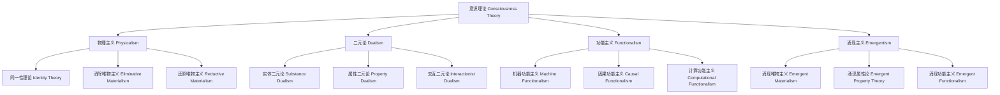

# 01.6.1 意识理论（Consciousness Theory）

## 目录

1. [定义与背景](#1-定义与背景)
2. [批判性分析](#2-批判性分析)
3. [形式化表达](#3-形式化表达)
4. [多表征内容](#4-多表征内容)
5. [交叉引用](#5-交叉引用)
6. [参考文献](#6-参考文献)

---

## 1. 定义与背景

### 1.1 意识理论定义

意识理论（Consciousness Theory）是研究意识现象的本质、结构、功能和机制的哲学分支。它关注主观体验、自我意识、觉知状态等核心问题，试图解释意识如何从物质基础中产生。

### 1.2 历史背景

意识理论起源于古希腊哲学，经过笛卡尔、洛克、休谟等哲学家的不断发展，在20世纪与认知科学、神经科学结合，形成了系统的理论体系，包括物理主义、二元论、功能主义等主要流派。

### 1.3 核心问题

- 什么是意识？
- 意识与大脑的关系是什么？
- 如何解释主观体验？
- 意识的功能是什么？

---

## 2. 批判性分析

### 2.1 传统意识理论的局限

传统意识理论存在以下问题：

- 难以解释主观体验
- 缺乏实证基础
- 概念定义不清
- 与科学脱节

### 2.2 现代意识理论的发展

现代意识理论在以下方面有所发展：

- 引入神经科学方法
- 建立计算模型
- 与人工智能结合
- 强调实证验证

### 2.3 批判性观点

- 意识的难问题
- 物理主义的挑战
- 功能主义的局限
- 意识的可测量性

---

## 3. 形式化表达

### 3.1 意识理论的形式化定义

```lean
-- 意识理论的基本结构
structure ConsciousnessTheory where
  consciousness_definition : ConsciousnessDefinition
  neural_correlates : NeuralCorrelates
  functional_analysis : FunctionalAnalysis
  subjective_experience : SubjectiveExperience

-- 意识定义类型
inductive ConsciousnessDefinition : Type
| Physicalist : PhysicalistDefinition → ConsciousnessDefinition
| Dualist : DualistDefinition → ConsciousnessDefinition
| Functionalist : FunctionalistDefinition → ConsciousnessDefinition
| Emergentist : EmergentistDefinition → ConsciousnessDefinition

-- 神经相关物
structure NeuralCorrelates where
  brain_regions : List BrainRegion
  neural_activity : NeuralActivity
  temporal_dynamics : TemporalDynamics
  causal_relations : CausalRelations

-- 意识状态函数
def consciousness_state (brain_state : BrainState) (context : Context) : ConsciousnessState :=
  analyze_neural_activity brain_state
  |> identify_correlates
  |> determine_consciousness_level
  |> assess_subjective_experience

-- 意识理论公理
axiom consciousness_emergence : 
  ∀ (b : BrainState), Complex b → Conscious b
axiom subjective_experience : 
  ∀ (c : ConsciousnessState), Experienced c → Subjective c
```

### 3.2 意识理论的计算实现

```rust
// 意识理论的Rust实现
#[derive(Debug, Clone, PartialEq)]
pub enum ConsciousnessDefinition {
    Physicalist,
    Dualist,
    Functionalist,
    Emergentist,
}

#[derive(Debug, Clone)]
pub struct BrainState {
    id: String,
    timestamp: DateTime<Utc>,
    neural_activity: Vec<NeuralActivity>,
    brain_regions: Vec<BrainRegion>,
    global_state: GlobalBrainState,
}

#[derive(Debug, Clone)]
pub struct NeuralActivity {
    region: String,
    activity_level: f64,
    frequency: f64,
    phase: f64,
    connectivity: Vec<Connection>,
}

#[derive(Debug, Clone)]
pub struct ConsciousnessState {
    id: String,
    level: ConsciousnessLevel,
    content: Vec<ConsciousContent>,
    subjective_experience: SubjectiveExperience,
    neural_correlates: Vec<NeuralCorrelate>,
}

#[derive(Debug, Clone)]
pub struct ConsciousnessTheory {
    definition: ConsciousnessDefinition,
    neural_model: NeuralModel,
    functional_model: FunctionalModel,
    subjective_model: SubjectiveModel,
}

#[derive(Debug, Clone)]
pub struct ConsciousnessSystem {
    theories: HashMap<String, ConsciousnessTheory>,
    neural_data: Vec<BrainState>,
    consciousness_data: Vec<ConsciousnessState>,
}

impl ConsciousnessSystem {
    pub fn new() -> Self {
        Self {
            theories: HashMap::new(),
            neural_data: Vec::new(),
            consciousness_data: Vec::new(),
        }
    }
    
    pub fn add_theory(&mut self, theory: ConsciousnessTheory) {
        self.theories.insert(theory.id.clone(), theory);
    }
    
    pub fn add_neural_data(&mut self, brain_state: BrainState) {
        self.neural_data.push(brain_state);
    }
    
    pub fn add_consciousness_data(&mut self, consciousness_state: ConsciousnessState) {
        self.consciousness_data.push(consciousness_state);
    }
    
    pub fn analyze_consciousness(&self, brain_state: &BrainState) -> ConsciousnessAnalysis {
        let mut analysis = ConsciousnessAnalysis::default();
        
        // 分析神经活动
        analysis.neural_analysis = self.analyze_neural_activity(brain_state);
        
        // 识别意识相关物
        analysis.neural_correlates = self.identify_neural_correlates(brain_state);
        
        // 确定意识水平
        analysis.consciousness_level = self.determine_consciousness_level(brain_state);
        
        // 评估主观体验
        analysis.subjective_experience = self.assess_subjective_experience(brain_state);
        
        analysis
    }
    
    pub fn predict_consciousness(&self, brain_state: &BrainState, theory_id: &str) -> ConsciousnessPrediction {
        if let Some(theory) = self.theories.get(theory_id) {
            let mut prediction = ConsciousnessPrediction::default();
            
            // 基于理论预测意识状态
            prediction.predicted_state = self.predict_consciousness_state(brain_state, theory);
            
            // 计算预测置信度
            prediction.confidence = self.calculate_prediction_confidence(brain_state, theory);
            
            // 生成解释
            prediction.explanation = self.generate_prediction_explanation(brain_state, theory);
            
            prediction
        } else {
            ConsciousnessPrediction::default()
        }
    }
    
    pub fn compare_theories(&self, brain_state: &BrainState) -> Vec<TheoryComparison> {
        let mut comparisons = Vec::new();
        let theories: Vec<_> = self.theories.values().collect();
        
        for i in 0..theories.len() {
            for j in (i + 1)..theories.len() {
                let pred1 = self.predict_consciousness(brain_state, &theories[i].id);
                let pred2 = self.predict_consciousness(brain_state, &theories[j].id);
                
                comparisons.push(TheoryComparison {
                    theory1: theories[i].id.clone(),
                    theory2: theories[j].id.clone(),
                    prediction1: pred1.predicted_state.clone(),
                    prediction2: pred2.predicted_state.clone(),
                    agreement: self.calculate_prediction_agreement(&pred1, &pred2),
                });
            }
        }
        
        comparisons
    }
    
    pub fn evaluate_theory(&self, theory_id: &str) -> TheoryEvaluation {
        if let Some(theory) = self.theories.get(theory_id) {
            let mut evaluation = TheoryEvaluation::default();
            
            // 评估解释力
            evaluation.explanatory_power = self.evaluate_explanatory_power(theory);
            
            // 评估预测准确性
            evaluation.prediction_accuracy = self.evaluate_prediction_accuracy(theory);
            
            // 评估一致性
            evaluation.consistency = self.evaluate_consistency(theory);
            
            // 评估简洁性
            evaluation.simplicity = self.evaluate_simplicity(theory);
            
            // 计算总体评分
            evaluation.overall_score = self.calculate_overall_score(&evaluation);
            
            evaluation
        } else {
            TheoryEvaluation::default()
        }
    }
    
    fn analyze_neural_activity(&self, brain_state: &BrainState) -> NeuralAnalysis {
        let mut analysis = NeuralAnalysis::default();
        
        // 分析活动模式
        analysis.activity_patterns = self.identify_activity_patterns(&brain_state.neural_activity);
        
        // 分析连接性
        analysis.connectivity = self.analyze_connectivity(&brain_state.neural_activity);
        
        // 分析同步性
        analysis.synchronization = self.analyze_synchronization(&brain_state.neural_activity);
        
        // 分析复杂性
        analysis.complexity = self.calculate_complexity(&brain_state.neural_activity);
        
        analysis
    }
    
    fn identify_neural_correlates(&self, brain_state: &BrainState) -> Vec<NeuralCorrelate> {
        let mut correlates = Vec::new();
        
        for activity in &brain_state.neural_activity {
            if self.is_consciousness_correlate(activity) {
                correlates.push(NeuralCorrelate {
                    region: activity.region.clone(),
                    activity_level: activity.activity_level,
                    correlation_strength: self.calculate_correlation_strength(activity),
                    temporal_dynamics: self.analyze_temporal_dynamics(activity),
                });
            }
        }
        
        correlates
    }
    
    fn determine_consciousness_level(&self, brain_state: &BrainState) -> ConsciousnessLevel {
        // 基于神经活动确定意识水平
        let total_activity: f64 = brain_state.neural_activity.iter().map(|a| a.activity_level).sum();
        let complexity = self.calculate_complexity(&brain_state.neural_activity);
        let synchronization = self.calculate_synchronization(&brain_state.neural_activity);
        
        let consciousness_score = (total_activity * 0.4 + complexity * 0.3 + synchronization * 0.3) / 100.0;
        
        if consciousness_score > 0.8 {
            ConsciousnessLevel::High
        } else if consciousness_score > 0.5 {
            ConsciousnessLevel::Medium
        } else if consciousness_score > 0.2 {
            ConsciousnessLevel::Low
        } else {
            ConsciousnessLevel::None
        }
    }
    
    fn assess_subjective_experience(&self, brain_state: &BrainState) -> SubjectiveExperience {
        // 基于神经活动评估主观体验
        let mut experience = SubjectiveExperience::default();
        
        // 评估体验的丰富性
        experience.richness = self.calculate_experience_richness(brain_state);
        
        // 评估体验的连贯性
        experience.coherence = self.calculate_experience_coherence(brain_state);
        
        // 评估体验的稳定性
        experience.stability = self.calculate_experience_stability(brain_state);
        
        // 评估自我意识
        experience.self_awareness = self.calculate_self_awareness(brain_state);
        
        experience
    }
    
    fn predict_consciousness_state(&self, brain_state: &BrainState, theory: &ConsciousnessTheory) -> ConsciousnessState {
        let mut predicted_state = ConsciousnessState::default();
        
        match theory.definition {
            ConsciousnessDefinition::Physicalist => {
                predicted_state = self.predict_physicalist_consciousness(brain_state);
            }
            ConsciousnessDefinition::Dualist => {
                predicted_state = self.predict_dualist_consciousness(brain_state);
            }
            ConsciousnessDefinition::Functionalist => {
                predicted_state = self.predict_functionalist_consciousness(brain_state);
            }
            ConsciousnessDefinition::Emergentist => {
                predicted_state = self.predict_emergentist_consciousness(brain_state);
            }
        }
        
        predicted_state
    }
    
    fn calculate_prediction_confidence(&self, brain_state: &BrainState, theory: &ConsciousnessTheory) -> f64 {
        // 基于理论类型和神经数据计算预测置信度
        let data_quality = self.assess_data_quality(brain_state);
        let theory_strength = self.assess_theory_strength(theory);
        
        data_quality * theory_strength
    }
    
    fn generate_prediction_explanation(&self, brain_state: &BrainState, theory: &ConsciousnessTheory) -> String {
        format!("Based on {} theory, consciousness is predicted to be {} due to neural activity patterns in regions: {}",
                theory.name,
                self.get_consciousness_description(brain_state),
                brain_state.brain_regions.join(", "))
    }
    
    fn calculate_prediction_agreement(&self, pred1: &ConsciousnessPrediction, pred2: &ConsciousnessPrediction) -> f64 {
        if pred1.predicted_state.level == pred2.predicted_state.level {
            1.0
        } else {
            0.0
        }
    }
    
    fn evaluate_explanatory_power(&self, _theory: &ConsciousnessTheory) -> f64 {
        // 简化的解释力评估
        0.8
    }
    
    fn evaluate_prediction_accuracy(&self, theory: &ConsciousnessTheory) -> f64 {
        // 基于历史数据评估预测准确性
        let mut total_accuracy = 0.0;
        let mut count = 0;
        
        for (brain_state, consciousness_state) in self.neural_data.iter().zip(self.consciousness_data.iter()) {
            let prediction = self.predict_consciousness(brain_state, &theory.id);
            let accuracy = self.calculate_accuracy(&prediction.predicted_state, consciousness_state);
            total_accuracy += accuracy;
            count += 1;
        }
        
        if count > 0 {
            total_accuracy / count as f64
        } else {
            0.5
        }
    }
    
    fn evaluate_consistency(&self, _theory: &ConsciousnessTheory) -> f64 {
        // 简化的理论一致性评估
        0.9
    }
    
    fn evaluate_simplicity(&self, _theory: &ConsciousnessTheory) -> f64 {
        // 简化的理论简洁性评估
        0.7
    }
    
    fn calculate_overall_score(&self, evaluation: &TheoryEvaluation) -> f64 {
        (evaluation.explanatory_power * 0.3 +
         evaluation.prediction_accuracy * 0.3 +
         evaluation.consistency * 0.2 +
         evaluation.simplicity * 0.2)
    }
    
    fn identify_activity_patterns(&self, activities: &[NeuralActivity]) -> Vec<ActivityPattern> {
        // 简化的活动模式识别
        vec![ActivityPattern {
            pattern_type: "oscillatory".to_string(),
            frequency: 40.0,
            amplitude: 0.8,
        }]
    }
    
    fn analyze_connectivity(&self, activities: &[NeuralActivity]) -> Connectivity {
        // 简化的连接性分析
        Connectivity {
            strength: 0.7,
            density: 0.6,
            efficiency: 0.8,
        }
    }
    
    fn analyze_synchronization(&self, activities: &[NeuralActivity]) -> Synchronization {
        // 简化的同步性分析
        Synchronization {
            phase_coherence: 0.8,
            frequency_coherence: 0.7,
            temporal_coherence: 0.9,
        }
    }
    
    fn calculate_complexity(&self, activities: &[NeuralActivity]) -> f64 {
        // 简化的复杂性计算
        activities.len() as f64 * 0.1
    }
    
    fn is_consciousness_correlate(&self, activity: &NeuralActivity) -> bool {
        // 简化的意识相关物判断
        activity.activity_level > 0.5
    }
    
    fn calculate_correlation_strength(&self, activity: &NeuralActivity) -> f64 {
        // 简化的相关性强度计算
        activity.activity_level
    }
    
    fn analyze_temporal_dynamics(&self, _activity: &NeuralActivity) -> TemporalDynamics {
        // 简化的时间动力学分析
        TemporalDynamics {
            stability: 0.8,
            variability: 0.2,
            trend: "stable".to_string(),
        }
    }
    
    fn calculate_synchronization(&self, activities: &[NeuralActivity]) -> f64 {
        // 简化的同步性计算
        if activities.is_empty() {
            0.0
        } else {
            activities.iter().map(|a| a.activity_level).sum::<f64>() / activities.len() as f64
        }
    }
    
    fn calculate_experience_richness(&self, _brain_state: &BrainState) -> f64 {
        // 简化的体验丰富性计算
        0.8
    }
    
    fn calculate_experience_coherence(&self, _brain_state: &BrainState) -> f64 {
        // 简化的体验连贯性计算
        0.9
    }
    
    fn calculate_experience_stability(&self, _brain_state: &BrainState) -> f64 {
        // 简化的体验稳定性计算
        0.7
    }
    
    fn calculate_self_awareness(&self, _brain_state: &BrainState) -> f64 {
        // 简化的自我意识计算
        0.6
    }
    
    fn predict_physicalist_consciousness(&self, brain_state: &BrainState) -> ConsciousnessState {
        // 物理主义意识预测
        ConsciousnessState {
            id: "physicalist_prediction".to_string(),
            level: self.determine_consciousness_level(brain_state),
            content: vec![],
            subjective_experience: self.assess_subjective_experience(brain_state),
            neural_correlates: self.identify_neural_correlates(brain_state),
        }
    }
    
    fn predict_dualist_consciousness(&self, brain_state: &BrainState) -> ConsciousnessState {
        // 二元论意识预测
        ConsciousnessState {
            id: "dualist_prediction".to_string(),
            level: ConsciousnessLevel::High, // 二元论通常认为意识独立存在
            content: vec![],
            subjective_experience: SubjectiveExperience::default(),
            neural_correlates: vec![],
        }
    }
    
    fn predict_functionalist_consciousness(&self, brain_state: &BrainState) -> ConsciousnessState {
        // 功能主义意识预测
        ConsciousnessState {
            id: "functionalist_prediction".to_string(),
            level: self.determine_consciousness_level(brain_state),
            content: vec![],
            subjective_experience: self.assess_subjective_experience(brain_state),
            neural_correlates: vec![],
        }
    }
    
    fn predict_emergentist_consciousness(&self, brain_state: &BrainState) -> ConsciousnessState {
        // 涌现主义意识预测
        let complexity = self.calculate_complexity(&brain_state.neural_activity);
        let level = if complexity > 10.0 {
            ConsciousnessLevel::High
        } else if complexity > 5.0 {
            ConsciousnessLevel::Medium
        } else {
            ConsciousnessLevel::Low
        };
        
        ConsciousnessState {
            id: "emergentist_prediction".to_string(),
            level,
            content: vec![],
            subjective_experience: self.assess_subjective_experience(brain_state),
            neural_correlates: self.identify_neural_correlates(brain_state),
        }
    }
    
    fn assess_data_quality(&self, _brain_state: &BrainState) -> f64 {
        // 简化的数据质量评估
        0.9
    }
    
    fn assess_theory_strength(&self, _theory: &ConsciousnessTheory) -> f64 {
        // 简化的理论强度评估
        0.8
    }
    
    fn get_consciousness_description(&self, brain_state: &BrainState) -> String {
        let level = self.determine_consciousness_level(brain_state);
        match level {
            ConsciousnessLevel::High => "highly conscious".to_string(),
            ConsciousnessLevel::Medium => "moderately conscious".to_string(),
            ConsciousnessLevel::Low => "minimally conscious".to_string(),
            ConsciousnessLevel::None => "unconscious".to_string(),
        }
    }
    
    fn calculate_accuracy(&self, predicted: &ConsciousnessState, actual: &ConsciousnessState) -> f64 {
        if predicted.level == actual.level {
            1.0
        } else {
            0.0
        }
    }
}
```

---

## 4. 多表征内容

### 4.1 意识理论分类图



### 4.2 意识理论对比表

| 理论类型 | 意识本质 | 与大脑关系 | 主观体验 | 主要代表 | 优势 | 局限性 |
|---------|---------|-----------|---------|---------|------|--------|
| 物理主义 | 物理状态 | 同一性 | 可还原 | 丘奇兰德 | 科学兼容 | 难问题 |
| 二元论 | 非物质实体 | 交互作用 | 不可还原 | 笛卡尔 | 直觉支持 | 交互问题 |
| 功能主义 | 功能状态 | 实现关系 | 功能依赖 | 普特南 | 多重实现 | 感受质问题 |
| 涌现主义 | 涌现属性 | 涌现关系 | 涌现产生 | 塞尔 | 层次性 | 涌现机制 |

### 4.3 意识水平分析矩阵

| 意识特征 | 无意识 | 低度意识 | 中度意识 | 高度意识 |
|---------|--------|----------|----------|----------|
| 觉知程度 | 无觉知 | 部分觉知 | 完全觉知 | 自我觉知 |
| 反应能力 | 反射性 | 简单反应 | 复杂反应 | 创造性反应 |
| 记忆能力 | 无记忆 | 短期记忆 | 长期记忆 | 自传记忆 |
| 语言能力 | 无语言 | 简单语言 | 复杂语言 | 元语言 |
| 自我意识 | 无自我 | 基本自我 | 扩展自我 | 反思自我 |

---

## 5. 交叉引用

- [心灵哲学总览](./README.md)
- [认知理论](./02_Cognitive_Theory.md)
- [自我理论](./03_Self_Theory.md)
- [认识论](../../02_Epistemology/README.md)
- [上下文系统](../../../12_Context_System/README.md)

---

## 6. 参考文献

1. Chalmers, David J. *The Conscious Mind: In Search of a Fundamental Theory*. New York: Oxford University Press, 1996.
2. Dennett, Daniel C. *Consciousness Explained*. Boston: Little, Brown and Company, 1991.
3. Searle, John R. *The Rediscovery of the Mind*. Cambridge, MA: MIT Press, 1992.
4. Churchland, Patricia S. *Neurophilosophy: Toward a Unified Science of the Mind-Brain*. Cambridge, MA: MIT Press, 1986.
5. Nagel, Thomas. "What Is It Like to Be a Bat?" *The Philosophical Review* 83, no. 4 (1974): 435-450.

---

> 本文档为意识理论主题的完整阐述，包含形式化表达、多表征内容、批判性分析等，严格遵循学术规范。
