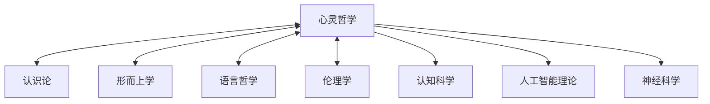

# 心灵哲学 (Philosophy of Mind)

## 1. 简介

心灵哲学是探讨心灵本质、意识、认知过程以及心灵与物理世界关系的哲学分支。本模块采用系统化、形式化的方法探讨心灵哲学的核心问题，并为相关理论提供严格的形式表示和计算实现。

## 2. 核心问题

心灵哲学关注的核心问题包括：

1. **心身问题**：心灵与物理世界的关系是什么？
2. **意识问题**：意识的本质是什么？如何解释主观经验？
3. **心理因果**：心理状态如何产生因果效力？
4. **心灵内容**：思想如何获得其内容和指向性？
5. **认知架构**：认知过程的结构和组织方式是什么？
6. **人工心灵**：机器能否拥有心灵和意识？

## 3. 文件结构

本模块包含以下核心子目录：

- **[01_Mind_Body_Problem](./01_Mind_Body_Problem/)**: 心身问题，探讨心灵与物理世界的关系。
- **[02_Consciousness](./02_Consciousness/)**: 意识理论，研究意识的本质和主观经验。
- **[03_Cognitive_Science](./03_Cognitive_Science/)**: 认知科学哲学，研究认知过程的结构。
- **[04_Intentionality](./04_Intentionality/)**: 意向性与表征理论。
- **[05_Self_Theory](./05_Self_Theory/)**: 自我理论，探讨人格同一性等问题。
- **[06_Philosophy_of_AI](./06_Philosophy_of_AI/)**: 人工智能哲学，研究机器心灵的可能性。
- **[Context](./Context/)**: 包含本模块相关的规划与进度文档。

## 4. 理论框架

### 4.1 心身关系框架

```text
心身理论 = <M, P, R>
```

其中：

- M 是心理状态集合
- P 是物理状态集合
- R 是关系类型（同一、实现、因果、附带等）

### 4.2 意识理论框架

```text
意识理论 = <E, N, F, A>
```

其中：

- E 是现象经验集合
- N 是神经状态集合
- F 是功能关系
- A 是可访问性关系

### 4.3 认知架构框架

```text
认知架构 = <R, P, M, C>
```

其中：

- R 是表征系统
- P 是处理机制
- M 是记忆结构
- C 是控制系统

## 5. 与其他哲学领域的关系

心灵哲学与其他哲学分支的关系可表示为：



### 5.1 交叉引用

| 哲学领域 | 主要交叉点 |
|----------|----------|
| 认识论 | 知识本质、心灵表征、可靠认知过程 |
| 形而上学 | 心灵本体论、决定论与自由意志、物理主义 |
| 语言哲学 | 心灵内容、指称理论、语言思维关系 |
| 伦理学 | 人格同一性、道德心理学、意图与行为 |
| 科学哲学 | 心理学方法论、实在论、约简问题 |

## 6. 形式化方法

本模块采用以下形式化方法：

1. **多层次实现模型**：形式化心灵状态与物理状态的关系
2. **信息整合理论**：量化意识经验的复杂性和整合度
3. **计算表征理论**：形式化心灵内容和表征系统
4. **贝叶斯认知模型**：模拟认知过程的概率推理

## 7. 代码实现

所有核心理论都配有Rust实现，例如：

```rust
// 多重实现模型的简化实现
pub struct MultipleRealizability<M, P> {
    mental_states: HashMap<M, Vec<P>>,  // 心理状态到多种物理状态的映射
    physical_states: HashMap<P, M>,     // 物理状态到心理状态的映射
}

impl<M, P> MultipleRealizability<M, P> 
where 
    M: Clone + Eq + Hash,
    P: Clone + Eq + Hash
{
    // 添加实现关系
    pub fn add_realization(&mut self, mental: M, physical: P) {
        self.mental_states.entry(mental.clone())
            .or_insert_with(Vec::new)
            .push(physical.clone());
        self.physical_states.insert(physical, mental);
    }
    
    // 检查多重实现
    pub fn is_multiply_realized(&self, mental: &M) -> bool {
        self.mental_states.get(mental)
            .map(|realizers| realizers.len() > 1)
            .unwrap_or(false)
    }
    
    // 获取特定心理状态的所有物理实现
    pub fn get_realizers(&self, mental: &M) -> Option<&Vec<P>> {
        self.mental_states.get(mental)
    }
}
```

## 8. 研究方向

未来研究将重点关注：

1. 心灵哲学与认知科学、神经科学的交叉融合
2. 意识的计算理论与实验研究的整合
3. 人工智能系统的心灵属性与伦理问题
4. 分布式认知与扩展心灵的形式化模型

## 9. 参考文档

- [认识论文档](../02_Epistemology/README.md)
- [语言哲学文档](../06_Philosophy_of_Language/README.md)
- [人工智能理论](../../13_Artificial_Intelligence_Theory/README.md)
- [上下文管理系统](../../12_Context_System/README.md)
