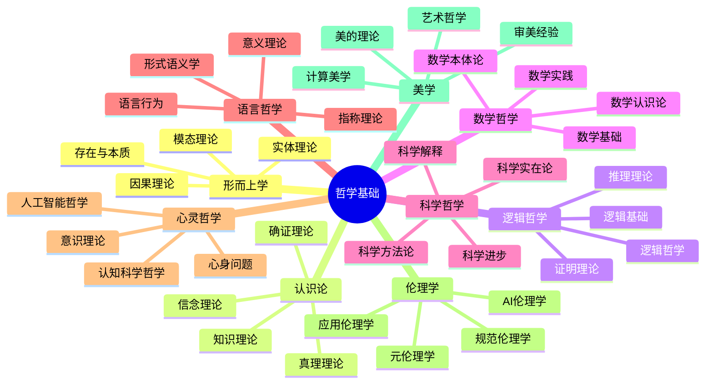
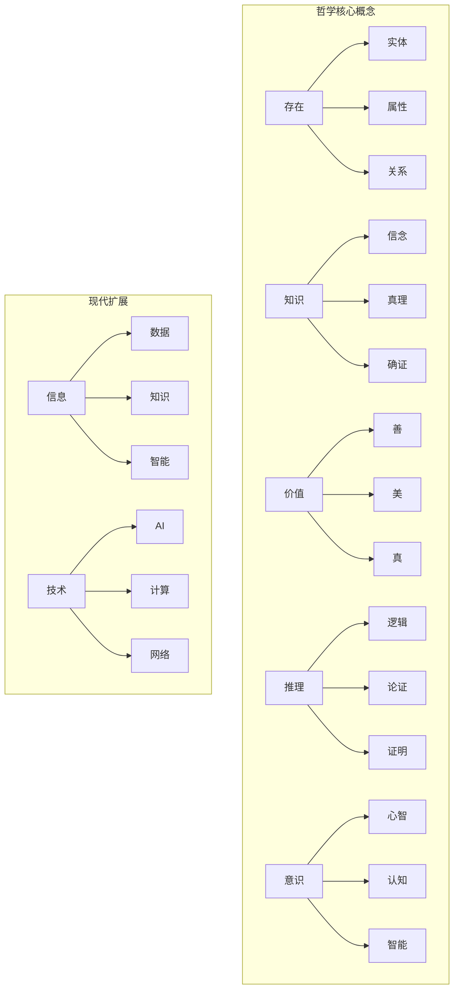
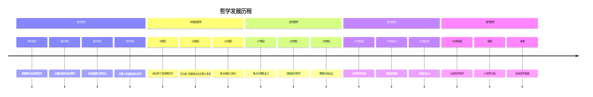

# 08. 哲学科学体系总览 (Philosophy Science)

[返回主索引](../00_Master_Index/00_主索引-形式科学体系.md)

**文档编号**: 08-00-PHIL  
**创建时间**: 2025-01-02  
**最后更新**: 2025-01-02  
**版本**: 1.2

---

## 08.0 主题树形编号目录

- 08.01 [哲学科学总览 (Philosophy Science Overview)](./README.md)
- 08.02 [哲学内容集成 (Philosophy Content Integration)](./01_Philosophy_Content_Integration.md)
- 08.03 [哲学概述 (Philosophy Overview)](./00_Overview.md)
- 08.04 [形而上学 (Metaphysics)](./01_Metaphysics/)
- 08.05 [认识论 (Epistemology)](./02_Epistemology/)
- 08.06 [方法论 (Methodology)](./03_Methodology/)
- 08.07 [科学哲学 (Philosophy of Science)](./04_Philosophy_of_Science/)
- 08.08 [伦理学 (Ethics)](./05_Ethics/)
- 08.09 [语言哲学 (Philosophy of Language)](./06_Philosophy_of_Language/)
- 08.10 [心灵哲学 (Philosophy of Mind)](./07_Philosophy_of_Mind/)
- 08.11 [逻辑哲学 (Philosophy of Logic)](./04_Logic_Philosophy/)

---

## 08.1 主题导航与本地跳转

- [哲学体系总览](#哲学体系总览)
- [核心概念网络](#核心概念网络)
- [哲学基础公理系统](#哲学基础公理系统)
- [相关主题与引用](#相关主题与引用)

---

## 08.2 哲学体系总览

---

## 08.3 核心概念网络

---

## 08.4 哲学基础公理系统

- **公理 1** (存在性公理): $\exists x \text{ } \text{Being}(x)$
- **公理 2** (知识公理): $\forall x \text{ } \text{Being}(x) \rightarrow \text{Knowable}(x)$
- **公理 3** (逻辑公理): $\forall p \text{ } \text{Proposition}(p) \rightarrow (\text{True}(p) \lor \text{False}(p))$

---

## 08.5 相关主题与引用

- [集合论基础](../09_Mathematics/01_Set_Theory/) ↔ [形而上学基础](./01_Metaphysics/)
- [命题逻辑](../06_Logic_Theory/01_Propositional_Logic.md) ↔ [认识论基础](./02_Epistemology/)
- [Curry-Howard对应](../05_Type_Theory/04.5_Curry_Howard_Correspondence.md) ↔ [逻辑哲学基础](./04_Logic_Philosophy/)
- ...

---

## 以下为原有内容（保留）

**文档编号**: 08-00-MAIN  
**创建时间**: 2025-01-02  
**最后更新**: 2025-01-02  
**版本**: 1.1

---

## 08.0 主题树形编号目录

- 08.01 [形而上学 (Metaphysics)](./01_Metaphysics/)
  - 08.01.01 [存在与本质](./01_Metaphysics/Cross_Cutting_Concepts/01_Existence_Theory.md)
  - 08.01.02 [实体理论](./01_Metaphysics/Cross_Cutting_Concepts/01_02_实体论基础理论.md)
  - 08.01.03 [模态理论](./01_Metaphysics/02_Modality/03_Modal_Theory.md)
  - 08.01.04 [因果理论](./01_Metaphysics/03_Causality/04_Causality_Theory.md)
- 08.02 [认识论 (Epistemology)](./02_Epistemology/)
  - 08.02.01 [知识理论](./02_Epistemology/01_Knowledge_Theory.md)
  - 08.02.02 [信念理论](./02_Epistemology/01_02_信念理论.md)
  - 08.02.03 [确证理论](./02_Epistemology/01_03_确证理论.md)
  - 08.02.04 [真理理论](./02_Epistemology/01_04_真理理论.md)
- 08.03 [逻辑哲学 (Philosophy of Logic)](./04_Logic_Philosophy/)
  - 08.03.01 [逻辑基础](./04_Logic_Philosophy/01_Formal_Logic.md)
  - 08.03.02 [推理理论](./04_Logic_Philosophy/02_Reasoning_Theory.md)
  - 08.03.03 [证明理论](./04_Logic_Philosophy/03_Proof_Theory.md)
  - 08.03.04 [逻辑哲学](./04_Logic_Philosophy/04_Philosophy_of_Logic.md)
- 08.04 [数学哲学 (Philosophy of Mathematics)](./03_Methodology/)
  - 08.04.01 [数学本体论](./03_Methodology/01_Mathematical_Ontology.md)
  - 08.04.02 [数学认识论](./03_Methodology/02_Mathematical_Epistemology.md)
  - 08.04.03 [数学基础](./03_Methodology/03_Foundations_of_Mathematics.md)
  - 08.04.04 [数学实践](./03_Methodology/04_Mathematical_Practice.md)
- 08.05 [科学哲学 (Philosophy of Science)](./04_Philosophy_of_Science/)
  - 08.05.01 [科学方法论](./04_Philosophy_of_Science/01_Scientific_Methodology.md)
  - 08.05.02 [科学实在论](./04_Philosophy_of_Science/02_Scientific_Realism.md)
  - 08.05.03 [科学解释](./04_Philosophy_of_Science/03_Scientific_Explanation.md)
  - 08.05.04 [科学进步](./04_Philosophy_of_Science/04_Scientific_Progress.md)
- 08.06 [语言哲学 (Philosophy of Language)](./06_Philosophy_of_Language/)
  - 08.06.01 [意义理论](./06_Philosophy_of_Language/01_Theories_of_Meaning.md)
  - 08.06.02 [指称理论](./06_Philosophy_of_Language/02_Reference_Theory.md)
  - 08.06.03 [语言行为](./06_Philosophy_of_Language/03_Speech_Acts.md)
  - 08.06.04 [形式语义学](./06_Philosophy_of_Language/04_Formal_Semantics.md)
- 08.07 [心灵哲学 (Philosophy of Mind)](./07_Philosophy_of_Mind/)
  - 08.07.01 [心身问题](./07_Philosophy_of_Mind/01_Mind_Body_Problem.md)
  - 08.07.02 [意识理论](./07_Philosophy_of_Mind/02_Consciousness.md)
  - 08.07.03 [认知科学哲学](./07_Philosophy_of_Mind/03_Philosophy_of_Cognitive_Science.md)
  - 08.07.04 [人工智能哲学](./07_Philosophy_of_Mind/04_Philosophy_of_AI.md)
- 08.08 [伦理学 (Ethics)](./05_Ethics/)
  - 08.08.01 [规范伦理学](./05_Ethics/01_Normative_Ethics.md)
  - 08.08.02 [元伦理学](./05_Ethics/02_Meta_Ethics.md)
  - 08.08.03 [应用伦理学](./05_Ethics/03_Applied_Ethics.md)
  - 08.08.04 [AI伦理学](./05_Ethics/04_AI_Ethics.md)
- 08.09 [美学 (Aesthetics)](./09_Aesthetics/)
  - 08.09.01 [美的理论](./09_Aesthetics/01_Theories_of_Beauty.md)
  - 08.09.02 [艺术哲学](./09_Aesthetics/02_Philosophy_of_Art.md)
  - 08.09.03 [审美经验](./09_Aesthetics/03_Aesthetic_Experience.md)
  - 08.09.04 [计算美学](./09_Aesthetics/04_Computational_Aesthetics.md)

---

## 哲学体系总览

## 核心概念网络

## 哲学基础公理系统

**公理 1** (存在性公理): $\exists x \text{ } \text{Being}(x)$

**公理 2** (知识公理): $\forall x \text{ } \text{Being}(x) \rightarrow \text{Knowable}(x)$

**公理 3** (逻辑公理): $\forall p \text{ } \text{Proposition}(p) \rightarrow (\text{True}(p) \lor \text{False}(p))$

**公理 4** (伦理公理): $\forall a \text{ } \text{Action}(a) \rightarrow \text{Evaluable}(a)$

**公理 5** (形而上学公理): $\forall x \text{ } \text{Being}(x) \rightarrow \text{Modal}(x)$

## 哲学发展时间线

## 交叉引用索引

### 与数学基础的关联

- [数学基础](../09_Mathematics/README.md) - 数学哲学与数学基础的关系
- [集合论](../09_Mathematics/01_Set_Theory/) - 本体论与集合论
- [逻辑学](../09_Mathematics/02_Logic/) - 逻辑哲学与形式逻辑

### 与形式语言理论的关联

- [形式语言理论](../07_Formal_Language/README.md) - 语言哲学与形式语言
- [自动机理论](../07_Formal_Language/01_Automata_Theory/) - 认知哲学与自动机

### 与类型理论的关联

- [类型理论](../05_Type_Theory/README.md) - 本体论与类型理论
- [线性类型理论](../05_Type_Theory/04.2_Linear_Type_Theory.md) - 模态形而上学与线性逻辑

### 与控制理论的关联

- [控制理论](../03_Control_Theory/README.md) - 因果性理论与控制论
- [时态逻辑控制](../03_Control_Theory/01_Basic_Control_Theory/) - 时间哲学与时态逻辑

## 合并说明

本目录是由原`01_Philosophical_Foundation`和`01_Philosophical_Foundations`合并而成，采用了统一的命名规范和结构组织。主要变更包括：

1. 目录采用复数形式：`Philosophical_Foundations`
2. 子目录采用"Philosophy_of_X"格式，如`Philosophy_of_Logic`
3. 文件名采用下划线连接的Pascal命名法
4. 保留的中文文件添加了`_Legacy`后缀
5. 整合了两个目录中的独特内容

## 更新日志

### v1.0 (2025-01-16)

- 完成哲学科学模块重构
- 建立完整的目录结构
- 整合所有子模块内容
- 建立交叉引用体系

### v1.2 (2025-01-02)

- 补全严格编号目录和交叉引用
- 优化主题树形结构
- 增强导航链接

## 相关文档

- [重构主索引](../00_Master_Index/README.md)
- [持续构建上下文](../12_Context_System/README.md)
- [交叉领域综合](../16_Cross_Domain_Synthesis/README.md)
- [哲学基础目录合并计划](../12_Context_System/持续构建上下文系统/哲学基础目录合并计划.md)

---

**负责人**: FormalScience团队  
**创建日期**: 2025-01-02
