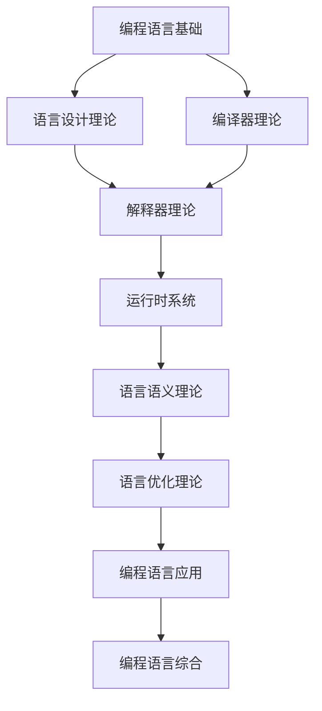

# 编程语言理论索引 (Programming Language Theory Index)

## 📋 **目录**

### 1. [编程语言基础](08.1_Programming_Language_Foundation.md)

### 2. [语言设计理论](08.2_Language_Design_Theory.md)

### 3. [编译器理论](08.3_Compiler_Theory.md)

### 4. [解释器理论](08.4_Interpreter_Theory.md)

### 5. [运行时系统](08.5_Runtime_Systems.md)

### 6. [语言语义理论](08.6_Language_Semantics_Theory.md)

### 7. [语言优化理论](08.7_Language_Optimization_Theory.md)

### 8. [编程语言应用](08.8_Programming_Language_Applications.md)

---

## 🎯 **编程语言理论概述**

编程语言理论研究编程语言的设计、实现和使用。它为软件开发提供了理论基础，涵盖了从语言设计到编译器实现的完整技术栈。

### 核心特征

1. **语言设计**：设计新的编程语言
2. **编译器技术**：实现语言的编译器
3. **语义理论**：定义语言的语义
4. **优化技术**：优化程序执行
5. **运行时支持**：提供运行时环境

### 理论层次

```
┌─────────────────────────────────────────────────────────────┐
│                    编程语言综合 (8.9)                         │
├─────────────────────────────────────────────────────────────┤
│ 应用理论 (8.8) │ 优化理论 (8.7) │ 语义理论 (8.6) │ 运行时系统 (8.5) │
├─────────────────────────────────────────────────────────────┤
│ 解释器理论 (8.4) │ 编译器理论 (8.3) │ 设计理论 (8.2) │ 基础理论 (8.1) │
└─────────────────────────────────────────────────────────────┘
```

---

## 🔗 **理论关联图**



---

## 📚 **详细主题结构**

### 8.1 编程语言基础

- **8.1.1** [语言分类](08.1_Programming_Language_Foundation.md#811-语言分类)
- **8.1.2** [语言范式](08.1_Programming_Language_Foundation.md#812-语言范式)
- **8.1.3** [语法理论](08.1_Programming_Language_Foundation.md#813-语法理论)
- **8.1.4** [语言特性](08.1_Programming_Language_Foundation.md#814-语言特性)

### 8.2 语言设计理论

- **8.2.1** [设计原则](08.2_Language_Design_Theory.md#821-设计原则)
- **8.2.2** [类型系统设计](08.2_Language_Design_Theory.md#822-类型系统设计)
- **8.2.3** [内存管理设计](08.2_Language_Design_Theory.md#823-内存管理设计)
- **8.2.4** [并发模型设计](08.2_Language_Design_Theory.md#824-并发模型设计)

### 8.3 编译器理论

- **8.3.1** [词法分析](08.3_Compiler_Theory.md#831-词法分析)
- **8.3.2** [语法分析](08.3_Compiler_Theory.md#832-语法分析)
- **8.3.3** [语义分析](08.3_Compiler_Theory.md#833-语义分析)
- **8.3.4** [代码生成](08.3_Compiler_Theory.md#834-代码生成)

### 8.4 解释器理论

- **8.4.1** [解释器架构](08.4_Interpreter_Theory.md#841-解释器架构)
- **8.4.2** [虚拟机设计](08.4_Interpreter_Theory.md#842-虚拟机设计)
- **8.4.3** [字节码执行](08.4_Interpreter_Theory.md#843-字节码执行)
- **8.4.4** [JIT编译](08.4_Interpreter_Theory.md#844-jit编译)

### 8.5 运行时系统

- **8.5.1** [内存管理](08.5_Runtime_Systems.md#851-内存管理)
- **8.5.2** [垃圾回收](08.5_Runtime_Systems.md#852-垃圾回收)
- **8.5.3** [异常处理](08.5_Runtime_Systems.md#853-异常处理)
- **8.5.4** [并发支持](08.5_Runtime_Systems.md#854-并发支持)

### 8.6 语言语义理论

- **8.6.1** [操作语义](08.6_Language_Semantics_Theory.md#861-操作语义)
- **8.6.2** [指称语义](08.6_Language_Semantics_Theory.md#862-指称语义)
- **8.6.3** [公理语义](08.6_Language_Semantics_Theory.md#863-公理语义)
- **8.6.4** [语义等价性](08.6_Language_Semantics_Theory.md#864-语义等价性)

### 8.7 语言优化理论

- **8.7.1** [静态分析](08.7_Language_Optimization_Theory.md#871-静态分析)
- **8.7.2** [代码优化](08.7_Language_Optimization_Theory.md#872-代码优化)
- **8.7.3** [性能分析](08.7_Language_Optimization_Theory.md#873-性能分析)
- **8.7.4** [优化策略](08.7_Language_Optimization_Theory.md#874-优化策略)

### 8.8 编程语言应用

- **8.8.1** [系统编程](08.8_Programming_Language_Applications.md#881-系统编程)
- **8.8.2** [Web开发](08.8_Programming_Language_Applications.md#882-web开发)
- **8.8.3** [科学计算](08.8_Programming_Language_Applications.md#883-科学计算)
- **8.8.4** [人工智能](08.8_Programming_Language_Applications.md#884-人工智能)

---

## 🔄 **与其他理论的关联**

### 向上关联

- **类型理论**：[04_Type_Theory](../04_Type_Theory/01_Type_Theory_Index.md)
- **形式语言理论**：[03_Formal_Language_Theory](../03_Formal_Language_Theory/01_Formal_Language_Theory_Index.md)

### 向下关联

- **软件工程理论**：[07_Software_Engineering_Theory](../07_Software_Engineering_Theory/01_Software_Engineering_Theory_Index.md)
- **形式模型理论**：[09_Formal_Model_Theory](../09_Formal_Model_Theory/01_Formal_Model_Theory_Index.md)

---

## 📖 **学习路径建议**

### 基础路径

1. 编程语言基础 → 语言设计理论 → 编译器理论
2. 解释器理论 → 运行时系统 → 语言语义理论
3. 语言优化理论 → 编程语言应用 → 编程语言综合

### 专业路径

- **编译器方向**：编译器理论 → 语言优化 → 代码生成
- **语言设计方向**：语言设计 → 语义理论 → 新语言开发
- **运行时方向**：运行时系统 → 内存管理 → 性能优化

---

## 🎯 **核心概念索引**

| 概念 | 定义位置 | 相关理论 |
|------|----------|----------|
| 语言分类 | [8.1.1](08.1_Programming_Language_Foundation.md#811-语言分类) | 编程语言基础 |
| 语言设计 | [8.2.1](08.2_Language_Design_Theory.md#821-设计原则) | 语言设计理论 |
| 编译器 | [8.3.1](08.3_Compiler_Theory.md#831-词法分析) | 编译器理论 |
| 解释器 | [8.4.1](08.4_Interpreter_Theory.md#841-解释器架构) | 解释器理论 |
| 运行时 | [8.5.1](08.5_Runtime_Systems.md#851-内存管理) | 运行时系统 |
| 语义 | [8.6.1](08.6_Language_Semantics_Theory.md#861-操作语义) | 语言语义理论 |
| 优化 | [8.7.1](08.7_Language_Optimization_Theory.md#871-静态分析) | 语言优化理论 |
| 系统编程 | [8.8.1](08.8_Programming_Language_Applications.md#881-系统编程) | 编程语言应用 |

---

## 🔄 **持续更新**

**最后更新时间**：2024-12-20
**版本**：v1.0.0
**维护者**：编程语言理论重构团队

---

## 📋 **待完成任务**

- [ ] 创建所有子主题的详细文档
- [ ] 建立编程语言概念间的交叉引用系统
- [ ] 完善编译器和解释器实现
- [ ] 构建编程语言理论与实践的桥梁
