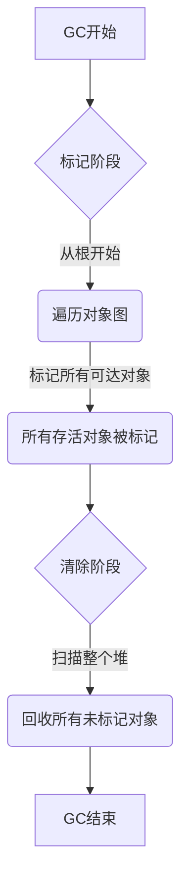

# 08.4.4 内存管理 (Memory Management)

## 目录

- [08.4.4 内存管理 (Memory Management)](#0844-内存管理-memory-management)
  - [目录](#目录)
  - [1. 定义与背景](#1-定义与背景)
  - [2. 批判性分析](#2-批判性分析)
  - [3. 核心策略](#3-核心策略)
  - [4. 形式化表达](#4-形式化表达)
  - [5. 交叉引用](#5-交叉引用)
  - [6. 参考文献](#6-参考文献)
  - [批判性分析](#批判性分析)

---

## 1. 定义与背景

内存管理是程序运行时系统的一个核心功能，它负责在程序执行期间，按需从操作系统申请内存、分配给程序的各个部分使用，并在不再需要时将其释放，以便重用。

---

## 2. 批判性分析

- **挑战**: 内存管理的目标是双重的：必须是**正确**的（不能过早释放仍被引用的内存，不能泄露不再引用的内存），也必须是**高效**的（分配和回收速度快，空间开销小，程序暂停时间短）。
- **手动 vs. 自动**: 这是内存管理最根本的设计选择。
  - **手动管理**: 程序员负责显式地申请（`malloc`）和释放（`free`）内存。
  - **自动管理**: 由运行时系统（通常是垃圾收集器）自动检测和回收不再使用的内存。

---

## 3. 核心策略

- **手动内存管理 (Manual Memory Management)**:
  - **优点**: 给予程序员最大程度的控制，可以实现极致的性能。
  - **缺点**: 极易出错，是两类最常见也最危险的bug的来源：**悬垂指针 (Dangling Pointers)** 和 **内存泄漏 (Memory Leaks)**。
  - **语言**: C, C++.
- **垃圾收集 (Garbage Collection, GC)**:
  - **描述**: 自动内存管理的最常用技术。GC会周期性地识别出程序中哪些内存是"不可达"的，并将其回收。
  - **核心算法**:
    - **引用计数 (Reference Counting)**: 跟踪每个对象被引用的次数，当计数归零时回收。无法处理循环引用。
    - **标记-清除 (Mark-and-Sweep)**: 从根对象（如栈上的变量）开始遍历对象图，标记所有可达对象，然后清除（回收）所有未被标记的对象。
    - **复制收集 (Copying Collection)**: 将堆分为两个半区，每次只使用一个。GC时，将存活对象从当前半区复制到另一个半区，然后清空当前半区。
- **所有权 (Ownership)**:
  - **描述**: Rust语言采用的创新策略。它是一套在编译时强制执行的规则，用于管理内存，核心思想是"任何值都有一个唯一的所有者"。当所有者离开作用域时，值被自动释放。
  - **优点**: 实现了与GC同等的内存安全，但没有运行时的GC开销。

---

## 4. 形式化表达

**标记-清除 (Mark-Sweep) GC 流程**:

---

## 5. 交叉引用

- [语言实现总览](README.md)
- [虚拟机与运行时](08.4.3_Virtual_Machines_and_Runtimes.md)
- [所有权(Rust)](../../TODO.md)

---

## 6. 参考文献

1. Jones, Richard, and Lins, Rafael. *Garbage Collection: Algorithms for Automatic Dynamic Memory Management*. 1996.
2. Klabnik, Steve, and Nichols, Carol. *The Rust Programming Language*. 2018.

## 批判性分析

- 本节内容待补充：请从多元理论视角、局限性、争议点、应用前景等方面进行批判性分析。
