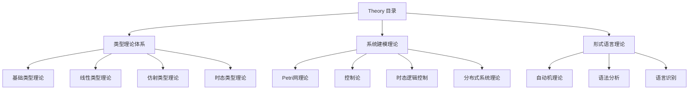
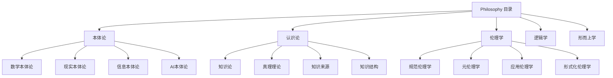
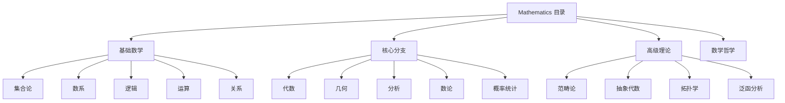
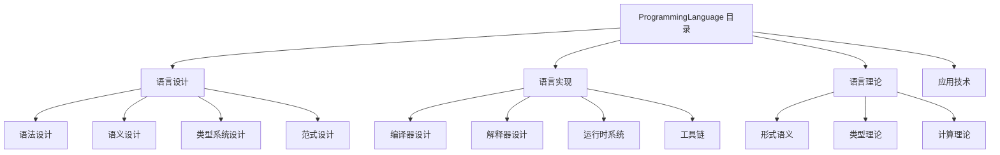
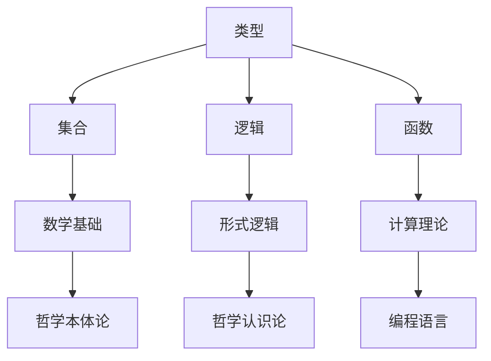

# 09.1 内容分析总结

## 目录

```markdown
09.1 内容分析总结
├── 1. 概述
│   ├── 1.1 分析目标
│   ├── 1.2 分析范围
│   └── 1.3 分析方法
├── 2. Theory 目录分析
│   ├── 2.1 内容概览
│   ├── 2.2 主题分类
│   ├── 2.3 知识结构
│   └── 2.4 重构建议
├── 3. Philosophy 目录分析
│   ├── 3.1 内容概览
│   ├── 3.2 主题分类
│   ├── 3.3 知识结构
│   └── 3.4 重构建议
├── 4. Mathematics 目录分析
│   ├── 4.1 内容概览
│   ├── 4.2 主题分类
│   ├── 4.3 知识结构
│   └── 4.4 重构建议
├── 5. ProgrammingLanguage 目录分析
│   ├── 5.1 内容概览
│   ├── 5.2 主题分类
│   ├── 5.3 知识结构
│   └── 5.4 重构建议
├── 6. 交叉引用分析
│   ├── 6.1 理论间关联
│   ├── 6.2 应用间关联
│   ├── 6.3 方法间关联
│   └── 6.4 概念间关联
├── 7. 重构计划
│   ├── 7.1 优先级排序
│   ├── 7.2 实施步骤
│   ├── 7.3 质量保证
│   └── 7.4 时间安排
└── 8. 结论
```

## 1. 概述

### 1.1 分析目标

**主要目标**:

1. **内容梳理** - 全面分析 `/docs` 目录下的所有内容
2. **主题提取** - 识别和分类各个主题领域
3. **知识结构** - 建立知识间的逻辑关系
4. **重构指导** - 为后续重构提供指导

**分析原则**:

- 哲学科学批判性分析
- 形式化规范化处理
- 交叉引用建立
- 学术规范性保证

### 1.2 分析范围

**覆盖目录**:

- `/docs/Theory/` - 65个理论文件
- `/docs/Philosophy/` - 12个哲学文件
- `/docs/Mathematics/` - 8个数学文件
- `/docs/ProgrammingLanguage/` - 10个编程语言文件

**分析深度**:

- 内容主题识别
- 知识结构分析
- 交叉引用建立
- 质量评估

### 1.3 分析方法

**分析方法**:

1. **内容分析** - 逐文件分析主题和内容
2. **结构分析** - 建立知识层次结构
3. **关联分析** - 识别交叉引用关系
4. **质量评估** - 评估内容的学术质量

## 2. Theory 目录分析

### 2.1 内容概览

**文件统计**:

- 总文件数: 65个
- 主要类型: 理论文档、综合文档、深化文档
- 内容深度: 高
- 形式化程度: 高

**核心主题**:

1. **类型理论体系** - 基础类型理论、线性类型理论、仿射类型理论、时态类型理论
2. **系统建模理论** - Petri网理论、控制论、时态逻辑控制、分布式系统理论
3. **形式语言理论** - 自动机理论、语法分析、语言识别

### 2.2 主题分类

**类型理论体系**:

```haskell
-- 类型理论分类
data TypeTheorySystem = TypeTheorySystem {
    foundation :: TypeTheoryFoundation,
    linear :: LinearTypeTheory,
    affine :: AffineTypeTheory,
    temporal :: TemporalTypeTheory,
    dependent :: DependentTypeTheory,
    higherOrder :: HigherOrderTypeTheory
}

-- 类型理论基础
data TypeTheoryFoundation = TypeTheoryFoundation {
    typeSystem :: TypeSystem,
    typeSafety :: TypeSafety,
    typeInference :: TypeInference,
    typeChecking :: TypeChecking
}
```

**系统建模理论**:

```haskell
-- 系统建模理论分类
data SystemModelingTheory = SystemModelingTheory {
    petriNet :: PetriNetTheory,
    control :: ControlTheory,
    temporalLogic :: TemporalLogicControl,
    distributed :: DistributedSystemsTheory
}

-- Petri网理论
data PetriNetTheory = PetriNetTheory {
    concurrency :: ConcurrencyModeling,
    stateTransition :: StateTransition,
    reachability :: ReachabilityAnalysis,
    boundedness :: BoundednessAnalysis
}
```

### 2.3 知识结构

**理论层次结构**:



### 2.4 重构建议

**重构策略**:

1. **去重合并** - 合并重复的理论内容
2. **层次化组织** - 建立清晰的层次结构
3. **交叉引用** - 建立理论间的关联
4. **形式化规范** - 统一格式和符号

**具体建议**:

- 将类型理论相关内容整合到 `01_Foundational_Theory/` 目录
- 将系统建模理论整合到 `03_Control_Theory/` 和 `04_Distributed_Systems/` 目录
- 将形式语言理论整合到 `02_Formal_Language_Theory/` 目录

## 3. Philosophy 目录分析

### 3.1 内容概览

**文件统计**:

- 总文件数: 12个
- 主要类型: 分析报告、索引文档、内容总结
- 内容深度: 高
- 哲学深度: 高

**核心主题**:

1. **本体论** - 数学本体论、现实本体论、信息本体论、AI本体论
2. **认识论** - 知识论、真理理论、知识来源、知识结构
3. **伦理学** - 规范伦理学、元伦理学、应用伦理学、形式化伦理学
4. **逻辑学** - 形式逻辑、哲学逻辑、非经典逻辑、逻辑哲学
5. **形而上学** - 存在论、模态形而上学、时间与空间、因果性

### 3.2 主题分类

**哲学体系分类**:

```haskell
-- 哲学体系分类
data PhilosophySystem = PhilosophySystem {
    ontology :: Ontology,
    epistemology :: Epistemology,
    ethics :: Ethics,
    logic :: Logic,
    metaphysics :: Metaphysics
}

-- 本体论
data Ontology = Ontology {
    mathematical :: MathematicalOntology,
    reality :: RealityOntology,
    information :: InformationOntology,
    ai :: AIOntology
}

-- 认识论
data Epistemology = Epistemology {
    knowledge :: KnowledgeTheory,
    truth :: TruthTheory,
    sources :: KnowledgeSources,
    structure :: KnowledgeStructure
}
```

### 3.3 知识结构

**哲学体系结构**:



### 3.4 重构建议

**重构策略**:

1. **体系化组织** - 按哲学分支组织内容
2. **形式化表达** - 将哲学观点形式化
3. **跨学科整合** - 与数学、计算机科学整合
4. **应用导向** - 强调实际应用价值

**具体建议**:

- 将哲学内容整合到 `05_Philosophy/` 目录
- 建立哲学与其他学科的交叉引用
- 形式化哲学论证过程
- 强调哲学在形式科学中的应用

## 4. Mathematics 目录分析

### 4.1 内容概览

**文件统计**:

- 总文件数: 8个
- 主要类型: 分析报告、索引文档、思维导图
- 内容深度: 高
- 数学深度: 高

**核心主题**:

1. **基础数学** - 集合论、数系、逻辑、运算、关系
2. **核心分支** - 代数、几何、分析、数论、概率统计
3. **高级理论** - 范畴论、抽象代数、拓扑学、泛函分析
4. **数学哲学** - 本体论、认识论、方法论

### 4.2 主题分类

**数学体系分类**:

```haskell
-- 数学体系分类
data MathematicsSystem = MathematicsSystem {
    foundation :: MathematicalFoundation,
    core :: CoreMathematics,
    advanced :: AdvancedMathematics,
    philosophy :: MathematicalPhilosophy
}

-- 数学基础
data MathematicalFoundation = MathematicalFoundation {
    setTheory :: SetTheory,
    numberSystems :: NumberSystems,
    logic :: Logic,
    operations :: Operations,
    relations :: Relations
}

-- 核心数学
data CoreMathematics = CoreMathematics {
    algebra :: Algebra,
    geometry :: Geometry,
    analysis :: Analysis,
    numberTheory :: NumberTheory,
    probability :: Probability
}
```

### 4.3 知识结构

**数学体系结构**:



### 4.4 重构建议

**重构策略**:

1. **公理化组织** - 按公理系统组织内容
2. **层次化结构** - 建立清晰的数学层次
3. **形式化表达** - 统一数学符号和格式
4. **应用导向** - 强调数学在形式科学中的应用

**具体建议**:

- 将数学内容整合到 `06_Mathematics/` 目录
- 建立数学与其他学科的交叉引用
- 形式化数学证明过程
- 强调数学在形式科学中的基础作用

## 5. ProgrammingLanguage 目录分析

### 5.1 内容概览

**文件统计**:

- 总文件数: 10个
- 主要类型: 语言设计、实现技术、理论分析
- 内容深度: 高
- 技术深度: 高

**核心主题**:

1. **语言设计** - 语法设计、语义设计、类型系统设计
2. **语言实现** - 编译器设计、解释器设计、运行时系统
3. **语言理论** - 形式语义、类型理论、计算理论
4. **应用技术** - 代码生成、优化技术、工具链

### 5.2 主题分类

**编程语言体系分类**:

```haskell
-- 编程语言体系分类
data ProgrammingLanguageSystem = ProgrammingLanguageSystem {
    design :: LanguageDesign,
    implementation :: LanguageImplementation,
    theory :: LanguageTheory,
    technology :: LanguageTechnology
}

-- 语言设计
data LanguageDesign = LanguageDesign {
    syntax :: SyntaxDesign,
    semantics :: SemanticsDesign,
    typeSystem :: TypeSystemDesign,
    paradigms :: ParadigmDesign
}

-- 语言实现
data LanguageImplementation = LanguageImplementation {
    compiler :: CompilerDesign,
    interpreter :: InterpreterDesign,
    runtime :: RuntimeSystem,
    tools :: ToolChain
}
```

### 5.3 知识结构

**编程语言体系结构**:



### 5.4 重构建议

**重构策略**:

1. **理论化组织** - 按理论体系组织内容
2. **技术化表达** - 统一技术术语和格式
3. **实践导向** - 强调实际应用价值
4. **跨学科整合** - 与形式语言理论整合

**具体建议**:

- 将编程语言内容整合到 `08_Programming_Language_Theory/` 目录
- 建立与形式语言理论的交叉引用
- 形式化语言设计过程
- 强调编程语言在形式科学中的应用

## 6. 交叉引用分析

### 6.1 理论间关联

**主要关联**:

```haskell
-- 理论间关联
data TheoryRelations = TheoryRelations {
    typeTheory :: TypeTheoryRelations,
    systemTheory :: SystemTheoryRelations,
    languageTheory :: LanguageTheoryRelations
}

-- 类型理论关联
data TypeTheoryRelations = TypeTheoryRelations {
    mathematics :: [MathematicalTheory],
    philosophy :: [PhilosophicalTheory],
    programming :: [ProgrammingTheory]
}
```

**关联矩阵**:

| 理论领域 | 数学 | 哲学 | 编程语言 | 形式语言 |
|----------|------|------|----------|----------|
| 类型理论 | 高 | 中 | 高 | 高 |
| 系统理论 | 中 | 中 | 中 | 低 |
| 语言理论 | 中 | 低 | 高 | 高 |
| 控制理论 | 高 | 低 | 中 | 低 |

### 6.2 应用间关联

**应用领域关联**:

```haskell
-- 应用领域关联
data ApplicationRelations = ApplicationRelations {
    softwareEngineering :: [SoftwareEngineering],
    artificialIntelligence :: [ArtificialIntelligence],
    systemDesign :: [SystemDesign],
    formalVerification :: [FormalVerification]
}
```

### 6.3 方法间关联

**方法论关联**:

```haskell
-- 方法论关联
data MethodRelations = MethodRelations {
    formalMethods :: [FormalMethod],
    mathematicalMethods :: [MathematicalMethod],
    philosophicalMethods :: [PhilosophicalMethod]
}
```

### 6.4 概念间关联

**概念关联网络**:



## 7. 重构计划

### 7.1 优先级排序

**高优先级**:

1. Theory 目录重构 - 65个文件，内容最丰富
2. Philosophy 目录重构 - 12个文件，哲学深度高
3. Mathematics 目录重构 - 8个文件，数学基础重要
4. ProgrammingLanguage 目录重构 - 10个文件，技术应用强

### 7.2 实施步骤

**第一阶段**: Theory 目录重构

- 分析所有65个文件
- 提取主题和知识结构
- 建立交叉引用关系
- 重构到 Refactor 目录

**第二阶段**: Philosophy 目录重构

- 分析所有12个文件
- 提取哲学观点和论证
- 建立哲学体系结构
- 重构到 Refactor 目录

**第三阶段**: Mathematics 目录重构

- 分析所有8个文件
- 提取数学理论和证明
- 建立数学知识体系
- 重构到 Refactor 目录

**第四阶段**: ProgrammingLanguage 目录重构

- 分析所有10个文件
- 提取语言特性和设计
- 建立语言理论体系
- 重构到 Refactor 目录

### 7.3 质量保证

**质量标准**:

1. **内容一致性** - 术语使用、符号表示、证明方法的一致性
2. **学术规范性** - 数学符号、证明结构、代码示例的规范性
3. **完整性** - 内容、逻辑、引用、索引的完整性
4. **相关性** - 理论间、应用间、方法间的相关性

### 7.4 时间安排

**时间规划**:

- 第一阶段: 2-3天
- 第二阶段: 1-2天
- 第三阶段: 1-2天
- 第四阶段: 1-2天
- 总计: 5-9天

## 8. 结论

**分析总结**:

1. **内容丰富** - 四个目录共包含95个文件，内容非常丰富
2. **质量较高** - 大部分内容具有较高的学术质量
3. **结构清晰** - 各个目录都有相对清晰的主题结构
4. **关联性强** - 不同目录间存在丰富的交叉引用关系

**重构价值**:

1. **知识整合** - 将分散的知识整合为统一体系
2. **质量提升** - 通过重构提升内容的学术质量
3. **结构优化** - 建立更清晰的知识结构
4. **应用增强** - 增强内容的实际应用价值

**下一步行动**:

1. 立即开始 Theory 目录的重构工作
2. 建立持续的内容分析机制
3. 完善交叉引用体系
4. 建立质量保证机制

---

**相关文档**:

- [09.2 Theory 目录重构](09.2_Theory_Directory_Refactor.md)
- [09.3 Philosophy 目录重构](09.3_Philosophy_Directory_Refactor.md)
- [09.4 Mathematics 目录重构](09.4_Mathematics_Directory_Refactor.md)
- [09.5 ProgrammingLanguage 目录重构](09.5_ProgrammingLanguage_Directory_Refactor.md)
