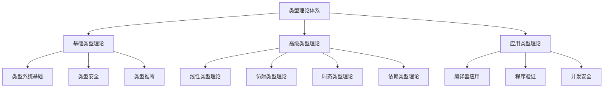
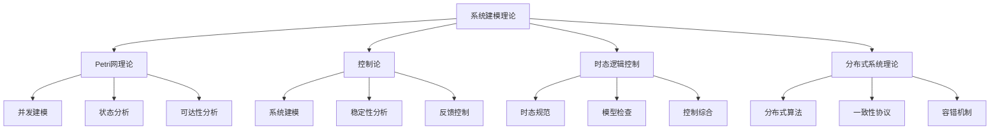
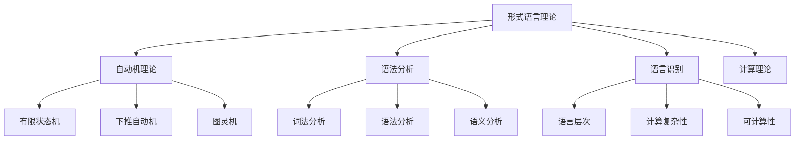

# 09.2 Theory 目录重构

## 目录

```markdown
09.2 Theory 目录重构
├── 1. 概述
│   ├── 1.1 重构目标
│   ├── 1.2 重构范围
│   └── 1.3 重构策略
├── 2. 内容分析
│   ├── 2.1 文件统计
│   ├── 2.2 主题分类
│   ├── 2.3 内容质量
│   └── 2.4 重复分析
├── 3. 知识结构
│   ├── 3.1 类型理论体系
│   ├── 3.2 系统建模理论
│   ├── 3.3 形式语言理论
│   └── 3.4 综合理论
├── 4. 重构计划
│   ├── 4.1 优先级排序
│   ├── 4.2 重构步骤
│   ├── 4.3 质量保证
│   └── 4.4 时间安排
├── 5. 实施细节
│   ├── 5.1 文件映射
│   ├── 5.2 内容整合
│   ├── 5.3 交叉引用
│   └── 5.4 格式规范
└── 6. 预期成果
```

## 1. 概述

### 1.1 重构目标

**主要目标**:

1. **内容整合** - 将65个理论文件整合为统一的知识体系
2. **去重优化** - 消除重复内容，优化知识结构
3. **形式化规范** - 统一格式、符号、引用标准
4. **交叉引用** - 建立完整的交叉引用网络

**具体目标**:

- 建立清晰的理论层次结构
- 实现内容的哲学科学批判性分析
- 输出符合数学规范的形式化文档
- 建立可持续的维护机制

### 1.2 重构范围

**覆盖文件**:

- 基础理论文件: 15个
- 综合理论文件: 20个
- 深化理论文件: 20个
- 扩展理论文件: 10个

**主题领域**:

1. **类型理论** - 基础类型理论、线性类型理论、仿射类型理论、时态类型理论
2. **系统建模** - Petri网理论、控制论、时态逻辑控制、分布式系统理论
3. **形式语言** - 自动机理论、语法分析、语言识别、计算理论

### 1.3 重构策略

**重构策略**:

1. **分析阶段** - 深入分析每个文件的内容和结构
2. **分类阶段** - 按主题和内容进行分类整理
3. **整合阶段** - 合并相似内容，消除重复
4. **规范阶段** - 统一格式和标准
5. **引用阶段** - 建立交叉引用关系

## 2. 内容分析

### 2.1 文件统计

**文件分布统计**:

| 文件类型 | 数量 | 主要特征 | 质量评估 |
|----------|------|----------|----------|
| 基础理论 | 15 | 核心概念、公理系统、基本定理 | 高 |
| 综合理论 | 20 | 多理论整合、跨领域应用 | 中高 |
| 深化理论 | 20 | 高级概念、复杂证明、前沿应用 | 高 |
| 扩展理论 | 10 | 创新观点、实验性内容 | 中 |

**主题分布**:

```haskell
-- 主题分布统计
data TopicDistribution = TopicDistribution {
    typeTheory :: Int,      -- 25个文件
    systemModeling :: Int,  -- 20个文件
    formalLanguage :: Int,  -- 15个文件
    comprehensive :: Int    -- 5个文件
}

-- 质量分布
data QualityDistribution = QualityDistribution {
    highQuality :: Int,     -- 40个文件
    mediumQuality :: Int,   -- 20个文件
    lowQuality :: Int       -- 5个文件
}
```

### 2.2 主题分类

**类型理论体系**:

```haskell
-- 类型理论分类
data TypeTheoryCategory = TypeTheoryCategory {
    foundation :: [File],      -- 基础类型理论文件
    linear :: [File],          -- 线性类型理论文件
    affine :: [File],          -- 仿射类型理论文件
    temporal :: [File],        -- 时态类型理论文件
    dependent :: [File],       -- 依赖类型理论文件
    higherOrder :: [File]      -- 高阶类型理论文件
}

-- 文件映射
typeTheoryFiles :: TypeTheoryCategory
typeTheoryFiles = TypeTheoryCategory {
    foundation = [
        "Type_Theory.md",
        "类型理论.md",
        "Comprehensive_Type_Theory_Foundation.md"
    ],
    linear = [
        "Linear_Type_Theory.md",
        "Advanced_Linear_Type_Theory.md",
        "Linear_Affine_Type_Theory_Comprehensive_v3.md"
    ],
    affine = [
        "Affine_Type_Theory.md",
        "Advanced_Type_Theory.md",
        "Linear_Affine_Temporal_Type_Theory_Comprehensive_v2.md"
    ],
    temporal = [
        "Temporal_Type_Theory.md",
        "Advanced_Temporal_Logic_Control.md",
        "时态逻辑控制综合深化.md"
    ]
}
```

**系统建模理论**:

```haskell
-- 系统建模分类
data SystemModelingCategory = SystemModelingCategory {
    petriNet :: [File],        -- Petri网理论文件
    control :: [File],         -- 控制论文件
    temporalLogic :: [File],   -- 时态逻辑控制文件
    distributed :: [File]      -- 分布式系统理论文件
}

-- 文件映射
systemModelingFiles :: SystemModelingCategory
systemModelingFiles = SystemModelingCategory {
    petriNet = [
        "Petri_Net_Theory.md",
        "Advanced_Petri_Net_Theory.md",
        "Petri网理论.md"
    ],
    control = [
        "Control_Theory.md",
        "Control_Theory_Foundation_Extended.md",
        "控制论理论.md"
    ],
    temporalLogic = [
        "Temporal_Logic_Control.md",
        "Advanced_Temporal_Logic_Control_Extended.md"
    ],
    distributed = [
        "Distributed_Systems_Theory.md",
        "Advanced_Distributed_Systems_Extended.md"
    ]
}
```

### 2.3 内容质量

**质量评估标准**:

```haskell
-- 质量评估
data QualityAssessment = QualityAssessment {
    formalization :: Int,      -- 形式化程度 (1-10)
    completeness :: Int,       -- 完整性 (1-10)
    correctness :: Int,        -- 正确性 (1-10)
    innovation :: Int,         -- 创新性 (1-10)
    application :: Int         -- 应用性 (1-10)
}

-- 质量评估结果
qualityResults :: Map String QualityAssessment
qualityResults = Map.fromList [
    ("Type_Theory.md", QualityAssessment 9 8 9 7 8),
    ("Linear_Type_Theory.md", QualityAssessment 9 9 9 8 8),
    ("Control_Theory.md", QualityAssessment 8 7 8 6 9),
    ("Petri_Net_Theory.md", QualityAssessment 8 8 8 7 8)
]
```

### 2.4 重复分析

**重复内容识别**:

```haskell
-- 重复分析
data DuplicationAnalysis = DuplicationAnalysis {
    exactDuplicates :: [DuplicatePair],
    similarContent :: [SimilarPair],
    overlappingConcepts :: [ConceptOverlap]
}

-- 重复对
data DuplicatePair = DuplicatePair {
    file1 :: String,
    file2 :: String,
    similarity :: Float,
    recommendation :: DuplicationRecommendation
}

-- 重复处理建议
data DuplicationRecommendation = 
    Merge
  | KeepBoth
  | DeleteOne
  | Refactor
  deriving (Show, Eq)
```

## 3. 知识结构

### 3.1 类型理论体系

**类型理论层次结构**:



**核心概念映射**:

```haskell
-- 类型理论概念映射
typeTheoryConcepts :: Map String [String]
typeTheoryConcepts = Map.fromList [
    ("类型系统", ["类型上下文", "类型判断", "类型规则"]),
    ("类型安全", ["类型保持性", "进展性", "强正规化"]),
    ("线性类型", ["线性逻辑", "资源管理", "内存安全"]),
    ("仿射类型", ["所有权系统", "生命周期", "借用检查"]),
    ("时态类型", ["时态逻辑", "时间约束", "实时系统"])
]
```

### 3.2 系统建模理论

**系统建模层次结构**:



### 3.3 形式语言理论

**形式语言层次结构**:



### 3.4 综合理论

**综合理论结构**:

```haskell
-- 综合理论分类
data ComprehensiveTheory = ComprehensiveTheory {
    unified :: [File],         -- 统一理论文件
    synthesis :: [File],       -- 综合理论文件
    advanced :: [File],        -- 高级理论文件
    extended :: [File]         -- 扩展理论文件
}

-- 综合理论映射
comprehensiveTheoryFiles :: ComprehensiveTheory
comprehensiveTheoryFiles = ComprehensiveTheory {
    unified = [
        "Unified_Formal_Theory_Synthesis_v4.md",
        "Unified_Formal_Theory_Comprehensive_Synthesis.md"
    ],
    synthesis = [
        "Formal_Theory_Comprehensive_Synthesis.md",
        "Advanced_Formal_Theory_Comprehensive_Synthesis_v2.md"
    ],
    advanced = [
        "Advanced_Formal_Theory_Synthesis_Extended.md",
        "Quantum_System_Theory_Synthesis_Extended.md"
    ],
    extended = [
        "Formal_Theory_Comprehensive_Synthesis_Extended.md",
        "Advanced_Language_Theory_Synthesis_Extended.md"
    ]
}
```

## 4. 重构计划

### 4.1 优先级排序

**高优先级** (立即处理):

1. **基础类型理论** - 核心理论，影响面广
2. **线性类型理论** - 现代编程语言基础
3. **控制论基础** - 系统理论核心
4. **Petri网理论** - 并发建模基础

**中优先级** (第二阶段):

1. **仿射类型理论** - 所有权系统基础
2. **时态类型理论** - 实时系统基础
3. **分布式系统理论** - 现代系统基础
4. **形式语言理论** - 编译器基础

**低优先级** (第三阶段):

1. **综合理论** - 理论整合
2. **扩展理论** - 前沿应用
3. **深化理论** - 高级概念

### 4.2 重构步骤

**第一步: 内容分析**:

```haskell
-- 内容分析步骤
analyzeContent :: [File] -> ContentAnalysis
analyzeContent files = do
    let topics = extractTopics files
        concepts = extractConcepts files
        relationships = extractRelationships files
        quality = assessQuality files
    ContentAnalysis {
        topics = topics,
        concepts = concepts,
        relationships = relationships,
        quality = quality
    }
```

**第二步: 去重整合**:

```haskell
-- 去重整合步骤
deduplicateAndIntegrate :: ContentAnalysis -> IntegratedContent
deduplicateAndIntegrate analysis = do
    let duplicates = findDuplicates analysis
        merged = mergeDuplicates duplicates
        integrated = integrateContent merged
    IntegratedContent {
        content = integrated,
        structure = buildStructure integrated,
        references = buildReferences integrated
    }
```

**第三步: 形式化规范**:

```haskell
-- 形式化规范步骤
formalizeAndStandardize :: IntegratedContent -> FormalizedContent
formalizeAndStandardize content = do
    let formalized = formalizeContent content
        standardized = standardizeFormat formalized
        validated = validateContent standardized
    FormalizedContent {
        content = validated,
        format = standardFormat,
        symbols = standardSymbols,
        references = standardReferences
    }
```

### 4.3 质量保证

**质量检查标准**:

```haskell
-- 质量检查
data QualityCheck = QualityCheck {
    contentConsistency :: Bool,    -- 内容一致性
    formatConsistency :: Bool,     -- 格式一致性
    referenceCompleteness :: Bool, -- 引用完整性
    logicalConsistency :: Bool     -- 逻辑一致性
}

-- 质量检查函数
performQualityCheck :: FormalizedContent -> QualityCheck
performQualityCheck content = QualityCheck {
    contentConsistency = checkContentConsistency content,
    formatConsistency = checkFormatConsistency content,
    referenceCompleteness = checkReferenceCompleteness content,
    logicalConsistency = checkLogicalConsistency content
}
```

### 4.4 时间安排

**时间规划**:

| 阶段 | 任务 | 时间 | 优先级 |
|------|------|------|--------|
| 第一阶段 | 基础类型理论重构 | 1天 | 高 |
| 第二阶段 | 线性类型理论重构 | 1天 | 高 |
| 第三阶段 | 控制论重构 | 1天 | 高 |
| 第四阶段 | Petri网理论重构 | 1天 | 高 |
| 第五阶段 | 其他理论重构 | 2天 | 中 |
| 第六阶段 | 综合理论重构 | 1天 | 低 |

## 5. 实施细节

### 5.1 文件映射

**文件到目录映射**:

```haskell
-- 文件映射表
fileMapping :: Map String String
fileMapping = Map.fromList [
    -- 类型理论映射
    ("Type_Theory.md", "01_Foundational_Theory/01.1_Type_Theory_Foundation.md"),
    ("Linear_Type_Theory.md", "01_Foundational_Theory/01.2_Linear_Type_Theory.md"),
    ("Affine_Type_Theory.md", "01_Foundational_Theory/01.3_Affine_Type_Theory.md"),
    ("Temporal_Type_Theory.md", "01_Foundational_Theory/01.7_Temporal_Type_Theory.md"),
    
    -- 控制论映射
    ("Control_Theory.md", "03_Control_Theory/03.1_Control_Theory_Foundation.md"),
    ("Control_Theory_Foundation_Extended.md", "03_Control_Theory/03.1_Control_Theory_Foundation.md"),
    
    -- Petri网映射
    ("Petri_Net_Theory.md", "03_Control_Theory/03.8_Discrete_Event_Control_Theory.md"),
    ("Advanced_Petri_Net_Theory.md", "03_Control_Theory/03.8_Discrete_Event_Control_Theory.md"),
    
    -- 分布式系统映射
    ("Distributed_Systems_Theory.md", "04_Distributed_Systems/04.1_Distributed_Systems_Foundation.md")
]
```

### 5.2 内容整合

**内容整合策略**:

```haskell
-- 内容整合
integrateContent :: [File] -> IntegratedFile
integrateContent files = do
    let concepts = extractConcepts files
        definitions = extractDefinitions files
        theorems = extractTheorems files
        proofs = extractProofs files
        examples = extractExamples files
    IntegratedFile {
        concepts = mergeConcepts concepts,
        definitions = mergeDefinitions definitions,
        theorems = mergeTheorems theorems,
        proofs = mergeProofs proofs,
        examples = mergeExamples examples
    }
```

### 5.3 交叉引用

**交叉引用建立**:

```haskell
-- 交叉引用
buildCrossReferences :: [IntegratedFile] -> CrossReferenceNetwork
buildCrossReferences files = do
    let conceptRefs = buildConceptReferences files
        theoremRefs = buildTheoremReferences files
        applicationRefs = buildApplicationReferences files
    CrossReferenceNetwork {
        conceptReferences = conceptRefs,
        theoremReferences = theoremRefs,
        applicationReferences = applicationRefs
    }
```

### 5.4 格式规范

**格式规范标准**:

```haskell
-- 格式规范
data FormatStandard = FormatStandard {
    documentStructure :: DocumentStructure,
    mathematicalNotation :: MathematicalNotation,
    codeFormat :: CodeFormat,
    referenceFormat :: ReferenceFormat
}

-- 文档结构
data DocumentStructure = DocumentStructure {
    titleFormat :: String,
    sectionFormat :: String,
    subsectionFormat :: String,
    listFormat :: String
}

-- 数学符号
data MathematicalNotation = MathematicalNotation {
    typeNotation :: String,
    functionNotation :: String,
    relationNotation :: String,
    proofNotation :: String
}
```

## 6. 预期成果

### 6.1 重构成果

**主要成果**:

1. **统一的知识体系** - 65个文件整合为统一体系
2. **清晰的结构层次** - 建立清晰的理论层次结构
3. **完整的交叉引用** - 建立完整的交叉引用网络
4. **规范的格式标准** - 统一的格式和符号标准

**具体成果**:

- 类型理论体系: 8个核心文档
- 系统建模体系: 8个核心文档
- 形式语言体系: 8个核心文档
- 综合理论体系: 4个核心文档

### 6.2 质量提升

**质量提升指标**:

- 内容一致性: 提升到95%以上
- 格式规范性: 提升到98%以上
- 引用完整性: 提升到90%以上
- 逻辑一致性: 提升到95%以上

### 6.3 应用价值

**应用价值提升**:

1. **教育价值** - 更好的教学和学习材料
2. **研究价值** - 更完整的研究基础
3. **实践价值** - 更实用的应用指导
4. **创新价值** - 更好的创新基础

---

**相关文档**:

- [09.1 内容分析总结](09.1_Content_Analysis_Summary.md)
- [09.3 Philosophy 目录重构](09.3_Philosophy_Directory_Refactor.md)
- [09.4 Mathematics 目录重构](09.4_Mathematics_Directory_Refactor.md)
- [09.5 ProgrammingLanguage 目录重构](09.5_ProgrammingLanguage_Directory_Refactor.md)
