# 数学基础综合框架

## 目录

1. [数学基础概述](#1-数学基础概述)
2. [集合论基础](#2-集合论基础)
3. [数系理论](#3-数系理论)
4. [代数结构](#4-代数结构)
5. [分析基础](#5-分析基础)
6. [几何基础](#6-几何基础)
7. [逻辑基础](#7-逻辑基础)
8. [范畴论基础](#8-范畴论基础)
9. [数学哲学](#9-数学哲学)
10. [跨学科应用](#10-跨学科应用)

## 1. 数学基础概述

### 1.1 数学的本质

数学是研究数量、结构、变化、空间以及信息等概念的一门学科，通过抽象化和逻辑推理建立概念和理论体系。

**形式化定义**：
$$\text{Mathematics} = \langle \mathcal{O}, \mathcal{R}, \mathcal{A}, \mathcal{P} \rangle$$

其中：

- $\mathcal{O}$ 是数学对象集合
- $\mathcal{R}$ 是关系集合
- $\mathcal{A}$ 是公理集合
- $\mathcal{P}$ 是证明规则集合

### 1.2 数学基础层次

```mermaid
graph TB
    A[数学基础] --> B[集合论]
    A --> C[数系理论]
    A --> D[代数结构]
    A --> E[分析基础]
    A --> F[几何基础]
    A --> G[逻辑基础]
    A --> H[范畴论]
    
    B --> I[集合运算]
    B --> J[关系函数]
    B --> K[基数序数]
    
    C --> L[自然数]
    C --> M[整数]
    C --> N[有理数]
    C --> O[实数]
    C --> P[复数]
    
    D --> Q[群论]
    D --> R[环论]
    D --> S[域论]
    D --> T[线性代数]
    
    E --> U[微积分]
    E --> V[实分析]
    E --> W[复分析]
    E --> X[泛函分析]
    
    F --> Y[欧氏几何]
    F --> Z[非欧几何]
    F --> AA[拓扑学]
    F --> BB[微分几何]
    
    G --> CC[命题逻辑]
    G --> DD[谓词逻辑]
    G --> EE[推理规则]
    G --> FF[证明方法]
    
    H --> GG[对象态射]
    H --> HH[函子]
    H --> II[自然变换]
    H --> JJ[极限余极限]
```

### 1.3 数学方法论

#### 1.3.1 公理化方法

**定义 1.1** (公理系统)
一个公理系统是一个四元组 $\mathcal{S} = \langle \mathcal{L}, \mathcal{A}, \mathcal{R}, \mathcal{T} \rangle$，其中：

- $\mathcal{L}$ 是形式语言
- $\mathcal{A}$ 是公理集合
- $\mathcal{R}$ 是推理规则
- $\mathcal{T}$ 是定理集合

#### 1.3.2 构造性方法

**定义 1.2** (构造性证明)
一个证明是构造性的，如果它提供了算法来构造所证明对象的存在实例。

#### 1.3.3 形式化方法

**定义 1.3** (形式化)
形式化是将数学概念和推理转换为符号系统的过程。

## 2. 集合论基础

### 2.1 集合的基本概念

**定义 2.1** (集合)
集合是不同对象的无序聚集，这些对象称为集合的元素。

**公理 2.1** (外延公理)
两个集合相等当且仅当它们包含相同的元素：
$$\forall x \forall y [\forall z(z \in x \leftrightarrow z \in y) \rightarrow x = y]$$

**公理 2.2** (空集公理)
存在一个不包含任何元素的集合：
$$\exists x \forall y(y \notin x)$$

### 2.2 集合运算

**定义 2.2** (并集)
$$A \cup B = \{x : x \in A \lor x \in B\}$$

**定义 2.3** (交集)
$$A \cap B = \{x : x \in A \land x \in B\}$$

**定义 2.4** (差集)
$$A \setminus B = \{x : x \in A \land x \notin B\}$$

**定义 2.5** (幂集)
$$\mathcal{P}(A) = \{X : X \subseteq A\}$$

### 2.3 关系与函数

**定义 2.6** (二元关系)
从集合 $A$ 到集合 $B$ 的二元关系是 $A \times B$ 的子集。

**定义 2.7** (函数)
函数 $f: A \rightarrow B$ 是一个关系，满足：

1. $\forall x \in A, \exists y \in B, (x,y) \in f$
2. $\forall x \in A, \forall y_1, y_2 \in B, [(x,y_1) \in f \land (x,y_2) \in f] \rightarrow y_1 = y_2$

### 2.4 基数与序数

**定义 2.8** (等势)
两个集合 $A$ 和 $B$ 等势，记作 $A \sim B$，如果存在从 $A$ 到 $B$ 的双射。

**定义 2.9** (基数)
集合 $A$ 的基数是与 $A$ 等势的所有集合的等价类。

## 3. 数系理论

### 3.1 自然数

**皮亚诺公理**：

1. $0$ 是自然数
2. 每个自然数都有唯一的后继
3. $0$ 不是任何自然数的后继
4. 不同的自然数有不同的后继
5. 数学归纳原理

**定义 3.1** (自然数加法)
$$m + 0 = m$$
$$m + S(n) = S(m + n)$$

**定义 3.2** (自然数乘法)
$$m \cdot 0 = 0$$
$$m \cdot S(n) = m \cdot n + m$$

### 3.2 整数

**定义 3.3** (整数)
整数是自然数对的等价类，其中 $(a,b) \sim (c,d)$ 当且仅当 $a + d = b + c$。

**整数运算**：
$$[(a,b)] + [(c,d)] = [(a+c, b+d)]$$
$$[(a,b)] \cdot [(c,d)] = [(ac+bd, ad+bc)]$$

### 3.3 有理数

**定义 3.4** (有理数)
有理数是整数对的等价类，其中 $(a,b) \sim (c,d)$ 当且仅当 $a \cdot d = b \cdot c$。

**有理数运算**：
$$\frac{a}{b} + \frac{c}{d} = \frac{ad + bc}{bd}$$
$$\frac{a}{b} \cdot \frac{c}{d} = \frac{ac}{bd}$$

### 3.4 实数

**定义 3.5** (戴德金分割)
实数可以通过有理数的戴德金分割来构造。

**实数完备性**：
每个有上界的非空实数集合都有最小上界。

### 3.5 复数

**定义 3.6** (复数)
复数是形如 $a + bi$ 的数，其中 $a, b \in \mathbb{R}$，$i^2 = -1$。

**复数运算**：
$$(a + bi) + (c + di) = (a + c) + (b + d)i$$
$$(a + bi) \cdot (c + di) = (ac - bd) + (ad + bc)i$$

## 4. 代数结构

### 4.1 群论

**定义 4.1** (群)
群是一个集合 $G$ 配备一个二元运算 $\cdot$，满足：

1. **结合律**：$(a \cdot b) \cdot c = a \cdot (b \cdot c)$
2. **单位元**：存在 $e \in G$，使得 $\forall a \in G, e \cdot a = a \cdot e = a$
3. **逆元**：$\forall a \in G, \exists a^{-1} \in G, a \cdot a^{-1} = a^{-1} \cdot a = e$

**定理 4.1** (拉格朗日定理)
有限群的子群的阶整除群的阶。

### 4.2 环论

**定义 4.2** (环)
环是一个集合 $R$ 配备两个二元运算 $+$ 和 $\cdot$，满足：

1. $(R, +)$ 是阿贝尔群
2. $(R, \cdot)$ 是半群
3. **分配律**：$a \cdot (b + c) = a \cdot b + a \cdot c$ 和 $(a + b) \cdot c = a \cdot c + b \cdot c$

### 4.3 域论

**定义 4.3** (域)
域是一个环，其中非零元素在乘法下形成群。

**定理 4.2** (域的特征)
域的特征要么是素数，要么是零。

### 4.4 线性代数

**定义 4.4** (向量空间)
向量空间是一个集合 $V$ 配备加法和标量乘法，满足向量空间公理。

**定义 4.5** (线性变换)
线性变换是保持加法和标量乘法的函数：
$$T(av + bw) = aT(v) + bT(w)$$

## 5. 分析基础

### 5.1 极限理论

**定义 5.1** (序列极限)
序列 $\{a_n\}$ 收敛到 $L$，记作 $\lim_{n \to \infty} a_n = L$，如果：
$$\forall \epsilon > 0, \exists N \in \mathbb{N}, \forall n \geq N, |a_n - L| < \epsilon$$

**定义 5.2** (函数极限)
函数 $f$ 在 $x_0$ 处的极限是 $L$，记作 $\lim_{x \to x_0} f(x) = L$，如果：
$$\forall \epsilon > 0, \exists \delta > 0, \forall x, 0 < |x - x_0| < \delta \rightarrow |f(x) - L| < \epsilon$$

### 5.2 连续性

**定义 5.3** (连续性)
函数 $f$ 在点 $x_0$ 连续，如果：
$$\lim_{x \to x_0} f(x) = f(x_0)$$

**定理 5.1** (介值定理)
如果 $f$ 在闭区间 $[a,b]$ 上连续，且 $f(a) \neq f(b)$，则对于 $f(a)$ 和 $f(b)$ 之间的任何值 $c$，存在 $x \in (a,b)$ 使得 $f(x) = c$。

### 5.3 微分学

**定义 5.4** (导数)
函数 $f$ 在点 $x_0$ 的导数是：
$$f'(x_0) = \lim_{h \to 0} \frac{f(x_0 + h) - f(x_0)}{h}$$

**定理 5.2** (中值定理)
如果 $f$ 在闭区间 $[a,b]$ 上连续，在开区间 $(a,b)$ 上可导，则存在 $c \in (a,b)$ 使得：
$$f'(c) = \frac{f(b) - f(a)}{b - a}$$

### 5.4 积分学

**定义 5.5** (黎曼积分)
函数 $f$ 在区间 $[a,b]$ 上的黎曼积分是：
$$\int_a^b f(x) dx = \lim_{n \to \infty} \sum_{i=1}^n f(\xi_i) \Delta x_i$$

**定理 5.3** (微积分基本定理)
如果 $F$ 是 $f$ 的原函数，则：
$$\int_a^b f(x) dx = F(b) - F(a)$$

## 6. 几何基础

### 6.1 欧氏几何

**欧几里得公理**：

1. 两点确定一条直线
2. 直线可以无限延长
3. 以任意点为圆心，任意距离为半径可以画圆
4. 所有直角都相等
5. 平行公理

### 6.2 非欧几何

**定义 6.1** (双曲几何)
双曲几何是满足除平行公理外所有欧几里得公理的几何。

**定义 6.2** (椭圆几何)
椭圆几何是球面几何的推广。

### 6.3 拓扑学

**定义 6.3** (拓扑空间)
拓扑空间是一个集合 $X$ 配备一个拓扑 $\tau$，即 $X$ 的子集族，满足：

1. $\emptyset, X \in \tau$
2. 任意并集属于 $\tau$
3. 有限交集属于 $\tau$

**定义 6.4** (连续映射)
映射 $f: X \rightarrow Y$ 连续，如果 $Y$ 中任何开集的原像在 $X$ 中是开集。

### 6.4 微分几何

**定义 6.5** (流形)
$n$ 维流形是一个局部同胚于 $\mathbb{R}^n$ 的拓扑空间。

**定义 6.6** (切空间)
流形 $M$ 在点 $p$ 的切空间是所有在 $p$ 点切于 $M$ 的向量的集合。

## 7. 逻辑基础

### 7.1 命题逻辑

**定义 7.1** (命题)
命题是可以判断真假的陈述。

**逻辑连接词**：

- 否定：$\neg p$
- 合取：$p \land q$
- 析取：$p \lor q$
- 蕴含：$p \rightarrow q$
- 等价：$p \leftrightarrow q$

**推理规则**：

1. **假言推理**：$p \rightarrow q, p \vdash q$
2. **否定后件**：$p \rightarrow q, \neg q \vdash \neg p$
3. **合取引入**：$p, q \vdash p \land q$

### 7.2 谓词逻辑

**定义 7.2** (谓词)
谓词是描述对象性质的函数。

**量词**：

- 全称量词：$\forall x P(x)$
- 存在量词：$\exists x P(x)$

**推理规则**：

1. **全称实例化**：$\forall x P(x) \vdash P(a)$
2. **存在概括**：$P(a) \vdash \exists x P(x)$

### 7.3 证明方法

**直接证明**：从前提直接推导结论

**反证法**：假设结论为假，推导矛盾

**数学归纳法**：

1. 基础步骤：证明 $P(0)$ 为真
2. 归纳步骤：证明 $P(n) \rightarrow P(n+1)$

## 8. 范畴论基础

### 8.1 基本概念

**定义 8.1** (范畴)
范畴 $\mathcal{C}$ 由以下组成：

1. 对象类 $\text{Ob}(\mathcal{C})$
2. 态射类 $\text{Mor}(\mathcal{C})$
3. 复合运算 $\circ$
4. 单位态射

满足：

- 结合律：$(f \circ g) \circ h = f \circ (g \circ h)$
- 单位律：$1_B \circ f = f = f \circ 1_A$

### 8.2 函子

**定义 8.2** (函子)
从范畴 $\mathcal{C}$ 到范畴 $\mathcal{D}$ 的函子 $F$ 是：

1. 对象映射：$F: \text{Ob}(\mathcal{C}) \rightarrow \text{Ob}(\mathcal{D})$
2. 态射映射：$F: \text{Mor}(\mathcal{C}) \rightarrow \text{Mor}(\mathcal{D})$

满足：

- $F(f \circ g) = F(f) \circ F(g)$
- $F(1_A) = 1_{F(A)}$

### 8.3 自然变换

**定义 8.3** (自然变换)
自然变换 $\eta: F \rightarrow G$ 是函子间的态射，满足：
$$\eta_B \circ F(f) = G(f) \circ \eta_A$$

### 8.4 极限与余极限

**定义 8.4** (极限)
极限是范畴中的通用构造，满足泛性质。

**定义 8.5** (余极限)
余极限是极限的对偶概念。

## 9. 数学哲学

### 9.1 数学本体论

**柏拉图主义**：数学对象是独立存在的抽象实体

**形式主义**：数学是符号游戏，没有独立的存在

**直觉主义**：数学对象是心智构造

**逻辑主义**：数学可以还原为逻辑

### 9.2 数学认识论

**先验知识**：数学知识是先验的，不依赖经验

**必然性**：数学真理是必然的

**确定性**：数学知识是确定的

### 9.3 数学方法论

**公理化方法**：从公理出发的演绎方法

**构造性方法**：强调构造和算法

**形式化方法**：符号化和机械化

## 10. 跨学科应用

### 10.1 数学与计算机科学

**算法理论**：基于数学的算法设计和分析

**复杂性理论**：计算复杂性的数学研究

**形式化方法**：程序验证的数学方法

### 10.2 数学与物理学

**微分方程**：物理现象的数学建模

**群论**：对称性的数学描述

**拓扑学**：空间结构的数学研究

### 10.3 数学与经济学

**博弈论**：策略互动的数学分析

**优化理论**：资源分配的数学方法

**概率论**：不确定性的数学处理

### 10.4 数学与生物学

**动力系统**：生物过程的数学建模

**图论**：生物网络的数学分析

**统计学**：生物数据的数学处理

## 总结

数学基础综合框架提供了一个统一的数学理论体系，涵盖了从基础概念到高级理论的各个层面。这个框架不仅建立了严格的数学基础，还为跨学科应用提供了理论支撑。

通过形式化表达、严格证明和系统化组织，我们建立了一个完整的数学知识体系，为后续的理论研究和实际应用奠定了坚实的基础。

---

**参考文献**：

1. Bourbaki, N. (1968). Theory of Sets. Springer-Verlag.
2. Halmos, P. R. (1974). Naive Set Theory. Springer-Verlag.
3. Lang, S. (2002). Algebra. Springer-Verlag.
4. Rudin, W. (1976). Principles of Mathematical Analysis. McGraw-Hill.
5. Munkres, J. R. (2000). Topology. Prentice Hall.
6. Mac Lane, S. (1998). Categories for the Working Mathematician. Springer-Verlag.
