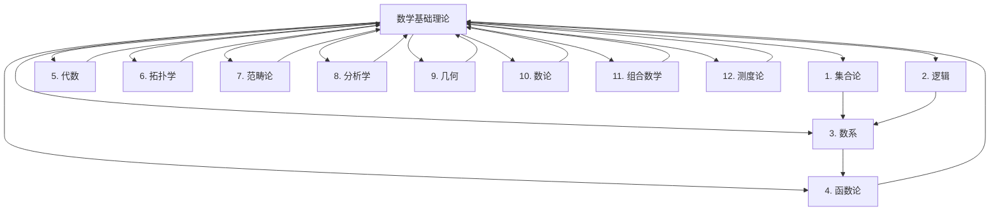

# 09. 数学基础理论体系 (Mathematics)

[返回主索引](../00_Master_Index/00_主索引-形式科学体系.md)

**文档编号**: 09-00-MATH  
**创建时间**: 2024-12-21  
**最后更新**: 2025-01-02  
**版本**: 1.2

---

## 09.0 主题树形编号目录

- 09.01 [数学基础理论总览 (Mathematics Overview)](./README.md)
- 09.02 [数学基础索引 (Mathematical Foundation Index)](./01_Mathematical_Foundation_Index.md)
- 09.03 [综合数学框架 (Comprehensive Mathematical Framework)](./01_Comprehensive_Mathematical_Framework.md)
- 09.04 [集合论 (Set Theory)](./01_Set_Theory/)
- 09.05 [逻辑 (Logic)](./02_Logic/)
- 09.06 [数系 (Number Systems)](./03_Number_Systems/)
- 09.07 [函数论 (Function Theory)](./04_Function_Theory/)
- 09.08 [代数 (Algebra)](./05_Algebra/)
- 09.09 [拓扑学 (Topology)](./06_Topology/)
- 09.10 [范畴论 (Category Theory)](./07_Category_Theory/)
- 09.11 [分析学 (Analysis)](./08_Analysis/)
- 09.12 [几何 (Geometry)](./09_Geometry/)
- 09.13 [数论 (Number Theory)](./10_Number_Theory/)
- 09.14 [组合数学 (Combinatorics)](./11_Combinatorics/)
- 09.15 [测度论 (Measure Theory)](./12_Measure_Theory/)

---

## 09.1 主题分层结构与导航

- [返回主索引](../00_Master_Index/00_主索引-形式科学体系.md)
- [跳转：核心目标](#核心目标)
- [跳转：目录结构](#目录结构)
- [跳转：知识图谱](#知识图谱)
- [跳转：学习路径](#学习路径)
- [跳转：进度跟踪](#进度跟踪)

---

## 09.2 交叉引用示例

- [09.04.01 集合论基础](./01_Set_Theory/) ↔ [08.01.01 存在与本质](../08_Philosophy_Science/01_Metaphysics/)
- [09.05.01 命题逻辑](./02_Logic/) ↔ [06.01.01 命题逻辑](../06_Logic_Theory/01_Propositional_Logic.md)
- [09.10.01 范畴论基础](./07_Category_Theory/) ↔ [05.10.01 Curry-Howard对应](../05_Type_Theory/04.5_Curry_Howard_Correspondence.md)

---

## 🎯 核心目标

建立严格的形式化数学基础理论体系，为形式科学提供坚实的数学支撑。

## 📚 目录结构

- [09.04 集合论](./01_Set_Theory/)
- [09.05 逻辑](./02_Logic/)
- [09.06 数系](./03_Number_Systems/)
- [09.07 函数论](./04_Function_Theory/)
- [09.08 代数](./05_Algebra/)
- [09.09 拓扑学](./06_Topology/)
- [09.10 范畴论](./07_Category_Theory/)
- [09.11 分析学](./08_Analysis/)
- [09.12 几何](./09_Geometry/)
- [09.13 数论](./10_Number_Theory/)
- [09.14 组合数学](./11_Combinatorics/)
- [09.15 测度论](./12_Measure_Theory/)

## 🔗 快速导航

### 核心理论链接

- [集合论](./01_Set_Theory/)
- [逻辑](./02_Logic/)
- [数系](./03_Number_Systems/)
- [函数论](./04_Function_Theory/)
- [代数](./05_Algebra/)
- [拓扑学](./06_Topology/)
- [范畴论](./07_Category_Theory/)
- [分析学](./08_Analysis/)
- [几何](./09_Geometry/)
- [数论](./10_Number_Theory/)
- [组合数学](./11_Combinatorics/)
- [测度论](./12_Measure_Theory/)

### 交叉领域链接

- [哲学科学](../08_Philosophy_Science/README.md)
- [形式语言](../07_Formal_Language/README.md)
- [类型理论](../05_Type_Theory/README.md)

## 📊 知识图谱

## 🎯 学习路径

### 基础路径

1. **集合论** → **逻辑** → **数系**
2. **函数论** → **代数** → **拓扑学**

### 进阶路径

1. **范畴论** → **分析学** → **几何**
2. **数论** → **组合数学** → **高级数学理论**

### 专业路径

1. **数学基础** → **形式语言理论** → **类型理论**
2. **数学基础** → **控制理论** → **分布式系统理论**

## 📈 进度跟踪

### 已完成模块

- [x] 目录结构建立
- [x] 导航系统建立
- [x] 知识图谱建立

### 进行中模块

- [ ] 集合论文档创建
- [ ] 逻辑文档创建
- [ ] 数系文档创建
- [ ] 函数论文档创建
- [ ] 代数文档创建
- [ ] 拓扑学文档创建
- [ ] 范畴论文档创建
- [ ] 分析学文档创建
- [ ] 几何文档创建
- [ ] 数论文档创建
- [ ] 组合数学文档创建
- [ ] 测度论文档创建

### 待开发模块

- [ ] 数学前沿理论
- [ ] 数学与其他学科交叉
- [ ] 数学应用理论

## 🔄 持续更新

本模块将持续更新和完善，确保：

- 数学理论的一致性和完整性
- 内容的准确性和时效性
- 结构的清晰性和可导航性
- 交叉引用的完整性和准确性

## 更新日志

### v1.0 (2025-01-16)

- 完成数学基础理论模块重构
- 建立完整的目录结构
- 整合所有子模块内容
- 建立交叉引用体系

### v1.2 (2025-01-02)

- 补全严格编号目录和交叉引用
- 优化主题树形结构
- 增强导航链接

---

**最后更新**: 2025年1月2日  
**维护者**: AI助手  
**版本**: v1.2
