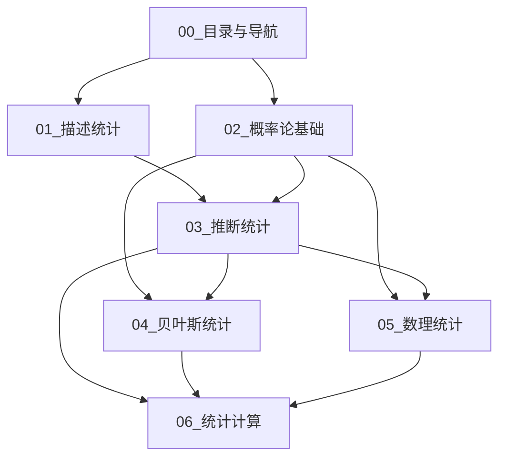

# 00_目录与导航 - 统计学模块完整目录

---

📌 **内容摘要**

本文档深入探讨00_目录与导航 - 统计学模块完整目录的核心原理和关键方法。内容涵盖统计学领域的主要知识点，包括贝叶斯统计, 估计, 离散度, 后验等关键主题。适合有一定基础的学习者系统学习。

**关键词**: 贝叶斯统计, 估计, 离散度, 后验, 统计学, 概率分布, 概率论, 随机变量

📚 **学习目标**

- 掌握00_目录与导航 - 统计学模块完整目录的核心概念和主要方法
- 理解相关理论的应用场景
- 建立该领域的系统性知识框架

🎯 **难度级别**: 中级

⏱️ **预计阅读时间**: 15分钟

**前置知识**: 相关领域的基础概念, 微积分基础

---


> **模块**: 09_统计学 | **版本**: v1.0 | **导航文档**

---

## 文档结构总览

```
09_统计学/
├── README.md                    # 模块概述与快速入门
├── 00_目录与导航.md             # 本文档 - 完整目录树
├── 01_描述统计.md               # 数据描述与探索性分析
├── 02_概率论基础.md             # 概率的数学基础
├── 03_推断统计.md               # 统计推断方法论
├── 04_贝叶斯统计.md             # 贝叶斯推断框架
├── 05_数理统计.md               # 统计理论的数学基础
└── 06_统计计算.md               # 统计方法的计算实现
```

---

## 详细目录树

### 01_描述统计.md

```
1. 描述统计基础
   1.1 数据类型与测量尺度
       1.1.1 分类数据、顺序数据、数值数据
       1.1.2 名义尺度、顺序尺度、间隔尺度、比率尺度
   1.2 集中趋势度量
       1.2.1 算术平均数 (Arithmetic Mean)
       1.2.2 几何平均数 (Geometric Mean)
       1.2.3 调和平均数 (Harmonic Mean)
       1.2.4 中位数 (Median)
       1.2.5 众数 (Mode)
       1.2.6 分位数系统 (Quartiles, Percentiles)
   1.3 离散程度度量
       1.3.1 极差 (Range)
       1.3.2 四分位距 (IQR)
       1.3.3 方差 (Variance)
       1.3.4 标准差 (Standard Deviation)
       1.3.5 变异系数 (Coefficient of Variation)
       1.3.6 平均绝对偏差 (MAD)
   1.4 分布形态度量
       1.4.1 偏度 (Skewness)
       1.4.2 峰度 (Kurtosis)
       1.4.3 矩方法 (Method of Moments)

2. 数据可视化
   2.1 单变量可视化
       2.1.1 直方图 (Histogram)
       2.1.2 箱线图 (Box Plot)
       2.1.3 核密度估计 (KDE)
       2.1.4 Q-Q图
   2.2 多变量可视化
       2.2.1 散点图矩阵
       2.2.2 热力图 (Heatmap)
       2.2.3 平行坐标图

3. 探索性数据分析 (EDA)
   3.1 EDA原则与流程
   3.2 异常值检测方法
   3.3 数据变换技术
   3.4 实际案例分析

4. 对比矩阵
   4.1 集中趋势度量对比
   4.2 离散程度度量对比
   4.3 可视化方法对比
```

### 02_概率论基础.md

```
1. 概率空间与公理
   1.1 样本空间与事件
       1.1.1 样本空间 Ω 的定义
       1.1.2 事件代数与σ-代数
       1.1.3 可测空间
   1.2 Kolmogorov公理系统
       1.2.1 非负性公理
       1.2.2 规范性公理
       1.2.3 可列可加性公理
   1.3 条件概率与独立性
       1.3.1 条件概率定义
       1.3.2 乘法公式
       1.3.3 全概率公式
       1.3.4 Bayes公式
       1.3.5 事件的独立性

2. 随机变量
   2.1 随机变量的定义
       2.1.1 可测函数
       2.1.2 分布函数 F(x)
       2.1.3 离散型与连续型
   2.2 期望与矩
       2.2.1 数学期望 E[X]
       2.2.2 方差 Var(X)
       2.2.3 协方差 Cov(X,Y)
       2.2.4 相关系数 ρ
       2.2.5 矩生成函数
       2.2.6 特征函数
   2.3 随机向量
       2.3.1 联合分布
       2.3.2 边缘分布
       2.3.3 条件分布
       2.3.4 多元正态分布

3. 概率分布
   3.1 离散型分布
       3.1.1 Bernoulli分布
       3.1.2 二项分布 Bin(n,p)
       3.1.3 泊松分布 Pois(λ)
       3.1.4 几何分布
       3.1.5 负二项分布
       3.1.6 超几何分布
   3.2 连续型分布
       3.2.1 均匀分布 U(a,b)
       3.2.2 正态分布 N(μ,σ²)
       3.2.3 指数分布 Exp(λ)
       3.2.4 Gamma分布
       3.2.5 Beta分布
       3.2.6 t分布
       3.2.7 χ²分布
       3.2.8 F分布
   3.3 分布族与指数族
       3.3.1 位置-尺度族
       3.3.2 指数族定义
       3.3.3 自然参数形式

4. 极限定理
   4.1 大数定律
       4.1.1 弱大数定律 (WLLN)
       4.1.2 强大数定律 (SLLN)
   4.2 中心极限定理
       4.2.1 经典CLT
       4.2.2 Lindeberg-Feller CLT
       4.2.3 Lyapunov CLT
   4.3 收敛模式
       4.3.1 几乎必然收敛
       4.3.2 依概率收敛
       4.3.3 依分布收敛
       4.3.4 Lp收敛
```

### 03_推断统计.md

```
1. 统计推断基础
   1.1 总体与样本
       1.1.1 总体分布
       1.1.2 简单随机样本
       1.1.3 统计量与抽样分布
   1.2 统计模型
       1.2.1 参数模型
       1.2.2 非参数模型
       1.2.3 半参数模型

2. 点估计
   2.1 估计方法
       2.1.1 矩估计 (MOM)
       2.1.2 最大似然估计 (MLE)
       2.1.3 最小二乘估计 (LSE)
       2.1.4 Bayes估计
   2.2 估计量的性质
       2.2.1 无偏性
       2.2.2 有效性
       2.2.3 一致性
       2.2.4 渐近正态性
   2.3 信息不等式
       2.3.1 Fisher信息
       2.3.2 Cramér-Rao下界

3. 区间估计
   3.1 置信区间基础
       3.1.1 置信水平与覆盖概率
       3.1.2 枢轴量方法
   3.2 正态分布参数的CI
       3.2.1 均值置信区间
       3.2.2 方差置信区间
       3.2.3 两样本比较
   3.3 大样本置信区间
       3.3.1 基于CLT的近似CI
       3.3.2 方差稳定变换
   3.4 贝叶斯可信区间

4. 假设检验
   4.1 检验基础
       4.1.1 原假设与备择假设
       4.1.2 检验统计量与拒绝域
       4.1.3 两类错误
       4.1.4 显著性水平与p值
   4.2 正态总体检验
       4.2.1 Z检验与t检验
       4.2.2 χ²方差检验
       4.2.3 两样本t检验
   4.3 似然比检验
       4.3.1 Neyman-Pearson引理
       4.3.2 广义似然比检验
   4.4 拟合优度检验
       4.4.1 χ²拟合优度检验
       4.4.2 Kolmogorov-Smirnov检验

5. 方差分析 (ANOVA)
   5.1 单因素方差分析
       5.1.1 模型假设
       5.1.2 平方和分解
       5.1.3 F检验
   5.2 多因素方差分析
       5.2.1 交互效应
       5.2.2 因子设计
   5.3 多重比较
       5.3.1 Bonferroni校正
       5.3.2 Tukey HSD
```

### 04_贝叶斯统计.md

```
1. 贝叶斯推断基础
   1.1 Bayes定理
       1.1.1 离散形式的Bayes定理
       1.1.2 连续形式的Bayes定理
       1.1.3 Bayes更新的序贯性质
   1.2 贝叶斯推断框架
       1.2.1 参数作为随机变量
       1.2.2 先验-似然-后验
       1.2.3 预测分布

2. 先验分布
   2.1 先验的类型
       2.1.1 共轭先验
       2.1.2 无信息先验
       2.1.3 主观先验
       2.1.4 层次先验
   2.2 常用共轭先验
       2.2.1 Beta-Binomial
       2.2.2 Gamma-Poisson
       2.2.3 Normal-Normal
       2.2.4 Dirichlet-Multinomial
   2.3 Jeffreys先验
       2.3.1 Fisher信息与无信息先验
       2.3.2 不变性原理

3. 后验推断
   3.1 点估计
       3.1.1 后验均值
       3.1.2 后验中位数
       3.1.3 后验众数 (MAP)
   3.2 区间估计
       3.2.1 可信区间
       3.2.2 最高后验密度区域 (HPD)
   3.3 假设检验
       3.3.1 Bayes因子
       3.3.2 后验概率比

4. 计算方法
   4.1 解析方法
       4.1.1 共轭先验的解析解
       4.1.2 线性模型
   4.2 数值积分
       4.2.1 网格方法
       4.2.2 高斯积分
   4.3 Monte Carlo方法
       4.3.1 直接采样
       4.3.2 重要性采样
       4.3.3 拒绝采样
   4.4 MCMC方法
       4.4.1 Metropolis-Hastings算法
       4.4.2 Gibbs采样
       4.4.3 Hamiltonian Monte Carlo
       4.4.4 收敛诊断

5. 高级主题
   5.1 经验贝叶斯
   5.2 变分推断
   5.3 贝叶斯非参数
       5.3.1 Dirichlet过程
       5.3.2 高斯过程
```

### 05_数理统计.md

```
1. 统计决策理论
   1.1 决策理论基础
       1.1.1 决策问题三要素
       1.1.2 损失函数
       1.1.3 风险函数
       1.1.4 决策规则
   1.2 最优决策
       1.2.1 容许性
       1.2.2 最小最大决策
       1.2.3 Bayes决策
   1.3 估计的决策理论
       1.3.1 平方误差损失
       1.3.2 绝对误差损失
       1.3.3 0-1损失

2. 充分统计量
   2.1 充分性概念
       2.1.1 充分统计量定义
       2.1.2 因子分解定理
       2.1.3 最小充分统计量
   2.2 完备性
       2.2.1 完备统计量
       2.2.2 Basu定理
   2.3 Rao-Blackwell定理
       2.3.1 定理陈述与证明
       2.3.2 UMVUE构造

3. 指数族
   3.1 指数族定义
       3.1.1 标准形式
       3.1.2 自然参数空间
       3.1.3 充分统计量
   3.2 指数族的性质
       3.2.1 矩生成
       3.2.2 共轭先验
       3.2.3 广义线性模型

4. 渐近理论
   4.1 估计的渐近性质
       4.1.1 相合性
       4.1.2 渐近正态性
       4.1.3 渐近效率
   4.2 MLE的渐近理论
       4.2.1 MLE的相合性
       4.2.2 MLE的渐近正态性
       4.2.3 Fisher信息矩阵
   4.3 渐近相对效率
   4.4 稳健统计
       4.4.1 影响函数
       4.4.2 M-估计
       4.4.3 R-估计
```

### 06_统计计算.md

```
1. 随机数生成
   1.1 伪随机数
       1.1.1 线性同余生成器
       1.1.2 梅森旋转算法
       1.1.3 随机数检验
   1.2 非均匀随机变量
       1.2.1 逆变换法
       1.2.2 接受-拒绝法
       1.2.3 复合方法
   1.3 特殊分布采样
       1.3.1 正态分布 (Box-Muller)
       1.3.2 多元正态
       1.3.3 Gamma与Beta

2. 重采样方法
   2.1 Bootstrap方法
       2.1.1 非参数Bootstrap
       2.1.2 参数Bootstrap
       2.1.3 Bootstrap置信区间
       2.1.4 Jackknife方法
   2.2 置换检验
       2.2.1 置换检验原理
       2.2.2 精确检验与近似检验
   2.3 交叉验证
       2.3.1 K折交叉验证
       2.3.2 留一法
       2.3.3 自助交叉验证

3. 优化方法
   3.1 经典优化
       3.1.1 Newton-Raphson
       3.1.2 Fisher得分法
       3.1.3 EM算法
   3.2 随机优化
       3.2.1 随机梯度下降
       3.2.2 模拟退火
       3.2.3 遗传算法

4. 数值线性代数
   4.1 矩阵分解
       4.1.1 LU分解
       4.1.2 QR分解
       4.1.3 Cholesky分解
       4.1.4 SVD
   4.2 线性回归计算
       4.2.1 正规方程
       4.2.2 迭代方法
       4.2.3 岭回归计算

5. 计算复杂性
   5.1 算法复杂性
       5.1.1 时间复杂性
       5.1.2 空间复杂性
   5.2 统计问题的复杂性
       5.2.1 NP难统计问题
       5.2.2 近似算法
   5.3 并行计算
       5.3.1 并行随机数
       5.3.2 GPU加速
       5.3.3 分布式统计计算
```

---

## 导航矩阵

### 按主题导航

| 主题 | 主要文档 | 相关章节 |
|------|----------|----------|
| **描述统计** | 01_描述统计.md | 1.2, 1.3, 1.4, 2.1, 2.2 |
| **概率基础** | 02_概率论基础.md | 1.1, 1.2, 2.1 |
| **分布理论** | 02_概率论基础.md | 3.1, 3.2, 3.3 |
| **极限定理** | 02_概率论基础.md, 05_数理统计.md | 4.1, 4.2, 4.3 |
| **参数估计** | 03_推断统计.md | 2.1, 2.2, 2.3 |
| **假设检验** | 03_推断统计.md | 4.1, 4.2, 4.3, 4.4 |
| **置信区间** | 03_推断统计.md | 3.1, 3.2, 3.3, 3.4 |
| **贝叶斯基础** | 04_贝叶斯统计.md | 1.1, 1.2 |
| **先验选择** | 04_贝叶斯统计.md | 2.1, 2.2, 2.3 |
| **MCMC方法** | 04_贝叶斯统计.md | 4.3, 4.4 |
| **决策理论** | 05_数理统计.md | 1.1, 1.2, 1.3 |
| **充分统计量** | 05_数理统计.md | 2.1, 2.2, 2.3 |
| **渐近理论** | 05_数理统计.md | 4.1, 4.2, 4.3, 4.4 |
| **随机数生成** | 06_统计计算.md | 1.1, 1.2, 1.3 |
| **Bootstrap** | 06_统计计算.md | 2.1 |
| **EM算法** | 06_统计计算.md | 3.1.3 |

### 按难度导航

#### 初级 (入门级)

```
01_描述统计.md
  ├── 1.2 集中趋势度量
  ├── 1.3 离散程度度量
  └── 2.1 单变量可视化

02_概率论基础.md
  ├── 1.3 条件概率与独立性
  └── 3.1 离散型分布 (部分)
```

#### 中级 (进阶)

```
02_概率论基础.md
  ├── 2.2 期望与矩
  └── 4.2 中心极限定理

03_推断统计.md
  ├── 2.1 估计方法
  ├── 3.2 正态分布参数的CI
  └── 4.2 正态总体检验

04_贝叶斯统计.md
  ├── 1.1 Bayes定理
  └── 2.2 常用共轭先验
```

#### 高级 (研究级)

```
04_贝叶斯统计.md
  ├── 4.4 MCMC方法
  └── 5.3 贝叶斯非参数

05_数理统计.md
  ├── 1.2 最优决策
  ├── 2.3 Rao-Blackwell定理
  └── 4.4 稳健统计

06_统计计算.md
  ├── 3.2 随机优化
  └── 5.3 并行计算
```

---

## 依赖关系图



---

## 快速参考索引

### 常用公式速查

| 公式 | 位置 | 文档 |
|------|------|------|
| $E[X] = \int x f(x) dx$ | 2.2.1 | 02_概率论基础.md |
| $\text{Var}(X) = E[X^2] - (E[X])^2$ | 2.2.2 | 02_概率论基础.md |
| $p(\theta|x) \propto p(x|\theta)p(\theta)$ | 1.2.2 | 04_贝叶斯统计.md |
| $\hat{\theta}_{MLE} = \arg\max_\theta \mathcal{L}(\theta)$ | 2.1.2 | 03_推断统计.md |
| $\bar{X} \pm z_{\alpha/2} \frac{\sigma}{\sqrt{n}}$ | 3.2.1 | 03_推断统计.md |

### 关键定理索引

| 定理 | 位置 | 文档 |
|------|------|------|
| 大数定律 | 4.1 | 02_概率论基础.md |
| 中心极限定理 | 4.2 | 02_概率论基础.md |
| Cramér-Rao下界 | 2.3.2 | 03_推断统计.md |
| Neyman-Pearson引理 | 4.3.1 | 03_推断统计.md |
| Rao-Blackwell定理 | 2.3 | 05_数理统计.md |

---

## 学习路径推荐

### 路径1: 经典统计路线

```
01_描述统计 → 02_概率论基础 → 03_推断统计 → 05_数理统计
```

### 路径2: 贝叶斯统计路线

```
02_概率论基础 → 04_贝叶斯统计 → 06_统计计算
```

### 路径3: 数据科学路线

```
01_描述统计 → 02_概率论基础 → 03_推断统计 → 06_统计计算
```

### 路径4: 理论统计路线

```
02_概率论基础 → 05_数理统计 → 04_贝叶斯统计 (高级部分)
```

---

## 版本历史

| 版本 | 日期 | 变更 |
|------|------|------|
| v1.0 | 2026-04-12 | 初始版本，完整目录结构 |

---

```
╔═══════════════════════════════════════════════════════════════╗
║                 统计学模块导航中心                            ║
║                                                               ║
║   选择你的路径，开始统计学习之旅                              ║
║                                                               ║
╚═══════════════════════════════════════════════════════════════╝
```

---

## 📚 延伸阅读

- [9.1.3 探索性数据分析](./09_统计学/01_描述统计/01.3_探索性数据分析.md)
- [9.6.2 重采样方法](./09_统计学/06_统计计算/06.2_重采样方法.md)
- [9.2.2 随机变量](./09_统计学/02_概率论基础/02.2_随机变量.md)
- [2.2 线性代数](./01_数学基础/02_代数学/02.2_线性代数.md)
- [2.3 线性代数](./01_数学基础/02_代数学/02.3_线性代数.md)
