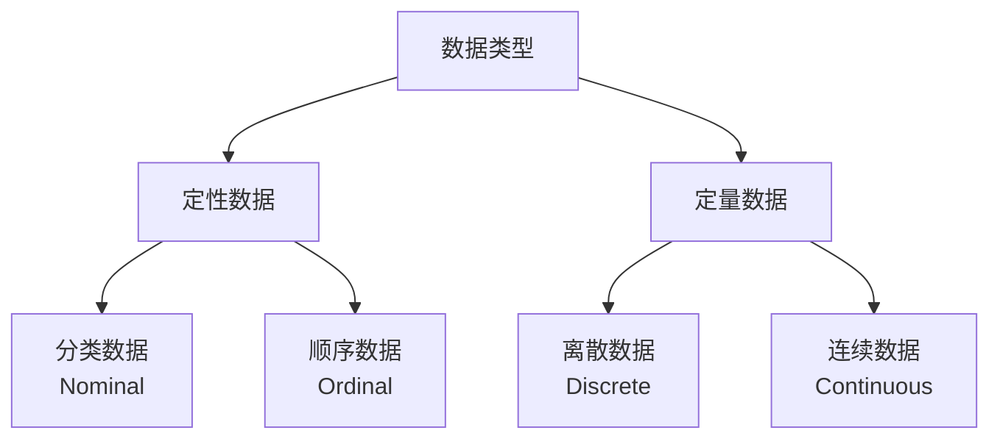

# 01_描述统计 - Descriptive Statistics

---

📌 **内容摘要**

本文档深入探讨01_描述统计 - Descriptive Statistics的核心原理和关键方法。内容涵盖统计学领域的主要知识点，包括集中趋势, 描述统计, 离散度等关键主题。适合有一定基础的学习者系统学习。

**关键词**: 集中趋势, 描述统计, 离散度, 统计学

📚 **学习目标**

- 掌握01_描述统计 - Descriptive Statistics的核心概念和主要方法
- 理解相关理论的应用场景
- 建立该领域的系统性知识框架

🎯 **难度级别**: 中级

⏱️ **预计阅读时间**: 15分钟

**前置知识**: 相关领域的基础概念, 微积分基础

---


> **形式科学** | **统计学基础** | **版本**: v1.0

---

## 1. 描述统计基础

### 1.1 数据类型与测量尺度

#### 1.1.1 数据分类



**形式化定义**

设数据集 $\mathcal{D} = \{x_1, x_2, \ldots, x_n\}$，其中每个 $x_i \in \mathcal{X}$

| 数据类型 | 取值空间 $\mathcal{X}$ | 数学特性 | 示例 |
|----------|------------------------|----------|------|
| **分类数据** | 有限集合，无序 | 等价关系 | 性别 {男, 女} |
| **顺序数据** | 全序集合 | 可比性 | 教育水平 {小学<初中<高中<大学} |
| **离散数据** | 可数集合 | 可数性 | 子女数量 {0, 1, 2, ...} |
| **连续数据** | 区间 $[a,b]$ 或 $\mathbb{R}$ | 完备性 | 身高、体重 |

#### 1.1.2 测量尺度

**Stevens测量尺度理论**

| 尺度 | 允许的变换 | 允许的统计量 | 信息强度 |
|------|-----------|--------------|----------|
| **名义尺度** | 一一对应 $x' = f(x)$ | 频率、众数 | ★ |
| **顺序尺度** | 单调变换 $x' = f(x), f'>0$ | 中位数、分位数 | ★★ |
| **间隔尺度** | 线性变换 $x' = ax + b, a>0$ | 均值、标准差 | ★★★ |
| **比率尺度** | 比例变换 $x' = ax, a>0$ | 几何平均、变异系数 | ★★★★ |

---

### 1.2 集中趋势度量

#### 1.2.1 算术平均数 (Arithmetic Mean)

**定义 1.1** (样本均值)

$$
\bar{x} = \frac{1}{n}\sum_{i=1}^{n} x_i
$$

**加权平均**

$$
\bar{x}_w = \frac{\sum_{i=1}^{n} w_i x_i}{\sum_{i=1}^{n} w_i}
$$

**性质**

1. **线性性**: $\overline{ax + b} = a\bar{x} + b$
2. **最小二乘性**: $\bar{x} = \arg\min_{c} \sum_{i=1}^{n}(x_i - c)^2$
3. **与总和的关系**: $\sum_{i=1}^{n}(x_i - \bar{x}) = 0$

**定理 1.1** (均值的敏感性)

设数据集中有一个异常值 $x_{(n)}$ (最大值)，则其对均值的影响：

$$
\frac{\partial \bar{x}}{\partial x_{(n)}} = \frac{1}{n}
$$

**证明**: 直接由定义求导即得。∎

#### 1.2.2 几何平均数 (Geometric Mean)

**定义 1.2** (几何平均)

对于正数 $x_1, \ldots, x_n > 0$：

$$
G = \left(\prod_{i=1}^{n} x_i\right)^{1/n} = \exp\left(\frac{1}{n}\sum_{i=1}^{n}\ln x_i\right)
$$

**对数形式**

$$
\ln G = \frac{1}{n}\sum_{i=1}^{n}\ln x_i = \overline{\ln x}
$$

**应用场景**

- 增长率平均
- 比率平均
- 对数正态分布的中心度量

#### 1.2.3 调和平均数 (Harmonic Mean)

**定义 1.3** (调和平均)

对于正数 $x_1, \ldots, x_n > 0$：

$$
H = \frac{n}{\sum_{i=1}^{n}\frac{1}{x_i}}
$$

**应用场景**

- 平均速度计算
- 并联电阻
- 价格-收益比率

#### 1.2.4 中位数 (Median)

**定义 1.4** (样本中位数)

设有序样本 $x_{(1)} \leq x_{(2)} \leq \cdots \leq x_{(n)}$

$$
\text{Median}(X) = \begin{cases}
x_{((n+1)/2)} & \text{if } n \text{ is odd} \\
\frac{1}{2}(x_{(n/2)} + x_{(n/2+1)}) & \text{if } n \text{ is even}
\end{cases}
$$

**性质**

1. **稳健性**: 对极端值不敏感
2. **最小绝对偏差**: $\text{Median} = \arg\min_{c} \sum_{i=1}^{n}|x_i - c|$

**定理 1.2** (中位数的稳健性)

中位数的崩溃点 (breakdown point) 为 50%。

#### 1.2.5 众数 (Mode)

**定义 1.5** (众数)

$$
\text{Mode}(X) = \arg\max_{x} f(x)
$$

其中 $f(x)$ 是概率质量函数 (离散) 或概率密度函数 (连续)。

**多峰性**

- 单峰分布 (Unimodal)
- 双峰分布 (Bimodal)
- 多峰分布 (Multimodal)

#### 1.2.6 分位数系统

**定义 1.6** (p-分位数)

样本 $p$-分位数 $q_p$ 满足：

$$
\frac{1}{n}\sum_{i=1}^{n}\mathbb{I}(x_i \leq q_p) \geq p \quad \text{且} \quad \frac{1}{n}\sum_{i=1}^{n}\mathbb{I}(x_i \geq q_p) \geq 1-p
$$

**常用分位数**

| 分位数 | 名称 | 符号 | 定义 |
|--------|------|------|------|
| $Q_1$ | 第一四分位数 | 25th percentile | $q_{0.25}$ |
| $Q_2$ | 第二四分位数/中位数 | 50th percentile | $q_{0.50}$ |
| $Q_3$ | 第三四分位数 | 75th percentile | $q_{0.75}$ |
| IQR | 四分位距 | - | $Q_3 - Q_1$ |

**计算示例** (线性插值法)

对于有序样本 $x_{(1)} \leq \cdots \leq x_{(n)}$，位置 $h = (n-1)p + 1$：

$$
q_p = x_{(\lfloor h \rfloor)} + (h - \lfloor h \rfloor)(x_{(\lceil h \rceil)} - x_{(\lfloor h \rfloor)})
$$

---

### 1.3 离散程度度量

#### 1.3.1 极差 (Range)

**定义 1.7** (极差)

$$
R = x_{(n)} - x_{(1)} = \max(x_i) - \min(x_i)
$$

**特点**

- 计算简单
- 对异常值极其敏感
- 未利用中间数据信息

#### 1.3.2 四分位距 (IQR)

**定义 1.8** (四分位距)

$$
\text{IQR} = Q_3 - Q_1 = q_{0.75} - q_{0.25}
$$

**稳健性**: 崩溃点 25%

#### 1.3.3 方差 (Variance)

**定义 1.9** (样本方差)

$$
s^2 = \frac{1}{n-1}\sum_{i=1}^{n}(x_i - \bar{x})^2
$$

**计算形式**

$$
s^2 = \frac{1}{n-1}\left(\sum_{i=1}^{n}x_i^2 - n\bar{x}^2\right) = \frac{1}{n-1}\left(\sum_{i=1}^{n}x_i^2 - \frac{1}{n}\left(\sum_{i=1}^{n}x_i\right)^2\right)
$$

**总体方差** (已知总体时)

$$
\sigma^2 = \frac{1}{N}\sum_{i=1}^{N}(x_i - \mu)^2
$$

**定理 1.3** (方差的平移不变性)

对于 $y_i = x_i + c$：

$$
\text{Var}(Y) = \text{Var}(X)
$$

#### 1.3.4 标准差 (Standard Deviation)

**定义 1.10** (样本标准差)

$$
s = \sqrt{s^2} = \sqrt{\frac{1}{n-1}\sum_{i=1}^{n}(x_i - \bar{x})^2}
$$

**特点**

- 与原始数据同单位
- 满足三角不等式

#### 1.3.5 变异系数 (CV)

**定义 1.11** (变异系数)

$$
\text{CV} = \frac{s}{\bar{x}} \times 100\%
$$

**应用场景**

- 比较不同单位数据的离散度
- 比较均值差异较大的数据集的相对离散度

**适用条件**: $\bar{x} > 0$ (比率尺度数据)

#### 1.3.6 平均绝对偏差 (MAD)

**定义 1.12** (MAD)

$$
\text{MAD} = \frac{1}{n}\sum_{i=1}^{n}|x_i - \bar{x}|
$$

**稳健MAD**

$$
\text{MAD}_{\text{robust}} = \text{median}(|x_i - \text{median}(x)|) \times 1.4826
$$

(1.4826 是正态分布下与标准差一致的校正因子)

---

### 1.4 分布形态度量

#### 1.4.1 偏度 (Skewness)

**定义 1.13** (Pearson偏度系数)

$$
\gamma_1 = \frac{\mu_3}{\sigma^3} = \frac{E[(X-\mu)^3]}{(E[(X-\mu)^2])^{3/2}}
$$

**样本偏度**

$$
g_1 = \frac{n}{(n-1)(n-2)}\sum_{i=1}^{n}\left(\frac{x_i - \bar{x}}{s}\right)^3
$$

**解释**

| 偏度值 | 分布形态 | 示意图 |
|--------|----------|--------|
| $\gamma_1 < 0$ | 左偏 (负偏) | 长尾在左 |
| $\gamma_1 = 0$ | 对称 | 正态分布 |
| $\gamma_1 > 0$ | 右偏 (正偏) | 长尾在右 |

#### 1.4.2 峰度 (Kurtosis)

**定义 1.14** (Pearson峰度)

$$
\gamma_2 = \frac{\mu_4}{\sigma^4} = \frac{E[(X-\mu)^4]}{(E[(X-\mu)^2])^2}
$$

**超额峰度** (Excess Kurtosis)

$$
\kappa = \gamma_2 - 3
$$

**解释**

| 峰度类型 | 超额峰度 | 特征 |
|----------|----------|------|
| 低峰态 (Platykurtic) | $\kappa < 0$ | 比正态更平 |
| 常峰态 (Mesokurtic) | $\kappa = 0$ | 正态分布 |
| 尖峰态 (Leptokurtic) | $\kappa > 0$ | 比正态更尖 |

**样本峰度**

$$
g_2 = \frac{n(n+1)}{(n-1)(n-2)(n-3)}\sum_{i=1}^{n}\left(\frac{x_i - \bar{x}}{s}\right)^4 - \frac{3(n-1)^2}{(n-2)(n-3)}
$$

#### 1.4.3 矩方法

**定义 1.15** (k阶矩)

- **原点矩**: $\mu_k' = E[X^k]$
- **中心矩**: $\mu_k = E[(X - \mu)^k]$

**矩与统计量的关系**

| 统计量 | 矩表达式 |
|--------|----------|
| 均值 | $\mu = \mu_1'$ |
| 方差 | $\sigma^2 = \mu_2 = \mu_2' - (\mu_1')^2$ |
| 偏度 | $\gamma_1 = \mu_3 / \mu_2^{3/2}$ |
| 峰度 | $\gamma_2 = \mu_4 / \mu_2^2$ |

---

## 2. 数据可视化

### 2.1 单变量可视化

#### 2.1.1 直方图 (Histogram)

**构造方法**

1. 确定区间数 (Sturges公式): $k = \lceil \log_2(n) \rceil + 1$
2. 确定区间宽度: $h = \frac{R}{k}$
3. 计算频数: $f_j = \sum_{i=1}^{n}\mathbb{I}(x_i \in \text{bin}_j)$

**频率密度**

$$
\hat{f}(x) = \frac{f_j}{n \cdot h}, \quad x \in \text{bin}_j
$$

#### 2.1.2 箱线图 (Box Plot)

**五数概括**

$$
(x_{(1)}, Q_1, \text{Median}, Q_3, x_{(n)})
$$

**异常值判定** (Tukey方法)

- **温和异常值**: $x < Q_1 - 1.5 \times \text{IQR}$ 或 $x > Q_3 + 1.5 \times \text{IQR}$
- **极端异常值**: $x < Q_1 - 3 \times \text{IQR}$ 或 $x > Q_3 + 3 \times \text{IQR}$


#### 2.1.3 核密度估计 (KDE)

**定义 2.1** (核密度估计)

$$
\hat{f}_h(x) = \frac{1}{nh}\sum_{i=1}^{n}K\left(\frac{x - x_i}{h}\right)
$$

其中 $K(\cdot)$ 是核函数，$h$ 是带宽。

**常用核函数**

| 核函数 | 表达式 | 效率 |
|--------|--------|------|
| 高斯核 | $K(u) = \frac{1}{\sqrt{2\pi}}e^{-u^2/2}$ | 95.1% |
| Epanechnikov | $K(u) = \frac{3}{4}(1-u^2)\mathbb{I}(|u| \leq 1)$ | 100% |
| 均匀核 | $K(u) = \frac{1}{2}\mathbb{I}(|u| \leq 1)$ | 92.9% |

**带宽选择** (Silverman规则)

$$
h = 0.9 \times \min\left(s, \frac{\text{IQR}}{1.34}\right) \times n^{-1/5}
$$

#### 2.1.4 Q-Q图

**理论**

Q-Q图比较样本分位数与理论分布分位数：

$$
(x_{(i)}, F^{-1}(p_i))
$$

其中 $p_i = \frac{i - 0.5}{n}$ (或类似调整)

**正态Q-Q图解读**

- 直线: 数据服从正态分布
- S形: 厚尾或薄尾
- 拱形: 偏态分布

---

### 2.2 多变量可视化

#### 2.2.1 散点图矩阵

对于 $p$ 维数据，展示所有两两变量的散点图：

$$
\text{矩阵大小: } p \times p
$$

对角线通常显示单变量分布 (直方图或密度)。

#### 2.2.2 热力图 (Heatmap)

用于展示相关矩阵或距离矩阵：

$$
\mathbf{R} = [\rho_{ij}]_{p \times p}
$$

颜色映射表示相关强度。

#### 2.2.3 平行坐标图

将多维数据映射到平行轴：

$$
(x_1, x_2, \ldots, x_p) \to \text{折线连接 } (1, x_1), (2, x_2), \ldots, (p, x_p)
$$

---

## 3. 探索性数据分析 (EDA)

### 3.1 EDA原则与流程

**Tukey的EDA原则**

1. 揭示数据的潜在结构
2. 对模型假设进行诊断
3. 识别异常值和强影响点
4. 提出数据转换建议

**标准流程**

```
数据收集 → 数据清洗 → 单变量分析 → 双变量分析 → 多变量分析 → 模型建议
```

### 3.2 异常值检测方法

**统计方法**

| 方法 | 公式 | 适用场景 |
|------|------|----------|
| Z-Score | $\frac{x - \bar{x}}{s} > 3$ | 正态假设 |
| IQR方法 | $x \notin [Q_1 - 1.5\text{IQR}, Q_3 + 1.5\text{IQR}]$ | 稳健方法 |
| Grubbs检验 | $\frac{\max|x_i - \bar{x}|}{s}$ | 单变量异常值 |

### 3.3 数据变换技术

**幂变换** (Box-Cox)

$$
y(\lambda) = \begin{cases}
\frac{x^\lambda - 1}{\lambda} & \text{if } \lambda \neq 0 \\
\ln x & \text{if } \lambda = 0
\end{cases}
$$

**常用变换**

| 变换 | 公式 | 用途 |
|------|------|------|
| 对数 | $\log(x)$ | 右偏数据、乘性效应 |
| 平方根 | $\sqrt{x}$ | 计数数据 |
| 倒数 | $1/x$ | 比率数据 |
| Logit | $\log\frac{p}{1-p}$ | 比例数据 |

---

## 4. 对比矩阵

### 4.1 集中趋势度量对比

| 特性 | 均值 | 中位数 | 众数 | 几何平均 | 调和平均 |
|------|------|--------|------|----------|----------|
| **计算复杂度** | $O(n)$ | $O(n\log n)$ | $O(n)$ | $O(n)$ | $O(n)$ |
| **对异常值敏感** | 高 | 低 | 低 | 中 | 高 |
| **崩溃点** | 0% | 50% | 取决于分布 | 0% | 0% |
| **适用尺度** | 间隔/比率 | 顺序及以上 | 名义及以上 | 比率 | 比率 |
| **存在性** | 总是存在 | 总是存在 | 可能不唯一 | 需正数 | 需正数 |
| **最优性** | 最小二乘 | 最小绝对偏差 | 最大似然(离散) | 对数最小二乘 | - |

### 4.2 离散程度度量对比

| 度量 | 公式 | 稳健性 | 适用条件 |
|------|------|--------|----------|
| **极差** | $x_{(n)} - x_{(1)}$ | 差 | 快速了解范围 |
| **IQR** | $Q_3 - Q_1$ | 好 | 稳健描述离散 |
| **方差** | $\frac{1}{n-1}\sum(x_i - \bar{x})^2$ | 差 | 推断统计基础 |
| **标准差** | $\sqrt{\text{方差}}$ | 差 | 与均值同单位 |
| **MAD** | $\text{median}|x_i - \text{median}|$ | 优秀 | 稳健替代 |
| **CV** | $s/\bar{x}$ | 差 | 比较不同均值 |

### 4.3 可视化方法对比

| 方法 | 维度 | 适用数据类型 | 主要用途 | 限制 |
|------|------|-------------|----------|------|
| **直方图** | 1D | 连续 | 分布形状 | 对分箱敏感 |
| **箱线图** | 1D | 连续 | 五数概括、异常值 | 丢失细节 |
| **KDE** | 1D | 连续 | 平滑密度估计 | 带宽选择 |
| **Q-Q图** | 1D | 连续 | 分布拟合检验 | 需要经验 |
| **散点图** | 2D | 连续 | 关系可视化 | 大数据点重叠 |
| **热力图** | 2D | 矩阵 | 相关/距离模式 | 颜色选择 |
| **平行坐标** | nD | 混合 | 多维模式 | 高维混乱 |

---

## 5. 实际应用案例

### 案例1: 房价数据分析

**背景**: 分析某城市房价数据 (n=500)

**描述统计结果**

| 统计量 | 价格(万元) | 面积(m²) | 房龄(年) |
|--------|-----------|----------|----------|
| 均值 | 285.6 | 89.3 | 12.4 |
| 中位数 | 268.0 | 87.0 | 10.0 |
| 标准差 | 156.8 | 32.5 | 8.7 |
| 最小值 | 85.0 | 35.0 | 1.0 |
| 最大值 | 1200.0 | 280.0 | 45.0 |
| 偏度 | 1.85 | 0.92 | 0.76 |

**分析洞察**

1. 房价右偏严重 (高端豪宅拉动)
2. 中位数 < 均值，建议用中位数作为中心度量
3. 对数变换可改善正态性

### 案例2: 质量控制中的稳健统计

**背景**: 生产线零件尺寸监控

**问题**: 存在测量误差导致的异常值

**方案对比**

| 方法 | 估计值 | 标准误 | 稳健性 |
|------|--------|--------|--------|
| 均值±SD | 10.02 ± 0.15 | 0.021 | 差 |
| 中位数±IQR | 10.01 ± 0.12 | - | 好 |
|  trimmed均值(10%) | 10.015 ± 0.08 | 0.018 | 较好 |

---

## 6. 与其他模块的交叉引用

### 前置知识

| 概念 | 来源模块 | 具体位置 |
|------|----------|----------|
| 集合论基础 | 01_数学基础 | 集合与函数 |
| 求和与求积 | 01_数学基础 | 级数与序列 |
| 实数性质 | 01_数学基础 | 实分析基础 |

### 后续应用

| 本文概念 | 应用模块 | 应用场景 |
|----------|----------|----------|
| 样本均值 | 03_推断统计 | 参数估计 |
| 样本方差 | 03_推断统计 | 置信区间、检验 |
| 分位数 | 03_推断统计 | 非参数方法 |
| 分布形态 | 02_概率论基础 | 分布选择 |

---

## 参考公式汇总

### 基本统计量

```
均值:        x̄ = (1/n)Σxᵢ
方差:        s² = (1/(n-1))Σ(xᵢ - x̄)²
标准差:      s = √s²
变异系数:    CV = s/x̄ × 100%
中位数:      有序序列的中间值
几何平均:    G = (Πxᵢ)^(1/n)
调和平均:    H = n/(Σ(1/xᵢ))
```

### 分布形态

```
偏度:        γ₁ = μ₃/σ³
峰度:        γ₂ = μ₄/σ⁴
超额峰度:    κ = γ₂ - 3
```

---

```
╔═══════════════════════════════════════════════════════════════╗
║                    01_描述统计                                ║
║                                                               ║
║   "理解数据的第一步：描述其中心、离散与形态"                  ║
║                                                               ║
╚═══════════════════════════════════════════════════════════════╝
```

---

## 📚 延伸阅读

- [9.1.3 探索性数据分析](01_描述统计/01.3_探索性数据分析.md)
- [9.1.1 集中趋势与离散度](01_描述统计/01.1_集中趋势与离散度.md)
- [4.1 实分析](../01_数学基础/04_分析学/04.1_实分析.md)
- [1.1 集合论基础](../01_数学基础/01_元数学基础/01.1_集合论基础.md)
- [5.2 概率论公理](../01_数学基础/05_概率论与测度论/05.2_概率论公理.md)
