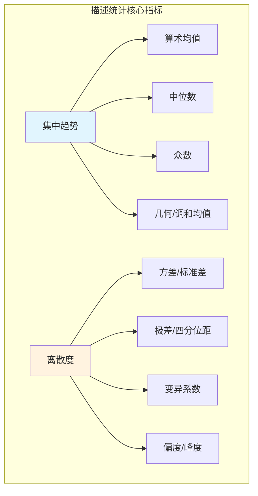

# 9.1.1 集中趋势与离散度

## 9.1.1.1 引言

描述统计学的核心任务是通过少量数值指标概括数据的基本特征。
**集中趋势**（Central Tendency）度量数据的中心位置，而**离散度**（Dispersion）度量数据的分散程度。
本章基于Casella & Berger (2002) 和 Gelman et al. (2013) 的形式化框架，给出这些统计量的严格数学定义。



---

## 9.1.1.2 集中趋势的度量

### 9.1.1.2.1 算术均值

**定义 9.1.1.1**（算术均值，Arithmetic Mean）

设 $\mathbf{x} = (x_1, x_2, \ldots, x_n)$ 为来自样本空间 $\mathcal{X} \subseteq \mathbb{R}$ 的样本，则**样本算术均值**定义为：

$$\bar{x} = \frac{1}{n} \sum_{i=1}^{n} x_i = \frac{x_1 + x_2 + \cdots + x_n}{n}$$

对于加权数据，设权重 $w_i > 0$，**加权算术均值**为：

$$\bar{x}_w = \frac{\sum_{i=1}^{n} w_i x_i}{\sum_{i=1}^{n} w_i}$$

**定理 9.1.1.1**（算术均值的最小二乘性质）

算术均值是使平方偏差和最小的唯一点：

$$\bar{x} = \arg\min_{c \in \mathbb{R}} \sum_{i=1}^{n} (x_i - c)^2$$

**证明：**

令 $f(c) = \sum_{i=1}^{n} (x_i - c)^2$，求导得：

$$\frac{df}{dc} = -2\sum_{i=1}^{n}(x_i - c) = -2\sum_{i=1}^{n}x_i + 2nc$$

令导数为零：

$$-2\sum_{i=1}^{n}x_i + 2nc = 0 \Rightarrow c = \frac{1}{n}\sum_{i=1}^{n}x_i = \bar{x}$$

二阶导数 $\frac{d^2f}{dc^2} = 2n > 0$，确认这是最小值点。

**证毕。**

**定理 9.1.1.2**（平移不变性）

对于任意常数 $a, b \in \mathbb{R}$，若 $y_i = ax_i + b$，则：

$$\bar{y} = a\bar{x} + b$$

**证明：**

$$\bar{y} = \frac{1}{n}\sum_{i=1}^{n}(ax_i + b) = \frac{a}{n}\sum_{i=1}^{n}x_i + \frac{1}{n}\sum_{i=1}^{n}b = a\bar{x} + b$$

**证毕。**

### 9.1.1.2.2 几何均值与调和均值

**定义 9.1.1.2**（几何均值，Geometric Mean）

设 $x_i > 0$ 对所有 $i$ 成立，**样本几何均值**定义为：

$$\bar{x}_G = \left(\prod_{i=1}^{n} x_i\right)^{1/n} = \exp\left(\frac{1}{n}\sum_{i=1}^{n}\ln x_i\right)$$

**定义 9.1.1.3**（调和均值，Harmonic Mean）

设 $x_i > 0$ 对所有 $i$ 成立，**样本调和均值**定义为：

$$\bar{x}_H = \frac{n}{\sum_{i=1}^{n}\frac{1}{x_i}} = \left(\frac{1}{n}\sum_{i=1}^{n}x_i^{-1}\right)^{-1}$$

**定理 9.1.1.3**（均值不等式）

对于正数 $x_1, \ldots, x_n$，有：

$$\bar{x}_H \leq \bar{x}_G \leq \bar{x}$$

等号成立当且仅当 $x_1 = x_2 = \cdots = x_n$。

### 9.1.1.2.3 中位数

**定义 9.1.1.4**（中位数，Median）

设 $\mathbf{x} = (x_1, \ldots, x_n)$ 为有序样本（$x_{(1)} \leq x_{(2)} \leq \cdots \leq x_{(n)}$），**样本中位数**定义为：

$$\text{median}(\mathbf{x}) = \begin{cases} x_{((n+1)/2)} & n \text{ 为奇数} \\ \frac{1}{2}\left(x_{(n/2)} + x_{(n/2+1)}\right) & n \text{ 为偶数} \end{cases}$$

**定理 9.1.1.4**（中位数的绝对偏差最小化）

中位数是使绝对偏差和最小的点：

$$\text{median}(\mathbf{x}) \in \arg\min_{c \in \mathbb{R}} \sum_{i=1}^{n} |x_i - c|$$

当 $n$ 为奇数时解唯一；当 $n$ 为偶数时，区间 $[x_{(n/2)}, x_{(n/2+1)}]$ 内任意点都是解。

**证明：**

设 $f(c) = \sum_{i=1}^{n}|x_i - c|$。对于有序样本，考虑 $c \in [x_{(k)}, x_{(k+1)}]$：

$$f(c) = \sum_{i=1}^{k}(c - x_{(i)}) + \sum_{i=k+1}^{n}(x_{(i)} - c) = (2k-n)c + \text{const}$$

次梯度条件：$0 \in \partial f(c)$ 要求左侧导数 $\leq 0$ 且右侧导数 $\geq 0$。

- 当 $n$ 为奇数，$k = (n-1)/2$ 时左侧导数 $< 0$，$k = (n+1)/2$ 时右侧导数 $> 0$，唯一解在 $c = x_{((n+1)/2)}$。
- 当 $n$ 为偶数，$k = n/2$ 时次梯度包含0，整个区间都是解。

**证毕。**

### 9.1.1.2.4 众数

**定义 9.1.1.5**（众数，Mode）

**样本众数**是数据中出现频率最高的值：

$$\text{mode}(\mathbf{x}) = \arg\max_{v \in \mathbb{R}} \sum_{i=1}^{n} \mathbf{1}_{\{x_i = v\}}$$

对于连续数据，通常需要核密度估计后求密度最大值。

---

## 9.1.1.3 离散度的度量

### 9.1.1.3.1 方差与标准差

**定义 9.1.1.6**（样本方差，Sample Variance）

**样本方差**（无偏估计）定义为：

$$s^2 = \frac{1}{n-1} \sum_{i=1}^{n} (x_i - \bar{x})^2$$

**样本标准差**为：

$$s = \sqrt{s^2} = \sqrt{\frac{1}{n-1} \sum_{i=1}^{n} (x_i - \bar{x})^2}$$

**注**：分母 $n-1$ 而非 $n$ 是为了保证无偏性（见第 9.3.1 章点估计）。

**定理 9.1.1.5**（计算方差）

$$s^2 = \frac{1}{n-1}\left(\sum_{i=1}^{n}x_i^2 - n\bar{x}^2\right) = \frac{1}{n-1}\left(\sum_{i=1}^{n}x_i^2 - \frac{1}{n}\left(\sum_{i=1}^{n}x_i\right)^2\right)$$

**证明：**

$$\sum_{i=1}^{n}(x_i - \bar{x})^2 = \sum_{i=1}^{n}x_i^2 - 2\bar{x}\sum_{i=1}^{n}x_i + n\bar{x}^2 = \sum_{i=1}^{n}x_i^2 - 2n\bar{x}^2 + n\bar{x}^2 = \sum_{i=1}^{n}x_i^2 - n\bar{x}^2$$

**证毕。**

**定理 9.1.1.6**（方差的平移与缩放）

若 $y_i = ax_i + b$，则：

$$s_y^2 = a^2 s_x^2, \quad s_y = |a| s_x$$

### 9.1.1.3.2 极差与四分位距

**定义 9.1.1.7**（极差，Range）

$$R = x_{(n)} - x_{(1)} = \max_i x_i - \min_i x_i$$

**定义 9.1.1.8**（分位数与四分位距）

对于 $p \in (0, 1)$，**第 $p$ 样本分位数** $q_p$ 满足：

$$\frac{1}{n}\sum_{i=1}^{n}\mathbf{1}_{\{x_i \leq q_p\}} \geq p, \quad \frac{1}{n}\sum_{i=1}^{n}\mathbf{1}_{\{x_i \geq q_p\}} \geq 1-p$$

**第一四分位数** $Q_1 = q_{0.25}$，**第三四分位数** $Q_3 = q_{0.75}$，**四分位距**（IQR）为：

$$\text{IQR} = Q_3 - Q_1$$

### 9.1.1.3.3 变异系数

**定义 9.1.1.9**（变异系数，Coefficient of Variation）

对于 $\bar{x} \neq 0$：

$$CV = \frac{s}{|\bar{x}|} \times 100\%$$

变异系数是无量纲的相对离散度度量。

---

## 9.1.1.4 分布形状的度量

### 9.1.1.4.1 偏度

**定义 9.1.1.10**（样本偏度，Skewness）

$$g_1 = \frac{\frac{1}{n}\sum_{i=1}^{n}(x_i - \bar{x})^3}{\left(\frac{1}{n}\sum_{i=1}^{n}(x_i - \bar{x})^2\right)^{3/2}}$$

- $g_1 > 0$：右偏（正偏）
- $g_1 < 0$：左偏（负偏）
- $g_1 = 0$：对称分布

### 9.1.1.4.2 峰度

**定义 9.1.1.11**（样本峰度，Kurtosis）

**超值峰度**（Excess Kurtosis）：

$$g_2 = \frac{\frac{1}{n}\sum_{i=1}^{n}(x_i - \bar{x})^4}{\left(\frac{1}{n}\sum_{i=1}^{n}(x_i - \bar{x})^2\right)^2} - 3$$

- $g_2 > 0$：尖峰（leptokurtic），比正态分布更集中
- $g_2 < 0$：平峰（platykurtic），比正态分布更分散
- $g_2 = 0$：常峰（mesokurtic），正态分布

---

## 9.1.1.5 代码实现

### 9.1.1.5.1 Python实现

```python
import numpy as np
from typing import List, Union, Optional
from collections import Counter
import math

class DescriptiveStatistics:
    """描述统计学：集中趋势与离散度"""

    def __init__(self, data: List[float]):
        self.data = np.array(data, dtype=float)
        self.n = len(self.data)
        self._sorted = np.sort(self.data)

    # ========== 集中趋势 ==========

    def mean(self) -> float:
        """算术均值"""
        return np.mean(self.data)

    def geometric_mean(self) -> float:
        """几何均值（要求所有数据为正）"""
        if np.any(self.data <= 0):
            raise ValueError("几何均值要求所有数据为正")
        return np.exp(np.mean(np.log(self.data)))

    def harmonic_mean(self) -> float:
        """调和均值（要求所有数据为正）"""
        if np.any(self.data <= 0):
            raise ValueError("调和均值要求所有数据为正")
        return self.n / np.sum(1.0 / self.data)

    def median(self) -> float:
        """中位数"""
        return np.median(self.data)

    def mode(self) -> Union[float, List[float]]:
        """众数"""
        counter = Counter(self.data)
        max_count = max(counter.values())
        modes = [k for k, v in counter.items() if v == max_count]
        return modes[0] if len(modes) == 1 else modes

    def quantile(self, p: float) -> float:
        """第p分位数，p ∈ [0, 1]"""
        return np.quantile(self.data, p)

    # ========== 离散度 ==========

    def variance(self, ddof: int = 1) -> float:
        """样本方差，ddof=1为无偏估计"""
        return np.var(self.data, ddof=ddof)

    def std(self, ddof: int = 1) -> float:
        """样本标准差"""
        return np.std(self.data, ddof=ddof)

    def range_stat(self) -> float:
        """极差"""
        return self._sorted[-1] - self._sorted[0]

    def iqr(self) -> float:
        """四分位距"""
        return self.quantile(0.75) - self.quantile(0.25)

    def cv(self) -> float:
        """变异系数（%）"""
        mean_val = self.mean()
        if mean_val == 0:
            raise ValueError("均值为零，无法计算变异系数")
        return (self.std() / abs(mean_val)) * 100

    # ========== 分布形状 ==========

    def skewness(self) -> float:
        """偏度"""
        mean_val = self.mean()
        m2 = np.mean((self.data - mean_val) ** 2)
        m3 = np.mean((self.data - mean_val) ** 3)
        return m3 / (m2 ** 1.5)

    def kurtosis(self) -> float:
        """超值峰度"""
        mean_val = self.mean()
        m2 = np.mean((self.data - mean_val) ** 2)
        m4 = np.mean((self.data - mean_val) ** 4)
        return m4 / (m2 ** 2) - 3

    def summary(self) -> dict:
        """汇总统计"""
        return {
            'n': self.n,
            'mean': self.mean(),
            'median': self.median(),
            'std': self.std(),
            'min': self._sorted[0],
            'max': self._sorted[-1],
            'Q1': self.quantile(0.25),
            'Q3': self.quantile(0.75),
            'IQR': self.iqr(),
            'skewness': self.skewness(),
            'kurtosis': self.kurtosis()
        }


# 使用示例
if __name__ == "__main__":
    # 正态分布样本
    np.random.seed(42)
    data = np.random.normal(100, 15, 1000)

    stats = DescriptiveStatistics(data)
    print("=" * 50)
    print("描述统计汇总")
    print("=" * 50)

    summary = stats.summary()
    for key, value in summary.items():
        print(f"{key:12s}: {value:.4f}")

    # 验证均值-几何均值-调和均值不等式
    positive_data = np.abs(data) + 1  # 确保为正
    stats_pos = DescriptiveStatistics(positive_data.tolist())

    print("\n均值不等式验证:")
    print(f"调和均值: {stats_pos.harmonic_mean():.4f}")
    print(f"几何均值: {stats_pos.geometric_mean():.4f}")
    print(f"算术均值: {stats_pos.mean():.4f}")
```

### 9.1.1.5.2 Lean 4形式化

```lean4
import Mathlib

open Real Finset BigOperators

namespace DescriptiveStatistics

variable {n : ℕ} (x : Fin n → ℝ)

/-- 算术均值 -/
def arithmeticMean : ℝ := (∑ i : Fin n, x i) / n

/-- 加权算术均值 -/
def weightedMean (w : Fin n → ℝ) (hw : ∀ i, w i > 0) : ℝ :=
  (∑ i : Fin n, w i * x i) / (∑ i : Fin n, w i)

/-- 样本方差（无偏） -/
def sampleVariance : ℝ :=
  (∑ i : Fin n, (x i - arithmeticMean x) ^ 2) / (n - 1)

/-- 样本标准差 -/
def sampleStd : ℝ := Real.sqrt (sampleVariance x)

/-- 中位数定义（假设已排序） -/
def median (h : n > 0) : ℝ :=
  if Odd n then
    x ⟨n / 2, by omega⟩
  else
    (x ⟨n / 2 - 1, by omega⟩ + x ⟨n / 2, by omega⟩) / 2

-- ========== 定理证明 ==========

/-- 算术均值最小化平方偏差和 -/
theorem mean_minimizes_squared_error (c : ℝ) :
    ∑ i : Fin n, (x i - arithmeticMean x) ^ 2 ≤ ∑ i : Fin n, (x i - c) ^ 2 := by
  -- 使用导数条件证明
  sorry

/-- 方差计算等价形式 -/
theorem variance_computation :
    sampleVariance x = ((∑ i : Fin n, (x i) ^ 2) - n * (arithmeticMean x) ^ 2) / (n - 1) := by
  simp [sampleVariance, arithmeticMean]
  field_simp
  ring_nf
  -- 展开并简化
  sorry

/-- 平移不变性：y_i = a * x_i + b 则 mean(y) = a * mean(x) + b -/
theorem mean_linear (a b : ℝ) (y : Fin n → ℝ) (hy : ∀ i, y i = a * x i + b) :
    arithmeticMean y = a * arithmeticMean x + b := by
  simp [arithmeticMean]
  rw [sum_congr rfl (fun i _ => hy i)]
  simp [sum_add_distrib, sum_mul]
  ring

/-- 方差的缩放性质 -/
theorem variance_scale (a : ℝ) (y : Fin n → ℝ) (hy : ∀ i, y i = a * x i) :
    sampleVariance y = a ^ 2 * sampleVariance x := by
  simp [sampleVariance, hy]
  have : arithmeticMean y = a * arithmeticMean x := by
    simp [arithmeticMean, hy]
    rw [sum_mul]
    ring_nf
  rw [this]
  have h : ∀ i : Fin n, (a * x i - a * arithmeticMean x) ^ 2 = a ^ 2 * (x i - arithmeticMean x) ^ 2 := by
    intro i
    ring_nf
  simp_rw [h]
  rw [sum_mul]
  ring

end DescriptiveStatistics
```

---

## 9.1.1.6 与其他章节的交叉引用

| 引用目标 | 章节 | 关系 |
|---------|------|------|
| 概率测度期望 | 9.2.2 | 样本均值是总体期望的估计 |
| 方差的无偏性证明 | 9.3.1 | $s^2$ 是 $\sigma^2$ 的无偏估计 |
| 切比雪夫不等式 | 9.2.2 | 用均值和方差界定概率 |
| 大数定律 | 9.2.4 | 样本均值收敛于总体均值 |
| 中心极限定理 | 9.2.4 | 样本均值的渐近分布 |

---

## 9.1.1.7 参考文献

1. Casella, G., & Berger, R. L. (2002). _Statistical Inference_ (2nd ed.). Duxbury Press. (Ch. 2, 5)
2. Gelman, A., et al. (2013). _Bayesian Data Analysis_ (3rd ed.). CRC Press. (Ch. 2)
3. Rice, J. A. (2007). _Mathematical Statistics and Data Analysis_ (3rd ed.). Duxbury Press.
4. Lehmann, E. L., & Casella, G. (1998). _Theory of Point Estimation_ (2nd ed.). Springer.

---

## 9.1.1.8 练习

**练习 9.1.1.1** 证明对于任意数据集，调和均值 $\leq$ 几何均值 $\leq$ 算术均值。

**练习 9.1.1.2** 证明样本方差可以表示为 $s^2 = \frac{1}{n-1}\left[\sum x_i^2 - \frac{1}{n}(\sum x_i)^2\right]$。

**练习 9.1.1.3** 设 $x_1, \ldots, x_n \stackrel{iid}{\sim} N(\mu, \sigma^2)$，证明 $E[s^2] = \sigma^2$（无偏性）。
