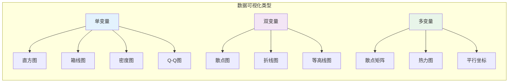
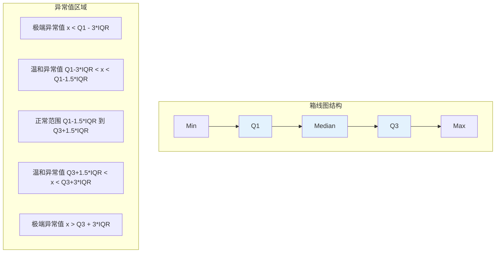

# 9.1.2 数据可视化

## 9.1.2.1 引言

数据可视化是探索性数据分析（EDA）的核心工具，通过图形化表示揭示数据的模式、趋势和异常。
本章形式化描述直方图、箱线图、散点图等经典可视化方法，并给出其数学构造和统计解释。



---

## 9.1.2.2 直方图

### 9.1.2.2.1 形式化定义

**定义 9.1.2.1**（直方图，Histogram）

设 $\mathbf{x} = (x_1, \ldots, x_n)$ 为样本，选择区间 $[a, b]$ 覆盖数据范围，将其划分为 $k$ 个等宽区间（bin）：

$$B_j = [a + (j-1)h, a + jh), \quad j = 1, \ldots, k$$

其中 **bin宽度** $h = \frac{b-a}{k}$。

**经验概率密度函数**（直方图估计）定义为：

$$\hat{f}_h(x) = \frac{1}{nh} \sum_{i=1}^{n} \mathbf{1}_{\{x_i \in B(x)\}}$$

其中 $B(x)$ 表示包含 $x$ 的区间。

**定义 9.1.2.2**（相对频率）

第 $j$ 个bin的相对频率：

$$p_j = \frac{n_j}{n}, \quad n_j = \sum_{i=1}^{n} \mathbf{1}_{\{x_i \in B_j\}}$$

直方图高度通常设为 $\frac{p_j}{h}$ 使总面积为1。

### 9.1.2.2.2 最优Bin宽度选择

**定理 9.1.2.1**（Sturges公式）

对于近似正态分布的数据，推荐bin数量：

$$k = \lceil \log_2(n) + 1 \rceil$$

**定理 9.1.2.2**（Freedman-Diaconis规则）

最优bin宽度：

$$h^* = 2 \cdot \frac{\text{IQR}}{n^{1/3}}$$

其中IQR为四分位距。

**证明思路：**

基于渐近均方积分误差（AMISE）最小化：

$$\text{AMISE}(\hat{f}_h) = \frac{1}{nh} + \frac{h^2}{12} \int (f'(x))^2 dx$$

对 $h$ 求导并令为零：

$$-\frac{1}{nh^2} + \frac{h}{6} \int (f'(x))^2 dx = 0$$

解得 $h^* \propto n^{-1/3}$。对于正态分布，$\int (f'(x))^2 dx = \frac{1}{4\sqrt{\pi}\sigma^3}$，代入可得上述公式。

---

## 9.1.2.3 箱线图

### 9.1.2.3.1 五数概括

**定义 9.1.2.3**（五数概括，Five-Number Summary）

$$\text{五数} = (x_{(1)}, Q_1, \text{median}, Q_3, x_{(n)})$$

其中：

- $x_{(1)}$: 最小值
- $Q_1$: 第一四分位数（25th百分位）
- median: 中位数（50th百分位）
- $Q_3$: 第三四分位数（75th百分位）
- $x_{(n)}$: 最大值

### 9.1.2.3.2 箱线图构造

**定义 9.1.2.4**（箱线图，Box Plot）

箱线图由以下元素构成：

1. **箱体**（Box）：从 $Q_1$ 到 $Q_3$，表示中间50%数据
2. **箱内线**（Median line）：中位数位置
3. **whiskers**：通常延伸至 $Q_1 - 1.5 \times \text{IQR}$ 和 $Q_3 + 1.5 \times \text{IQR}$
4. **异常值**（Outliers）：超出whisker范围的数据点

**定义 9.1.2.5**（异常值判定）

**温和异常值**（Mild outlier）：

$$x < Q_1 - 1.5 \times \text{IQR} \quad \text{或} \quad x > Q_3 + 1.5 \times \text{IQR}$$

**极端异常值**（Extreme outlier）：

$$x < Q_1 - 3 \times \text{IQR} \quad \text{或} \quad x > Q_3 + 3 \times \text{IQR}$$



---

## 9.1.2.4 散点图与相关可视化

### 9.1.2.4.1 散点图

**定义 9.1.2.6**（散点图，Scatter Plot）

设双变量样本 $\{(x_i, y_i)\}_{i=1}^n$，散点图是 $\mathbb{R}^2$ 中点集 $\{(x_i, y_i)\}$ 的可视化表示。

**样本相关系数**：

$$r = \frac{\sum_{i=1}^{n}(x_i - \bar{x})(y_i - \bar{y})}{\sqrt{\sum_{i=1}^{n}(x_i - \bar{x})^2 \sum_{i=1}^{n}(y_i - \bar{y})^2}}$$

### 9.1.2.4.2 Q-Q图

**定义 9.1.2.7**（Q-Q图，Quantile-Quantile Plot）

用于评估样本是否来自某个理论分布。设有序样本 $x_{(1)} \leq \cdots \leq x_{(n)}$，理论分布 $F$，则Q-Q图绘制：

$$(F^{-1}(p_i), x_{(i)}), \quad i = 1, \ldots, n$$

其中 $p_i$ 为绘图位置，常用选择：

- **Blom**: $p_i = \frac{i - 0.375}{n + 0.25}$
- **Weibull**: $p_i = \frac{i}{n+1}$
- **Hazen**: $p_i = \frac{i - 0.5}{n}$

---

## 9.1.2.5 核密度估计

**定义 9.1.2.8**（核密度估计，Kernel Density Estimation）

$$\hat{f}_h(x) = \frac{1}{nh} \sum_{i=1}^{n} K\left(\frac{x - x_i}{h}\right)$$

其中 $K$ 为**核函数**（满足 $\int K(u) du = 1$，$K(u) \geq 0$），$h > 0$ 为带宽。

**常用核函数**：

| 核函数 | 表达式 $K(u)$ | 效率 |
|--------|--------------|------|
| 高斯核 | $\frac{1}{\sqrt{2\pi}}e^{-u^2/2}$ | 95.1% |
| Epanechnikov | $\frac{3}{4}(1-u^2)\mathbf{1}_{|u|\leq 1}$ | 100% |
| 均匀核 | $\frac{1}{2}\mathbf{1}_{|u|\leq 1}$ | 92.9% |

**定理 9.1.2.3**（最优带宽选择）

渐近均方积分误差（AMISE）最小化的带宽：

$$h_{\text{opt}} = \left(\frac{\int K^2}{n \int (f''(x))^2 dx \left(\int u^2 K(u) du\right)^2}\right)^{1/5} \propto n^{-1/5}$$

Silverman经验法则（正态假设）：

$$h = 1.06 \cdot \min\left(s, \frac{\text{IQR}}{1.34}\right) \cdot n^{-1/5}$$

---

## 9.1.2.6 代码实现

### 9.1.2.6.1 Python实现

```python
import numpy as np
import matplotlib.pyplot as plt
from typing import List, Tuple, Optional, Callable
from scipy import stats
import warnings

class DataVisualization:
    """数据可视化：直方图、箱线图、散点图、Q-Q图"""

    def __init__(self, data: np.ndarray):
        self.data = np.asarray(data)
        self.n = len(self.data)

    # ========== 直方图 ==========

    def freedman_diaconis_bins(self) -> int:
        """Freedman-Diaconis规则计算最优bin数量"""
        q75, q25 = np.percentile(self.data, [75, 25])
        iqr = q75 - q25
        if iqr == 0:
            iqr = np.std(self.data)
        h = 2 * iqr / (self.n ** (1/3))
        if h == 0:
            return int(np.sqrt(self.n))
        return int(np.ceil((self.data.max() - self.data.min()) / h))

    def sturges_bins(self) -> int:
        """Sturges公式"""
        return int(np.ceil(np.log2(self.n) + 1))

    def compute_histogram(self, bins: Optional[int] = None,
                          range_: Optional[Tuple] = None) -> Tuple[np.ndarray, np.ndarray]:
        """计算直方图数据"""
        if bins is None:
            bins = self.freedman_diaconis_bins()
        counts, edges = np.histogram(self.data, bins=bins, range=range_)
        return counts, edges

    def kernel_density_estimate(self, x: np.ndarray,
                                bandwidth: Optional[float] = None,
                                kernel: str = 'gaussian') -> np.ndarray:
        """核密度估计"""
        if bandwidth is None:
            # Silverman经验法则
            iqr = np.percentile(self.data, 75) - np.percentile(self.data, 25)
            bandwidth = 1.06 * min(np.std(self.data), iqr / 1.34) * (self.n ** (-1/5))

        def gaussian_kernel(u):
            return np.exp(-0.5 * u**2) / np.sqrt(2 * np.pi)

        def epanechnikov_kernel(u):
            return 0.75 * (1 - u**2) * (np.abs(u) <= 1)

        kernels = {
            'gaussian': gaussian_kernel,
            'epanechnikov': epanechnikov_kernel
        }

        K = kernels.get(kernel, gaussian_kernel)

        # 向量化计算
        result = np.zeros_like(x, dtype=float)
        for xi in self.data:
            result += K((x - xi) / bandwidth)

        return result / (self.n * bandwidth)

    # ========== 箱线图统计 ==========

    def five_number_summary(self) -> dict:
        """五数概括"""
        return {
            'min': np.min(self.data),
            'Q1': np.percentile(self.data, 25),
            'median': np.median(self.data),
            'Q3': np.percentile(self.data, 75),
            'max': np.max(self.data),
            'IQR': np.percentile(self.data, 75) - np.percentile(self.data, 25)
        }

    def boxplot_stats(self, whis: float = 1.5) -> dict:
        """箱线图统计量"""
        stats_dict = self.five_number_summary()
        q1, q3 = stats_dict['Q1'], stats_dict['Q3']
        iqr = stats_dict['IQR']

        lower_fence = q1 - whis * iqr
        upper_fence = q3 + whis * iqr

        # 调整whisker位置到实际数据点
        lower_whisker = np.min(self.data[self.data >= lower_fence]) if np.any(self.data >= lower_fence) else q1
        upper_whisker = np.max(self.data[self.data <= upper_fence]) if np.any(self.data <= upper_fence) else q3

        outliers = self.data[(self.data < lower_fence) | (self.data > upper_fence)]

        return {
            **stats_dict,
            'lower_whisker': lower_whisker,
            'upper_whisker': upper_whisker,
            'lower_fence': lower_fence,
            'upper_fence': upper_fence,
            'outliers': outliers,
            'n_outliers': len(outliers)
        }

    # ========== Q-Q图 ==========

    def qq_plot_data(self, distribution: str = 'norm',
                     method: str = 'blom') -> Tuple[np.ndarray, np.ndarray]:
        """
        生成Q-Q图数据

        method: 'blom', 'weibull', 'hazen'
        """
        sorted_data = np.sort(self.data)
        n = len(sorted_data)

        # 绘图位置
        if method == 'blom':
            p = (np.arange(1, n + 1) - 0.375) / (n + 0.25)
        elif method == 'weibull':
            p = np.arange(1, n + 1) / (n + 1)
        elif method == 'hazen':
            p = (np.arange(1, n + 1) - 0.5) / n
        else:
            p = (np.arange(1, n + 1) - 0.5) / n

        # 理论分位数
        if distribution == 'norm':
            theoretical = stats.norm.ppf(p)
        elif distribution == 'uniform':
            theoretical = stats.uniform.ppf(p)
        elif distribution == 'exponential':
            theoretical = stats.expon.ppf(p)
        else:
            theoretical = stats.norm.ppf(p)

        return theoretical, sorted_data


class BivariateVisualization:
    """双变量可视化"""

    def __init__(self, x: np.ndarray, y: np.ndarray):
        self.x = np.asarray(x)
        self.y = np.asarray(y)
        assert len(self.x) == len(self.y)
        self.n = len(self.x)

    def scatter_stats(self) -> dict:
        """散点图相关统计"""
        r, p_value = stats.pearsonr(self.x, self.y)

        # 线性回归
        slope, intercept, r_value, p_val, std_err = stats.linregress(self.x, self.y)

        return {
            'correlation': r,
            'correlation_pvalue': p_value,
            'r_squared': r ** 2,
            'slope': slope,
            'intercept': intercept,
            'std_error': std_err
        }

    def contingency_table(self, x_bins: int = 5, y_bins: int = 5) -> np.ndarray:
        """列联表"""
        return np.histogram2d(self.x, self.y, bins=[x_bins, y_bins])[0]


# 使用示例
if __name__ == "__main__":
    np.random.seed(42)

    # 生成测试数据
    normal_data = np.random.normal(100, 15, 1000)
    bimodal_data = np.concatenate([
        np.random.normal(50, 10, 500),
        np.random.normal(150, 10, 500)
    ])

    # 单变量可视化
    viz = DataVisualization(normal_data)

    print("直方图Bin数量:")
    print(f"  Freedman-Diaconis: {viz.freedman_diaconis_bins()}")
    print(f"  Sturges: {viz.sturges_bins()}")

    print("\n五数概括:")
    five_num = viz.five_number_summary()
    for k, v in five_num.items():
        print(f"  {k}: {v:.4f}")

    print("\n箱线图统计:")
    box_stats = viz.boxplot_stats()
    print(f"  Whiskers: [{box_stats['lower_whisker']:.2f}, {box_stats['upper_whisker']:.2f}]")
    print(f"  异常值数量: {box_stats['n_outliers']}")

    # 双变量可视化
    x = np.random.normal(0, 1, 500)
    y = 2 * x + np.random.normal(0, 0.5, 500)  # 相关数据

    biv_viz = BivariateVisualization(x, y)
    scatter_stats = biv_viz.scatter_stats()
    print("\n散点图统计:")
    print(f"  相关系数: {scatter_stats['correlation']:.4f}")
    print(f"  R²: {scatter_stats['r_squared']:.4f}")
    print(f"  回归斜率: {scatter_stats['slope']:.4f}")
```

### 9.1.2.6.2 Lean形式化片段

```lean4
import Mathlib

open Real Finset

namespace DataVisualization

variable {n : ℕ} (x : Fin n → ℝ)

/-- 有序样本 -/
def orderedSample : Fin n → ℝ := sorry  -- 需要排序实现

/-- 第p分位数 -/
def quantile (p : ℝ) (hp : 0 < p ∧ p < 1) : ℝ :=
  let sorted := orderedSample x
  let idx := ⌈p * n⌉.natAbs
  sorted ⟨idx, by omega⟩

/-- 五数概括 -/
structure FiveNumberSummary where
  minimum : ℝ
  q1 : ℝ
  median : ℝ
  q3 : ℝ
  maximum : ℝ

def computeFiveNumber (h : n > 0) : FiveNumberSummary where
  minimum := orderedSample x ⟨0, by omega⟩
  q1 := quantile x 0.25 ⟨by norm_num, by norm_num⟩
  median := quantile x 0.5 ⟨by norm_num, by norm_num⟩
  q3 := quantile x 0.75 ⟨by norm_num, by norm_num⟩
  maximum := orderedSample x ⟨n - 1, by omega⟩

/-- 核密度估计 -/
def kernelDensityEstimate (K : ℝ → ℝ) (h : ℝ) (t : ℝ) : ℝ :=
  (1 / (n * h)) * ∑ i : Fin n, K ((t - x i) / h)

/-- 高斯核函数 -/
def gaussianKernel (u : ℝ) : ℝ :=
  (1 / Real.sqrt (2 * π)) * Real.exp (-(u^2) / 2)

end DataVisualization
```

---

## 9.1.2.7 交叉引用

| 引用目标 | 章节 | 内容 |
|---------|------|------|
| 集中趋势 | 9.1.1 | 箱线图的中位数、四分位数 |
| 离散度 | 9.1.1 | IQR、异常值判定 |
| 概率密度 | 9.2.2 | 直方图估计理论密度 |
| 正态分布 | 9.2.3 | Q-Q图的正态性检验 |
| 核估计理论 | 9.5.2 | 密度估计的渐近理论 |

---

## 9.1.2.8 参考文献

1. Tukey, J. W. (1977). _Exploratory Data Analysis_. Addison-Wesley.
2. Scott, D. W. (2015). _Multivariate Density Estimation_ (2nd ed.). Wiley.
3. Silverman, B. W. (1986). _Density Estimation for Statistics and Data Analysis_. Chapman & Hall.
4. Wand, M. P., & Jones, M. C. (1995). _Kernel Smoothing_. Chapman & Hall.
5. Cleveland, W. S. (1993). _Visualizing Data_. Hobart Press.

---

## 9.1.2.9 练习

**练习 9.1.2.1** 证明直方图作为密度估计的积分等于1。

**练习 9.1.2.2** 推导Freedman-Diaconis规则中 $h \propto n^{-1/3}$ 的关系。

**练习 9.1.2.3** 对于标准正态分布，计算最优核带宽的理论值，并与Silverman经验法则比较。
